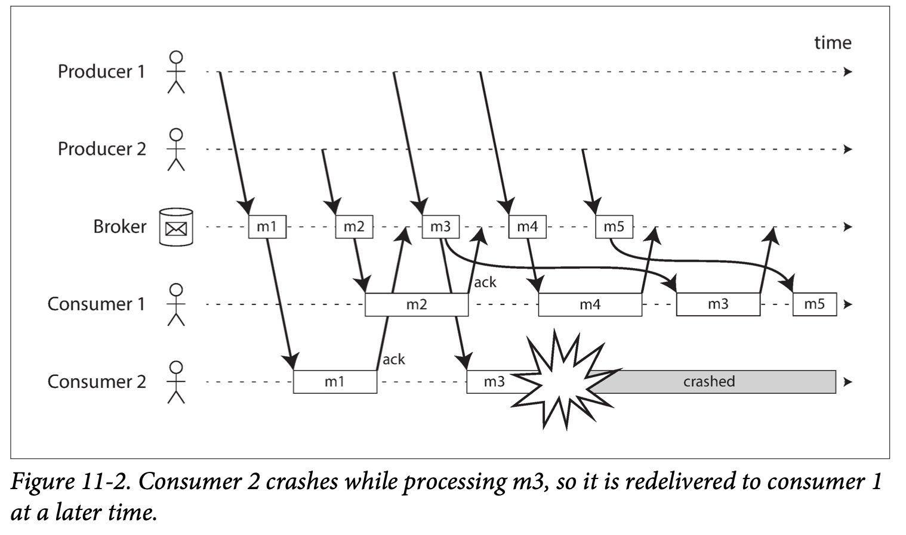
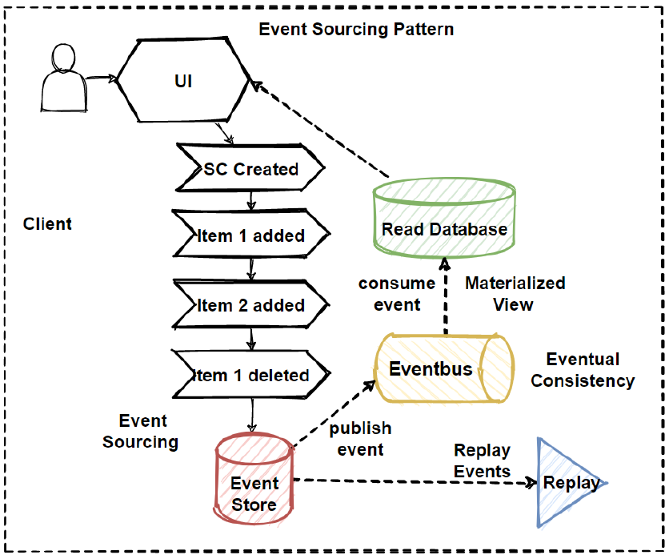
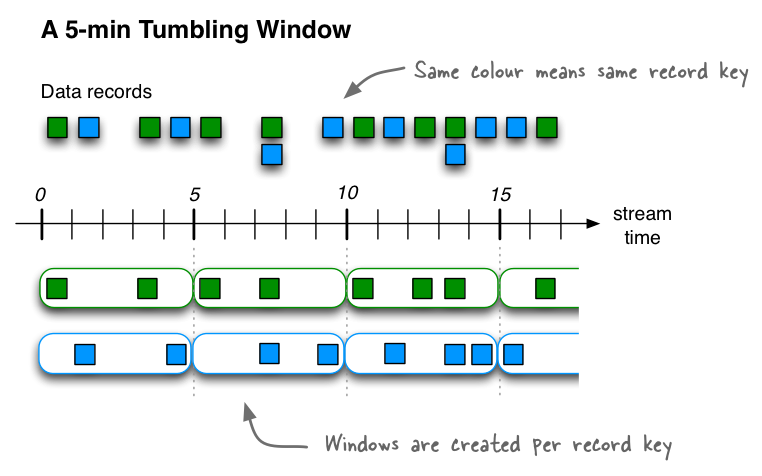
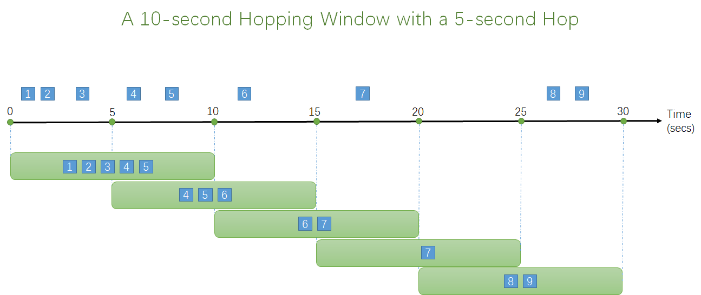
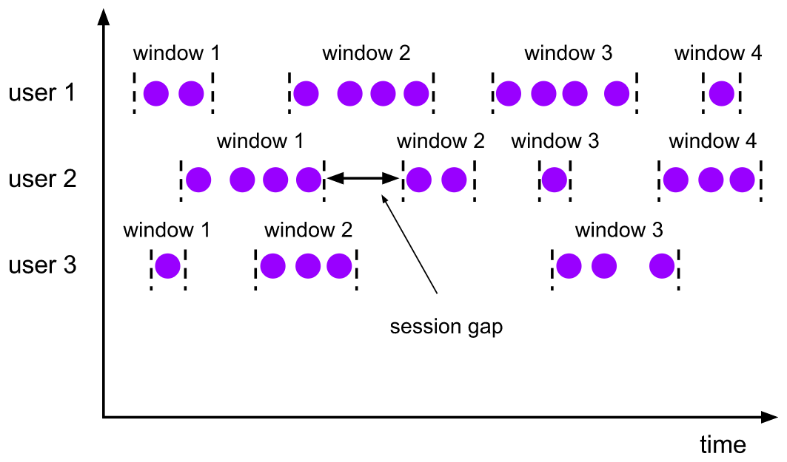

CHAPTER 11: STREAM PROCESSING:


- Batch process is under the assumption all the data is **Bounded**, which means we know the finite size of the data we are dealing with, so it is known when the job is finished. 
- In reality, a lot of the data is unbounded. (because data keeps generated every second). 
- Continuously data processing without interruptions(break into chunks) is the idea behind **streaming processing**.
    - Think of “Stream” as a never stop flow of water/river that keep feeding data in;


- **Transmitting Event Streams**
	- Batch processing: Input are **Files**  vs. Streaming Processing: Input are **Events**;
	- What is **Event**: a small, self-contained, immutable object containing the details of something that happened at some point in time. 
	- Event generated by a producer(Publisher/Sender) and then processed by multiple consumers(subscribers/recipients). 
	    - Related “events” are grouped together by **Topic/Stream**.
	- Batch vs. Stream processing is kind like the difference between Pull and Push. 
	    - Batch: is the consumer keep Pull event from DB. 
	    - Stream: is the DB keep pushing Event to Consumer.
	- Traditional DB/(RDMS) is not designed for “Stream/Event” processing 
- **Message Systems**:
    - A producer sends a message containing the event, which is then pushed to consumers.
    - MQ vs. Unix Pipe or TCP 
        - MQ allows many-to-many relationships (Producer vs. Consumer)
        - As Unix Pipe & TCP is usually one-to-one 
    - Within this publish/subscribe model, different systems take a wide range of approaches, and there is no one right answer for all purposes. To differentiate the systems, it is particularly helpful to ask the following two questions:
	    - What happens if the producers send messages faster than the consumers can process them?  Three options
	        - Drop message;  Queue ; backpressure also known as flow control; i.e., blocking the producer from sending more messages) 
	        - What if Queue is full ? 
	    - What happens if nodes crash or temporarily go offline—are any messages lost? 
		    - Whether message loss is acceptable depends very much on the application. For example, with sensor readings and metrics that are transmitted periodically, an occasional missing data point is perhaps not important,
    - **Direct messaging from producers to consumers**: (prone to loss data, userservice -> event-service ) 
        - **UDP multicast**: used in financial industry for streams such as stock market feeds; - where low latency is important
        - **Brokerless message library**: ZeroMQ. - implementing publish/subscribe messaging over TCP or IP multicast.
        - **StatsD & Brubeck**: UDP messaging. - for collecting metrics from all machines on the network and monitoring them.      
    - **Message brokers**: (aka. Message Queue, e.g. ActiveMQ, RabbitMQ, Kafka)
        - A special type of DB that optimized for Message Streams; 
        - Producer → Broker → Consumer 
        - Better fault tolerance; Message could be persist to disk; 
        - It all asynchronously; 
    - **Message brokers compared to databases**: (JMS, AMQP) 
        - In MB, Some even support 2PC (two-phase commit); 
        - In some MB, data is deleted right-after message is been consumed, while db contain until deleted.
        - DB Secondary Indexes vs. MQ subset of topics
        - MQ has no support for queries, but notify clients when data change, db have support for query.
    - **Multiple consumers**:
	    - When multiple consumers read messages in the same topic, two main patterns of messaging are used, ( sqs vs kafka )
        - **Load balancing**:  arbitrarily assigned to worker/consumer; Good for parallel processing expensive work-load. 
        - **Fan-out**: Each message is sent to all consumers/worker;  exchange bindings in AMQP) 
    - Two patterns could be combined.  => consumer group -> Kafka
	- **Acknowledgments and redelivery**:
		- 
		  
	    - Consumer may crash at any time, imp to send ack to broker, but its also possible to get processed but failed to send ack. Handling this case requires an atomic commit protocol (“Distributed Transactions in Practice” on page 360).
	    - message m3 resend -> order changed -> to maintain order -> consumer for each queue.
	      

	
- **Partitioned Logs:**
	- **Transient messaging mindset**: transient operation that leaves no permanent trace.  (Which is totally opposite than DB or FileSystem) 
	- Why can we not have a hybrid, combining the durable storage approach of databases with the low-latency notification facilities of messaging?
	- Yes, **log-based message brokers**. ( Kafka )
	- **Using logs for message storage**:
	- Log: is simply an append-only sequence of records on disk.
	- **Log-based Message broker**: A producer sends a message by appending it to the end of the log, and a consumer receives messages by reading the log sequentially. 
	- **This log can be partitioned**. 
	- Each message is offset by a sequence number. (totally ordered) 
		- Note: no ordering guarantee across partitions tho. 
	
	
	
	- E.g. Apache **Kafka**, Amazon Kinesis Streams, and Twitter’s DistributedLog. (millions of MPS by partitioning) 
	- **Logs compared to traditional messaging***: 
		- the broker can assign entire partitions to nodes in the consumer group, Then each client consumes all the messages in the partitions it has been assigned.
	- **Log-based approach**: high message throughput, where each message is fast to process and where message ordering is important. 
	- **Disk space usage**:
		- To prevent run out of storage, log is divided into segments, old segments are deleted or archived. 
		- **“Log” is kind of like a bounded-size buffer**, if the consumer can’t keep up, the old message will be discarded. 
		- E.g. 6T HDD with 150MB/s write speed can buffer up to 11 hrs of messages. 
	- **When consumers cannot keep up with producers**: ( consuming speed is less)
		- Three choices: **dropping**, **buffering** or **backpressure**(flow-control).
		- consumer are independent if not very slow can also read the old message, but very slow and broker disk/buffer get full ,then it will start loosing old message and if consumer very slow it will also loss the message.
		- **Replaying old messages**:
			- it is a read-only operation that does not change the log.
			- Offset is under the consumer’s control. So, it has the freedom to go back to previous data/offset. 
			- This made it easier for integration with other dataflows. 
	- **Keeping Systems in Sync**:
		- Often need to combine several different technologies in order to satisfy their requirements. (Write/Read/Search/Analytics etc.) 
		- It is essential to keep all the data in-sync. if an item is updated in the database, it also needs to be updated in the cache, search indexes, and data warehouse. (usually through ETL processes.) 
		- Or “Dual writes” ( update data in all system like db, search, cache, see below figure ), which prone to issue like race-conditiotion, consistency what if one fail.
		
		
		- The key is to determine if we can have only one “Source of Truth” (aka. Leader) 
- **Change Data Capture**:
	- CDC(Change Data Capture): is a process that extracts DB changes and puts it into other systems. 
	- E.g. in the form of “Stream” 
	
	
	
	- **Implementing change data capture**:
		- We call any “log consumer” a “derived data system”. The idea behind CDC is to ensure all those “derived data systems” got the up-to-date changes. 
		- Essentially, CDC makes one database the **leader**, and turns the others into followers.
		- Potential Mechanism: Maxwell and Debezium , with WAL.
		- Usually done asynchronously → replication lag 
	- **Initial Snapshot**: for historical data capture, depend upon usecase. but there is limit of storage, so might need to delete very old.
	- **Log compaction**: (e.g. Apache Kafka, we don't want to go to snapshot again and again , so its logical to maintain retention in kafka itself, for optimisation can do compaction. like lsm -> The principle is simple: the storage engine periodically looks for log records with the same key, throws away any duplicates, and keeps only the most recent update for each key. This compaction and merging process runs in the background ) 
		- This allows the message broker to be used for durable storage, not just for transient messaging. 
- **Event Sourcing**:
	- **Event Sourcing**: a technique that was developed in the domain-driven design (DDD) community.
	- **CDC vs. ES**(Event Sourcing): simpler term we have final state db which can as source of truth this is case of CDC, and that db emit cdc events. on the other hands our source of truth is event store which has the immutable events. 
	- **ES is a powerful technique for data modeling**, because it makes more sense to record a user’s action as immutable events, rather than the effect of the actions on a mutable DB. 
	- **Deriving current state from the event log**:
		- Applications need to take the events and transform it to an application state that is suitable for the user to view. (deterministic) .
		- Means we will see lag in read case :?
		- A CDC event for the update of a record typically contains the entire new version of the record, so the current value for a primary key is entirely determined by the most recent event for that primary key, and log compaction can discard previous events for the same key.
		- On the other hand, with event sourcing, events are modeled at a higher level: an event typically expresses the intent of a user action, not the mechanics of the state update that occurred as a result of the action. In this case, later events typically do not override prior events, and so you need the full history of events to recon‐ struct the final state.
	- **Commands and events**:
		- First it comes as “Command” and then after it successfully executed, it becomes “Event” which is durable and immutable. 
		- when the event is generated, it becomes a fact.
		- A consumer of the event stream use this to update other things , above event store and we can replay it , it will as a source of truth.;
		- Do we use this when we expect delay in read ? 
			- mostly use in case where we need full history, so bit of delay like audit log.
			- not like calculating the final state with this and read from that table. 
		- in which case we use this ? 
			- audit logs, ledger, git commit version
		  	
		  
- **State, Streams, and Immutability**:
	- **Immutability** is also what makes event sourcing and change data capture powerful.
	- Whenever you have a state that changes, that state is the result of the events that mutated it over time.
	- **mutable state** and an **append-only log** of immutable events do not contradict each other: they are two sides of the same coin. 
	- the **changelog**, represents the evolution of state over time.
	- In terms of mathematical: 
	- **application state** is what you get when you **integrate** an event stream over time;
	- **a change stream** is what you get when you **differentiate** the state by time; 
	- 
	- **Log compaction**: bridging the distinction between log and DB state.  it retains only the latest version of each record, and discards overwritten versions.
	- **Advantages of immutable events**: (e.g. Account ledger) 
		- Particularly important in financial systems, it is also beneficial for many other systems.
		- Capture more information than just the current state.
		- E.g. Shopping cart history with append-only event could help analytic in the future; 
	- **Deriving several views from the same event log**:
		- You can derive several different read-oriented representations from the same log of events. 
		- Having an explicit translation step from an event log to a database makes it easier to evolve your application over time.  
	- **Command Query Responsibility Segregation (CQRS)**: you gain a lot of flexibility by separating the form in which data is written from the form it is read. 
	- **Concurrency control**:
		- **The biggest downside of event sourcing and change data capture is asynchronous. → cause delay.** 
		- for this do system like MT. Transaction outbox pattern.
	- **Limitations of immutability**:
		- Truly deleting data could be difficult because data live in many places. 
		- Deletion is more a matter of “making it harder to retrieve the data” than actually “making it impossible to retrieve the data.” 
- **Processing Streams**
	- Where streams come from (user activity events, sensors, and writes to databases).
	- How streams are transported (through direct messaging, via message brokers, and in event logs).
	- Last question is **What can you do with Stream** ? three major options 
		- 1, write it to a database, cache, search index, or similar storage system so it can be used by other applications/clients/systems. 
		- Kind like **maintaining materialized views**.
		- 2, push the events to users directly; 
		- 3, process one or more input streams to produce one or more output streams. (pipelining); **processing streams to produce other, derived streams**. 
	- A block of Code that processes streams so called “Operator” or “Job”. 
	- **Use of Stream Processing**
		- **Monitoring System**: Fraud detection, Trading System, Manufacturing System, Military and Intelligence systems. 
		- **Stream analytics**: (e.g. Apache Storm, Spark Streaming, Flink, Concord, Samza, and Kafka Streams, Google Cloud Dataflow and Azure Stream Analytics) 
			- More oriented toward aggregations and statistical metrics over a large number of events;
		- Stream analytics systems sometimes use **probabilistic algorithms**, such as Bloom filters. 
		- **Maintaining materialized views**:
			- Derived data systems can be treated as maintaining materialized views. 
		- **Search on streams**:
			- The percolator feature of Elasticsearch is one option for implementing this kind of stream search.
- **Reasoning About Time** ( check alex xu vol 2 )
	- Time “window” ( we need the timing window in case of aggregation like last. )
	- Using the timestamps in the events allows the processing to be **deterministic**. running the same process again on the same input yields the same result.
	- many stream processing frameworks use the local system clock on the processing machine (the processing time) to determine windowing, but it can be problematic in case of delay of events. 
	- **Event time( the time where event actually happended, 9:00 am) versus processing time(the time at which our streamer is processing. 10:00am)**: 
		- if you restart stream (event accumutated)-> then it will give feeling that at that processing time there were huge events. but its not true.
	- 
	- **Knowing when you’re ready**: 
		- need to be able to handle such **straggler** events that arrive after the window has already been declared complete. you have 2 options: 
			- 1, Ignore the straggler events; (if its not in current window)
			- 2, Publish a correction; for this requrie to have previous state, -> overhead
	- **Whose clock are you using, anyway**?
		- To adjust for incorrect device clocks, log three timestamps:
			- The time at which the event occurred, according to the device clock
			- The time at which the event was sent to the server, according to the device clock
			- The time at which the event was received by the server, according to the server clock
		- By subtracting the second timestamp from the third, you can estimate the offset between the device clock and the server clock (assuming the network delay is negligible compared to the required timestamp accuracy). You can then apply that offset to the event timestamp and thus estimate the true time at which the event actually occurred (assuming the device clock offset did not change between the time the event occurred and the time it was sent to the server).
	- **Types of windows**:
		- Tumbling window: fixed length, and every event belongs to exactly one window.For example, if you have a 1-minute tumbling window, all the events with timestamps between 10:03:00 and 10:03:59 are grouped into one window, events between 10:04:00 and 10:04:59 into the next window, and so on. You could implement a 1-minute tumbling window by taking each event timestamp and rounding it down to the nearest minute to determine the window that it belongs to.
		  
		- Hopping window: fixed length, but allows windows to overlap in order to provide some smoothing. For example, a 5-minute window with a hop size of 1 minute would contain the events between 10:03:00 and 10:07:59, then the next window would cover events between 10:04:00 and 10:08:59, and so on. You can implement this hopping window by first calculating 1-minute tumbling windows, and then aggregating over several adjacent windows. usecase -> to calculate "moving averages"
		  
		- Sliding window: contains all the events that occur within some interval of each other. For example, a 5-minute sliding window would cover events at 10:03:39 and 10:08:12, because they are less than 5 minutes apart (note that tumbling and hopping 5-minute windows would not have put these two events in the same window, as they use fixed boundaries). A sliding window can be implemented by keeping a buffer of events sorted by time and removing old events when they expire from the window.
		- Session window: has no fixed duration. But, grouping together all events relative to the same user that occur closely together in time. (e.g. website analytics) and the window ends when the user has been inactive for some time (for example, if there have been no events for 30 minutes). Sessionization is a common requirement for website analytics
		  
- **Stream Joins**
	- Similar to batch jobs; However, since new events can appear anytime on a stream makes joins on streams more challenging than in batch jobs. To understand the situation better, let’s distinguish three different types of joins
	- **stream-stream joins**, **stream-table joins**, and **table-table joins**.
	- **Stream-stream join (window join)**:
		- What it is: Matching two event streams (e.g., searches and clicks) to track relationships, like click-through rates. ou need to bring together the events for the search action and the click action, which are connected by having the same session ID. Similar analyses are needed in advertising systems. Since clicks may come much later or not at all. Due to variable network delays, the click event may even arrive before the search event . we use a time window (e.g., 1 hour) to decide which events to join.
		- How to implement:
			- Store recent search and click events, indexed by session ID.
			- When a new event arrives, check if a matching event exists in the stored data.
			- Whenever a search event or click event occurs, it is added to the appropriate index, and the stream processor also checks the other index to see if another event for the same ses‐ sion ID has already arrived. If there is a matching event, you emit an event saying which search result was clicked. If the search event expires without you seeing a matching click event, you emit an event saying which search results were not clicked.
			- Use stream processing frameworks like Apache Flink, Apache Kafka Streams, or Spark Structured Streaming with windowing functions to handle timing issues.
	- **Stream-table join (stream enrichment)**:
		- Enriching the activity events with information from the database. (e.g., adding user profile info to activity logs). 
		- Instead of performing remote SQL queries, we can cache up a copy of DB. (In Memory hashtable or local disk index) 
			- Need CDC to ensure the stream data is up-to-date; 
		- When a profile is created or modified, the stream processor updates its local copy. Thus, we obtain a join between two streams: the activity events and the profile updates.
		- Use **Flink’s broadcast join, Kafka Streams' GlobalKTable, or in-memory caching** to avoid slow remote database queries.
	- **Table-table join (materialized view maintenance)**: (e.g. Tweets)
		- **What it is:** Continuously updating a derived table (e.g., Twitter timelines) based on changes in two related tables (e.g., tweets and follows).
		- **How to implement:**
			- Maintain **two stateful streams**: one for tweet events and another for follow/unfollow events.
			- When a user tweets, add the tweet to the timelines of all followers.
			- When a follow/unfollow event occurs, update timelines accordingly.
			- Use **Kafka Streams KTables, Flink stateful processing, or materialized views in databases** like Rockset or Materialize.
			- Another way of looking at this stream process is that it maintains a materialized view for a query that joins two tables (tweets and follows), something like the following:
			- SELECT follows.follower_id AS timeline_id, array_agg(tweets.* ORDER BY tweets.timestamp DESC) FROM tweets  JOIN follows ON follows.followee_id = tweets.sender_id GROUP BY follows.follower_id
	- **Time-dependence of joins**:
		- **What it is:**
			- When joining data, **timing matters**. For example:
			- If a user updates their profile, some events should use the old profile (before the update), and others should use the new one.
			- If you calculate sales tax, you must apply the **correct tax rate at the time of purchase**, not the latest tax rate.
			- it matters whether you first follow and then unfollow, or the other way round, but there is typically no ordering guarantee across different streams or partitions.
			- If events from different streams arrive out of order, **joins can become inconsistent** and **non-deterministic** (meaning rerunning the same job may give different results). which means you cannot rerun the same job on the same input and necessarily get the same result: the events on the input streams may be interleaved in a different way when you run the job again.
		- In a data warehouse, a **dimension** is a dataset that contains descriptive attributes (e.g., customer information, product details, tax rates). A **slowly changing dimension (SCD)** refers to a dataset where values change **gradually over time** rather than frequently.
		- **The Problem with Joining Changing Data**
			- When joining a **fact table** (e.g., invoices) with a **dimension table** (e.g., tax rates), there is a challenge:
			- If the tax rate table always contains **only the latest rates**, historical invoices will reflect **incorrect** values when tax rates change.
			- If we reprocess old invoices today, they might get **joined with the wrong tax rate** because the latest tax rate has replaced the old one.
		 - **Solution: Assigning Unique Identifiers to Versions**
			 - To solve this, every time the tax rate changes, we:
			 - **Create a new record in the table instead of overwriting the old one**
			 - **Assign a unique identifier** (e.g., `tax_rate_id_2024`) to the new rate.
			 - **Store this identifier in the invoice** at the time of sale.
		- **Downside: No Log Compaction**: Log compaction is a technique used in streaming systems (like Kafka) to remove older records and keep only the latest version. However, because we need to retain **all historical versions** of tax rates for accurate joins, **log compaction cannot be used**—we cannot just delete old rates.

- **Fault Tolerance** 
	- You can’t wait until a stream is finished to validate its output/result, since all the stream is unbounded and will never really finish/complete.  Stream processing systems need **fault tolerance** to handle failures while ensuring **accurate and consistent results**. Unlike batch processing, where failed tasks can simply be restarted without affecting the final output, stream processing faces additional challenges because the data flow is **continuous and unbounded**.
	- ### **Techniques for Fault Tolerance in Stream Processing**
		- **Microbatching and checkpointing**:
			- **Microbatching**: break the stream into small blocks, and treat each block like a miniature batch process.  (e.g. **Spark** Streaming)  usually one second interval.
			- Smaller the batches size the greater overhead. 
			- Larger batches size means longer delay of results. 
			- implicitly provides a tumbling window equal to the batch size
			- Easy to retry when batch get failed -> aws lambda with kafka with batch size.
		- **Checkpointing**: (Used in Apache Flink)
			- Periodically **save the current processing state** to durable storage.
			- If a failure occurs, restart from the latest checkpoint instead of reprocessing everything.
			- **More efficient than microbatching** but requires careful state management.
			- The checkpoints are triggered by bar‐ riers in the message stream, similar to the boundaries between microbatches, but without forcing a particular window size.
		- **Atomic commit revisited**:
			- When sending results to **external systems** (e.g., databases, message queues), failures can lead to **duplicate or lost data**.
			- **Solution:** Ensure **all effects of a task happen atomically**—either everything succeeds, or nothing happens.
			- Similar to **distributed transactions** (but optimized for stream processing).
			- Used in **Google Cloud Dataflow, VoltDB, and planned for Apache Kafka**
		- **Idempotence**:
			- Distributed transactions are one way of achieving that goal, but another way is to rely on **idempotence**.
			- if an operation is not naturally idempotent, it can often be made idempotent with a bit of extra metadata. (e.g. Kafka with some offset value) . For example, when consuming messages from Kafka, every message has a persistent, monotonically increasing offset. When writing a value to an external database, you can include the offset of the message that triggered the last write with the value. Thus, you can tell whether an update has already been applied, and avoid performing the same update again.
		- **Rebuilding state after a failure**:
			- Any stream process that requires state—for example, any windowed aggregations (such as counters, averages, and histograms) and any tables and indexes used for joins—must ensure that this state can be recovered after a failure.
			- One option is to keep the state in a remote datastore and replicate it, although having to query a remote database for each individual message can be slow.
			- keep state local to the stream processor, and replicate it periodically.
			- For example, Flink periodically captures snapshots of operator state and writes them to durable storage such as HDFS [92, 93]; Samza and Kafka Streams replicate state changes by sending them to a dedicated Kafka topic with log compaction, similar to change data capture
			- In some cases, it may not even be necessary to replicate the state, because it can be rebuilt from the input streams. For example, if the state consists of aggregations over a fairly short window, it may be fast enough to simply replay the input events corre‐ sponding to that window
			- However, all of these trade-offs depend on the performance characteristics of the underlying infrastructure:
	
- **Techniques to handle delay events**: 
	- Reconsillation type system, batch processing.
 	- Allow bit late event -> watermark technique, let say 5 second allow -> make system bit complex since will require to maintain previous state as well. 
        ```
           💡 Example in Flink:
			WatermarkStrategy
			  .forBoundedOutOfOrderness(Duration.ofSeconds(5))
        ``` 
	- Means: allow 5 seconds of lateness → handle late events → emit window results when watermark passes window end time.
 		
