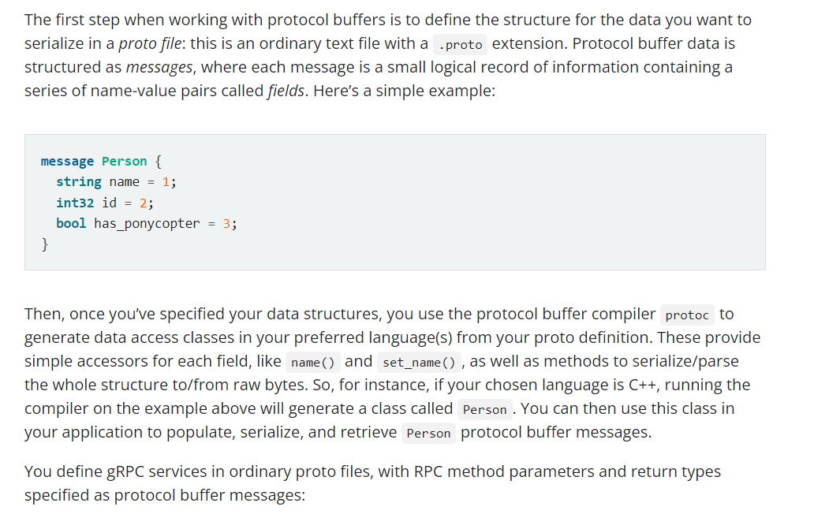

``Documentation`` 
https://grpc.io/docs/what-is-grpc/introduction/


1. By default, gRPC uses Protocol Buffer.
2. Client and server can have different language.
3. Protocol Buffers (https://protobuf.dev/overview/) are a language-neutral, platform-neutral extensible mechanism for serializing structured data(  to convert structured data (such as objects, records, or messages) into a format that can be easily transmitted over a network, stored, or otherwise represented ).Protocol buffers provide a serialization format for packets of typed, structured data that are up to a 

4. RPC, or Remote Procedure Call, is a general concept referring to a protocol that one program can use to request a service from a program located on another computer in a network. gRPC is a specific implementation of RPC developed by Google. It is a high-performance, open-source framework that uses Protocol Buffers as its interface description language and HTTP/2 as the transport protocol.
5. The gRPC programming API in most languages comes in both synchronous and asynchronous flavors. You can find out more in each language’s tutorial and reference documentation
6. RPC life cycle: (https://grpc.io/docs/what-is-grpc/core-concepts/#rpc-life-cycle): what happens when a gRPC client calls a gRPC server method.
7. A gRPC channel provides a connection to a gRPC server on a specified host and port. It is used when creating a client stub. Clients can specify channel arguments to modify gRPC’s default behavior, such as switching message compression on or off. A channel has state, including connected and idle.
8. For Go, the proto compiler generates a .pb.go file with a type for each message type in your file.

``How to define proto for golang``

Doc: https://protobuf.dev/getting-started/gotutorial/

### Core Concept

gRPC lets you define four kinds of service method:

``Unary RPCs`` where the client sends a single request to the server and gets a single response back, just like a normal function call.

```
rpc SayHello(HelloRequest) returns (HelloResponse);

```

``Server streaming RPCs`` where the client sends a request to the server and gets a stream to read a sequence of messages back. The client reads from the returned stream until there are no more messages. gRPC guarantees message ordering within an individual RPC call.

```
rpc LotsOfReplies(HelloRequest) returns (stream HelloResponse);

```

``Client streaming RPCs`` where the client writes a sequence of messages and sends them to the server, again using a provided stream. Once the client has finished writing the messages, it waits for the server to read them and return its response. Again gRPC guarantees message ordering within an individual RPC call.

```
    rpc LotsOfGreetings(stream HelloRequest) returns (HelloResponse);
```

``Bidirectional streaming RPCs`` where both sides send a sequence of messages using a read-write stream. The two streams operate independently, so clients and servers can read and write in whatever order they like: for example, the server could wait to receive all the client messages before writing its responses, or it could alternately read a message then write a message, or some other combination of reads and writes. The order of messages in each stream is preserved.

```
    rpc BidiHello(stream HelloRequest) returns (stream HelloResponse);
```


```Why would I want to use gRPC?```

The main usage scenarios:

* Low latency, highly scalable, distributed systems.
* Developing mobile clients which are communicating to a cloud server.
* Designing a new protocol that needs to be accurate, efficient and language independent.


# Setting up a grpc go project

1. Create a new directory for your project and cd into it
2. mkdir basic-go-grpc
3. cd basic-go-grpc
4. mkdir client server proto
5. Enable go module ( GO111MODULE=auto)
5. Installing the gRPC Go plugin

```
    go install google.golang.org/protobuf/cmd/protoc-gen-go@v1.28
    go install google.golang.org/grpc/cmd/protoc-gen-go-grpc@v1.2

```

6. Initialize a Go module

```
    go mod init github.com/your_username/basic-go-grpc
    go mod tidy
```
7. Create the proto file with the required services and messages in the proto directory
8. Generate .pb.go files from the proto file
9. depending on what path you mention in your helloworld.proto file. (install protocol buffer if already not install in system , protoc commend won't work ). 
``
--go_out=. and  --go-grpc_out=.  (this path is relative to what you defined in proto file go_package) `` while `` proto/helloworld.proto  (this is relative to where you are executing this command like pwd, ls)``


```
    protoc --go_out=. --go-grpc_out=. proto/helloworld.proto


```


10. Create the server and client directories and create the main.go files with necessary controllers and services


# Running the Application

1. Install the dependencies

```
    go mod tidy
```

2. Run the server ( go run *.go  (if more than one file of main package))

```
    go run server/main.go
```

3. Run the client

```
    go run client/main.go
```
