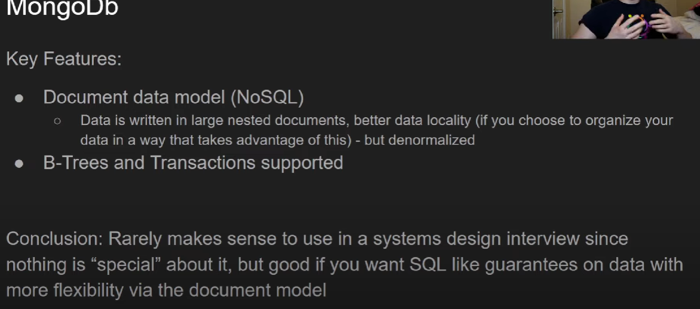
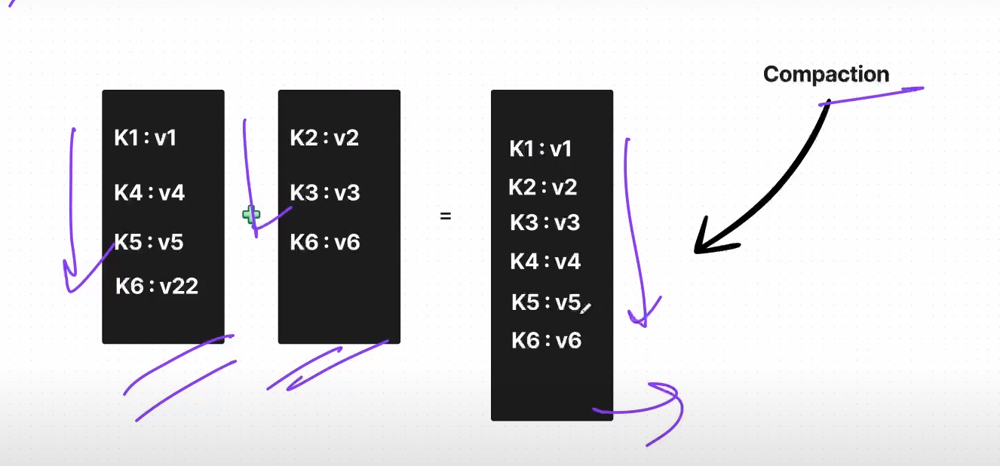
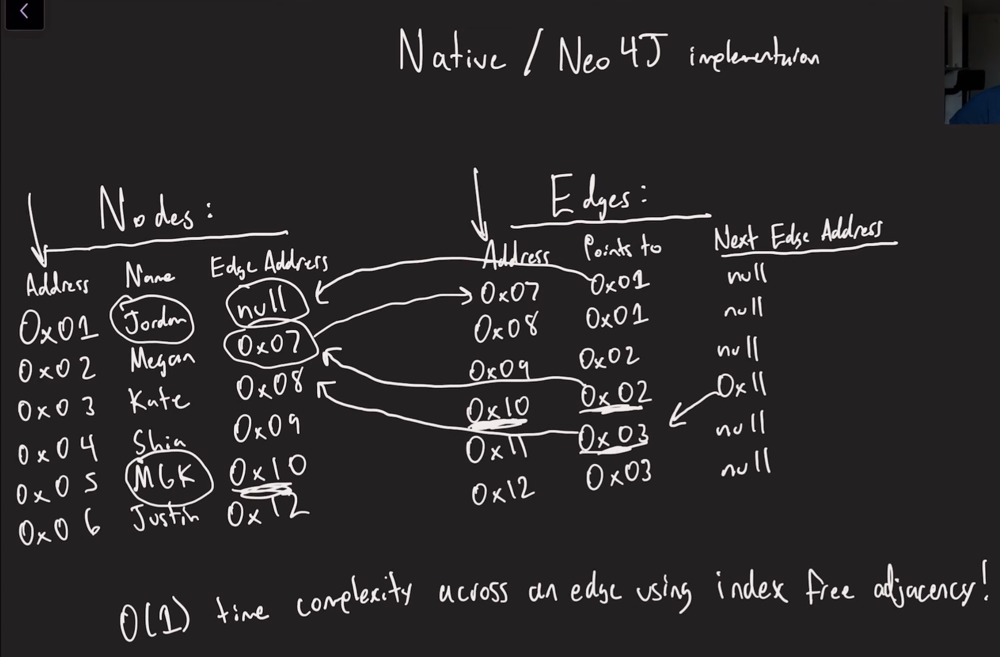
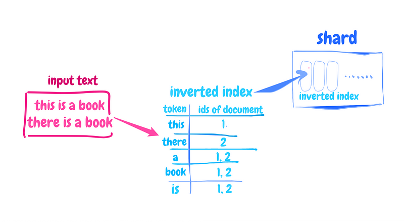
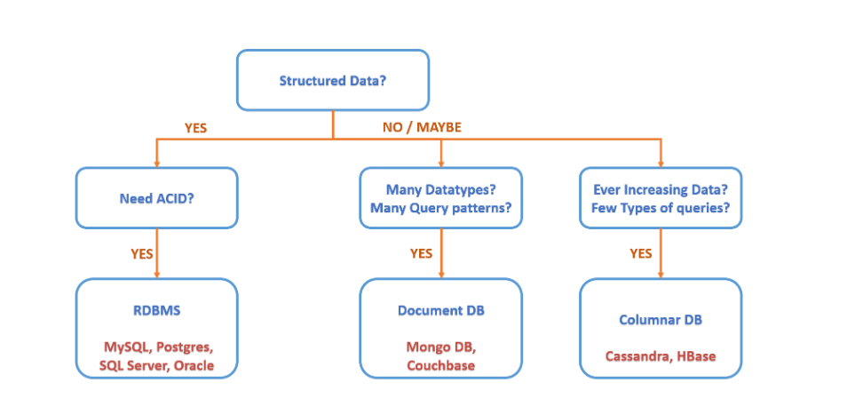

****1. mysql.****
- SQL is also very scalable if you don’t care about relations or foreign key constraints
- store data in row-wise.
- if we don't have index, require linear time to search the rows.
- it uses b-tree  to do indexing ( B-tree indexes are a common data structure for organizing and accessing data efficiently on disk) , each leaf node of b-tree has page of row ( 1 page have multiple rows depending upon side of page. ) [ Note sure, but can imagine like we have a file that is b-tree index , it have the address of disk where does its leaf node data exist. Now at any search it will find it and fetch it and save in ram kind of, in update it will rebalance itself  and save its file to disk and help to find the address of the block to be changed and let say other function with updated it. ]
- b-tree make the read to log(n) for that particular field on which index is made. leaf node is page of it.
- on the other hand it make write slower, since it has to rebalance the tree after insertion. So too much index is n't good for write
- though can scale with sharding -> but with limitations since join. but vertical scale and replication there alwasy.
- transactions is a plus point. ( very expensive in case of distributed )
#### More
- https://vipulpachauri12.medium.com/how-mysql-stores-data-in-disk-ee51a9e81c39#:~:text=MySQL%20stores%20each%20database%20(also,the%20table%20definition%20in%20MyTable.
- https://www.youtube.com/watch?v=DbxddGtHl70
- https://www.lucavall.in/blog/how-databases-store-and-retrieve-data-with-b-trees
-

****2. mongodb ( document ).****

- also store data row-wise, but not rigid structural , its store as json.
- means instead of table , it does replication in the json.
- means it can be scaled horizontally more freely. since no joins. ( mysql you can't put table in different node if they have join with some table, the ony way is to keep in such way that no need node wise join situation)
- it also uses b-tree same like the mysql
- mongodb keep a global unique id for each document , that's how here the joins work by keeping that unique document id in first document.
- it also has acidic transactions.
- real time analytics.
- single leader and multiple read replica approach.
- aws documentdb, (aws dynamodb also provide json support), mongodb, couchbase etc.

#### More
- https://medium.com/nerd-for-tech/all-basics-of-mongodb-in-10-minutes-baddaf6b6625
- https://www.youtube.com/watch?v=ONzdr4SmOng


- Confused ? which to use between these -> when your priority is only scalability and flexibility. strong acidic and schema and secure go for sql.

- Or in short you can also skip this db in interview , no having very high advantage. So always prefix sql here ( saying only with compare to mongodb not other nosql ). So now we will compare other db with sql directly.
- or it is used when we have not structure data but want quality kind of similar to sql.



****3. cassandra, cosmosdb ( column ).****
- index based on LSM tree ( Log-Structured Merge-Tree [Link](https://www.youtube.com/watch?v=MbwmMCu9ltg&list=PLwrbo0b_XxA8BaxKRHuGHAQsBrmhYBsh1&index=4) ) and SSTables ( Sorted String Tables ). ( optimised for fast write )
- This is not real colomn oriented ( DDIA ).
  - On high level it save data in tree like structure which is called memtable ( balanced binary search tree ) in memory, then flash it to immutable( no update it will be created with new value) table which is called sstable. internally it uses merge sort etc at each level , that complete architecture is called LSM tree.
  - so write is simply write in tree then it will be flushed.
  - but in reading it will first check in memory lsm tree, then most recent lsm tree then second most recent, that's why reading is having little more complexity.
  - reading is optimised with bloom filter.
  - b-tree is random access, and in disk its not considered efficient , sequential access considered efficent, lsm tree follow this. while reading it has in memory indexing. [link](https://medium.com/@qiaojialinwolf/conceptions-you-should-know-about-hard-disk-997545b316e7)
  - compaction run in background
- Cassandra works really well if you want to write and store a large amount of data in a distributed system, don’t care much about ACID with good performance.
- Cassandra is an early NoSQL database with a hybrid design between a tabular and key-value store.
- Cassandra stores data as key-value stores ( then why no use key store ? -> key store is more simpler mostly use in caching. In this it shows data in tabular form allow to have more complex query as well based on the coloum value. ). It allows you to define tables with rows and columns, but the tabular structure isn’t used in actual storage. Instead, it uses the wide column-oriented database model ( still confusion whether its key value store or coloum oriented. As of now assume its assigned towards coloum oriented ) , so each row in the table can have a different set of columns.
- multi master apporach
- for e.g. query: 
```cassandraql
SELECT * FROM Orders
WHERE customerId = 'customer123'
AND orderDate >= '2024-01-01' AND orderDate <= '2024-01-31';
```
- this db is used in system design mostly as name of nosql. ( other are also used , but as compare to mongodb ).
- used when high write volume and high write , high availability , distributed, but no consistency.  Cassandra’s true use case, in a single word, is scale.



#### More details
- https://www.youtube.com/watch?v=I6jB0nM9SKU
- https://medium.com/@qiaojialinwolf/lsm-tree-the-underlying-design-of-nosql-database-cf30218e82f3
- https://medium.com/@qiaojialinwolf/conceptions-you-should-know-about-hard-disk-997545b316e7
- https://aws.amazon.com/compare/the-difference-between-cassandra-and-mongodb/#:~:text=Cassandra%20stores%20data%20as%20key%2Dvalue%20stores.
- actual coloum oriented, although it also use the lsm tree -> https://www.youtube.com/watch?v=Zt7rqtJ3uWA  ( no sure cassandra is 100% like this or not )
- 


****7. cosmosdb, Redis, dynamodb ( key store ).****

- Only key-value store like hashing.
- We can query with key only to get data , not any parameter of value.
- value can have different data types.
- mostly use for caching or config store with key kind of thing where no need query on basis of value field etc.
- simple as compare to other no sql.
- it also used multi master replication. ( specifically for dynamodb not sure for other) [ alex xu key value -> cassandra and dynamo] 

****4. graph ( graph ).****

- Niche
- Useful when thing is represented by graph i.e node and edges.
```json
(:User {id: "user1", name: "Alice"}) -[:FRIENDS_WITH]-> (:User {id: "user2", name: "Bob"})
(:User {id: "user1", name: "Alice"}) -[:FRIENDS_WITH]-> (:User {id: "user3", name: "Charlie"})
(:User {id: "user1", name: "Alice"}) -[:FRIENDS_WITH]-> (:User {id: "user4", name: "David"})
(:User {id: "user2", name: "Bob"}) -[:FRIENDS_WITH]-> (:User {id: "user3", name: "Charlie"})
(:User {id: "user3", name: "Charlie"}) -[:FRIENDS_WITH]-> (:User {id: "user4", name: "David"})

```
- can be used in social network.
- why not relational database ? , because of time complexity and scaling. let consider below example ( log(E) + Log(N) => find all friends + find name of those friends) 

- why not existing nosql ? , ( Log(N) + duplicate data )

- In neo4j it store the address directly to can access to disk directly


****- More details****
- https://www.youtube.com/watch?v=Sdw_D-Gllac&t=94s


****5. time series.[Don't know internal]****

- Niche
- Time series databases are specifically designed to handle time-stamped or time-series data efficiently, optimizing for high write throughput and unique query patterns based on time.
- Use column oriented storage.
- query, indexing on basis of timestamp.
- LSM tree is used in this, ( though TSM tree is used which internally use LSM ).
- it has chunks internally and chunk have its own indexing .
- existing nosql and rds is not much optimised for handling timeseries data workload. ( why not sure -> as of now assume that tsd are made in every step in consideration of time series data )
```json
| Timestamp           | Temperature (°C) |
|---------------------|------------------|
| 2024-03-01 00:00:00 | 15               |
| 2024-03-01 01:00:00 | 14               |
| 2024-03-01 02:00:00 | 13               |
| ...                 | ...              |
| 2024-03-02 00:00:00 | 14               |
| 2024-03-02 01:00:00 | 13               |
| ...                 | ...              |
| 2024-03-03 00:00:00 | 16               |
| ...                 | ...              |

```

- https://www.timescale.com/blog/time-series-data-why-and-how-to-use-a-relational-database-instead-of-nosql-d0cd6975e87c/  [ ek no. ]
- https://www.youtube.com/watch?v=QVa8k36w0Ig&list=PLwrbo0b_XxA8BaxKRHuGHAQsBrmhYBsh1&index=7

****6. search engine.[Don't know internal]****

- Niche - searching on the text. ( Performing a full-text search would mean that any user can search for something like “java” or “learn programming,” and you need to figure out all the blog posts where these words appear within a few milliseconds )
- Elasticsearch isn't a database, not in the same way that, for example, MySQL is
- Elasticsearch is a #JSON document repository that is based on the #Apache #Lucene search engine
```json
{
  "_id": "9a91473c-522e-4174-bf7f-f55293b8e526",
  "post_title": "Learning about Elasticsearch",
  "author_name": "Sanil Khurana",
  .....
}
```
- Lucene works its magic by indexing documents.
- distributed on multiple node, parallel searching, inverted index.  The core of high speed is derived from parallel computing and inverted index.
- inverted index: An inverted index lists every unique word that appears in any document and identifies all of the documents each word occurs in.



- https://betterprogramming.pub/system-design-series-elasticsearch-architecting-for-search-5d5e61360463
- https://www.reddit.com/r/rails/comments/66q413/why_is_elastic_search_faster_at_querying_compared/
- https://medium.com/analytics-vidhya/how-elasticsearch-search-so-fast-248630b70ba4

****7. Vector database****

- Niche
- for ml embedding, not going in deep of this currently


#### Reference:

- https://www.youtube.com/watch?v=cODCpXtPHbQ&t=38s
- https://www.codekarle.com/system-design/Database-system-design.html
- if its structure and not need acid can use any.
- when data is not structure its json also need query , then can use document db like mongodb , couchbase.
- and if you don't have much complex query 

