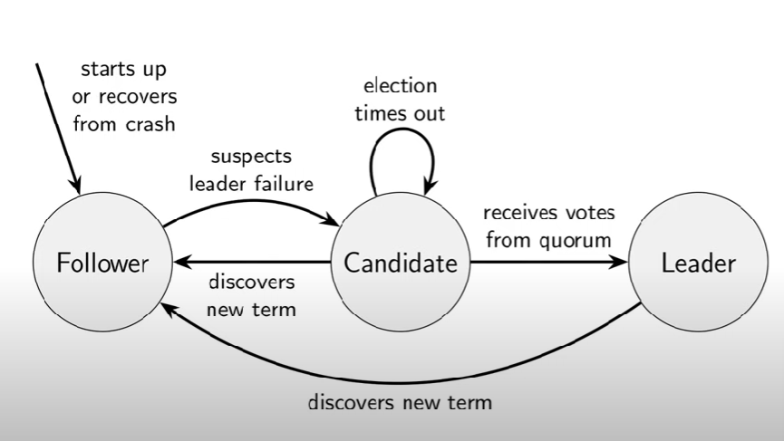
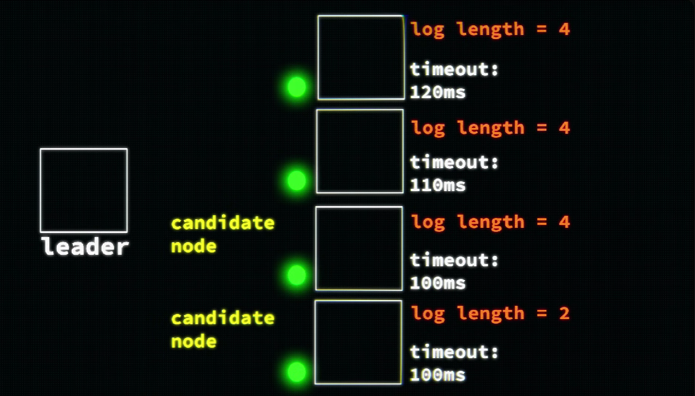
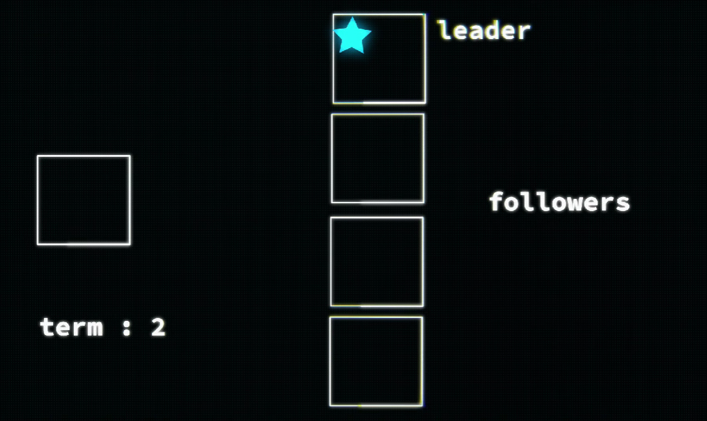
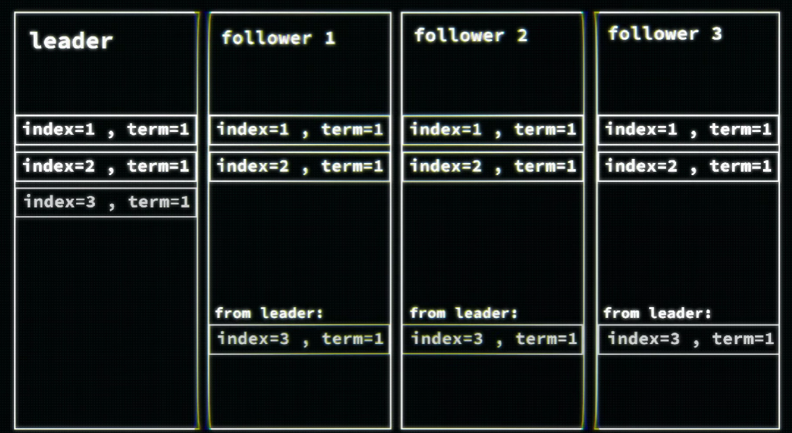
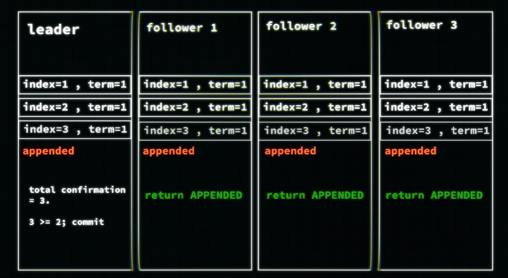
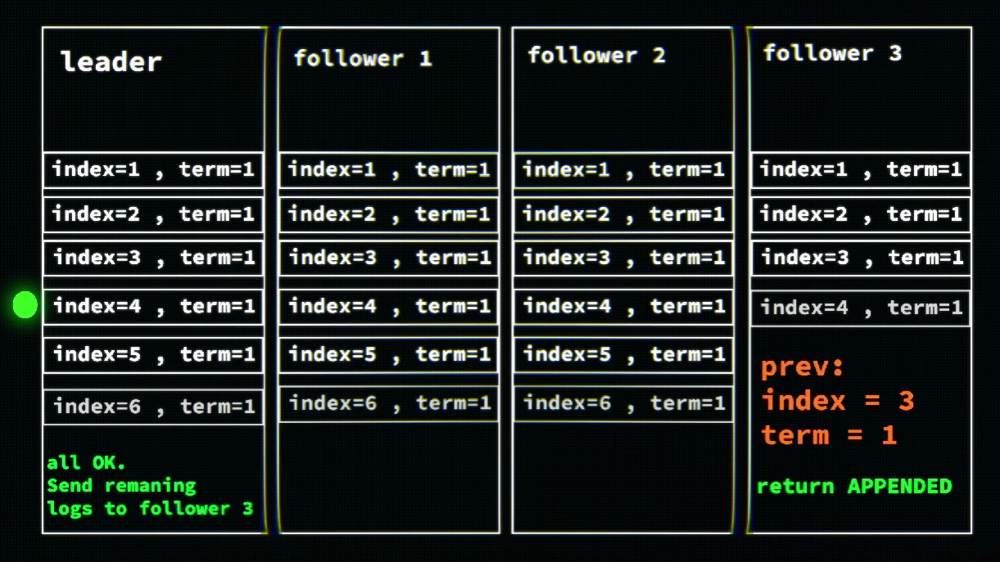
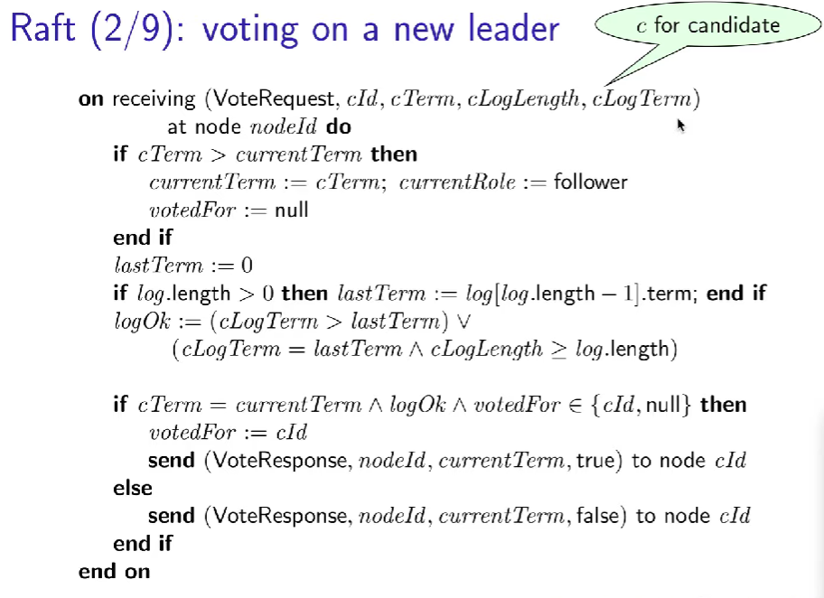
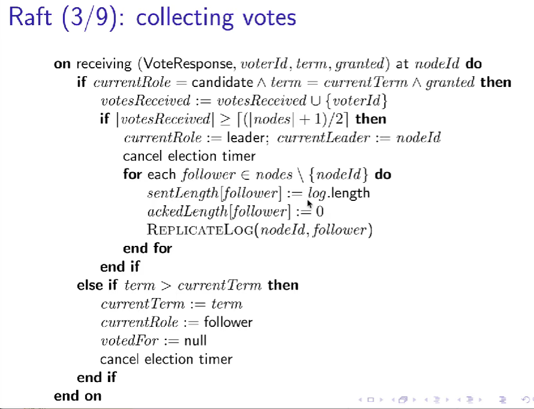
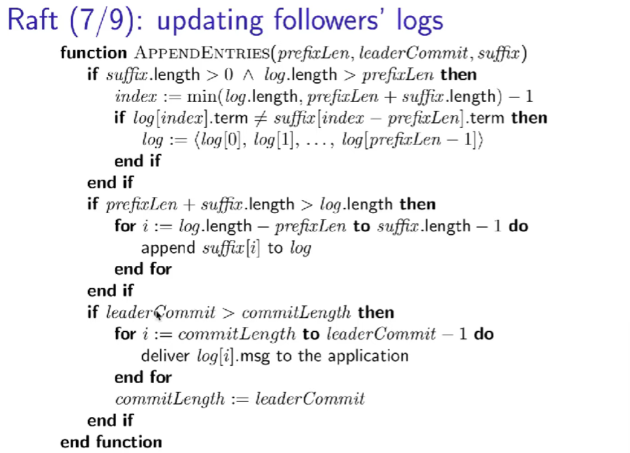

#### What is RAFT concensus algorithm:

As we already discussed when we work in distributed environment or leaderless approach, there are two majors problems:

- Node failure
- Node malfunctions.

So these consensus algorithm help us to resolved these.

In case of master slave this problems doesn't exist, but there all write go to single server , problem single point of failure.

- In Raft, node remain in one of the three states at any time: follower , candidate and leader and below state machine.
- timeout -> each node have some different time out , since you would see in algo node vote for themselves and if time out would be same, there it will be difficult to select the leader.

- It kind of based on leader and follower , but not exactly like that.
- There is concept of term in raft, which is just a variable and every time new leader select we increment this variable, this help in implementation to get to know whether current update or situation is in the same context.
- I am adding the ss of algorithm by martin kleppmann, expecting by reading of it you will get to know more of it.
- On a high level:
  - at the time there is only one leader. that is selected by voting. ( how ? check algo once :D )
  - and all the request indirect or directly come to the leader at that time.
  - this leader and follower maintain the logs.
  - leader write the request in log and send to the follower.
  - follower update the log and send the ack to the leader.
  - leader depending upon the quoram , check if its correct or write done or not and commit the write.
  - suppose some node go down, even after it can be sync with log by leader.

#### Algorithm

  

#### References:

- https://www.youtube.com/watch?v=uXEYuDwm7e4
- https://youtu.be/IujMVjKvWP4?si=_oShERAINhPsKcs