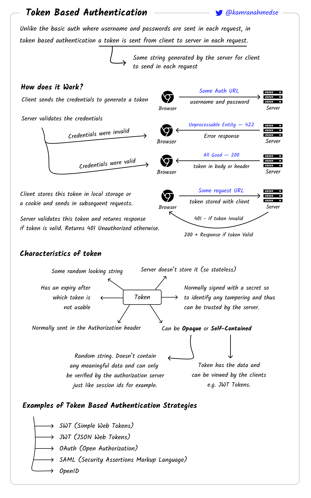
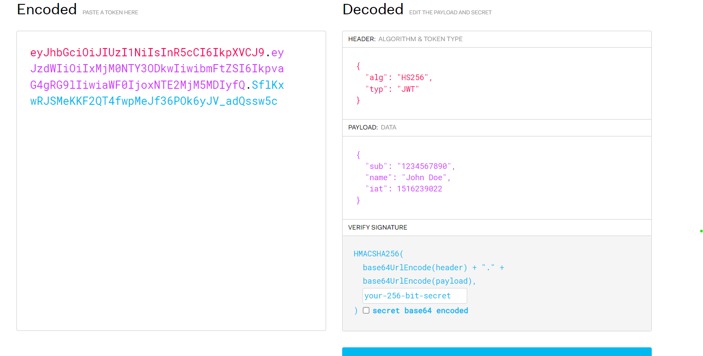
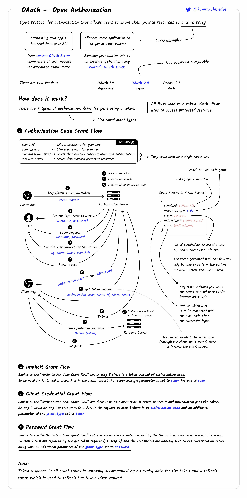
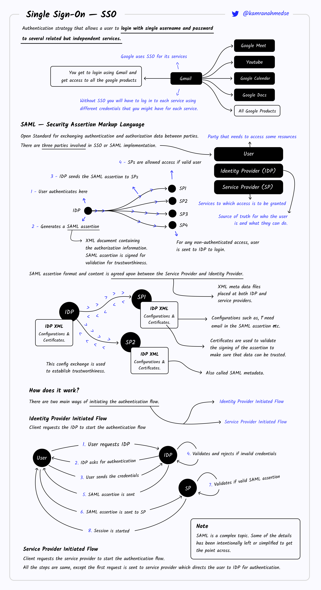

## How does different type of authentication works ?

### Different types of authentications

1. Credential Based.
2. Session Based.
   1. Stateful
   2. Stateless ( Also Understand SSO here)
      1. JWT
      2. SAML
      3. OPENID CONNECT ( OIDC )
      4. OAUTH
   
   

### Deep dive each of them

#### 1. Credential Based.
- Usr give credential username and password.
- We generate the passhash with input password ( with salt + hash algorith + password ). ( this 2 and 3 is one of the way there can be others )
- Check that for that username and orgid , whether the passhash exist and it is equal to above generated pass hash.


#### 2. Session Based:

1. Stateful


2. Stateless:



Stateless authentication stores the user session data on the client side (browser). The data is signed by the key of IdP(Identity Provider) ( if there is no any idp and our service also generate this token ) to ensure the integrity and authority of the session data.
Since the user session is stored on the client side, the server only have the capability to verify its validity by checking whether the payload and the signature match

What is SSO ?:
- Single Sign-on is the process of logging into one site and then getting logged into another site based on your login to first site. SSO is concept.
- Protocol/ways to do these ->  OAUTH(JWT), SAML(XML), OIDC(JWT) etc.


**a. JWT** 




**b. OAUTH ( Token based )**

OAuth is an authorization protocol that allows a user to selectively decide which services can do what with a user’s data.OAuth is not technically for Authentication. Though it is being used heavily for Authentication / SSO and mis read by many. OAuth is used to control authorization - what you can or cannot do within a Service

OAuth is a set of rules that **allow you to share your data that you hold within an application with another application without revealing your user name and password** that you hold within the first application with the second one.


1. Resource service -> google resource server ( will tell email id etc )
2. Authorizer service -> google gmail
3. user ->  me 
4. client ->  spotify


[ google and spotify already have internal connection for oauth. And spotify main the config on their side to have information like client id , secret, etc. ]
- user -> client
- client -> sign in with google button -> client server
- client -> call google auth(with state(random key) and oauth config , check google doc ) to get redirected url. -> google page to get permission from user

oauth config ( all these we store on our side):

```json
  "ClientId": "", 
  "ClientSecret":  
  "Endpoint": {
     "AuthUrl": "",
     "TokenUrl": ""      
  },
  "Scopes":
  "RedirectUrl"
```

- google auth ( user client access granted ) -> client server hook url
- client server ( google auth send a code and same state (that random key) to us ) -> google auth to get token with oauth config and this code
- client server -> google resource server to get user details with token and oauth 
- client server -> authenticate/authorise with those details, with token end point and token.



 
**c. OPENID CONNECT (OIDC)**

Its kind of same as OAUTH, instead of authorisation this is basically for authentication. We get the user information in format of JWT. Now JWT middle part is payload.
So we get information from there and authenticate user. That's the only different.
Here we don't need the scope.


**d. SAML**

SAML is a protocol used to implement SSO, specifically for exchanging authentication and authorization data.
Instead of json its communication based on the XML data type.

As we discussed the oauth, There we were using the json/jwt , and in particular format like authoriser endpoint , resource endpoint , secrets etc.

In the same way we have to save config for IDP in case of SAML on client side. That have little different format than oauth.

But Kind of all sso have save flow.

1. We have config of IDP already on basis of protocol.
2. User come on our side .
3. We redirect it to IDP
4. User enters credential.
5. IDP send us decided response, with our hook api.
6. We extract information and validate as per protocol and authenticate user.

For more details about the saml protocol can refer differently: \
https://medium.com/@srkasthuri/demystifying-saml-misconfigurations-3874aa1097ff  or any other refercen 




