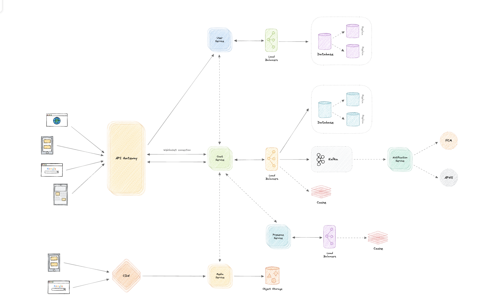
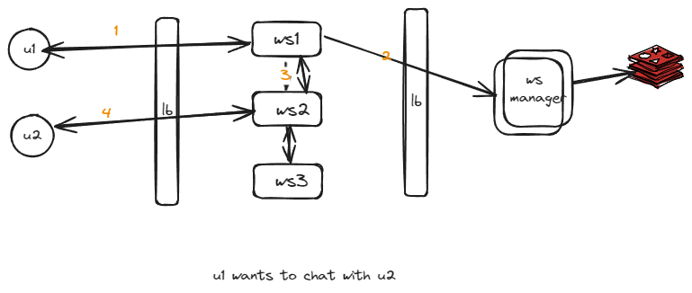
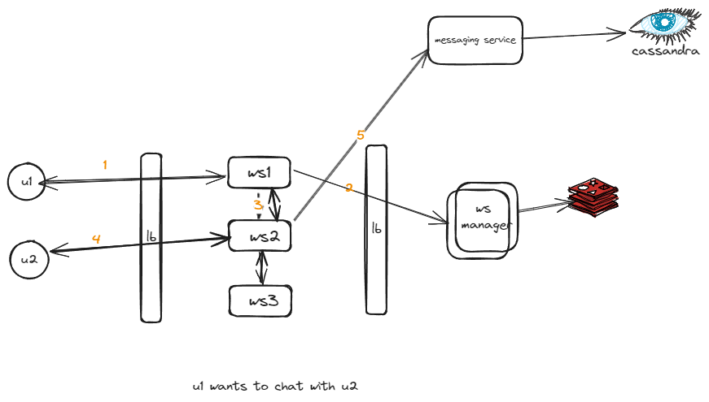
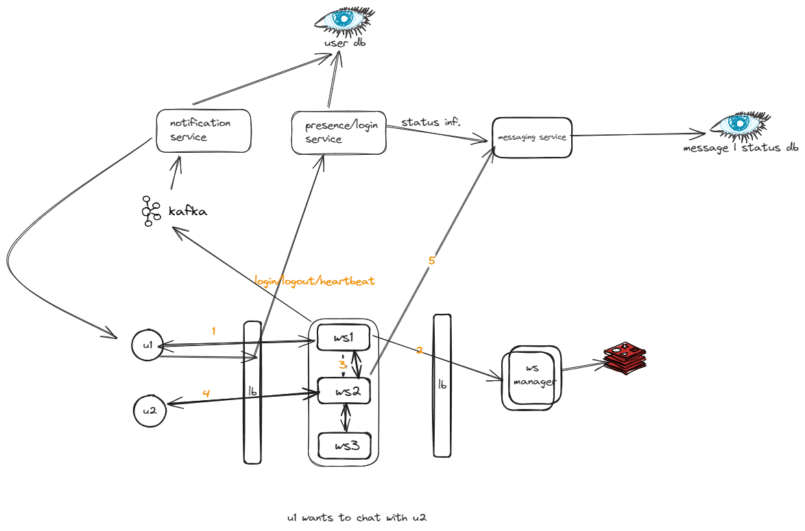
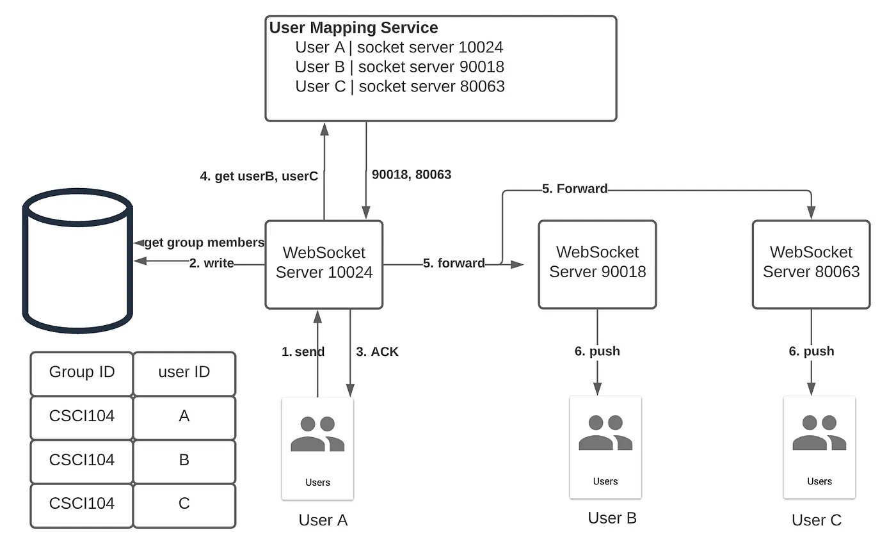
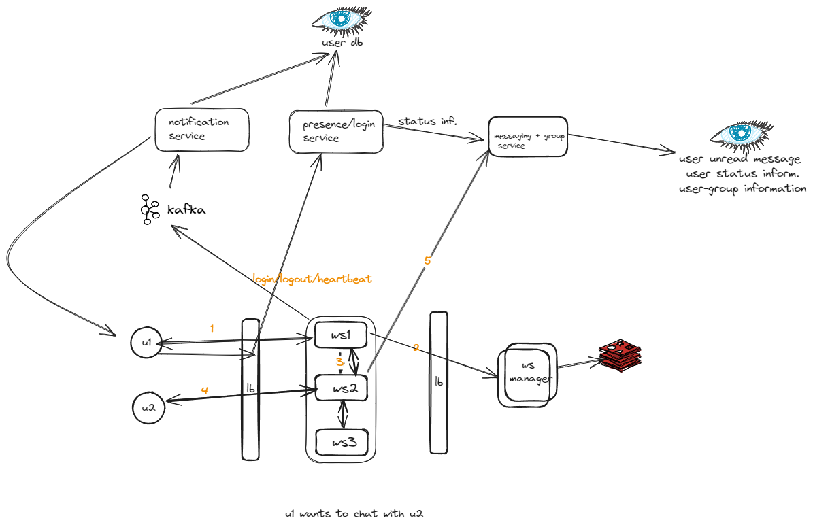

Design chat system:

#### Functional requirements
1. Should support one-on-one chat.
2. Group chats (max 100 people).
3. Should support file sharing (image, video, etc.).
4. Sent, Delivered, and Read receipts of the messages.
5. Show the last seen time of users.
6. If message is delivered don't keep it.
7. Push notifications.

#### Non-functional requirements

1. High availability with minimal latency.
2. The system should be scalable and efficient.

#### Design

#### What is web socket handler ? 

How will you find which user connected to which service in scaled system ? 

A web socket handler will be connected to a Web Socket Manager which is a repository of information about which web socket handlers are connected to which users. It sits on top of a Redis which stores two types of information:

- Which user is connected to which web socket handler
- What all users are connected to a web socket handler

Now let us get back to the conversation U1 and U2 are having. As we can see from the architecture flow diagram, U1 is connected to the web socket handler WSH1. So when U1 decides to send a message to U2, it communicates this to WSH1. WSH1 will then talk to the web socket manager to find out which web socket handler is handling U2, and the web socket manager will respond that U2 is connected to WSH2

#### What is message service.

this is for managing user status information and handling message when user is offline.
One user is online and message is deliver it will deleted data from db.

So if user is offline web socket server will call the messaging service and tell them to save message temporarily.
One user if online [ how will get to know ? Later]. Then will ask messaging service to get that message and delete.

#### How will get to know if user is online or not ? .

To implement the last seen functionality, we can use a heartbeat mechanism, where the client can periodically ping the servers indicating its liveness.
Since this needs to be as low overhead as possible, we can store the last active timestamp in the cache as follows: 

Key	Value

| User   | Date and Time           |
|--------|-------------------------|
| User A | 2022-07-01T14:32:50    |
| User B | 2022-07-05T05:10:35    |
| User C | 2022-07-10T04:33:25    |

#### Push Notification

This is little simple, our web socket will send the events to notification service kafka
one they received message from any user.

#### Group chat 

when request comes to ws service of a group message, then its connect to messaging service to get information about users in group.
after that it connects to web socket manager to get information about ws servers and then sends the message to user.

 

References:
1. System design by Alex xu.
2. https://www.youtube.com/watch?v=F9-dshKXbVg
3. https://github.com/karanpratapsingh/system-design?tab=readme-ov-file#whatsapp
4. https://www.youtube.com/watch?v=7WQ2EbXLfLI&t=158s
5. https://medium.com/@ephiram2002/horizontally-scaling-websockets-using-redis-afc25e9f7102 
6. https://www.codekarle.com/system-design/Whatsapp-system-design.html
7. https://towardsdatascience.com/ace-the-system-interview-design-a-chat-application-3f34fd5b85d0

