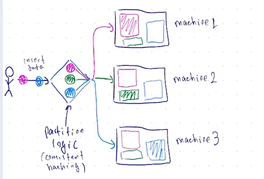
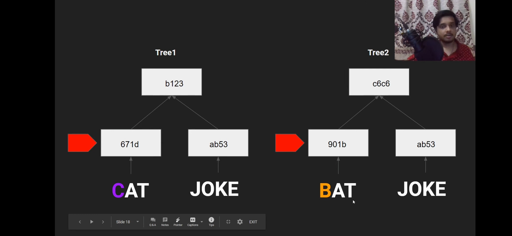
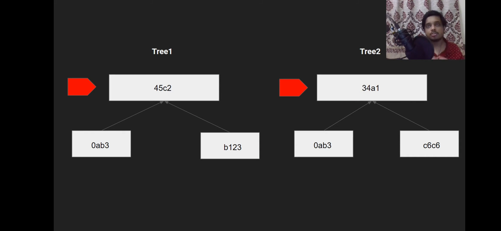
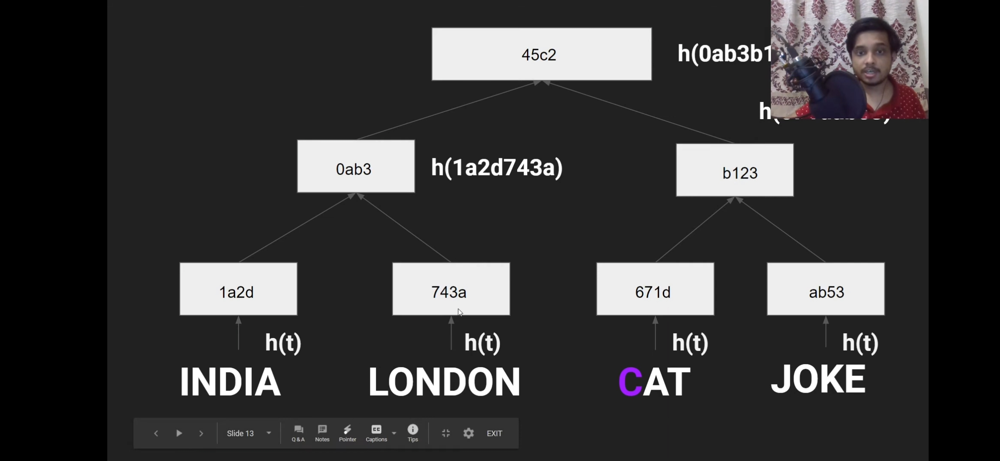
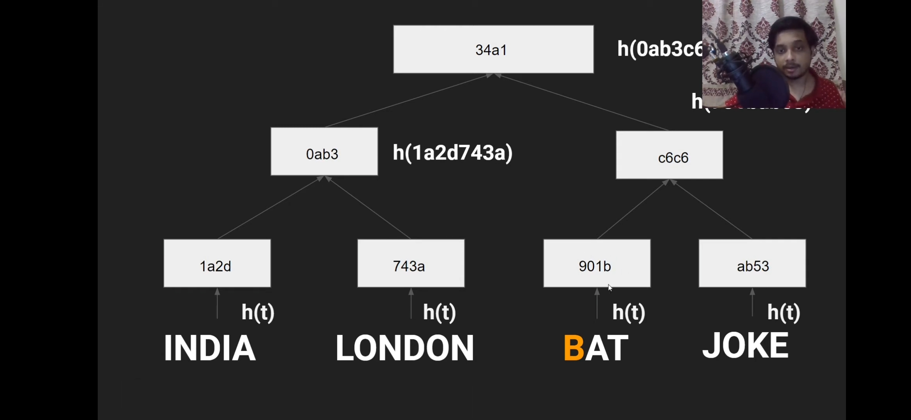

## key-value store (AP) [WIP]

Book

[https://www.educative.io/courses/grokking-modern-system-design-interview-for-engineers-managers/ensure-scalability-and-replication](https://www.educative.io/courses/grokking-modern-system-design-interview-for-engineers-managers/ensure-scalability-and-replication)

1. Data Partitioning

1. Data replication (peer to peer ) →

In the peer-to-peer approach, all involved storage areas are primary, and they replicate the data to stay updated. Both read and write are allowed on all nodes. Usually, it’s inefficient and costly to replicate in all nodes. Instead, three or five is a common choice for the number of storage nodes to be replicated.

**We’ll call a node coordinator that handles read or write operations. It’s directly responsible for the keys. A coordinator node is assigned the key “K.” It’s also responsible for replicating the keys to n−1 successors on the ring (clockwise).**

**Below** **C and B are coordinators for key L and K**

How to deal with the consistency factor? 

1. Tunable consistency→ (checkbook)

 quorum consensus | 

Minimum votes/number to win

How to deal and resolve inconsistency (In the available model about consistency dynamo cassandra chose to eventual consistency and it might cause inconsistency and below method to detail wit it )

1. what is Versioning and vector clock? → book.
2. How do we resolve conflict with the help of a vector clock? once we know about the conflict.
    
    
    Dynamo resolves these conflicts at read-time. Let’s understand this with an example:
    
    1. Server `A` serves a write to key `k1`, with the value `foo`. It assigns it a version of `[A:1]`. This write gets replicated to server `B`.
    2. Server `A` serves a write to key `k1`, with value `bar`. It assigns it a version of `[A:2]`. This write also gets replicated to server `B`.
    3. A network partition occurs. `A` and `B` cannot talk to each other.
    4. Server `A` serves a write to key `k1`, with the value `baz`. It assigns it a version of `[A:3]`. It cannot replicate it to server `B`, but it gets stored in a hinted handoff buffer on another server.
    5. Server `B` sees a write to key `k1`, with the `bax` value. It assigns it a version of `[B:1]`. It cannot replicate it to server `A`, but it gets stored in a hinted handoff buffer on another server.
    6. The network heals. Server `A` and `B` can talk to each other again.
    7. Either server gets a read request for key `k1`. It sees the same key with different versions `[A:3]` and `[A:2][B:1]`, but it does not know which one is newer. It returns both and tells the client to figure out the version and write the newer version back into the system.
    
    In the above example, most of the time, new versions subsume the previous version(s), and the system itself can determine the correct version (For example, `[A:2]` is newer than `[A:1]`). However, there are cases where the system cannot conclude on the correct version among the multiple versions of the same object, so this responsibility is given to the client.(client must have some algo to resolve this, may be like according to  priority of server etc way ) This is known as **semantic reconciliation.**
    
    Such a situation can arise in the presence of node failures, combined with concurrent updates leading to conflicting versions of an object. An example of semantic reconciliation is the shopping cart feature provided by Amazon. This mechanism guarantees that an ‘Add to cart’ operation is never lost, but it is possible that deleted items will resurface.
    
    
    
    More Read:
    
     [https://www.mydistributed.systems/2022/02/eventual-consistency-part-2.html](https://www.mydistributed.systems/2022/02/eventual-consistency-part-2.html)
    
    [https://www.mydistributed.systems/2022/02/eventual-consistency-part-1.html](https://www.mydistributed.systems/2022/02/eventual-consistency-part-1.html)
    

      **Handling failure**

1. Failure detection  → book
2. Handling temporary failure → sloppy quorum (first w healthy) and hinted handoff. (restore after up)

1. Handling permanent failure (book)→ Merkle tree.(to find the difference in less comparision)

How git use this ? → 

https://youtu.be/ADpI6zrR-3M?si=DfmNleY65Cxj3GQ-