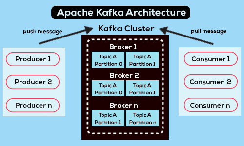
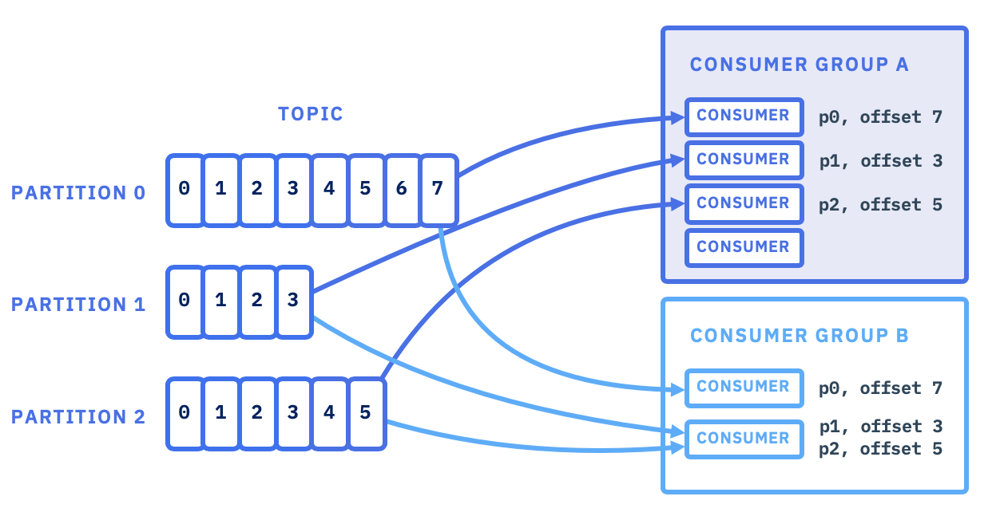
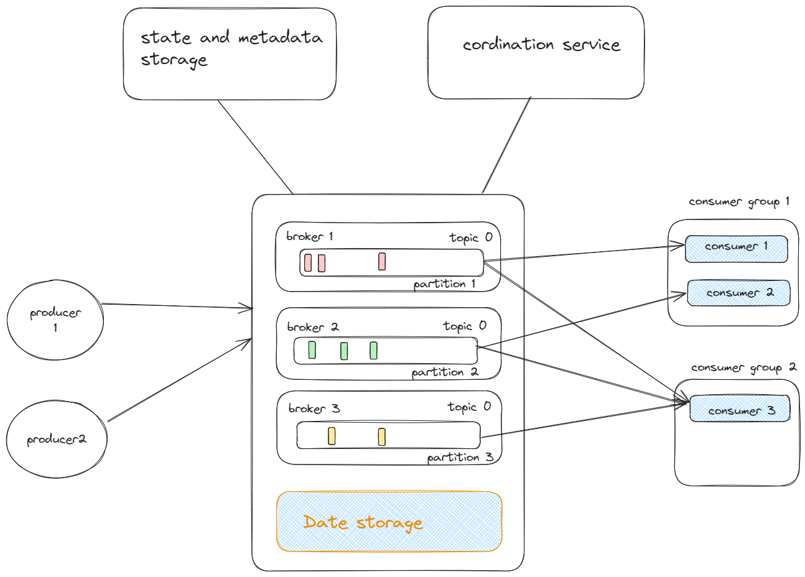
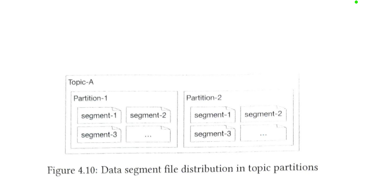
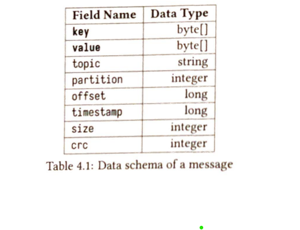

Design Distributed Message queue:

#### Message queue ( RabbitMQ ) vs Event streaming platforms ( Kafka ):

Event streaming platform are distributed message queue with extra features like have high data retention, repeated consumption of message.

***We will be discussing the message queue which have all these features. Since its not like designing question. Its a learning so will share how these works***

### Content

1. Messaging Models. ✅
   1. Point-to-Point. ✅
   2. Publish-Subscribe. ✅
2. Topic, Partitions and Brokers. ✅
3. Consumer Groups. ✅
4. High level design. ✅
5. Design deep dive. 
   1. Data storage ✅
   2. Message data structure.✅ 
   3. Batching ✅
   4. Push/Pull Method.✅ 
   5. Consumer Re-balancing [ ***Skipping*** ]
   6. State storage, metadata storage and zookeeper.✅
   7. Replication and in-sync replica.✅
   8. Data delivery semantics.✅

#### Note we guarantee the order in partition level of a topic.

#### Message Models

1. Point-to-Point: One message consumed by only one consumer. [ SQS ].
2. Publish-Subscribe: Consumer subscribe for a particular topic and consume message from it. But point-to-point can also be simulated by ***consumer group***.

#### Topic , Partition, Brokers

1. Topic: You can assume its like one queue, and we have separate queue according to topic name. So that consumer no need to listen events from other domain.
2. Brokers: These are the service which maintaining and processing your data.
3. Partition: For scaling topic and fault tolerance, we distribute the message in multiple brokers in multiple partition. So if we have lots of events in particular topic we can scale it. Partitions have different messages for a particular topic.

#### Consumer Groups

As said messaging queue allow one message to only one consumer. [ we have both feature this one as well as multiple ].
Multiple is easy , many consumer can subscribe same topic that's it.

But How to implement this ? 

That's where consumer groups come into picture.

***As name , consumer groups are the collection of consumers, one consumer can only be in one group. Messages in a partition will be consumed by only one consumer in a group but consumer can consume from multiple partition of different topic or same topic. This is like point to point model.***

#### High level design

Let's discuss about storage and coordination service in brief.

1. Data Storage
   1. State storage: keep the configuration or state of consumers
   2. Metadata storage: keep the configuration and properties of topic.
   3. Data storage: use to retain the messages

2. Coordination service
   1. Service discovery: which broker are alive.
   2. Leader Selection: Select one active controller among the brokers which will handle the partition things.
   3. Apache Zookeeper: commonly use to elect a controller.

### Deep-dive High level design

#### 1. Data storage:

Options: Sql, Nosql, Files.

Let's find out traffic pattern first :-

- Read and Write heavy.
- High data retention.
- Sequential access of data.
- No delete or update operations.

Quoting:

Database can handle the storage requirements. But they ain't ideal because it is hard to design a database that supports both write-heavy and read-heavy access patterns at a large scale.

Used Solution:

***Write Ahead Log ( WAL )*** : Its a plain file where new entries are appended to ***append-only*** log

Further Reading: 

- https://www.youtube.com/watch?v=uHvR7nOu5m4
- https://martinfowler.com/articles/patterns-of-distributed-systems/write-ahead-log.html
- https://www.freecodecamp.org/news/design-patterns-for-distributed-systems/#write-ahead-log-pattern

2. Other state and metadata can be in cache and nosql

#### 2. Message structure

Key is used to find the partition. And other field have their meaning as their name.

#### 3. Batching

This is way to improve the performance.

Batching: -> instead of calling immediately after we get event. We try to batch and make bulk call that will improve performance.

This can be improved:

1. Producer level -> instead of sending message one by one send in batch.
2. Logging level -> instead of immediately add message log write in batch. etc

Cons: Its trade off between latency and performance.

#### 4. Push/Pull

In publish-subscribe model.

We have two ways.

1. Either broker itself call each consumer like SNS who are subscribed to particular topic. [ ``Push``].
   1. Pros:
      1. Low latency: immediate push.
   2. Cons:
      1. It can result in bombard if consumer has less consumption rate than events.
2. Either consume continuously poll the events from broker. [`Pull`]
   1. Pros:
      1. Consumer control the rates.
      2. Best suitable for batch processing
   2. Cons:
      1. Checking event where there is no messages.

Mostly messaging queue implemented with pull.

#### 5. State storage, metadata storage and zookeeper.

Both state storage and metadata storage are kept in zookeeper.

State Storage:
- Consumer state information about its partition and offset.
- Database key value store -> Zookeeper

Metadata storage:
- Topic information including no. of partitions, retention period , distribution of replicas etc.
- Database key value store -> Zookeeper

Zookeeper

- hierarchical key-value store. It is commonly used to provider a distributed configuration management service.

- Metadata and state storage are moved to zookeeper.
- Broker now maintain the data storage for messages only.
- zookeeper helps with leader election of the broker cluster.

#### 6. Replication and in-sync replica.

- As of now we discussed that one topic have multiple partition to have more scalability, but what about reliability ? 
- That's why here comes replication of partitions.
- There is a config which keep replication count.
- For e.g. if its value is 2 . It means all the parititions of  topic will be replicated twice in different brokers
- Among all the replication , one will be leader that will do all work and other will be in sync with leader.

In-sync replicas [ ISR ]:

Those partition which are in sync with leader data.

Support replica count is 5 and in-sync replica is 4. It means out one partition doesn't have the latest information.

This is like similar problem in multi-master replication.

Here's a trade off between performance and durability and that dependent on the acknowledge counts from other replica, while putting messages in leader partition.
And different configurations have its own pros and cons.

If:

- ACK=all , all must be in sync for success 
- ACK=1 , 
- ACK=0 ,

#### 7. Data delivery semantics.
   
   
- At most one: No ack needed from broker and consumer. Usecases: Monitoring metrics, where small amount of loss is acceptable
   

- At least one: Infinite retry from producer to broker and broker to consumer. May have duplicate. De-duplication can be done on consumer side
 

- Exactly one : I guess not 100% sure whether its possible or not.

#### 8. Partition Balancing

- Increase partition (Scale topic) : Old messages won't get shift. Only new messages we will consider new partition and shift the corresponding loads. ( producer has to have this information , so that can send message accordingly. This message won't go in same partition now. Producer responsibility ).  
- Decrease partition : First will consume all the messages in this partition and destroy or after configured retention period passes. Parallely send the traffic in remaining partition only. But won't shift old messages from this partition to other.  ( Now producer will send only in remaining shards. Producer responsibility).

#### 9. Broker Failure Recovery.

- What if one broker down ? or scale ? 

Broker Down: ( always keep buffer in nodes, not 100% utilized it . So that in case of worst we save ourself )
- Broker controller detect and will create the another distribution plan with remaining nodes. ( every partition will have its leader)
- The new partitions in remaining broker will act as follower and will catch with leader.

Reference:
1. System design alex xu.

### Follow up:

1. Detail about zoo-keeper ( distributed coordination service ). is it database or what ? [ https://medium.com/@sureshpodeti/distributed-coordination-service-zookeeper-309ab626097d ]
2. In short zookeeper is a key-value store, that allow us to store the config data in the reliable way ? how ?
