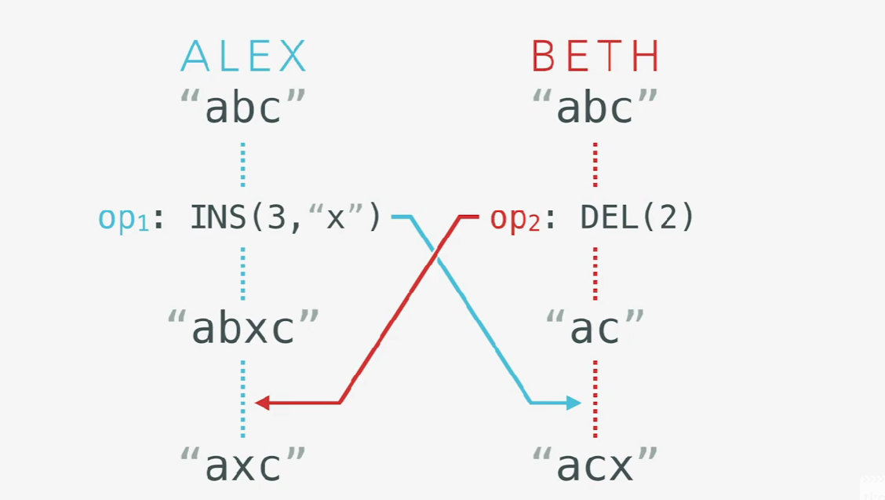
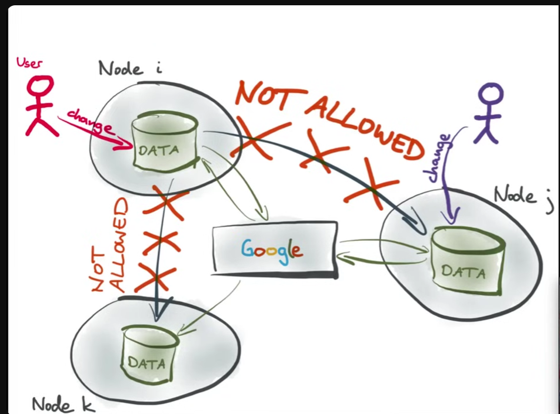
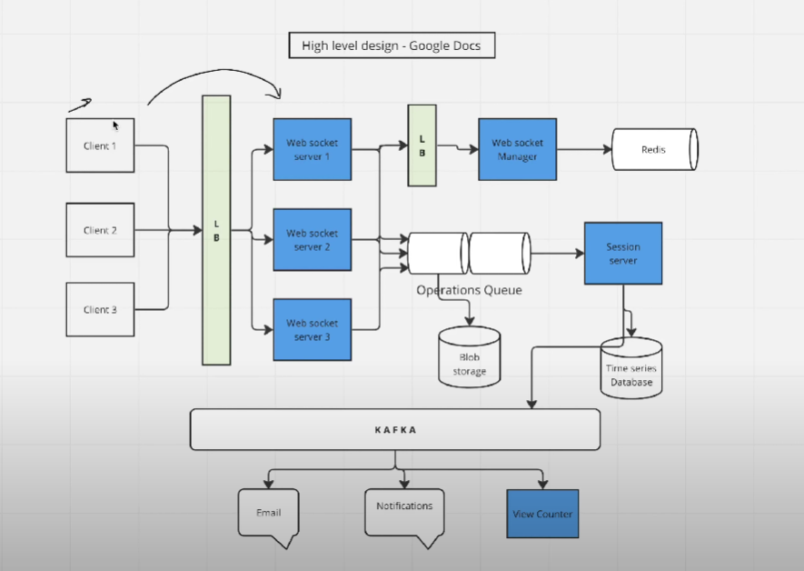
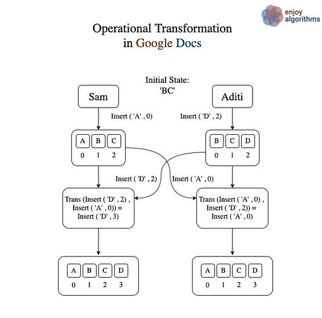
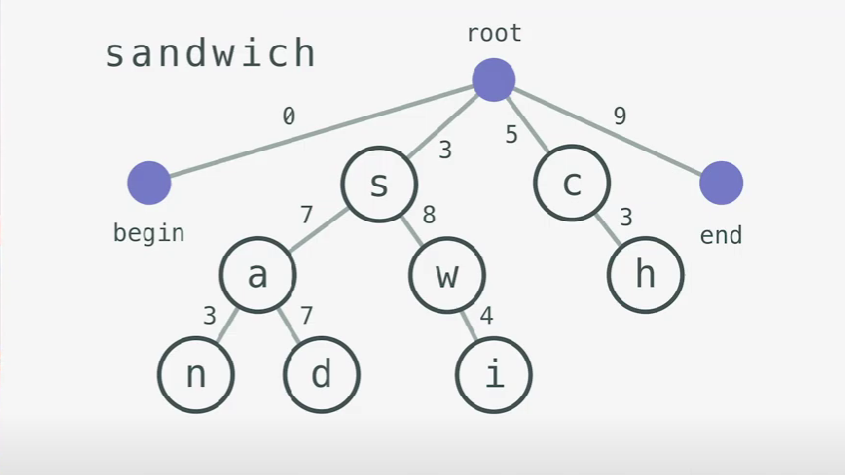
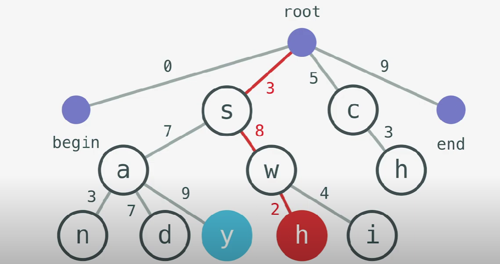
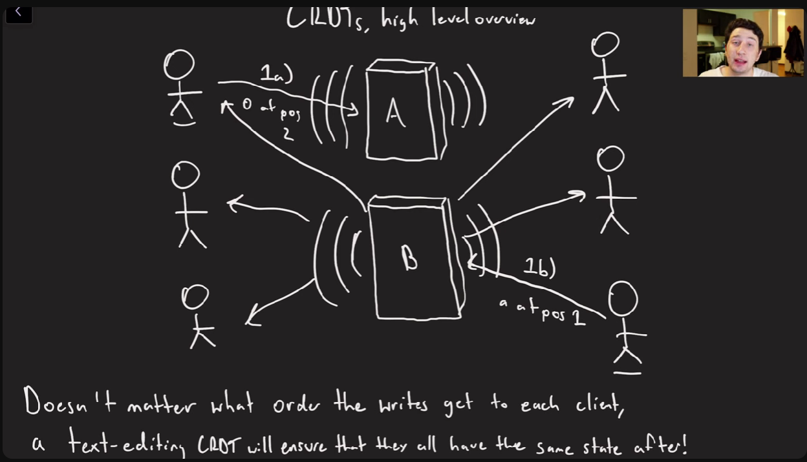

### Functional Requirement
1. Document collaboration: Multiple users should be able to edit a document simultaneously ( assume it is text based only). Written of one user should be seen dy other user immediately.
2. Conflict resolution: The system should push the edits done by one user to all the other collaborators. The system should also resolve conflicts between users if they’re editing the same portion of the document. So at the end user should be able to see same data.

### Non-functional Requirement
1. Concurrency: A lot of people are working on the same document 
2. Latency: Different users can be connected to collaborate on the same document. Maintaining low latency is challenging for users connected from different regions.

### High level design
 

#### Data stores
1. Relational database — for saving users’ information and document-related information for imposing privilege restrictions
2. NOSQL — for storing user comments for quicker access.
3. Time series — to save the edit history of documents
4. Blob storage — to store videos and images within a document
5. Cache — distributed cache like Redis and a CDN to provide end users good performance. We use Redis specifically to store different data structures, including user sessions, features for the typeahead service, and frequently accessed documents. The CDN stores frequently accessed documents and heavy objects, like images and videos.

#### Protocol

1. For only collaborative we will be using the websocket, apart from this on the other places it will be http.

#### Services:

1. Application service:  Service to fetch the document from the server, import , export etc. 
2. Operational queue and session service: Each request gets forwarded to the operations queue. This is where conflicts get resolved between different collaborators of the same document. If there are no conflicts, the data is batched and stored in the time series database via session servers. Data like videos and images get compressed for storage optimization, while characters are processed right away [ doubtful ].
3. Typeahead service:  for autocomplete suggestions and keyword extraction. It suggests using a NoSQL database to handle a large number of words efficiently and proposes caching frequently used words and phrases in Redis for faster retrieval.
4. Pub-sub system:  This is the notification service would be connected async by kafka.

#### Deep dive in collaborative part

#### Document editor

A document is a composition of characters in a specific order. Each character has a value and a positional index. The character can be a letter, a number, an enter (
), or a space. An index represents the character’s position within the ordered list of characters.

#### Concurrency

Collaboration on the same document by different users can lead to concurrency issues. Conflicts may arise whenever multiple users edit the same portion of a document.

Since users have a local copy of the document, the final status of the document may be different at the server from what the users see at their end. After the server pushes the updated version, users discover the unexpected outcome.

To solving this google doc uses operation transform and CRDTs. Since locking mechanism is not good as per use case since will block the other users . It won't give better user experience and collaborative environment.
These are based on operation did by user and other some condition. That will eventually generated same output and that is replicated to each user client.

#### Operational Transformation 

- The primary goal of OT is to ensure that edits made by different users in different orders result in the same final document state.
- This is kind of black box which take the conflicting operations and out a common operation by combining all and put to frontend.

- Operational transformation have limitations:
  - It depends on the order of operation, depending upon order final results come out and it require all operations. So it require a centrised server ( like in above diagram operation queue is operational server ). this is centralised
    
  - It not multi peer, it only two. let say its not below 3 operations come to 3 different servers, how to solve ?
    
  - But google doc use this how ? ->
    
  - Its pseudo mutlipeer -> there is decentralised google doc server which act as one person and other user every time that's how it implements.
  - Flow: operational server received operation, it find the resultant output depending on operation , send to all concurrent user or user of that doc.    

#### Conflict-free Replicated Data Type (CRDT)

- The Conflict-free Replicated Data Type (CRDT) was developed in an effort to improve OT.
- This solve multi peer at more extends as it doesn't have conflicts. And has low latency as compare to OT since no centralisd server and no need to resolved conflict as much in OT.
- Works on eventual consistency.
- There are different implementation of this data type, will discuss here about LSEC ( linear sequence ), tree based CRDT
  
- In this each node and client maintain a local data structure in tree shape what actually denoting the document. And its dfs is actually the document in order. For e.g. below is how the sandwich is written in it. It has some weight in edge.

- Instead of instead here character or each node denoted as address for e.g. the address of d in above image will be [3.7.7] and ***it must be unique and immutable in whole tree***. 
- lets see how we can insert some character between or suppose we have 2 operations.
  
- Operations: Now these operations can de done independently or concurrently no need to have centralised server.
  
  
- Disadvantages -> 
  - tree can change in array, but some advance algorithm has solved this also by balancing tree.
  - what if two user insert character with same address (though it has less probability) -> Yes this is case is tough to handle in this case , the operations will be interleaved. 
  - what if user click twice or what about idempotency 
    - UUID: -> overhead on client each operation/character has to maintain its unique id.
    - version vector:  ? tired take this up separately
- Flow: nodes maintain its crdt and similarly client, nodes received operation concurrently then do operations and broadcast to all client and all nodes do this ( also persist in db ) and nodes asyncly update them self with gossip protocol.  
  

  video later: https://www.youtube.com/watch?v=B5NULPSiOGw

#### References:

1. https://medium.com/@sureshpodeti/system-design-google-docs-93e12133a979
2. https://vvsevolodovich.dev/system-design-example-google-docs/
3. https://www.youtube.com/watch?v=-C_PHg9bxho&ab_channel=ArunTyagi  [ ek no. ]
4. https://srijancse.medium.com/how-real-time-collaborative-editing-work-operational-transformation-ac4902d75682
5. https://www.youtube.com/watch?v=M8-WFTjZoA0&ab_channel=TL%3BDR%2F%2FJavaScriptcodecastsforworkingdevs
6. https://www.youtube.com/watch?v=M8-WFTjZoA0
7. https://www.youtube.com/watch?v=YCjVIDv0zQY
8. https://www.youtube.com/watch?v=hy0ePbpna5Y
9. https://www.youtube.com/watch?v=x7drE24geUw&t=13s
10. building: https://conclave-team.github.io/conclave-site/
11. https://github.com/automerge/automerge