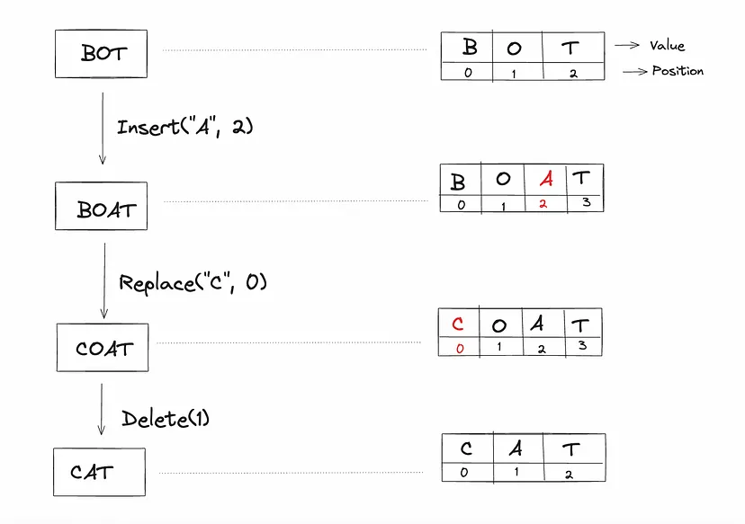

### Functional Requirement
1. Document collaboration: Multiple users should be able to edit a document simultaneously ( assume it is text based only).
2. Conflict resolution: The system should push the edits done by one user to all the other collaborators. The system should also resolve conflicts between users if they’re editing the same portion of the document.

### Non-functional Requirement
1. Concurrency: A lot of people are working on the same document 
2. Latency: Different users can be connected to collaborate on the same document. Maintaining low latency is challenging for users connected from different regions.

### High level design

#### Data stores
1. Relational database — for saving users’ information and document-related information for imposing privilege restrictions
2. NOSQL — for storing user comments for quicker access.
3. Time series — to save the edit history of documents
4. Blob storage — to store videos and images within a document
5. Cache — distributed cache like Redis and a CDN to provide end users good performance. We use Redis specifically to store different data structures, including user sessions, features for the typeahead service, and frequently accessed documents. The CDN stores frequently accessed documents and heavy objects, like images and videos.

#### Protocol

1. For only collaborative we will be using the websocket, apart from this on the other places it will be http.

#### Services:

1. Application service:  Service to fetch the document from the server, import , export etc. 
2. Operational queue and session service: Each request gets forwarded to the operations queue. This is where conflicts get resolved between different collaborators of the same document. If there are no conflicts, the data is batched and stored in the time series database via session servers. Data like videos and images get compressed for storage optimization, while characters are processed right away [ doubtful ].
3. Typeahead service:  for autocomplete suggestions and keyword extraction. It suggests using a NoSQL database to handle a large number of words efficiently and proposes caching frequently used words and phrases in Redis for faster retrieval.
4. Pub-sub system:  This is the notification service would be connected async by kafka.

#### Deep dive in collaborative part

#### Document editor

A document is a composition of characters in a specific order. Each character has a value and a positional index. The character can be a letter, a number, an enter (
), or a space. An index represents the character’s position within the ordered list of characters.

#### Concurrency

Collaboration on the same document by different users can lead to concurrency issues. Conflicts may arise whenever multiple users edit the same portion of a document.

Since users have a local copy of the document, the final status of the document may be different at the server from what the users see at their end. After the server pushes the updated version, users discover the unexpected outcome.

To solving this google doc uses operation transform and CRDTs. Since locking mechanism is not good as per use case since will block the other users . It won't give better user experience and collaborative environment.
These are based on operation did by user and other some condition. That will eventually generated same output and that is replicated to each user client.

#### Operational Transformation [ Has to be read separately ]
Operational transformation is a set of complex algorithms, and its correct implementation has proved challenging for real-world applications. For example, the Google Wave team took two years to implement an OT algorithm.

#### Conflict-free Replicated Data Type (CRDT) [ Has to be read separately ] 
video later: https://www.youtube.com/watch?v=B5NULPSiOGw

The Conflict-free Replicated Data Type (CRDT) was developed in an effort to improve OT. 

CRDTs ensure strong consistency between users. Even if some users are offline, the local replicas at end users will converge when they come back online.

In fact, with CRDTs, it’s possible to implement a serverless peer-to-peer collaborative document editing service.

#### References:

1. https://medium.com/@sureshpodeti/system-design-google-docs-93e12133a979
2. https://vvsevolodovich.dev/system-design-example-google-docs/