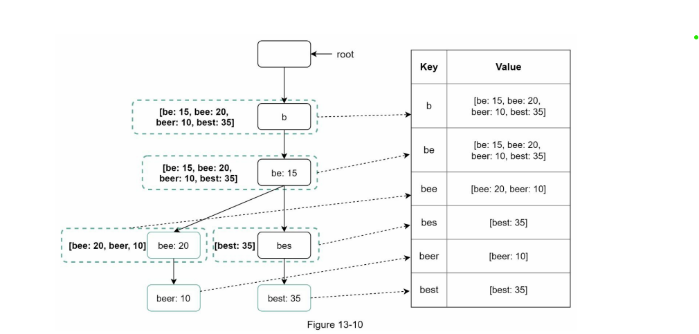
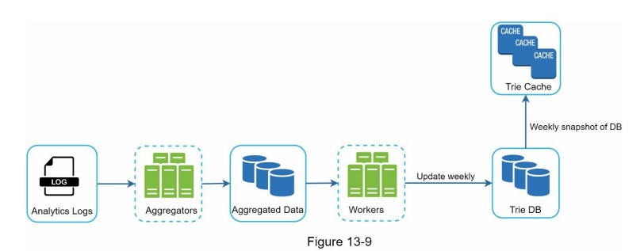
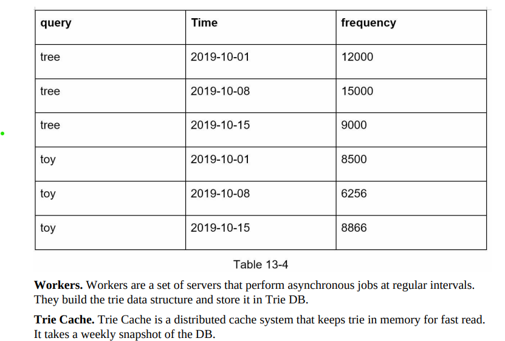
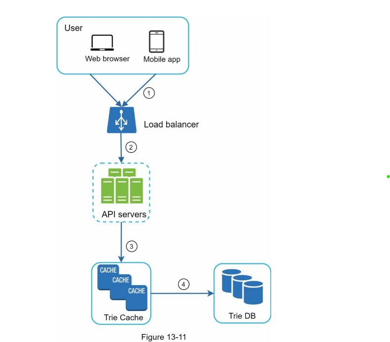
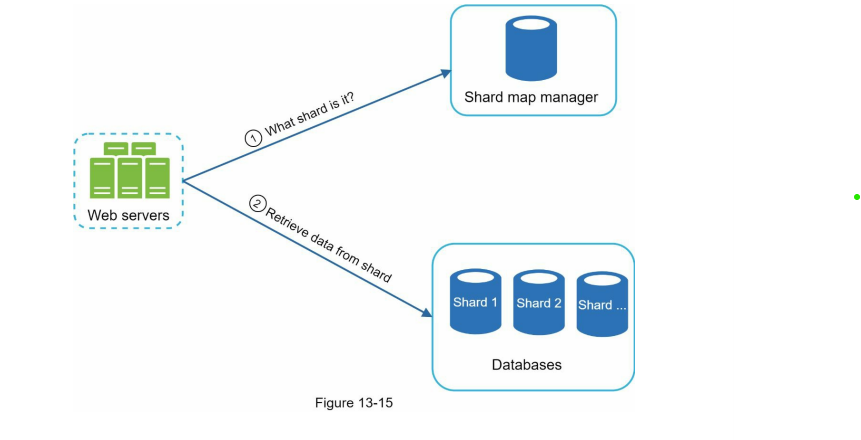

### Design Autocomplete feature for a search box


#### Requirements

1. ***Fast response time***: As a user types a search query, autocomplete suggestions must show up fast enough. An article about Facebook’s autocomplete system reveals that the system needs to return results ***within 100 milliseconds***. Otherwise it will cause stuttering. ***Constant time complexity***.
2. ***Relevant***: Autocomplete suggestions should be relevant to the search term.
3. ***Sorted***: Results returned by the system must be sorted by popularity or other ranking models.
4. ***Scalable***: The system can handle high traffic volume.
5. We will be handling a large amount of data, hence ***partition tolerance is necessary***. Partition tolerance means that the cluster must continue to work despite any network failure between system components/ nodes in the system. Users must not face any performance failure
6. ***Highly available***: It is okay if we don't have strong consistency. Owing to the CAP theorem, as availability and partition tolerance is our priority, eventual consistency is fine. If two people see different suggestions for a certain time span, it is fine. But the system must be available. Otherwise, it will degrade the user experience.

#### Back of the envelope estimation

- Assume 10 million daily active users (DAU).
- An average person performs 10 searches per day.
- 20 bytes of data per query string:
- Assume we use ASCII character encoding. 1 character = 1 byte
- Assume a query contains 4 words, and each word contains 5 characters on average.
- That is 4 x 5 = 20 bytes per query.
- For every character entered into the search box, a client sends a request to the backend for autocomplete suggestions. On average, 20 requests are sent for each search query. For example, the following 6 requests are sent to the backend by the time you finish typing “dinner”.
  ```  
    search?q=d
    search?q=di
    search?q=din
    search?q=dinn
    search?q=dinne
    search?q=dinner
  ```
- ~24,000 query per second (QPS) = 10,000,000 users * 10 queries / day * 20 characters / 24 hours / 3600 seconds.
- Peak QPS = QPS * 2 = ~48,000
- Assume 20% of the daily queries are new. 10 million * 10 queries / day * 20 byte per query * 20% = 0.4 GB. This means 0.4GB of new data is added to storage daily.

#### High level design

[ Useful on very less data set ]


1. We can have relational db which having the string and its frequency. Initially it will be empty.
2. Now once we get request , hit sql query to db and return the top k text.
3. Once he/she enter the search text , we will update that text in our table.
- Problem: 
- Search is not fast. Looks anti-pattern because of this database.
- too much storage uses.
- accessing everytime db is not good to write db can have high cpu utilisation. and affect on query


#### Deep-dive High level design

Now what can be done ? 
- Instead of sql can use nosql. Can use redis 🤔

#### Database and redis design

1. Redis

- To access fast we can use in memory storage, but simply keeping them as searched text and frequency. Will take storage and also will have to search all string.
- Solution: Trie Data structure. This can be more optimized to keep the top k frequency word already at node (assume prefix has limit and its constant assume 50)


So Now complexity is constant. Since prefix is constant . O(1) ( 50 ).


Okk , this is sorted what about persist storage and update ?

- ***For persist storage*** we can use nosql and put this as serialize tree or can also use key-value store with prefix in trie and its corresponding value.
- 
  

- Updating trie in this state at every text search would be bad, because of too much scale and also would affect query.
- Solution can do offline and in batch.


Solution:

1. We will log the search text with frequency.
2. Can create job that will instead of update the data in db and cache, it will delete and insert new data. [ We can tune period according to our need ]





Now its sorted so our query service would be look like this




***Problem, Scaling of database ?***

The best to scala here is horizontal scaling. We can scale simply by sharding a-z in multiple shard. 
So maximum can be 26 then can have shard on their child.

Problem - what if data is not evenly distributed, 'a' has more data than 'z'. 🤔

Solution:

Create Shard manager -> that will handle the distribution of data.

For e.g. This will maintain among [ a, b, c, w, x, y]

like shard1: [ a, b ] and shard2: [ c, w, ,x, y]




 


#### Reference:

1. System design alex xu.
2. https://systemdesignprep.com/team
