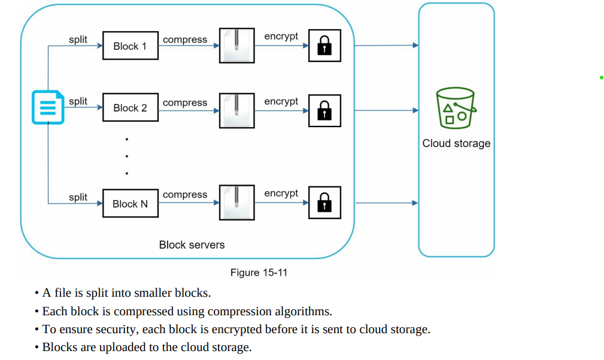
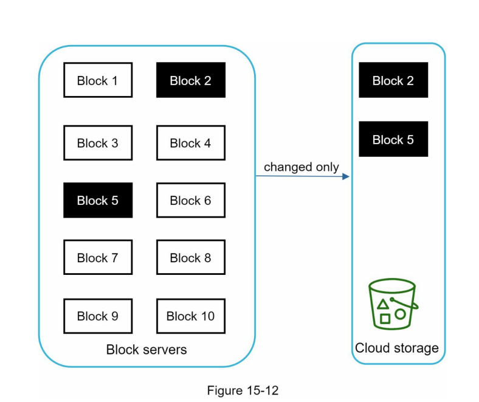
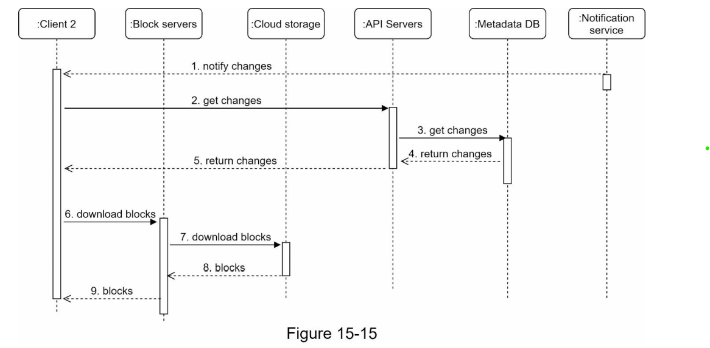

Design the google-drive: Its kinda same of youtube once. But here we don't need transcoding but yes need chunking.

### Functional Requirements
1. Add and download files. 
2. Sync on all device.
3. See file revision.
5. Send notification when a file is edited, deleted and shared to you.

### Non-functional Requirements
1. Reliability : data shouldn't be lost.
2. Fast sync speed
3. Scalability and high availability.

### Capacity Estimations
1. Assume 50M sign up and upto 10M DAU.
2. User gets 10 GB free space.
3. User upload 2 files perday. The average file size is 500KB.
4. 1:1 read to write ratio.
5. Total storage allocated = 50 M * 10GB => 500 * 10^12 -> 500 PB
6. QPS  = 10M * 2 / 10^5 = 200 request/second.
7. Peak QPS = 400 request/second.

### High level design

Let check functional requirement one by one.

1. Add/download the files.
This is kind of simple and we can use same design as did in youtube.
2. notification service -> already discussed. We will send the event to kafka once related entry in out metadata base.
3. Version: Best thing is that we are having chunks of file. So when version upgrade. It means there might be possible not all chunks are save only some chunks are update in this case storage would be saved.
4. Sync on all device:  Instead of async use sync update of metadata. use sql db in metadata. We can also use synchronisation server to send updated file to other client with long polling. Its kind of same in whatsapp.

### Deep dive high level design

1. Block Server:
   1. Split file in chunks and then save it.
   2. Delta change in case of update/edit file. ( in below photo block 2 and 5 are only changes )
      
      
   3. Download flow
      
2. High consistency:
   1. User shouldn't see different version on different system.
   2. We want strong consistency , then we can use the sql database for metadata.  Instead of nosql which are based on eventual consistency. Now all metadata update will be done by transactions.
3. Metadata DB:
   1.  TBU        
4. Notification service: Already discussed.

References:

1. https://www.linkedin.com/pulse/google-drive-design-saral-saxena/
2. https://www.pankajtanwar.in/blog/system-design-how-to-design-google-drive-dropbox-a-cloud-file-storage-service
3. Alex xu volume 1.

Curious Doubts [ WIP ]:

1. What does chunking file means ? 

