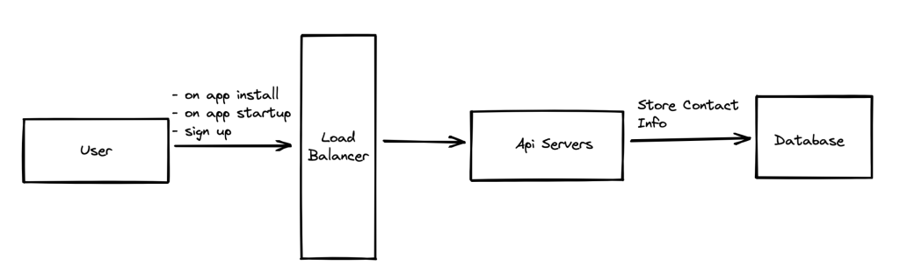
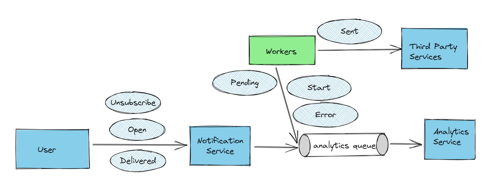
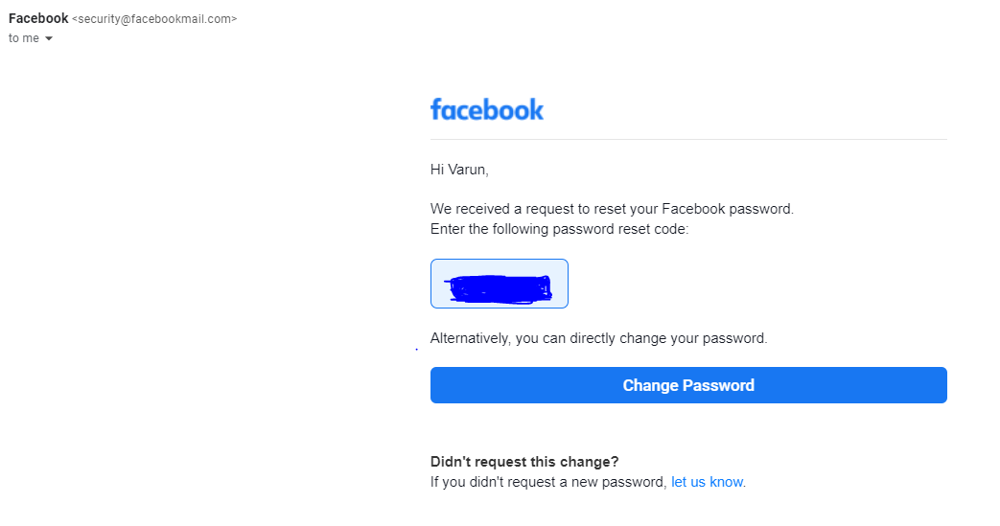

Great Article: https://www.bemyaficionado.com/design-a-notification-system/ <br>
Copy Pasted here for persistence and easiness.


### Design A Notification System

The notification system is a very important part of any organization. For ex: 

1. It is very important to tell people about their upcoming payments. 
2. Or that the order has been placed successfully with the receipt of their order. It gives them feedback that things went well.

But have you ever given any thought to how notification works or is delivered to you? Be it any medium:

   1. Push Notification on your IPhone, Android
   2. Email
   3. SMS etc…


#### Play With Numbers/Back of the envelope calculations

The notification system is not just expected to send notifications but also handle the scale of the organization. Any large size organization sends about 1 million notifications every day. And organizations like Facebook, with their 2B user base, let’s say 25% of them are active users and 25% of those active users have opted in for push notifications, that would come out to be 2 * 10^6 * 10^3 * .25 * .25 = 125M every day.

The scale is magnificent.

Of course, this number is not from a single region, but rather spread across the entire globe but still, this number is pretty big.

Let’s break it down a little more to get hold of it.

125M / 24 / 3600 = 1446 approx. notifications being sent every second.

#### Design a High-Level View Of The System


1. IOS notification delivery is handled by APNs. You trigger their API with the required payload and they deliver the notification to the user.
2. Similarly, FCM (Fire Cloud Messaging) by Google sends the notification to the android devices.
3. Mailchimp for sending email notifications.
4. Twilio for SMS.
5. If the above services couldn’t serve your needs then you could design your own specific services that send the respective notification.

But this is not what we are building today. What we are building is the Notification System that would make use of these services to deliver the notification to your user.

The high-level design that I could think of at first is as follows:


There will be services that would be sending data to the notification service. A service could be a micro-service, cron-job etc. For example – a billing system will send emails and push notifications to remind its customers of the due date for the payment.


***Notification System***: this is the heart of it all that orchestrates sending/receiving of notifications. This notification system will fetch the user preferences from the database, construct the payload and send it to the third-party services for delivering notifications.

### High-Level Design For Notification System


As you can see there are many gaps in the above diagram. Like:

1. Single Point Of Failure (SPOF) – There’s only one notification server that means SPOF.
2. Hard to scale – The notification system handles data storage and retrieval, information processing and sending notifications to third-party. This is challenging to scale. Scaling different components that are tightly coupled to each other is challenging.
3. Performance Bottlenecks: Processing and sending notifications can be resource-intensive. For example, generating an HTML document with the correct user data with all validations in place. Sending that payload to service and waiting for the acknowledgement. All this combined could take signification time in processing. Handling everything in one place could result in a system overload.
4. There is no mention of how the notification system will gather user information.


Let’s start solving the problems one by one:


#### Contact Info Gathering Flow

How would you store the user information?
To send notifications we need to gather email, mobile numbers and device tokens.

Different information could be accessed and stored during different times like;

- App Install – device token
- App Startup – device token
- Sign Up – contact info


This information could change anytime so there must be a way to keep this information updated. We could discuss that later. For now, let’s assume that this information is passed to our API servers from the device and gets stored in the database. The simplified flow would look like this:



#### Contact Info gathering flow

Email addresses and mobile numbers could be stored in the user’s table, whereas, devices token could be stored in the device table. A user can have multiple devices. And a push notification could be sent to all of their devices.


High-Level Design Improved
As we discussed above that the design is not scalable and fault-tolerant due to tight component coupling and SPOF.

Let’s start by moving caches and databases out of the notification system. Make notification service horizontally scalable (by adding more servers). Decouple the system by introducing a message queue.


This is how the system will work:


Service will call the APIs provided by the notification servers to send notifications
The notification server will fetch the metadata such as user info, device tokens and authentication tokens/keys from the caches or database to send the notification.
A notification event will be sent to the corresponding queue for processing.
Workers pull notification events from the queue
Workers send notifications to the third-party services
Third-party services deliver the notification to the user device and send the acknowledgement back.

#### Design Deep Dive

Now that we have come up with a good overall design, it is time to dig deeper at the different component levels and design them. Things that we will explore in deep dives are:

- Reliability
- Additional components that need clarification or some components that we missed or can’t be explained in the diagram. We will explore stuff like notification template, notification settings, rate limiting, retry mechanism, security in push notification, monitored queue and event tracking etc.

***Reliability***

The notifications could be delayed or out of order but they cannot be dropped. Notifications must be sent to the customer. And reliability becomes important. For this, it is better to maintain different queues that could be used for retry and other stuff. So, for every queue, we will create the respective retry and DLT (Dead Letter Topic) queue.

Another thing that we need is the notification log. A notification system should keep track of every notification that is processed. This could be used for auditing and debugging as well. All and all it seems to be a good idea to keep a notification log database.

The component design for the retry mechanism is below:


Retry mechanism
With this, the notification system is capable of handling failed notifications. Keep track of every notification. And it’s much more reliable. This idea can be expanded further. Like you could create another worker that will read data from the DLT queue and process the known failures. So, that the manual work could be minimized.

#### At Most Once Delivery

Is it possible to receive a notification exactly once?

The answer is no. It is not possible.

The distributed nature of the entire system could result in a duplicate notification. For instance – let’s say service 1 pushed the 10 events in the queue and before committing the status it fails. Next time when it comes up, it checks the state and retries 10 events again. That way those 10 events will be duplicated. In short, duplication is not possible at the producer level. However, duplication could be minimized.

For minimizing duplicates, we could implement a de-duplication mechanism before sending a notification to the customer.

#### De-Deuplication Mechanism

De-deuplication logic could be implemented in many ways.

Hash the payload
The easiest way to identify if the payload is duplicate or not is to hash the entire payload and compare it in the database. If the hash is found then the notification should be discarded.

Check the below diagram:


The component will work in the following way:

Hash the incoming notification payload
Query cached database to check and see if it exists or not
If the hash doesn’t exists then store the hash and process the event (send the notification)
If hash exists then skip sending the notification
In this case, we could limit the size of the cache to last 7 days. Actually, 7 days is also quite big, we can further reduce it down to 2 or 3 days depending on the requirements.

Thing to keep in mind is that hashing should be performed on the data part of the payload. This is because metadata could be different for the duplicate event. For ex – duplicate metadata may contain a different publised_at timestamp depending on the publish time. Not necessary means that the event is new.

##### Notification Template

A large notification system would send millions of notification for thousands of different reason. Therefore, every notification system contains some sort of templating mechanism that provides the structure for every type of notification.

You can think of notification template as a pre-formatted notification with customizable variables, styles and tracking links, etc. Here is the example of a notification template:

BODY:

````
Dear {{customer_name}},
You payment for {{item_name}} of amount {{item_price}} is due on {{due_date}}. Kindly make the payment on time to avoid penalty.
````

FOOTER
````
Thank You,
Fake Company
````

A notification template is not a necessity but beneficial. The benefit is the maintenance efforts required, provides consistent format, reducing margin of error and saves time.

#### Rate Limiting
To avoid overwhelming the user with a lot of notifications, we can limit the number of notifications a user can receive. This could also be customized by the customer. This is important because if we send too many notifications then the user may turn-off notifications completely or start ignoring them. Need to find a sweet spot in-between.

#### Events Tracking
This is important in understanding customer behaviour. The metrics like open rate, click rate, engagement etc.

Analytics service will be responsible for event tracking, therefore, there should be a close relationship between notification service and analytics service.


For this, notification service may send off events via queue that analytics service can consume and compute the analytics.

An architecture could look something like this:



The blue bubbles are the different events that could be tracked for analytics purpose.

#### Putting Everything Together

Let’s put everything together and see how the entire notification system will look like:


Notification System
In the above design, you can see following additions:

- Authentication and rate limiting features
- Retry mechanism to handle notification failures
- De-deduplication feature that we discussed above
- Notification templates to provide consistent and efficient creation process that is easy to maintain.
- Monitoring and tracking systems.

#### Conclusion
Notifications systems are an important part of any organization as they keep us posted of the important events and information.

Notification



Today we designed a complete scalable notification system that could be used to send millions of notification across the globe.