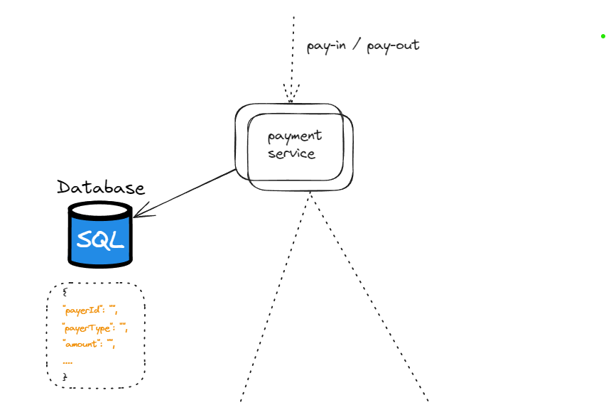

Design the Payment system.

### 1. Functional Requirements:

- Pay-in flow: payment system receives money from consumer on behalf of seller 
- Pay-out flow: payment system send money to sellers
- Assume we are not taking credit card input details, that will be done by external vendor.

### 2. Non-Functional Requirements:

- Reliability and fault tolerance
- Consistency accross all the internal payment service.

### 3. Capacity Estimations:

- 1 million of transaction per day
- 10 transaction per second
- This is not high ,but we have to focus more on non functional requirements.

### 4. High Level Design:


[ Copy Pasted ]

1. When a user clicks the “Buy” button, a payment event is generated and sent to the payment service. [ Assume it POST request Now]
2. The payment service stores the payment event in the database.
3. Sometimes a single payment event may contain several payment orders. For example, you may select products from multiple sellers in a single checkout process. The payment service will call the payment executor for each payment order.
4. The payment executor stores the payment order in the database.
5. The payment executor calls an external PSP to finish the credit card payment.
6. After the payment executor has successfully executed the payment, the payment service will update the wallet to record how much money a given seller has.
7. The wallet server stores the updated balance information in the database.
8. After the wallet service has successfully updated the seller’s balance information, the payment service will call the ledger to update it.
9. The ledger service appends the new ledger information to the database.
10. Every night the PSP or banks send settlement files to their clients. The settlement file contains the balance of the bank account, together with all the transactions that took place on this bank account during the day


### 5. Deep Dive High Level Design One By One:

#### Pay-In flow
Get payment from buyer and put in our bank ( Not seller yet )

#### Payment Service:

Responsibility:
- Check and verification of events. [ This is POST request with event in request ]
- Save payment event in db with its status and call executer.
- Return the response to the client about the payment.
- Which type of event ? -> Get X money from user ( Payer Entity In General , so that it will be agnostic of it).

Sample Event [ It will be in bulk ]:

```json
{
  "payerUserId": "",
  "paymentType": "<payIN or payOUT>",
  "amount": "",
  "orderMetadata": {}, // for payIn type, will help us to know it was for what product etc ?
  "sellerDetails": {}, // for payOut that will help us to send money to seller
  "statue": ""
}
```
Since we don't have to scale our database much and payment service will have structural event.
We will be using the SQL for this.


#### Payment Executor:

- Will get the valid event for payment and will call external payment service provider to get it done.
- - It has its own database will store payment details with global unique paymentId. That can be used as reference and receipt. After it got success.
- Same, SQL can be used here.

```json
{
  "paymentId": "",
  "amount": "",
  "recipantAccountInfo": "",
  "timestamp": ""
}
```

#### Payment Service Provider:

- External, That will move money from buyer credit card to our system account ( for e.g. flipkart account ). That's it.
- Famous PSP -> Stripe, Visa This is itself a complex system that has to be taken care separately.
- Check out them separately. These also give the UI for taking credit card information.


#### Pay-out flow

- Once the item is delivered. Instead of pay-in . We get. pay-out payment event with account information of seller.
- We same initiate payment with pay-out PSP ( for e.g. Tipalti etc). That will transfer the amount from our bank to seller account.


### Fault tolerant and consistent deep dive


### Follow Up:

How to make it as a service . So that can be used at any place.

### Reference:

1. https://blog.bytebytego.com/p/payment-system
2. Alex xu system design volume 2.
