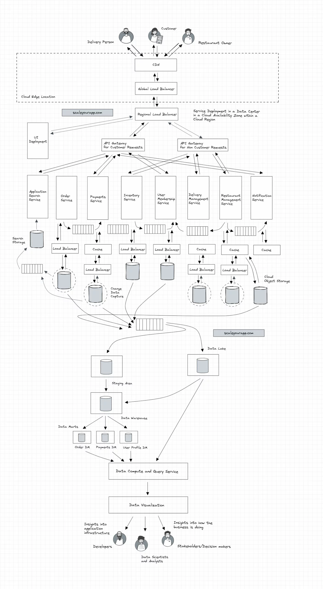

## Design the system like swiggy

### Requirements

1. A food delivery system requires the interaction of the restaurants, customers and delivery boys with the admin.
2. Restaurants can register themselves.
3. Users can create, update, delete, get their profiles.
4. User can search for the restaurant using a restaurant name, city name.
5. Restaurants can add, update the food menu.
6. User can see the food menu. User can get the food items based on Meal type or Cuisine type.
7. User can add/remove items to/from the cart. User can get all the items of the cart.
8. User can place or cancel the order. User can get all the orders ordered by him/her.
9. User can apply the coupons. User can get the detailed bill containing tax details.
10. User can make a payment using different modes of payment — credit card, wallet, etc.
11. Delivery boy can get all the deliveries made by him using his Id.
12. User can get the order status anytime. Success, Out for Delivery, Delivered, etc.

#### Final

### References:

1. https://scaleyourapp.com/application-architecture/
2. https://www.youtube.com/watch?v=iRhSAR3ldTw&t=130s
3. https://medium.com/almabetter/architecture-and-design-principles-behind-the-swiggys-delivery-partners-app-58646b19f1cb
4. https://www.linkedin.com/pulse/system-design-food-delivery-app-zomatoswiggy-saral-saxena/

