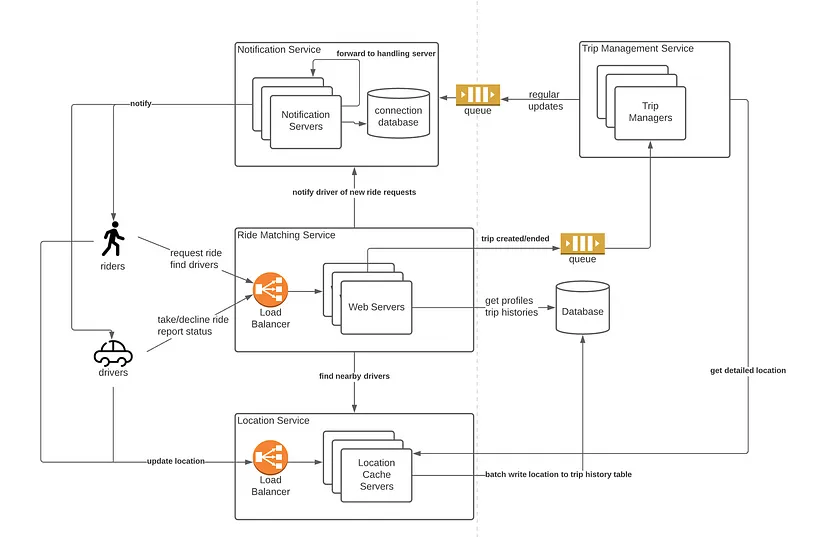

[ Kind of copy paste ]

### Functional Requirements:

We will design our system for two types of users: Customers and Drivers.

***Customers***

1. Customers should be able to see all the cabs in the vicinity with an ETA and pricing information. 
2. Customers should be able to book a cab to a destination. 
3. Customers should be able to see the location of the driver.

***Drivers***

1. Drivers should be able to accept or deny the customer requested ride.
2. Once a driver accepts the ride, they should see the pickup location of the customer.
3. Drivers should be able to mark the trip as complete on reaching the destination.

#### Extended requirements
- Customers can rate the trip after it's completed.
- Payment processing.
- Metrics and analytics.

### Non-Functional Requirements:

1. High reliability.
2. High availability with minimal latency.
3. The system should be scalable and efficient.

### Capacity Estimation

Let's start with the estimation and constraints.

Note: Make sure to check any scale or traffic-related assumptions with your interviewer.

***Traffic***

Let us assume we have 100 million daily active users (DAU) with 1 million drivers and on average our platform enables 10 million rides daily.

If on average each user performs 10 actions (such as request a check available rides, fares, book rides, etc.) we will have to handle 1 billion requests daily.


***What would be Requests Per Second (RPS) for our system?***

1 billion requests per day translate into 12K requests per second.


***Storage***

If we assume each message on average is 400 bytes, we will require about 400 GB of database storage every day.


And for 10 years, we will require about 1.4 PB of storage.


***Bandwidth***

As our system is handling 400 GB of ingress every day, we will require a minimum bandwidth of around 5 MB per second.

***Here is our high-level estimate***:

| Type                   | Estimate      |
|------------------------|---------------|
| Daily active users (DAU) | 100 million   |
| Requests per second (RPS) | 12K/s       |
| Storage (per day)      | ~400 GB       |
| Storage (10 years)     | ~1.4 PB       |
| Bandwidth              | ~5 MB/s       |

### High level design



#### Data models

user (can be driver or customer):
```json
{
  "userId": "",
  "type": "DRIVER|CUSTOMER"
}
```

Ride :
```json
{
  "customerId": "",
  "driverId": "",
  "cabId": "",
  "source": "",
  "destination": "",
  "price": "",
  "time": ""
}
```

```json
{
  "cabId": "",
  "ownerId": ""
}
```


#### Api design (copy pasted boring)

Let us do a basic API design for our services:

#### Request a Ride

Through this API, customers will be able to request a ride.

```tsx
requestRide(customerID: UUID, source: Tuple<float>, destination: Tuple<float>, cabType: Enum<string>, paymentMethod: Enum<string>): Ride
```

**Parameters**

Customer ID (`UUID`): ID of the customer.

Source (`Tuple<float>`): Tuple containing the latitude and longitude of the trip's starting location.

Destination (`Tuple<float>`): Tuple containing the latitude and longitude of the trip's destination.

**Returns**

Result (`Ride`): Associated ride information of the trip.

#### Cancel the Ride

This API will allow customers to cancel the ride.

```tsx
cancelRide(customerID: UUID, reason?: string): boolean
```

**Parameters**

Customer ID (`UUID`): ID of the customer.

Reason (`UUID`): Reason for canceling the ride _(optional)_.

**Returns**

Result (`boolean`): Represents whether the operation was successful or not.

#### Accept or Deny the Ride

This API will allow the driver to accept or deny the trip.

```tsx
acceptRide(driverID: UUID, rideID: UUID): boolean
denyRide(driverID: UUID, rideID: UUID): boolean
```

**Parameters**

Driver ID (`UUID`): ID of the driver.

Ride ID (`UUID`): ID of the customer requested ride.

**Returns**

Result (`boolean`): Represents whether the operation was successful or not.

#### Start or End the Trip

Using this API, a driver will be able to start and end the trip.

```tsx
startTrip(driverID: UUID, tripID: UUID): boolean
endTrip(driverID: UUID, tripID: UUID): boolean
```

**Parameters**

Driver ID (`UUID`): ID of the driver.

Trip ID (`UUID`): ID of the requested trip.

**Returns**

Result (`boolean`): Represents whether the operation was successful or not.


#### Reference:
1. https://github.com/karanpratapsingh/system-design?tab=readme-ov-file#uber
2. https://towardsdatascience.com/ace-the-system-design-interview-uber-lyft-7e4c212734b3