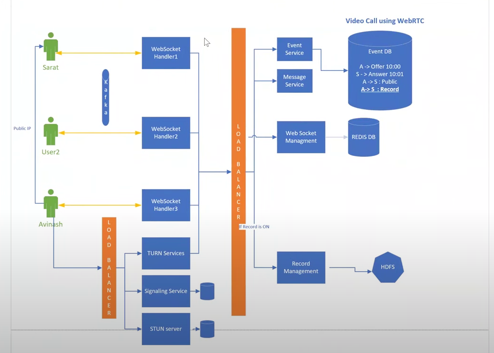
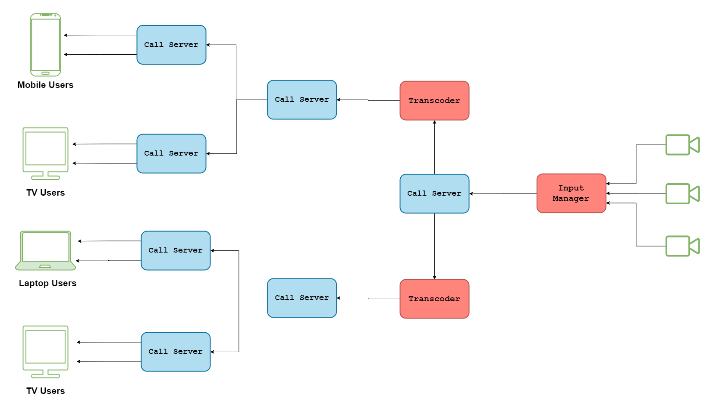

### Functional Requirements
1. The system must support 1-to-1 calls
2. The system must support group calls
3. Calls can be audio or video or screen sharing
4. Should offer a call recording feature
Note: Screen share will be an extension of video call itself, only in case of video call the source of the video is the camera, whereas in screen share source of the video will be the screen.
### Non-Functional Requirements
1. Should be super fast - low latency is not enough
2. High availability
3. Data loss is OK
### High level design
As per our requirement and we also show about tcp and udp.

We will be using a combination of TCP and UDP. All the API calls, all communication between components, etc will happen over TCP but all video transfer will happen over UDP on websocket as in whatsapp application.
Webrtc technology use to do this ( it's a collection of protocols, APIs (Application Programming Interfaces), and technologies that work together to enable real-time communication directly between web browsers ).

***1. Connector***: A connector’s job is to identify a user’s public IP address information.So U1 will get its public IP from the connector, U2 will get its public IP from the connector and they will share this information via web socket handler. Once they have each other’s public IP address they can start sharing video messages.

***But why do we even go through the whole process just to get the public IP address of the involved parties?***

Because for communication over UDP you need a public IP address. Now if both the users were on IPv6 it wouldn’t be a problem because they would already have a public IP address and can share it. But a huge number of devices are still on IPv4. [ Check Separately ]

***2. Call server***:  Now there is one more thing that can go wrong here. Usually, that layer also has a Firewall. And some Firewalls don’t allow UDP traffic to pass. Here we will introduce something called Call Server between U1 and U2. Call servers can do the job of a connector as well as facilitate data transfer. Now the ports for U1 and U2 will be identified by the call server and from then on it will start acting as an intermediate between U1 and U2. [ Doubt: is this use in every data packet ? ]

***3. Web socket handler***: WebSocket handler enables real-time communication for initiating and responding to calls between users, utilizing TCP connections; however, for the video call itself, a separate UDP connection between users (U1 and U2) is required. Now at this stage, we haven’t considered some very common and expected scenarios. Suppose U1 is on 5G network and can support HD videos but U2 is on 2G network and HD videos will considerably slow down the communication. So it makes no sense for U2 to receive videos in HD format. So how will U1 and U2 sort out these minor details like device resolution, network bandwidth, etc? Along with sharing their public IPs, U1 and U2 will also share these other attributes like bandwidth they are on, codecs, number of pixels the devices can support, etc, and decide on a configuration that supports the device with minimum capability in each category. For example, if U2 is on a lower bandwidth they will support a lower bandwidth, if U1 is on a device with the low resolution they will support a lower resolution etc. These attributes are also communicated via the web socket handler. After this, the actual call will begin which will just be a stream of data packets flowing between the two IP addresses. At this point, each device will act as a sender as well as a receiver and will be smart enough to render the data they receive.  After this, the actual call will begin which will just be a stream of data packets flowing between the two IP addresses. At this point, each device will act as a sender as well as a receiver and will be smart enough to render the data they receive
The handshaking that was done by the web socket handler is known as ***Signaling***. Our connector in WebRTC terminology is known as the ***STUN Server*** and the call server is known as the ***TURN Server***.

A protocol called as Interactive Connectivity Establishment (ICE). The job of ICE is to find the best possible path to connect two peer.ICE framework provides us with ‘ICE candidates’. ‘ICE candidates’ are nothing but objects that contain our own public IP address, port number and other connection related information.
In the absence of NAT, ICE is pretty straightforward since the public IP address of the peer is readily available (that done with help of Session Traversal Utilities for NAT (STUN) ). However, in the presence of NAT, ICE relies on entities called as  Traversal Using Relays around NAT (TURN).
The STUN server is only involved during the process of finding the public IP. Once WebRTC connection has been established, all further communication happen through WebRTC. However, in case of TURN, the TURN server is required throughout even after the WebRTC connection has been setup ( In other words, once the WebRTC connection is successfully established, the audio, video, or data streams are directly transmitted between the two peers without involving any intermediary servers or components like STUN or TURN ). A STUN server is only successful about 86% of the times.

#### If suppose, peer A would like to setup a WebRTC connection with peer B, they need to perform the following actions:

- Peer A generates it’s ICE candidates using Interactive Connectivity Establishment (ICE). In most cases it requires a Session Traversal Utilities for NAT (STUN) or a Traversal Using Relays around NAT (TURN) server.
- Peer A bundles the ICE candidate and Session Description into a single object. This object is stored as Local Description (a peer’s own connection information) within peer A and transferred to peer B via a signalling mechanism. This part is called as the Offer.
- Peer B receives the offer and stores it as Remote Description (connection information of the peer at other end) for further use. Peer B generates it’s own ICE candidate and Session Description, stores them as it’s Local Description and sends it to peer A via the signalling mechanism. This part is called as the Answer. (Note: As said earlier, the ICE candidates in step 2 and 3 may also be sent separately)
- Peer A receives the answer from peer B and stores it as it’s Remote Description.
- With this, both the peers have the connection information of each other and can successfully start communicating via WebRTC !

#### Group Video Call

Ok so now we know how 1-to-1 video calls work. Are group video calls the same? Well Yes and No. Members of a group video call will interact in a similar manner but it will follow a more hybrid approach.

The group will be classified based on size. Let’s say we have a threshold of 5. Now in the above example of a video call of four people, If U1, U2, U3, and U4 are connected through peer to peer network, U1 will send the same data packets to U2, U3, and U4 when it is talking, which is totally fine for a group of 4 people. But what if it is a full-blown conference with 100 odd people ? 

In such a case we will follow the Call server approach so each user will be sending to receiving from only the call server. This might put some load on the call server but that is easily manageable by scaling the hardware as per requirement. User’s bandwidth is something we can not control so our priority will be to optimize the use of users’ bandwidth utilization.

#### Call Recording

Also, remember the call recording feature? That is another reason to go with the call server approach. If we go with the p-to-p model, the complete call will not be present in a single location anywhere and recording will become difficult. So if a call has to be recorded it will have to be routed via the call server

#### System Architecture

#### WebSocket Handlers
Responsible for maintaining open connections with online users.

#### WebSocket Manager
Tracks connections between WebSocket Handlers and users, using Redis for fault tolerance.

#### Signaling Service
Now when U1 tries to connect with U2, it will call the web socket handler which in turn calls the Signaling Service which will initiates calls between users, performs checks (e.g., friend status), and communicates call acceptance.

#### User Service
Repository of all users, supports checks performed by the Signaling Service.

#### Connector (STUN server)
Facilitates finding users' IP addresses and handshake for call configuration.

#### TURN Server
Used if peer-to-peer connection cannot be established. [ Doubt same ]

#### Logger Service
Aggregates data packets for recording feature, sends them to a distributed file system.

#### File Creator
Compiles recorded data into a video file, stored in a permanent data store like S3.

#### Notification Center
Sends notifications to users when a recorded video is available.

#### Transcoding Service
Since our users will be connecting from different kinds of devices, they will be supporting different formats, and we need to be able to send them the data in that particular format, which is where Transcoding comes in. That means we will convert the original video to support multiple formats and a variety of bandwidths, bitrates, etc. see YOUTUBE design.

#### Analytics Service
Processes events sent to Kafka for generating reports and performing analytics.

#### Call server and peer-peer ?
Exactly what operations can the client perform independently? Going back to the U1-U2 video call, we know that our clients are smart enough to know their limitations like bandwidth, bitrate, resolution, etc, and communicate to the other party and come up with a configuration for the call that works for both of them. Now let’s say while U1 and U2 are in a peer to peer call, U1’s public IP keeps changing or the call keeps getting dropped. In such a case our clients will be smart enough to mutually decide that their p-to-p connection is not working and they need to move to the call server model. This will all happen at run time. Also, this switch won’t necessarily happen at the same time. U1 could be sending messages to U2 directly and U2 could be sent through the call server. Even in a group call, the same flow will apply.

#### How about a live broadcast?

The system described involves streaming events from multiple cameras and audio devices, with an input manager determining the sources for streaming. The video data is then sent to a call server for wider distribution. The call server sends the stream to transcoding servers to convert it into various formats suitable for different devices and network conditions. If hardware permits, real-time transcoding is possible. Transcoded streams are then forwarded to a second layer of call servers, which distribute specific format outputs to a third layer of call servers. These servers are globally distributed to minimize latency and serve users with the desired format. The architecture is inspired by Netflix's setup, aiming to efficiently broadcast live events to millions of viewers.

#### Doubts:
- is this webrtc concept or what protocol ? like do we need to create stun, turn , signaling service or it comes inside of it ?
- if so how we are doing group call ?

### Reference

1. https://www.100ms.live/blog/webrtc-turn-server
2. https://www.codekarle.com/system-design/Zoom-system-design.htm
3. https://medium.com/@anto.christo.20/understanding-web-real-time-communication-webrtc-d4cec5a43f2f
4. https://eytanmanor.medium.com/an-architectural-overview-for-web-rtc-a-protocol-for-implementing-video-conferencing-e2a914628d0e [ unread ]
5. https://github.com/junaidrahim/webrtc-session