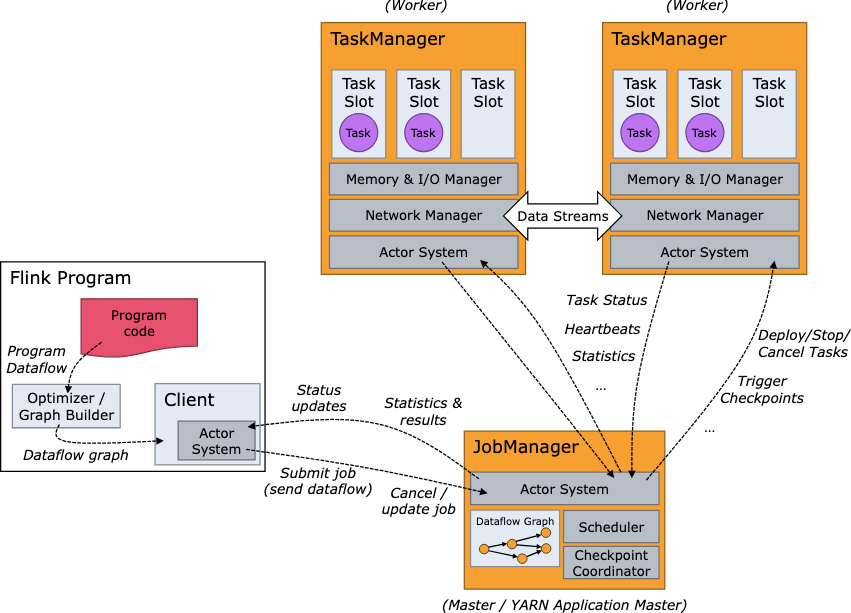

https://www.onehouse.ai/blog/apache-spark-structured-streaming-vs-apache-flink-vs-apache-kafka-streams-comparing-stream-processing-engines?utm_source=chatgpt.com 
# Introduction to Apache Flink ( Next step -> read its doc complete )

``The limits of event-driven applications are defined by how well a stream processor can handle time and state``

- The limits of event-driven applications are defined by how well a stream processor can handle time and state. Many of Flink’s outstanding features are centered around these concepts. Flink provides a rich set of state primitives that can manage very large data volumes (up to several terabytes) with exactly-once consistency guarantees. Moreover, Flink’s support for event-time, highly customizable window logic, and fine-grained control of time as provided by the ProcessFunction enable the implementation of advanced business logic. 
- At its core, Flink treats all data processing as a series of events, making it particularly well-suited for stream processing tasks. 

## Key Features of Apache Flink

- **True stream processing:** Processes data on an event-by-event basis for low latency and high throughput.
- **Exactly-once semantics:** Guarantees each event is processed exactly once, even in failures.
- **Stateful computations:** Supports complex event processing and machine learning tasks.
- **Event time processing:** Processes events based on their generation time, handling out-of-order and late data.
- **Windowing support:** Flexible window operations for aggregations over time or count intervals.
- **High availability & fault tolerance:** Checkpointing and savepoints ensure recovery without data loss.
- **Scalability:** Can scale to thousands of nodes, processing millions of events per second.

---

# Flink Architecture

Flink’s architecture supports scalable, fault-tolerant stream processing.

### Job Manager

- Coordinates scheduling, checkpoints, failure recovery, and job control flow.
- Components:
  - **ResourceManager:** Manages resource allocation.
  - **Dispatcher:** REST interface for job submissions, starts JobMasters.
  - **JobMaster:** Manages execution of individual jobs.

### Task Manager

- Worker nodes executing tasks in separate threads.
- Reports status to Job Manager.
- Manages memory and CPU.
- Organized into slots — units of resource scheduling.
- kind of same philosophy like map reduce, since they can shuffle etc. between task manager

### Client

- Prepares and submits dataflows to Job Manager.
- Runs within Java/Scala program or CLI.

### Distributed Execution

- **Parallelism:** Distributes operators across Task Managers.
- **Data Exchange Patterns:** Forward, Shuffle, Rebalance, Broadcast.
- **State Backend:**
  - MemoryStateBackend (in-memory, checkpoints to JobManager memory)
  - FsStateBackend (in-memory, checkpoints to file system)
  - RocksDBStateBackend (disk-based for large states)

### Fault Tolerance and High Availability

- Checkpointing: Asynchronous snapshots.
- Savepoints: Manually triggered for updates.
- State Restoration: From checkpoints/savepoints.
- JobManager HA: ZooKeeper for leader election.
- Optimized network stack with credit-based flow control and zero-copy networking.

---


## APIs

- **DataStream API:** For unbounded stream processing.
- **DataSet API:** For bounded batch processing (being phased out).

## Program Structure

- **Source:** Data origin (Kafka, files).
- **Transformations:** Data operations.
- **Sink:** Output destination.

Programs form a **dataflow graph** with streams and operators.

## Windowing

- Time Windows: Tumbling, sliding, session windows.
- Count Windows: Based on element count.
- Custom user-defined windows.

## Time and Watermarks

- Event Time: When event occurred.
- Processing Time: When event is processed.
- Ingestion Time: When event enters system.
- Watermarks track event time progress, enabling late data handling.

## State Management

- **Keyed State:** Partitioned by key.
- **Operator State:** Bound to operators.
- State primitives: ValueState, ListState, MapState, ReducingState, AggregatingState.

## Checkpointing & Exactly-Once Semantics

- Periodic, barrier-coordinated snapshots.
- Supports large state backends (e.g., RocksDB).

## Event Processing Functions

- MapFunction, FlatMapFunction, FilterFunction.
- KeyedProcessFunction: low-level with full state/time access.
- WindowFunction: for windowed data processing.

## Table API & SQL

- Declarative APIs integrating with DataStream/DataSet.
- Support for complex mixed pipelines.


# Use Cases and Real-World Examples

## Real-Time Analytics

**Example: E-commerce Analytics**

- Track user behavior, product popularity, dynamic pricing.
- Uses windowed counts of product views with sinks to Elasticsearch.

```

DataStream<Event> events = environment
.addSource(new KafkaSource<>(“user-events”, new EventDeserializationSchema()));

DataStream<Tuple2<String, Integer>> productViews = events
.filter(event -> event.getType().equals(“product_view”))
.map(event -> new Tuple2<>(event.getProductId(), 1))
.keyBy(tuple -> tuple.f0)
.window(TumblingEventTimeWindows.of(Time.minutes(5)))
.sum(1);

productViews.addSink(new ElasticsearchSink<>(config, indexer));
```
This example processes a stream of user events, calculates product views in 5-minute windows, and sends the results to Elasticsearch for visualization.

Sliding window with sliding time interval

```

import org.apache.flink.api.common.eventtime.WatermarkStrategy;
import org.apache.flink.api.common.serialization.SimpleStringSchema;
import org.apache.flink.api.java.tuple.Tuple2;
import org.apache.flink.streaming.api.datastream.SingleOutputStreamOperator;
import org.apache.flink.streaming.api.environment.StreamExecutionEnvironment;
import org.apache.flink.streaming.api.windowing.time.Time;
import org.apache.flink.streaming.api.windowing.assigners.SlidingEventTimeWindows;
import org.apache.flink.streaming.connectors.kafka.FlinkKafkaConsumer;
import org.apache.flink.streaming.connectors.kafka.FlinkKafkaProducer;
import org.apache.flink.util.OutputTag;
import com.fasterxml.jackson.databind.ObjectMapper;

import java.time.Duration;
import java.util.Properties;

public class SlidingWindowClickCount {

    public static class ClickEvent {
        public String userId;
        public long timestamp;
        public String page;
        public String action;
    }

    public static void main(String[] args) throws Exception {
        final StreamExecutionEnvironment env = StreamExecutionEnvironment.getExecutionEnvironment();

        Properties kafkaProps = new Properties();
        kafkaProps.setProperty("bootstrap.servers", "localhost:9092");
        kafkaProps.setProperty("group.id", "click-counter");

        FlinkKafkaConsumer<String> consumer = new FlinkKafkaConsumer<>("user-clicks", new SimpleStringSchema(), kafkaProps);
        consumer.assignTimestampsAndWatermarks(
            WatermarkStrategy
                .<String>forBoundedOutOfOrderness(Duration.ofSeconds(5))
                .withTimestampAssigner((eventStr, timestamp) -> {
                    try {
                        ClickEvent event = new ObjectMapper().readValue(eventStr, ClickEvent.class);
                        return event.timestamp;
                    } catch (Exception e) {
                        return 0L;
                    }
                })
        );

        SingleOutputStreamOperator<String> result = env
            .addSource(consumer)
            .map(value -> new ObjectMapper().readValue(value, ClickEvent.class))
            .keyBy(event -> event.userId)
            .window(SlidingEventTimeWindows.of(Time.minutes(1), Time.seconds(10)))
            .aggregate(new ClickCountAggregator(), new ClickWindowFunction())
            .map(new ObjectMapper()::writeValueAsString);

        FlinkKafkaProducer<String> producer = new FlinkKafkaProducer<>("user-click-counts", new SimpleStringSchema(), kafkaProps);
        result.addSink(producer);

        env.execute("Sliding Window Click Counter");
    }
}

```

## Fraud Detection

**Example: Credit Card Fraud**

- Detect suspicious transactions using keyed state and timers.
- Sends alerts on potential fraud.

## ETL & Data Pipelines

**Example: Log Data Processing**

- Batch job reading logs, filtering errors, enriching data.
- Writes processed logs back to HDFS.
         |




### flink ki kahani gpt ki sunanai: 

When using Flink with a distributed streaming setup involving multiple TaskManagers—some consuming Kafka partitions and others performing merges—checkpoint consistency and fault tolerance are managed through a combination of barrier alignment, checkpoint coordination, and exactly-once sink guarantees. Consider a scenario where you have 10 nodes with CPU, RAM, and SSD storage, running a Flink cluster with one JobManager and multiple TaskManagers; Kafka serves as both the source and sink with a topic partitioned into 10 partitions. Each Kafka partition is consumed by one Kafka source subtask on a TaskManager, which deserializes events, extracts timestamps, assigns watermarks, and sends keyed events downstream to windowed operators that maintain state locally (often backed by RocksDB on SSD for durability and fast access).

The merge TaskManager, responsible for aggregating partial results (e.g., Top-K) from multiple upstream TaskManagers, receives input streams partitioned by keys. Internally, Flink injects checkpoint barriers into all streams periodically; these barriers flow through the operators, including the merge operator, enabling barrier alignment. This means the merge operator buffers incoming events until it has received checkpoint barriers from all upstream subtasks to capture a consistent snapshot of its state and the data it has processed so far. This guarantees that the checkpoint reflects a precise, consistent cut of the entire distributed dataflow, ensuring that partial merges and upstream states are in sync.

Checkpoints themselves are triggered by the JobManager at configured intervals. When a checkpoint starts, the JobManager sends checkpoint triggers to all TaskManagers, including the source, merge, and sink operators. Each TaskManager asynchronously snapshots its local state (keyed states, RocksDB files, Kafka consumer offsets) and uploads the checkpoint data to durable distributed storage (e.g., HDFS, S3, or a replicated file system across the nodes). The checkpoint is only considered complete once all subtasks acknowledge successful snapshots. This design minimizes latency impact because checkpointing happens in the background and incrementally, while data processing and merging continue without blocking.

If a TaskManager running a Kafka source subtask fails, the JobManager detects the failure via missed heartbeats, reassigns the failed Kafka consumer task to another TaskManager, and restores the Kafka offset and operator state from the latest completed checkpoint stored in durable storage. Meanwhile, other source TaskManagers continue consuming and processing Kafka partitions normally, though checkpointing is paused or coordinated to maintain consistency during recovery. The checkpoint stores the Kafka offsets, operator states, and metadata centrally, so even if the node with the checkpoint data is lost, recovery is possible on any other node using the distributed checkpoint storage.

During failure recovery of the merge TaskManager, if it crashes after pushing partial results downstream to Kafka but before completing a checkpoint, Flink relies on the two-phase commit protocol used by Kafka sinks integrated with Flink’s checkpointing mechanism. The sink writes data to Kafka transactionally and only commits the transaction upon successful checkpoint completion. Thus, any data emitted by the merge operator after the last completed checkpoint but before the crash is discarded or rolled back during recovery, preventing duplicate or inconsistent output downstream. The JobManager orchestrates task restarts and state restoration, resuming processing from the last consistent checkpoint to guarantee exactly-once semantics.

Latency overhead introduced by writing checkpoints to durable storage like HDFS or S3 is minimized by Flink’s asynchronous checkpointing and incremental snapshots, which break down large state data into smaller chunks uploaded in parallel. When external storage is unavailable, checkpointing can use local disks on the cluster nodes, though this reduces fault tolerance. In that case, setting up a distributed file system like HDFS or using object storage is recommended to provide durable, shared checkpoint storage accessible by all TaskManagers.

In summary, Flink’s fault-tolerance and consistency model in a scenario with Kafka sources, windowed keyed processing, merging partial results, and Kafka sinks relies on coordinated checkpointing with barrier alignment, transactional sinks, and state backend durability (e.g., RocksDB on SSD). The JobManager controls checkpoint triggers, task failure detection, and recovery orchestration, while TaskManagers execute subtasks, maintain local state, and asynchronously snapshot and restore state. This architecture enables near real-time, exactly-once processing with strong guarantees despite failures or delays, ensuring that merging decisions, checkpoint consistency, and output correctness are tightly coupled and managed seamlessly.


### Reference

- https://medium.com/@22.gautam/apache-flink-unveiled-a-deep-dive-into-next-generation-stream-processing-9267352e1819
- Apache doc https://flink.apache.org/what-is-flink/use-cases/
- https://nightlies.apache.org/flink/flink-docs-release-1.20/docs/learn-flink/overview/  [ ek number must read for deep dive , pending]
