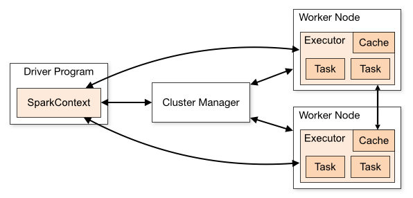
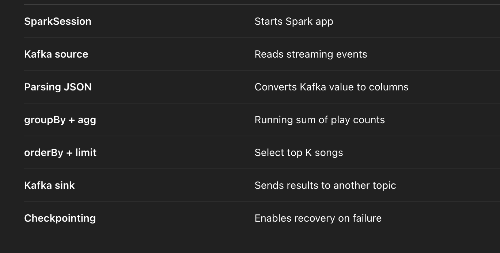

Kind of similar to spark

```

from pyspark.sql import SparkSession
from pyspark.sql.functions import col, sum as _sum
from pyspark.sql.types import StructType, StringType, IntegerType

# Create SparkSession
spark = SparkSession.builder.appName("TopKSongsStreaming").getOrCreate()

# Kafka source parameters
kafka_bootstrap_servers = "localhost:9092"
input_topic = "song_plays"
output_topic = "top_k_songs"

# Define schema of incoming JSON
schema = StructType() \
    .add("user_id", StringType()) \
    .add("song_id", StringType()) \
    .add("play_count", IntegerType())

# Read from Kafka
raw_stream = spark.readStream \
    .format("kafka") \
    .option("kafka.bootstrap.servers", kafka_bootstrap_servers) \
    .option("subscribe", input_topic) \
    .load()

# Extract JSON from value, parse it
stream_df = raw_stream.selectExpr("CAST(value AS STRING) as json_value") \
    .selectExpr("from_json(json_value, '{}') as data".format(schema.json())) \
    .select("data.*")

# Aggregate: sum play_count by song_id
agg_df = stream_df.groupBy("song_id").agg(
    _sum("play_count").alias("total_play_count")
)

# Get top K (e.g., 2)
K = 2
top_k_df = agg_df.orderBy(col("total_play_count").desc()).limit(K)

# Convert result to JSON string for Kafka sink
from pyspark.sql.functions import to_json, struct
output_df = top_k_df.selectExpr("to_json(struct(*)) AS value")

# Write to Kafka
query = output_df.writeStream \
    .format("kafka") \
    .option("kafka.bootstrap.servers", kafka_bootstrap_servers) \
    .option("topic", output_topic) \
    .option("checkpointLocation", "/tmp/spark_kafka_checkpoint") \
    .outputMode("complete") \
    .start()

query.awaitTermination()

```




[TBU]