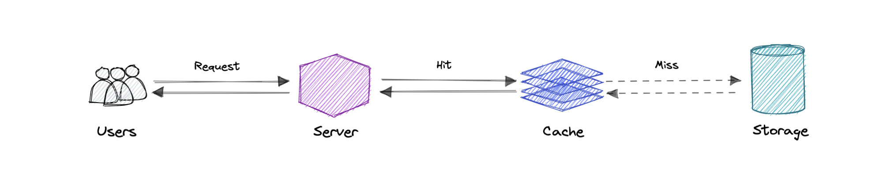

# Caching

a technique to store a copy of data or computational results that can be retrieved quickly.

**Importance of Caching**

Speed and efficiency are the name of the game. Caching reduces latency and lightens the load on the backend by serving pre-processed data.

Some of the examples: 

browser caching, cdn, database query caching.

https://codeahoy.com/2017/08/11/caching-strategies-and-how-to-choose-the-right-one/

**Cache hit and Cache miss**

A cache hit describes the situation where content is successfully served from the cache. The tags are searched in the memory rapidly, and when the data is found and read, it's considered a cache hit

A cache miss refers to the instance when the memory is searched, and the data isn't found. When this happens, the content is transferred and written into the cache

**Cache invalidation:**

Cache invalidation is a process where the computer system declares the cache entries as invalid and removes or replaces them. If the data is modified, it should be invalidated in the cache, if not, this can cause inconsistent application behavior. 

1. Write through cache

Data is written into the cache and the corresponding database simultaneously.

**Pro**: Fast retrieval, and complete data consistency between cache and storage.

**Con**: Higher latency for write operations.

1. write around cache

Where write directly goes to the database or permanent storage, bypassing the cache.

**Pro**: This may reduce latency

**Con:?** 

1. Write-back-cache

 ****

Where the write is only done to the caching layer and the write is confirmed as soon as the write to the cache completes. The cache then asynchronously syncs this write to the database.

**Pro**: This would lead to reduced latency and high throughput for write-intensive applications.

**Con:** There is a risk of data loss in case the caching layer crashes. We can improve this by having more than one replica acknowledging the write in the cache.

**Eviction policies**

Following are some of the most common cache eviction policies:

- **First In First Out (FIFO)**:
- **Last In First Out (LIFO)**:
- **Least Recently Used (LRU)**: Discards the least recently used items first.
- **Most Recently Used (MRU)**: Discards, in contrast to LRU, the most recently used items first.
- **Least Frequently Used (LFU)**: Counts how often an item is needed. Those that are used least often are discarded first.
- **Random Replacement (RR)**: Randomly selects a candidate item and discards it to make space when necessary.

**Distributed cache and currency:**

a distributed cache can grow beyond the memory limits of a single computer by linking together multiple computers

**Global Cache:**

