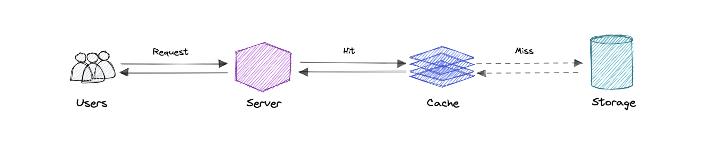

# Caching



a technique to store a copy of data or computational results that can be retrieved quickly.

**Importance of Caching**

Speed and efficiency are the name of the game. Caching reduces latency and lightens the load on the backend by serving pre-processed data.

Some of the examples: 

browser caching, cdn, database query caching.


https://codeahoy.com/2017/08/11/caching-strategies-and-how-to-choose-the-right-one/

**Cache hit and Cache miss**

A cache hit describes the situation where content is successfully served from the cache. The tags are searched in the memory rapidly, and when the data is found and read, it's considered a cache hit

A cache miss refers to the instance when the memory is searched, and the data isn't found. When this happens, the content is transferred and written into the cache

**Cache invalidation:**

Cache invalidation is a process where the computer system declares the cache entries as invalid and removes or replaces them. If the data is modified, it should be invalidated in the cache, if not, this can cause inconsistent application behavior. 

1. Write through cache


Data is written into the cache and the corresponding database simultaneously.

**Pro**: Fast retrieval, and complete data consistency between cache and storage.

**Con**: Higher latency for write operations.

1. write around cache


Where write directly goes to the database or permanent storage, bypassing the cache.

**Pro**: This may reduce latency

**Con:?** 

1. Write-back-cache


 ****

Where the write is only done to the caching layer and the write is confirmed as soon as the write to the cache completes. The cache then asynchronously syncs this write to the database.

**Pro**: This would lead to reduced latency and high throughput for write-intensive applications.

**Con:** There is a risk of data loss in case the caching layer crashes. We can improve this by having more than one replica acknowledging the write in the cache.

**Eviction policies**

Following are some of the most common cache eviction policies:

- **First In First Out (FIFO)**:
- **Last In First Out (LIFO)**:
- **Least Recently Used (LRU)**: Discards the least recently used items first.
- **Most Recently Used (MRU)**: Discards, in contrast to LRU, the most recently used items first.
- **Least Frequently Used (LFU)**: Counts how often an item is needed. Those that are used least often are discarded first.
- **Random Replacement (RR)**: Randomly selects a candidate item and discards it to make space when necessary.

**Distributed cache and currency:**


a distributed cache can grow beyond the memory limits of a single computer by linking together multiple computers

**Global Cache:**


**Nice blog for practical usecase:**
https://www.hellointerview.com/learn/system-design/deep-dives/redis
- Cache -> cluster -> key is distributer -> make sure no hot partition.
- Rate limiter.
- Powerful DS ->
  - hash , key value pair,
  - stream -> kind of very fast kafka


  - pub-sub ( whatsapp )
  - sorted set ( leaderboard ) 
  - geospatial ( proximity )

### synchornisation

#### ✅ 1. Atomic Redis Commands
Redis is single-threaded, so many commands are atomic by default. These are the simplest and most reliable methods for basic atomic operations.

Common Atomic Commands:

INCR: Atomically increments a key.
SETNX: Sets a key only if it doesn't exist.
HINCRBY: Atomically increments a field in a hash.
LPUSH: Pushes an element to a list.

Example in Go:
```

val, err := rdb.Incr(ctx, "global_counter").Result()
if err != nil {
    log.Fatal(err)
}
fmt.Println("Counter:", val)

```
Use atomic commands when only one Redis operation is needed.

#### 🔁 2. Transactions Using MULTI / EXEC
Redis supports transactions using MULTI and EXEC. Multiple commands can be queued and executed in order atomically.

Behavior:

Commands are queued after MULTI.
Executed together with EXEC.

Optional: WATCH for optimistic locking.

Example in Go:

```
err := rdb.Watch(ctx, func(tx *redis.Tx) error {
    _, err := tx.TxPipelined(ctx, func(pipe redis.Pipeliner) error {
        pipe.Set(ctx, "user:1001", "active", 0)
        pipe.Incr(ctx, "global_counter")
        return nil
    })
    return err
}, "user:1001", "global_counter")
```

Use this approach when multiple dependent writes must happen together.

#### 🧠 3. Lua Scripting (EVAL)
Redis supports executing Lua scripts atomically. All commands inside a Lua script run as a single operation.

Use Cases:

Complex logic that must be atomic (e.g., check-and-increment).

Safe read-modify-write behavior.

Example in Go:

```
script := redis.NewScript(`
    local current = redis.call("GET", KEYS[1])
    redis.call("INCR", KEYS[1])
    return current
`)

result, err := script.Run(ctx, rdb, []string{"global_counter"}).Result()
if err != nil {
    log.Fatal(err)
}
fmt.Println("Value before increment:", result)
```
Lua scripting is the most powerful and flexible atomic mechanism in Redis.

#### 🔒 4. Conditional Writes: SET with NX / EX / PX
Use the SET command with options to implement conditional writes or distributed locks.

Options:

NX: Set only if the key doesn't exist.
EX: Set expiration in seconds.
PX: Set expiration in milliseconds.

Example: Distributed Lock in Go

```
ok, err := rdb.SetNX(ctx, "lock:task:123", "uuid-xyz", 5*time.Second).Result()
if err != nil {
    log.Fatal(err)
}

if ok {
    fmt.Println("Lock acquired!")
    // Do protected work
} else {
    fmt.Println("Lock already held.")
}
```
Use this pattern for safe, auto-expiring distributed locks.

