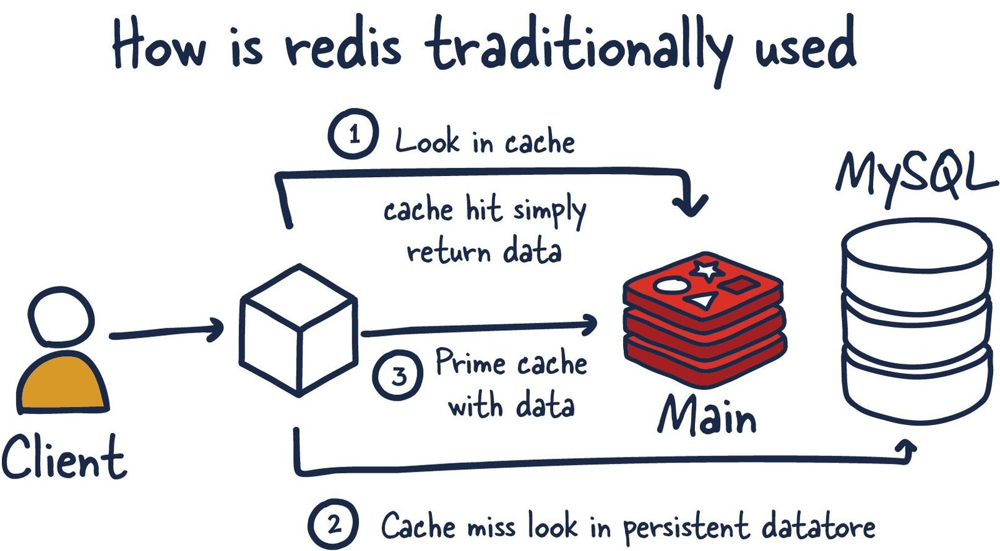

# Redis(Remote DIctionary Service)

**[Rem. When you work on it then only get to know about it more]**

Documentation: [https://redis.io/docs/about/](https://redis.io/docs/about/)

[https://www.youtube.com/watch?v=jgpVdJB2sKQ](https://www.youtube.com/watch?v=jgpVdJB2sKQ)

Redis is like a giant JSON that has a key and value pair(value can be a list, set, hash, etc.). And it's volatile and will lose once the system restarts. Since it's in memory. So we used it as a cache. (Although it has mechanism to use it as primary data base, and most people use it as well)

However, for many use cases, Redis offers enough guarantees that it can be used as a full-fledged primary database. Coupled with Redis plug-ins and its various High Availability (HA) setups, Redis as a database has become incredibly useful for certain scenarios and workloads.

It's open source. So **download → start server → add key ↔ remove key.**

The Redis command line interface (redis-cli) is a terminal program used to send commands to and read replies from the Redis server.

Redis has built-in replication, Lua scripting, LRU eviction, transactions, and different levels of on-disk persistence, and provides high availability via Redis Sentinel and automatic partitioning with Redis Cluster. So Redis can be used as a traditional monolithic and can be used as a distributed system as a cluster of nodes with sharding

All Redis data resides in the server’s main memory.

**Supported Data Types**: [https://redis.io/docs/data-types/](https://redis.io/docs/data-types/)

### How does it work/ Internally? why so fast?

[https://betterprogramming.pub/internals-workings-of-redis-718f5871be84](https://betterprogramming.pub/internals-workings-of-redis-718f5871be84)

(too much not able to understand it)

Upon reading a few posts, the following reasons for its high-throughput-low-latency performance.

1. Redis stores all of its data in the main memory (RAM) and periodically stores it in the disk. RAM-based access is fast compared to disk-based access.
2. Redis is a single-threaded implementation of an event-driven system enabled by the I/O multiplexing variant for processing all the connections.
3. Redis uses highly efficient data structures like [skip-lists](https://www.ics.uci.edu/~pattis/ICS-23/lectures/notes/Skip%20Lists.pdf), [simple dynamic strings](https://github.com/antirez/sds), etc.

**Second Reason**

In this, we will highlight the second point because that’s a significant contributor to high throughput and low-level latency.

**Redis uses the same approach of implementing a single thread and event loop like [node.js](https://nodejs.org/en/docs/guides/event-loop-timers-and-nexttick/). Check Js File**.  **Redis accepts TCP connections in an async manner, then handles each accepted connection in the event loop**

### Different Ways of deployment with their trade-off.

[https://architecturenotes.co/redis/](https://architecturenotes.co/redis/)

1. Single Redis Instance
2. Redis HA
3. Redis Sentinel
4. Redis Cluster

**1.  Single Redis Instance**

Its like running a single redis server on same application server. Can Make it more powerful by horizontal scaling. But have single point of failure. Can also make it more persistant → [https://redis.io/docs/management/persistence/](https://redis.io/docs/management/persistence/)

1. **Redis HA (High Availability)**
    
    
    
    
    Another popular setup with Redis is the main deployment with a secondary deployment that is kept in sync with replication. As data is written to the main instance it sends copies of those commands, to a replica client output buffer for secondary instances which facilitates replication. The secondary instances can be one or more instances in your deployment. These instances can help scale reads from Redis or provide failover in case the main is lost.
    
    There are several new things to consider in this topology since we have now entered a distributed system that has many [fallacies](https://architecturenotes.co/fallacies-of-distributed-systems/) you need to consider. Things that were previously straightforward are now more complex.
    
2. **Redis Sentinel**
    
    
    
    (Sentinel → **a person or thing that watches or stands as if watching**.)
    
    Sentinel is a distributed system. As with all distributed systems, Sentinel comes with several advantages and disadvantages. Sentinel is designed in a way where there is a cluster of sentinel processes working together to coordinate state to provide high availability for Redis. After all you wouldn't want the system protecting you from failure to have its own single point of failure.
    
    Sentinel is responsible for a few things. First, it ensures that the current main and secondary instances are functional and responding. This is necessary because sentinel (with other sentinel processes) can alert and act on situations where the main and/or secondary nodes are lost. Second, it serves a role in service discovery much like Zookeeper and Consul in other systems. So when a new client attempts to write something to Redis,  Sentinel will tell the client what current main instance is.
    
    So sentinels are constantly monitoring availability and sending out that information to clients so they are able to react to them if they indeed do failover.
    
    Here are its responsibilities:
    
    1. Monitoring **—** ensuring main and secondary instances are working as expected.
    2. Notification **—** notify system admins about occurrences in the Redis instances.
    3. Failover management — Sentinel nodes can start a failover process if the primary instance isn't available and enough (quorum of) nodes agree that is true.
    4. Configuration management — Sentinel nodes also serve as a point of discovery of the current main Redis instance.
    
    Using Redis Sentinel in this way allows for failure detection. This detection involves multiple sentinel processes agreeing that the current main instance is no longer available. This agreement process is called Quorum. (A **quorum** is the minimum number of votes that a distributed system has to obtain in order to be allowed to perform an operations like failover) This allows for increased robustness and protection against one machine misbehaving and being unable to reach the main Redis node.
    
3. **Redis Cluster.**

 what happens when you can't store all your data in memory on one machine. Currently, the maximum RAM available in a single server is 24TIB, presently listed online at AWS. Granted, that's a lot, but for some systems, that isn't enough, even for a caching layer.

Redis Cluster allows for the horizontal scaling of Redis.

# **Gossiping**

**Redis Cluster uses gossiping to determine the entire cluster's health. In the illustration above, we have 3 M nodes and 3 S nodes. All these nodes constantly communicate to know which shards are available and ready to serve requests. If enough shards agree that M1 isn't responsive, they can decide to promote M1's secondary S1 into a primary to keep the cluster healthy. The number of nodes needed to trigger this is configurable, and it is essential to get this right**

**Redis Persistence Model (Understand these things in detail while require )**

**No persistence**: If you wish, you can disable persistence altogether. This is the fastest way to run Redis and has no durability guarantees

**RDB and AOF used for persistence**

**Forking (How redis uses forking for point in time snapshots)**

 ****

### Implementation:

Check web simplified video or documentation.