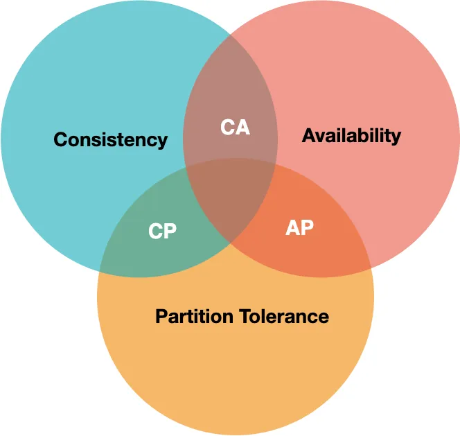

# Databases

**Designing Data-Intensive Applications Book by Martin Kleppmann**** 🦾

**Just keep in mind that databases that try to do many things well rarely excel at one thing.**

Remaining: 

How each data base saves data in disk, what is disk , effect of different way of saving to disk on trade-off  

Before Going deep dive, keep this algorithm in mind:

**CAP THEOREM:**

[ Remember CAP is for distributed or multi-node not for single node ]

[https://www.youtube.com/watch?v=BHqjEjzAicA](https://www.youtube.com/watch?v=BHqjEjzAicA)

The **CAP Theorem** says that any distributed database can only satisfy two of the three features.



- **Consistency**: every node has the same data.
- **Availability**: the ability of the system to respond to the user at all times.
- **Partition Tolerance**: the system continues working even if the network partition (communication between any of the nodes is broken)

Let's say we have two atm they remain in sync
Now network partition happens.

Now we prioritise consistency
No deposit and withdrawal until it is fixed.


if we prioritize availability


It will be inconsistent people will withdraw from both atm and it will become negative after fixing of network tolerance. Though it is not useful in the current case but can be useful in other cases. Like posting on Instagram by a user and it won’t matter much if other person can read it or not for some time.

………………………………………………………………………………………………………………………………………………………………

How do we scale a database in general? 

[https://www.freecodecamp.org/news/understanding-database-scaling-patterns/](https://www.freecodecamp.org/news/understanding-database-scaling-patterns/)

1. **Query Optimization & Connection Pool Implementation:** This pattern involves optimizing queries and managing database connections to reduce latency and improve performance. (you realize that the system has started performing poorly: API latency has increased a lot, and some transactions deadlock or starve and eventually fail. updating code.  ) . 
2. **Vertical Scaling or Scale Up** This pattern suggests upgrading hardware to increase system capacity and handle more traffic.
3. **Command Query Responsibility Segregation (CQRS):** CQRS involves separating read and write operations to distribute the load, enhancing performance, and reducing latency. (**master-slave**)
how do we sync in this →
4. **Multi Primary Replication:** This pattern introduces multiple primary databases that can handle write requests, allowing for increased write performance. (master-master, no slave all are masters)
5. **Partitioning:** This technique involves splitting the database into separate schemas or machines to handle high write and read traffic for specific functionalities. (having a different database with functionality)
6. **Horizontal Scaling:** Horizontal scaling involves **distributing** data across multiple machines (shards) to achieve greater scalability. (this is also called sharding, where distribute big db in small )
**can we do this for each type of db?** 
7. **Data Centre Wise Partition:** This approach distributes traffic across different data centers in various geographical regions to reduce latency and improve availability

………………………………….………………………………….………………………………….………………………………….………………

What can we want from our database?  Based on these things we usually select databases according to our needs and business requirements.

1. Able to keep our use-case data properly.
2. Able to get data quickly.
3. It should use less memory and no replication.
4. Data should be consistent and accurate.
5. Data should be available at all times.
6. What about ACID transactions?  
7. Somehow able to save data in a disaster in some server.. (replication).
8. Should be able to scale. → may be with/without distribution, by replication, etc.
9. Replication + distributed. 
10. What about distributed transaction ? 

First Let’s understand what are the different types of databases we have (and can also have in the future). And in them will understand their feature.

[https://dev.to/pmgysel/nosql-introduction-and-concepts-15a7](https://dev.to/pmgysel/nosql-introduction-and-concepts-15a7)

[https://medium.com/@i.vikas/looking-for-a-database-for-your-next-system-design-d65df8a778c5](https://medium.com/@i.vikas/looking-for-a-database-for-your-next-system-design-d65df8a778c5)

**Different Types of Databases**

[https://www.youtube.com/watch?v=6GebEqt6Ynk&list=PLjTveVh7FakKjb4UYzUazqBNNF-WGurXp&index=52](https://www.youtube.com/watch?v=6GebEqt6Ynk&list=PLjTveVh7FakKjb4UYzUazqBNNF-WGurXp&index=52)


**RELATIONAL DATABASES**

**Prerequisite:** Should have an idea of relational databases

Store structure data in tables.
****


1. **Able to keep our use-case data properly.**
    1. It only helps when we can figure out how to structure our data in fixed columns. Every row denotes new data with information on those fixed columns.
2. **Able to get data quickly.**
    1. We have **indexes** in this database (sorted in particular columns). We are querying on it that it will be fast else it will search in all rows. E.g. We have S.No. with increasing numbers then we can have binary search and logN complexity (we don’t do this explicitly it's a concept done by DBMS itself). So it's not always possible to have less complexity.
    2. too many indexes can slow down write operations.
3. It s**hould use less memory and no replication.**
    1. For this, we have a concept of normalization→ divide table into multiple tables for optimizing and reducing replication and later on fetch data by joining the tables.
    2.  **Cons: →** 
        1. Increase the latency of the query.
        2. Scalability: **query optimization**, **verticle scaling**, **replication of the whole database in another node (this has its challenges later on)**, or **very difficult in a distributed environment** or another way can be distributed by particular column value or **in short so that we don’t get any use case of getting data from two nodes and merging them**. (**like in mindtickle** distributed with **tenantIds**)  [**Not sure it's my understanding and experience**]
4. Data should be consistent and accurate.
    1. For a single node, it will be consistent because of transactions in a relational database.
    2. Replication → later part
    3. Distributed → later part
5. Data should be available at all times.
    1. That will depend on the design and will be discussed more while scaling with replication and distributed
    2. In the case of a single node, it's not 100% available if any disaster happens.
6. Somehow able to save data in a disaster in some server. (replication).
    1. possible by replicating the database.
7. It should be able to scale. → may be with/without distribution, by replication, etc.
    1. Query Optimization.
    2. Vertical Scaling → but it has its limit.
    3. Horizontal scaling
        1. Replication
            1. Master-slave ✅
            2. Master-Master / Multimaster ✅
        2. Distribution 
            1. Sharding

**NON-RELATIONAL DATABASES:**


No predefined schema, No need for data to be structured

1. **KEY-VALUE STORE**
    
    A key-value map where the value is of an arbitrary data type like String, Array, or JSON.
    
    (**Redis, Dynamodb)**
    
    *Key-value stores are particularly **suitable for caching implementations.***
    
    1. Able to keep our use-case data properly.
        1. Store a unique key and corresponding value, It has a primary key by which we can get data.
        2. Not possible to have complex data.
    2. Able to get data quickly.
        1. Fast to get data with that key. It is like constant insert and get with that particular key. Not possible to get with the other key. In this case will have to scan the complete db.
    3. It should use less memory and no replication.
    4. Data should be consistent and accurate.
        1. Dynamo db follows eventual consistency.
    5. Data should be available at all times.
    6. Somehow able to save data in a disaster in some server.. (replication).
    7. It should be able to scale. → may be with/without distribution, by replication, etc.
    
2. **DOCUMENT STORE**
    
    Each data entry is a document (e.g. JSON) of varying schema. It's possible to query by JSON elements. (It is sort of the same as key value but more flexible we save directly as JSON)
    
    [https://www.youtube.com/watch?v=ONzdr4SmOng](https://www.youtube.com/watch?v=ONzdr4SmOng)
    
    **Collection:** Documents are grouped into collections, which are similar to tables in relational databases. However, collections in document databases do not enforce a strict schema, allowing each document within a collection to have different fields.
    
    
    
    (**MongoDB, couchbase)**
    
    
    
    1. Able to keep our use-case data properly.
        1. It's JSON data. Not strict to have to fix no. of fields like relational.
    2. Able to get data quickly. (Time complexity? )
        1. Primary key and secondary key.
        2. Indexes can also be created . → Yes since it is also based on B tree instead of LSM trees.
    3. It should use less memory and no replication.
        1. It might have more memory since no concept of joins.
    4. Data should be consistent and accurate.
        1. These are created to provide eventual consistency. (write quorum) [ though at time of replication, we might also have the same thing in SQL ]
        2. **Don’t have an ACID transaction. [ Major ] → but mongadb now a days have some transactions.**
    5. Data should be available at all times.
        1. Support both replication and sharding in a better way.
    6. Somehow able to save data in a disaster in some server.. (replication).
    7. It should be able to scale. → may be with/without distribution, by replication, etc.
    
3. **COLUMNAR DATABASES**

Who is using this, tell some examples. 

1. **Store data in column families. Great for data compression and aggregate queries (e.g. SUM) [ Have support query like SQL, Snowflake ]**
2. Real-time analytics. 

[https://www.youtube.com/watch?v=Vw1fCeD06YI&t=1s](https://www.youtube.com/watch?v=Vw1fCeD06YI&t=1s)

(**Snowflake, Amazon Redshift, Cassandra**)

Let’s learn this by example:


This is how row-oriented (SQL) databases save data in disk.


Above while the box is like a block that db fetches from disk to memory in one go to check its having data or not which we want.


We will see these 3 examples in columnar db, to understand its pros and cons.

Columnar


This also does compression let say more than one-row id (1001 1002 ..) have the same salary then it will save it as a comma, it will indicate it has the same data between those commas

Pros and Cons


(PS: I don’t know what OLTP and OLAP 🤭)

1. Able to keep our use-case data properly.
    1. Already discussed
2. Able to get data quickly. (Time complexity? )
    1. Row wised
3. What about ACID transactions? 
    1. ?
4. Data should be consistent and accurate.
5. Data should be available at all times.
6. Somehow able to save data in a disaster in some server.. (replication).
7. It should be able to scale. → may be with/without distribution, by replication, etc.
8. Replication + distributed. 
9. It should use less memory and no replication.
    1. have technique compression on column-wise, but have an id field in each column

1. **GRAPH DATABASES**
    
    
    [https://www.youtube.com/watch?v=tvuZ-wqSTi0](https://www.youtube.com/watch?v=tvuZ-wqSTi0)
    
    **Real-world use case:**
    
    1. Social Media (FB, insta, LinkedIn, etc use this)
    
    Famous database:
    
    **(cosmos DB, neo4j, Amazon Neptune,** [TAO — Facebook’s Distributed database for Social Graph using sql](https://www.linkedin.com/pulse/facebooks-graph-database-tao-amit-kumar/)**, Dgraph (opensource Go use Graphql))**
    
    
    
    1. **Nodes**: Nodes represent entities that can be anything like Person, Student, Teacher, User, or any other object. They are similar to the row entry in the relational database.
    2. **Edges:** Edges represent the relationship that a node has with other nodes in the database. 
    3. **Properties:** Properties are similar to columns in relational databases. It attaches some labels that are represented with the node and defined as node properties. Properties are attached to a node to extend its information.
    
    Get all software created by a person with ID 1
    
    ```
    g.V("1").out("created").elementMap()
    => [label=>software name=>CMS createdAt=> 26/05/2012]
    ```
    
    1. Able to keep our use-case data properly.
        1. Got what is, not sure about hands-on.
    2. Able to get data quickly. → Yes if its as requirement form like graph
    3. It should use less memory and no replication. → 
    4. Data should be consistent and accurate.
    5. Data should be available at all times.
    6. What about ACID transactions? → No
    7. How is it stored in disk?
    8. Somehow able to save data in a disaster in some server.. (replication).
    9. what technology is used for indexing?
    10. It should be able to scale. → may be with/without distribution, by replication, etc.
    11. Replication + distributed. 
    
2. **SEARCH ENGINES:**
    
    A search engine database provides the specialized feature of full-text search over very large amounts of semistructured, or unstructured text data. The data can come from multiple sources, and users of the database may also want a “[**fuzzy search**](https://en.wikipedia.org/wiki/Approximate_string_matching)”, meaning the results may not exactly match the search string.
    
    Search-engine databases can handle full-text searches faster than relational databases. A well-known example of this is, an e-commerce website that can use search-engine databases to provide instant autocompletes or suggestions for its customers.
    
    > Search engine database are suitable for Text search and also for Logging and analysis
    > 
    
    The top search engine databases in the industry are [Elasticsearch, Splunk, and Solr](https://db-engines.com/en/ranking/search+engine).
    
    Check details on the Elastic Search Page.
    
3. **TIME-SERIES DATABASES:**
    
    (**Prometheus, influxdb, amazon timestream)**
    
    
    
    ### **What is time-series data?**
    
    Some think of “time-series data” as a sequence of data points, measuring the same thing over time, stored in time order. That’s true, but it just scratches the surface
    
    **Simply put: time-series datasets track changes to the overall system as INSERTs, not UPDATEs.**
    
    It allows us to *measure change*: analyze how something *changed* in the past, monitor how something *is changing* in the present, predict how it *may change* in the future
    

**And so, here’s how we define time-series data: data that collectively represents how a system/process/behavior changes over time**

Of course, storing data at this resolution comes with an obvious problem: you end up with a lot of data, rather fast. **So that’s the catch: time-series data piles up very quickly.**

This is why people are now turning to time-series databases.

**Why do I need a time-series database?**

You might ask: *Why can’t I just use a “normal” (i.e., non-time-series) database?*

The truth is that you can, and some people do:

[https://miro.medium.com/v2/resize:fit:875/0*gDkrxs6ikLZuofhg.](https://miro.medium.com/v2/resize:fit:875/0*gDkrxs6ikLZuofhg.)

A Time Series Database (TSDB) is a database optimized for time-stamped or time-series data

why not existing SQL and NoSQL?

1. VECTOR DATABASE:
    
    [https://www.datacamp.com/blog/the-top-5-vector-databases](https://www.datacamp.com/blog/the-top-5-vector-databases)
    
    [https://www.pinecone.io/learn/vector-database/](https://www.pinecone.io/learn/vector-database/)
    
    (chroma (opensource) , pinecone)
    
    [ efficiency in implementing "similarity search.” ]
    
    
    

**A vector database is a type of database that indexes and stores vector embeddings for fast retrieval and similarity search, with capabilities like CRUD operations, metadata filtering, and horizontal scaling.**

A vector database is a specific kind of database that saves information in the form of multi-dimensional vectors representing certain characteristics or qualities.

The number of dimensions in each vector can vary widely, from just a few to several thousand, based on the data's intricacy and detail. This data, which could include text, images, audio, and video, is transformed into vectors using various processes like machine learning models, word embeddings, or feature extraction techniques

The primary benefit of a vector database is its ability to swiftly and precisely locate and retrieve data according to their vector proximity or resemblance. This allows for searches rooted in semantic or contextual relevance rather than relying solely on exact matches or set criteria as with conventional databases

For instance, with a vector database, you can:

- Search for songs that resonate with a particular tune based on melody and rhythm.
- Discover articles that align with another specific article in theme and perspective.
- Identify gadgets that mirror the characteristics and reviews of a certain device.

How does it work? 


Traditional databases store simple data like words and numbers in a table format. Vector databases, however, work with complex data called vectors and use unique methods for searching.

While regular databases search for exact data matches, vector databases look for the closest match using specific measures of similarity.

Vector databases use special search techniques known as Approximate Nearest Neighbor (ANN) search, which includes methods like hashing and graph-based searches.

To really understand how vector databases work and how it is different from traditional relational databases like [**SQL**](https://www.datacamp.com/blog/all-about-sql-the-essential-language-for-database-management), we have to first understand the concept of embeddings.

Embedding is like giving each item, whether it's a word, image, or something else, a unique code that captures its meaning or essence. This code helps computers understand and compare these items in a more efficient and meaningful way.

This embedding process is typically achieved using a special kind of neural network designed for the task. For example, word embeddings convert words into vectors in such a way that words with similar meanings are closer in the vector space.

This transformation allows algorithms to understand relationships and similarities between items.

Essentially, embeddings serve as a bridge, converting non-numeric data into a form that machine learning models can work with, enabling them to discern patterns and relationships in the data more effectively.

*Embeddings uses a deep learning model to convert unstructured data into vectors*


### How to choose the SQL or NoSQL. Summary:  → [https://jepsen.io/analyses](https://jepsen.io/analyses) → each database property

Alex Xu → People using SQL for 40year so use this. if this is causing the problem then think first its any solution else shift to another DB, that accomplishes your need.

**consistency** (transaction):  why data is not consistent in Nosql while in SQL → if not ACID how they are working.

NoSQL database relies on a model known as the BASE model.

- **Basically** **Available:** Emphasizes high availability, allowing data to remain accessible even in the face of network issues or node failures, with no guarantee of immediate consistency.
- **Soft state:** Implies that a database's state can change over time due to various factors, including network delays and eventual consistency mechanisms.
- **Eventually consistent:** Over time, all data replicas will converge to a consistent state, even though temporary data inconsistencies may occur.

**scalability (availability, tolerance)**: check the above point for this → horizontal scaling and how hard it is

**NOTE:** There will always be counterpoints to that general guideline. You can scale MySQL horizontally,  and MongoDB started supporting  [Multi-Document ACID Transaction](https://www.mongodb.com/blog/post/mongodb-multi-document-acid-transactions-general-availability)

 

**So** let’s try to understand some key database concepts that will help us to choose the right database for our system design.

- Transactions
- Scaling

**But in case of commitment, we may prioritize availability.**

**TRANSACTIONS:**

In a database management system, a [transaction](https://en.wikipedia.org/wiki/Database_transaction) is a single unit of logic or work, sometimes made up of multiple operations. The operations in a transaction either all succeed, or all fail

two operations- **abort** and **commit.**

**What is an ACID transaction? which only SQL does.?
Or How SQL transaction is ACID**

[https://www.keboola.com/blog/acid-transactions#:~:text=The most common implementation of,often implement write-ahead logs](https://www.keboola.com/blog/acid-transactions#:~:text=The%20most%20common%20implementation%20of,often%20implement%20write%2Dahead%20logs).

a **transaction** is any operation that is treated as a single unit of work, which either completes fully or does not complete at all, and leaves the storage system in a consistent state


**Atomicity →** 

complete  or fail

**Consistency →** 

Consistency is about ensuring that changes made as part of a transaction are consistent with any database constraints. If the data at any stage goes against these constraints, the whole transaction will fail

**Iso¹lation →**

Modern DBMSs allow users to access data concurrently and in parallel. Isolation is the characteristic that allows concurrency control so modifications from one transaction are not affecting operations in another transaction. Two parallel transactions are in reality isolated and seem to be performed sequentially

**Durability →**

persistence of committed transactions. Transactions and database modifications are not kept in volatile memory but are saved to permanent storage, such as disks.

**How are ACID transactions implemented? (when having all table at one place. one vertical system)**

The most common implementation of ACID transactions is done via locks. Data is locked (not accessible by another transaction) until a transaction completes or fails, to guarantee atomicity, isolation, and consistency.

To guarantee durability, databases often implement write-ahead logs. Transactions are first stored in transaction logs, and only once they are saved to this separate repository, they are implemented in the actual database. In case of system failure mid-transaction, the transaction is either rolled back or continued from the transaction log left off.

**What if in the case of microservice? → Distributed transactions.**

Not all databases choose to support ACID transactions, usually because they are prioritizing other optimizations that are hard or theoretically impossible to implement together.

***Usually, relational databases do support ACID transactions, and non-relational databases don’t.*** 

[because → Relational databases rely on transactions because of the way related data is split between multiple tables. Other databases like MongoDB rarely need transactions but provide the capability in the event transactions are required.]

(
It's usually not always. 
**Misconception: NoSQL databases don't support ACID transactions**
Another common misconception is that NoSQL databases don't support ACID transactions. Some NoSQL databases like MongoDB do support [**ACID transactions**](https://www.mongodb.com/basics/transactions).
[https://www.mongodb.com/nosql-explained](https://www.mongodb.com/nosql-explained) 

[https://www.mongodb.com/basics/acid-transactions](https://www.mongodb.com/basics/acid-transactions)
)

**SCALING:**

- **Vertical Scaling**:
- **Horizontal Scaling**:

***Relational databases are not as easily scaled as more modern, non-relational databases**.*

**How do we scale relational databases**

1. Vertical scaling: increase CPU, memory, etc.
2. **horizontal scaling and how hard it is** ?:  (replication is easy distribution is hard since complexity increases, but replication has a limit )

Because this data is normalized, 
suppose there is a user table and a user order table 
now some part of the user table went into server1 and server2
same for the user order table

now we want to find out the data for a single user. So will have to take the join for both servers and we are gonna fuck up there.

or maybe option 2 is logically distributed it so that is not a case like this.

**In short, if it's possible by denormalizing or you have a very simple case in which no need of such a query then it's fine otherwise, hard. (FOR EXAMPLE, MT SHARD’S WITH TENANTID, AND THEY WILL NEVER NEED TO JOIN I THINK** 🤔**)**

**on the other hand in NoSQL, no concept of joining all data will be at one place. 
so after distribution, they will have to take from both servers separately and combine them.**

    
    **there is a saying → most SQL databases were designed with consistency in mind while most NoSQL databases were designed to accommodate scaling. (no SQL has redundant data and requires more space )**
    

[Database scaling](Databases/Database%20scaling%202ada7bf2d8ec42b78217e9da9d39c5ff.md)