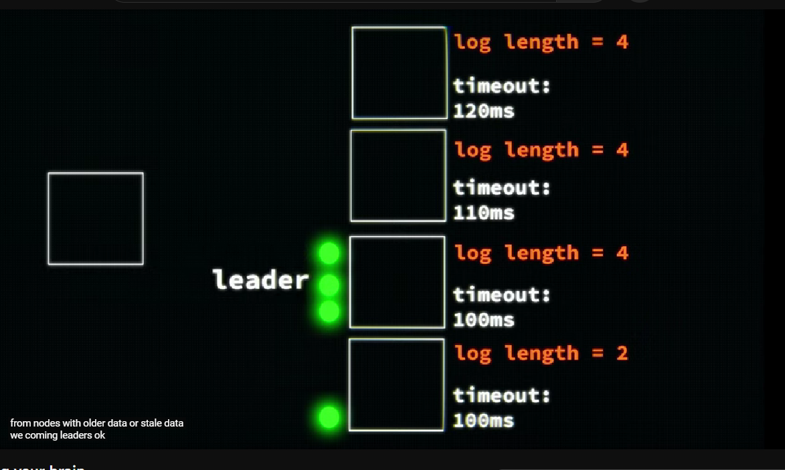

# Raft

**Raft**: Consensus algorithm with a clear structure, featuring a leader node coordinating the agreement process in a distributed system.

Raft in databases (As of now not going into deep dive imple.)

There is a leader who tells about the new entry to all followers, and they append it, if more than half the nodes ack, then the leader commits and tells followers to commit as well.

[https://www.youtube.com/watch?v=IujMVjKvWP4](https://www.youtube.com/watch?v=IujMVjKvWP4)