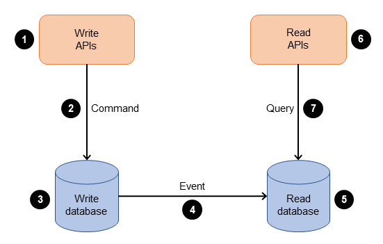
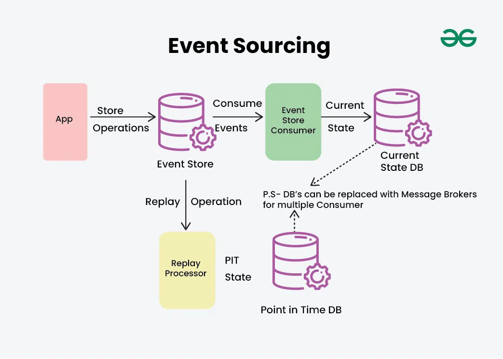
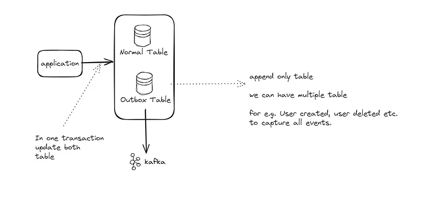
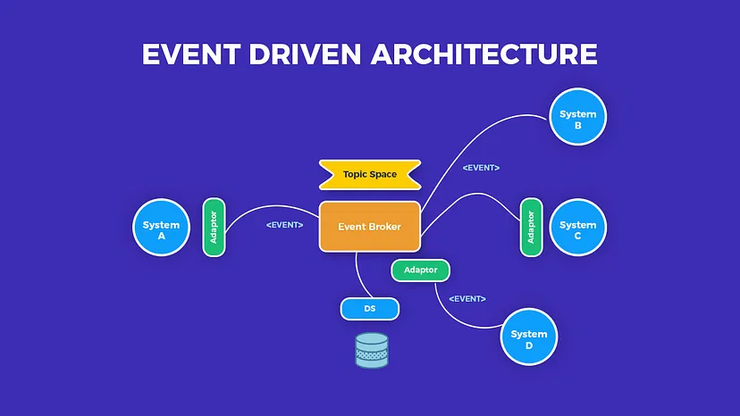
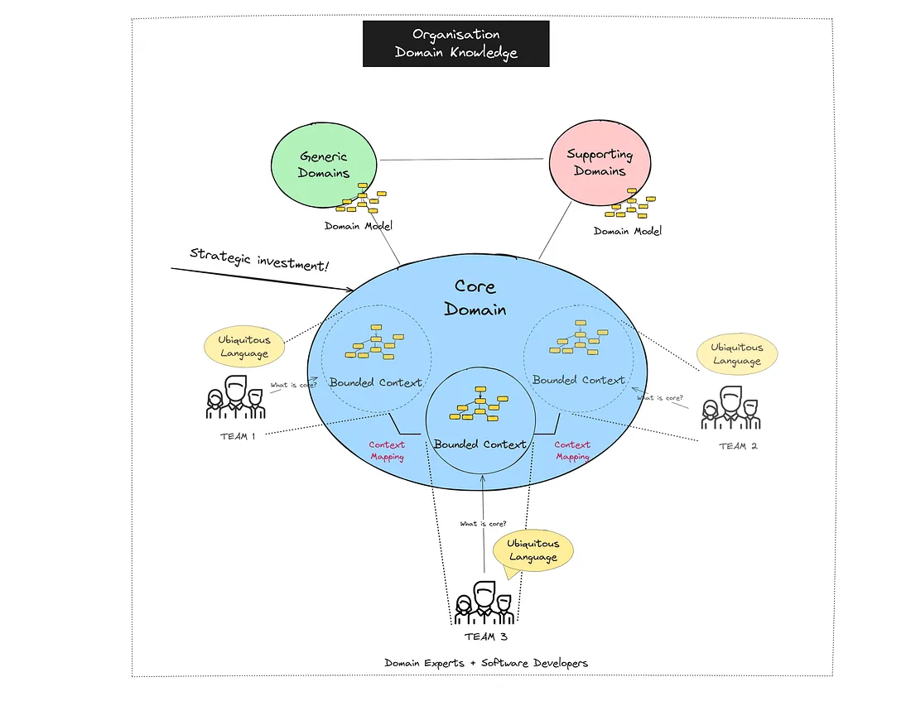

1. Circuit Breaker: check LLD
2. CQRS Pattern: command query reponsibilities segregation: Command Query Responsibility Segregation (CQRS) is a design pattern that segregates read and write operations for a data store into separate data models. This allows each model to be optimized independently and can improve performance, scalability, and security of an application.


3. Event Sourcing:

    - Event Sourcing is a pattern that suggests storing the history of all changes made to an application’s data as a sequence of events ( immutable, append only ). Rather than storing the current state of the data, Event Sourcing stores the sequence of events that led to that state. In other words, instead of storing the result of each operation, we store the operation itself. if we compare with MT, then its like outbox events as well and these are went to snoflake which contain SODPs , these are event sourcing way.  ( not 100% but kind of , since here its the source of truth out bit skewy )
    - When we want to retrieve the current state of the data, we simply “replay” all of the events in the event store, starting from the beginning. This gives us the current state of the data.
    - Advantages: Audit, replay, time travel
    - Disadvantages: high storage system requirement, query complexity
    - Alex Xu sophisticated it -> by saying there are 4 term in thie pattern : 
        - Command: The request which want to do something, it will generate events. ( in some cases it may not be ). Its just a state update request kind of .
        - State: Suppose there is command, then it may updated the state of our entity. That will eventually led to event like in MT user's some field.
        - Event: This denote the about the actual changes , which will be send to some storage, and view will be created on this or replay. These can be multiple with single command.
        - StateMachine , which will read the command and update state and emil event , kind of processor.
        - Flow -> Command -> statemachine -> updated state -> emit events -> historical database => replay or view creation. 
        - So these are conceptually, now you can implement any way you want, main aim to store the events , so that time travel is possible. ( Event source should be source of truth and immutable )
    - 
    - Bonus -> can check DDIA -> stream processing it has this.
4. Transactional Outbox Pattern: 
    - Check the medium:
    - 
    - It can help to do the event sourcing , but solving bit different problem.
    - It help to generate event and update state in db Transactional, to make sure there is no inconsistent state.
    - else it was hard to update state and publish event as well.
5. Event Driven Design: 
    - Focuses on the production, detection, and reaction to events within a system. It allows different components or services to communicate asynchronously through events, promoting loose coupling and scalability.
    - In short MT ka rule-engine , which was majorly event driven only.
    - Or Instead of request/response , its like event between service. 
    - Key component: Event producer, event broker , event , event consumer.
    - 
6. Domain Driven Design: 
    - That is very vast, its the pattern , that help to implement software , properly ( a/c to them ).
    - It has many step to make it possible, i would suggest to read the book for this. since it has details of different part of it.
    - On high level -> we want to break the software in multiple domain like in microservice, which have their boundad context, not other team need to worry about. And they communicate with each other, DDD has lower implement details as well like how to implement particular domain, ( best patter for it is hexagonal architecture ), can see the detail of it in book. All these combined all domain driven design. ( very high level )
    - its just a way , to implement software. but i think it might be pretty normal , but stil for technicality.
    - famous is blue book ( but bit old , so explore other while reading )
    - 
    - https://medium.com/raa-labs/part-1-domain-driven-design-like-a-pro-f9e78d081f10 ( didn't read )
7. MMAP:
    - Memory-mapped files allow an application to map a file or a portion of a file directly into its memory space. This means that instead of reading data from the file on disk every time it needs to access it, the application can access it as if it were in memory. This results in faster data access and lower latency.
    - But who do this, how to do this ? There are some commands of linux, which help to do this kind of crud types. and application code do this.
    - How to implement ? -> there is very simple [library](https://cs.opensource.google/go/x/exp/+/master:mmap/) in golang => https://ghvsted.com/blog/exploring-mmap-in-go/
    - Also can refer -> golang -> mmap_golang directory.
    - what is internal architecture of mmap or how it work ? 
    - Its basically the memory management concept of OS -> demand paging, virtual memory -> when we use system call mmap , it internally do all these
```
+-------------------+
| Application Calls  |
|      mmap()        |
+-------------------+
           |
           v
+-------------------+
| OS Creates Page    |
| Based Mapping      |
+-------------------+
           |
           v
+-------------------+
| Access Page       |
| (Demand Paging)   |
+-------------------+
           |
           v
+-------------------+
| Page Fault?       |<---------------------+
|  Yes / No         |                      |
+-------------------+                      |
           |                                 |
           v                                 |
  +-------------------+                       |
  | Load Page from    |                       |
  | Disk to RAM       |                       |
  +-------------------+                       |
           |                                 |
           v                                 |
  +-------------------+                       |
  | Update Page Table |                       |
  +-------------------+                       |
           |                                 |
           v                                 |
+-------------------+                       |
| Application Access |<--------------------+
| File Data Directly | 
+-------------------+

```
8. Event sourcing with MMAP ( stock exchange, digital wallet , Alex xu 2):
    - Now using the disk file as the source of event for communication ( like command and events in arch in kafka ) instead remote like kafka.
    - help in reduce latency 
    - that golang code is nothing but CRUD of event with mmap
    - for maintain state ( event store ) also we can use the disk database like rocksdb ,sqlite. ( instead like remote db) and can take snapshot etc for relibility etc scaling.