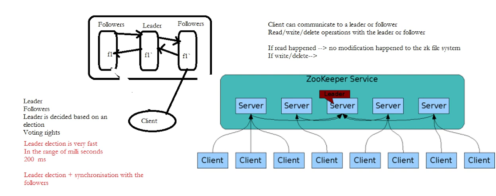
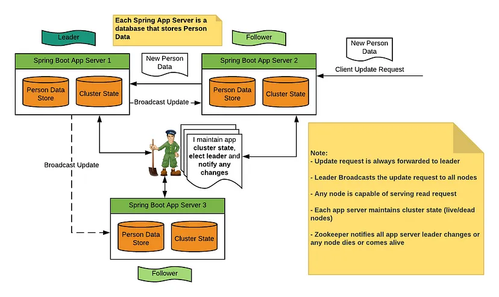

# Leader Selection Algorithm means:

## Definition

Leader Selection Algorithm is used to select a leader from a set of nodes in a distributed system. This algorithm is crucial in master-slave architecture, where if the master fails, a new leader needs to be elected from the slaves.

## Types of Leader Selection Algorithms

* Bully and Ring Algorithm — designed for different distributed system configuration (check when required)

## Resources

* https://3ev.medium.com/election-algorithm-a-case-study-7f51a4b059e9#:~:text=the%20Bully%20Algorithm.-,Bully%20Algorithm,from%20a%20set%20of%20processes.

# Zookeeper 

## Overview

ZooKeeper is a distributed, open-source coordination service for distributed applications. It is used in master-slave architecture and provides a tree-like structure, similar to a file system, where nodes are called znodes.

## Features

* Znodes in ZooKeeper offer the ability to store data and have children, maintain metadata like version and transaction ID, support Access Control Lists (ACL) for permissions, including username/password authentication, and provide notification for any changes.
* ZooKeeper is responsible for selecting a leader using leader selection algorithms and performing other duties like configuration management, locks in distributed systems, and maintaining and detecting if any server leaves or joins a cluster.
* ZooKeeper has a cluster with replication to avoid a single point of failure.
* Inside the cluster, it has a leader (based on voting) and followers.
* Clients can connect to the leader or followers for delete/write/read operations. If a client connects to a follower, it will redirect to the leader and broadcast to all followers.

## Characteristics

* ZooKeeper is not meant to store large amounts of data and is not a cache.
* It's used for managing heartbeats, knowing what servers are online, storing/updating configuration, etc.
* ZooKeeper is very simple and can't store different types of data structures. It also doesn't store much data and replicates data to nodes for consistency.

## Comparison with Key-Value Stores

* ZooKeeper vs normal key-store. (Why Kafka used this instead of any other key-value store)
* Quote: "You're comparing the high-level data model of ZooKeeper to other key value stores, but that's not what makes it unique. From a distributed systems standpoint, ZooKeeper is different than many other key value stores (especially Redis) because it is strongly consistent and can tolerate failures while a majority of the cluster is connected. Additionally, while data is held in memory, it's synchronously replicated to a majority of the cluster and backed by disk, so once a write succeeds, it guarantees that write will not be lost (barring a missile strike). This makes ZooKeeper very useful for storing small amounts of mission-critical state like configurations."

## Resources

* https://www.youtube.com/watch?v=0auBXKcMyUs&t=1659s
* https://bikas-katwal.medium.com/zookeeper-introduction-designing-a-distributed-system-using-zookeeper-and-java-7f1b108e236e
* https://stackoverflow.com/questions/31460901/whats-the-difference-between-zookeeper-and-any-distributed-key-value-stores
* https://preparingforcodinginterview.wordpress.com/2019/08/25/zookeeper-vs-redis/

# Leader Election in ZooKeeper – How It Works & Why It Matters

## Overview

In a distributed system, multiple nodes (servers) often need to coordinate tasks. To avoid conflicts and ensure consistency, one node is elected as the leader, while others act as followers.

## How ZooKeeper Performs Leader Election

1. All nodes register in ZooKeeper by creating an ephemeral sequential ZNode under a common path (e.g., `/election`)
2. ZooKeeper assigns each node a unique sequence number (e.g., `/election/node_0001`, `/election/node_0002`)
3. The node with the smallest sequence number becomes the leader
4. If the leader fails, its ephemeral node disappears, and the node with the next smallest number becomes the new leader

## Example: Leader Election in Kafka

Kafka brokers need a leader to coordinate tasks like topic partitioning and replication.

1. When a Kafka cluster starts, brokers register themselves with ZooKeeper
2. The broker with the lowest ZNode ID becomes the controller (leader)
3. If the leader fails, ZooKeeper elects a new leader automatically, ensuring high availability

## Why Use ZooKeeper for Leader Election?

* **Automatic Failover**: If the leader crashes, another node is elected instantly
* **Strong Consistency**: ZooKeeper ensures that at any moment, there is only one leader
* **Scalability**: Distributed systems can dynamically adjust without manual intervention
* **Coordination & Synchronization**: Helps manage distributed locks, worker assignment, and metadata storage

## Common Use Cases

Leader election is commonly used in:

* Distributed databases (HBase, Cassandra)
* Kafka, RabbitMQ, or other message brokers
* Microservices that require coordination
* Primary-backup models in high-availability systems

👉 TL;DR → ZooKeeper automates leader election in distributed systems, ensuring high availability, failover, and strong consistency (e.g., Kafka uses it to pick a broker leader). 🚀

- https://www.youtube.com/watch?v=0auBXKcMyUs&t=1659s
- https://bikas-katwal.medium.com/zookeeper-introduction-designing-a-distributed-system-using-zookeeper-and-java-7f1b108e236e
- https://stackoverflow.com/questions/31460901/whats-the-difference-between-zookeeper-and-any-distributed-key-value-stores
- https://preparingforcodinginterview.wordpress.com/2019/08/25/zookeeper-vs-redis/

#### Raft
- This is consensus algorithm [ what ? -> [Link](https://www.notion.so/Distributed-consensus-63b85ade896c4e49ade80ac361690953) ]
- Used in multi-master , master-master.
- It internally uses leader and follower kind of concept,On a high level: when ever write request comes it first send to leader , then it send to follow . once get the ack , leader commit and tells follower to commit as well.
- 
- https://medium.com/coccoc-engineering-blog/raft-consensus-algorithms-b48bb88afb17
- https://www.notion.so/Raft-dae2c0b7a18440a29523dd4507929bd9

#### Paxos

- Used in multi-master , master-master.
- 

#### Heart beat detection in distributed system

-  If there is a central server, all servers periodically send a heartbeat message to it. If there is no central server, all servers randomly choose a set of servers and send them a heartbeat message every few seconds. This way, if no heartbeat message is received from a server for a while, the system can suspect that the server might have crashed. If there is no heartbeat within a configured timeout period, the system can conclude that the server is not alive anymore and stop sending requests to it and start working on its replacement
- https://medium.com/geekculture/system-design-tutorial-3-must-know-distributed-systems-concepts-279d4e9718e8#:~:text=Heartbeating%20is%20one%20of%20the,heartbeat%20message%20every%20few%20seconds.

