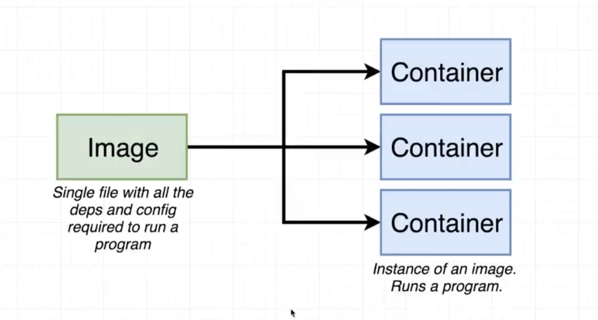

# docker

https://docs.docker.com/guides/get-started/

Here the client is our computer. Docker host is docker desktop

1. Why?
    1. No tension about dependency from one dev machine to another.  virtualization feel.
2. Docker image.
    1. It is like the zip of the code with its dependency. Everything but not live.
3. Docker container.
    1. followup on the image, but with life. You run the image then it changes to the container.
    2. or simple its like running instance of a image with kernal and other things which it require to run.
    3.

   

4. Docker registry.
    1. It's like GitHub. https://hub.docker.com/
5. Dockerfile and its comments.
    1. comments can check on documentation.

   .png)

6. Docker volume.
    1. If container is deleted then that save memory is also deleted. So this is the concept  to map our pesist storage to container. So that even if it stop then data will be there.

.............................................................
https://hub.docker.com/repository/docker/manvirag/learning_docker/general