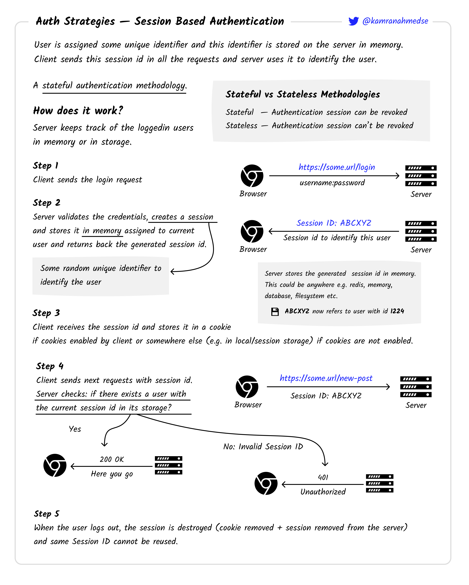
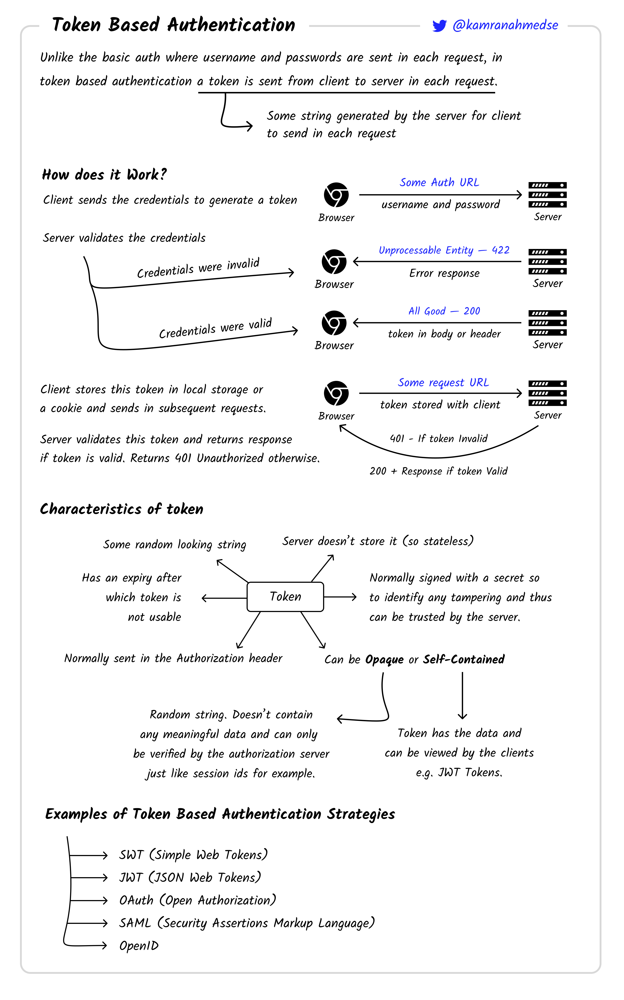
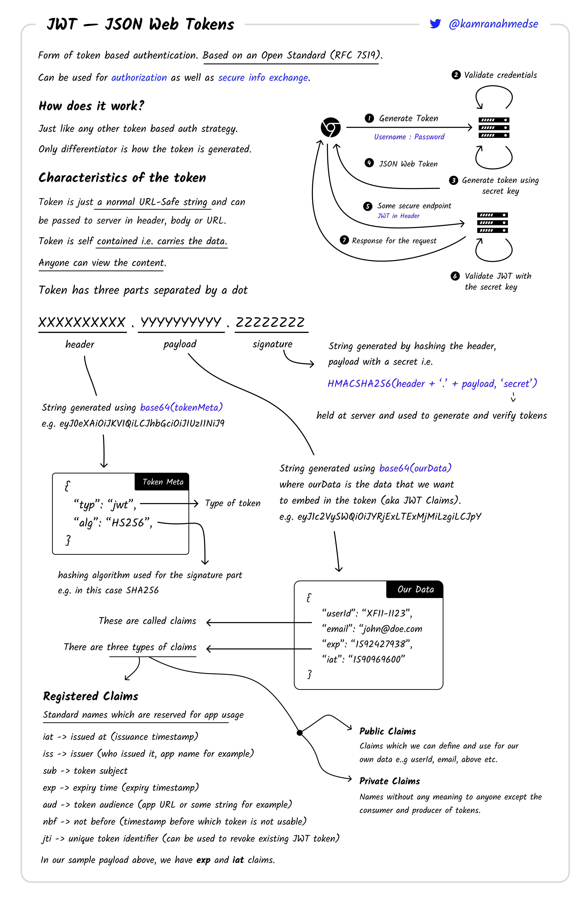
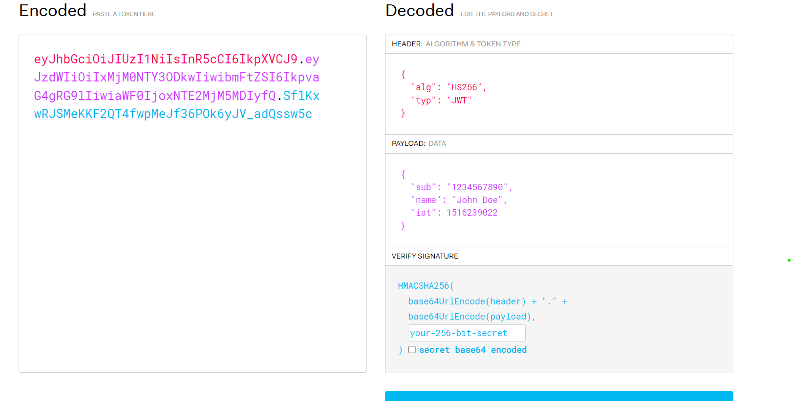
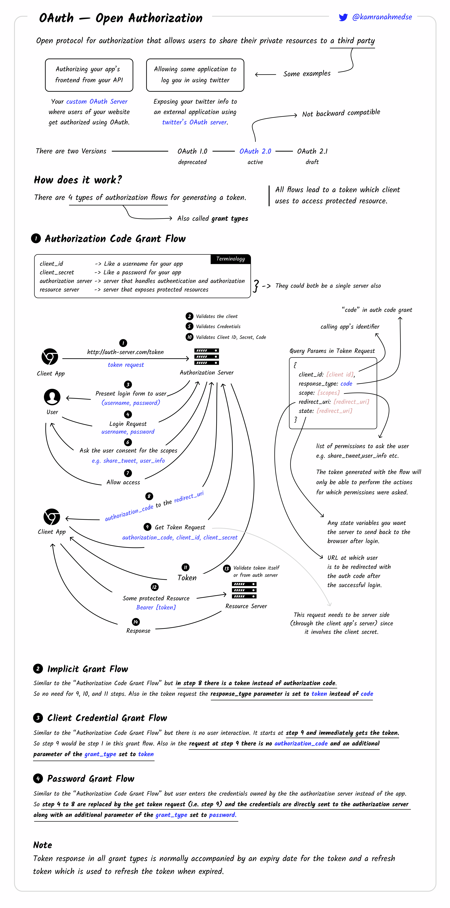
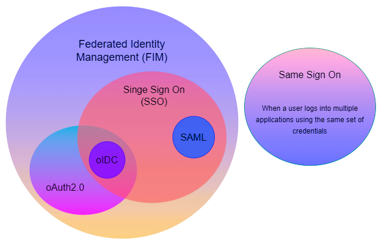
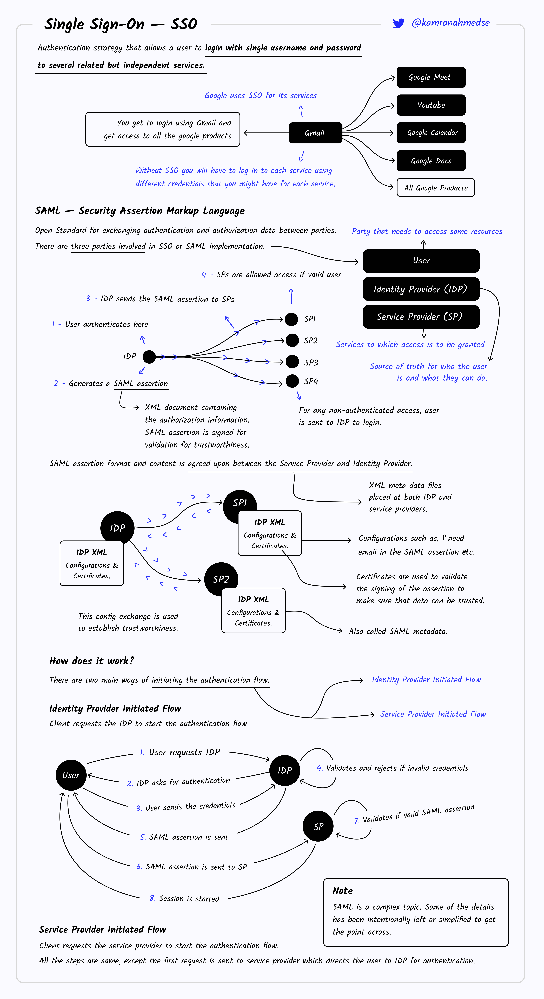

## How does different type of authentication works ? ( this is source of truth ) 

### Different types of authentications

1. Credential Based.
2. Session Based.
   1. Stateful
   2. Stateless ( Also Understand SSO here)
      1. JWT
      2. SSO
         1. SAML
         2. OPENID CONNECT ( OIDC )
         3. OAUTH
   
   

### Deep dive each of them

#### 1. Credential Based. ( yes i do understand this. )
- Usr give credential username and password.
- We generate the passhash with input password ( with salt + hash algorith + password ). ( this 2 and 3 is one of the way there can be others )
- Check that for that username and orgid , whether the passhash exist and it is equal to above generated pass hash.
- Yes hasing is not reversal


#### 2. Session Based: 
 
1. Stateful ( i understand this pic is correct )

   - basically maintain the sessionId and its expiratin in db. 
   - how to generate sesionId ? 
   - maintain the unique secreate id ( only at server not any where ) and use userid, and timestamp to generate it. generated by like above case, but yes there is possible some copy it and save in other brower cache or it might be able to login. its similary to someone has the username and password. sometimes IP or device checks to prevent or detect such misuse.





2. Stateless:

Stateless authentication stores the user session data on the client side (browser). 
Since the user session is stored on the client side, the server only have the capability to verify its validity by checking whether the payload and the signature match
This is done on basic of token concept or token based authentication . see below image. how and who generate that token make it into different types as mentioned in below pic. 



**a. JWT** ( i understand pic )

- one of the way to do token wala chiz via json. 
- How to generate jwt token.
   - base64 of header and payload separately. 
   - create its signature with unique key and append that also.
   - so if someone have jwt token it can get that user details, 
   - but can't do much with signature need to be done with uniqeu id. 
   - how to save ths unique id ?
      - it is save in secret of k8s and server only use to do thse thing. rotate the key for safety
- How we verify it.
   - extract payload and header and generate signature with that unqieu id and verify it with appended signature
- security ? 
   - similary to above in case someone copy that token





**b. OAUTH ( Token based )**

Example: login with twitter, login with github, login with google

OAuth (a protocol for auth, widely used ) is used to allow third-party applications to securely access a user’s data or perform actions on their behalf without exposing the user’s password; common use cases include enabling “Sign in with Google/Facebook/GitHub” buttons on websites or apps, granting apps permission to access user resources like email, calendars, or files from cloud services


**Flow:**

oauth config ( all these we store on our side):

```json
  "ClientId": "", 
  "ClientSecret":  
  "Endpoint": {
     "AuthUrl": "",
     "TokenUrl": ""      
  },
  "Scopes":
  "RedirectUrl"


"ClientId": Sent to Google's authorization and token endpoints to identify your application—it's public and required in both the authorization URL and token exchange request.

"ClientSecret": Used only by the client server (never exposed to the frontend) during the token exchange step to prove the authenticity of the client—sent along with the code to Google's token endpoint.

"Endpoint.AuthUrl": The URL where the user is redirected to grant permissions (e.g., https://accounts.google.com/o/oauth2/v2/auth)—used to build the initial redirect link.

"Endpoint.TokenUrl": The endpoint used by the client server to exchange the authorization code for an access token (and optionally a refresh token).

"Scopes": Define what level of access your app is requesting (e.g., user profile, email)—included as a parameter when redirecting the user to the authorization URL.

"RedirectUrl": The URL in your application where Google will send the user back after they grant or deny permissions—must match the redirect URL registered in the Google Developer Console.
```


Flow: ( logically redirect, make user login their side, they will hit back with temp code , we then hit back with temp code in hope get token, once we get we can get info from their endpoint url. )

1. User clicks "Sign in with Google" on the client (frontend) → the client sends a request to the client server to initiate the OAuth process.

2. Client server generates a random state value for CSRF protection and stores it temporarily (e.g., in session or database).

3. Client server constructs the Google authorization URL using the following parameters:
   - `client_id` (from config)
   - `redirect_uri` (from config)
   - `response_type=code`
   - `scope` (from config)
   - `state` (randomly generated value)
   - `access_type=offline` (if refresh token is needed)

4. Client server redirects the user to Google's Auth URL → the user sees a Google consent screen and approves access.

5. Google redirects the user back to your `RedirectUrl` with a temporary `code` and the same `state`.

6. Client server receives the `code` and verifies the `state` to ensure the request is legitimate.

7. Client server sends a POST request to Google's token endpoint with the following:
   - `code` (received from Google)
   - `client_id`, `client_secret`, `redirect_uri` (from config)
   - `grant_type=authorization_code`

8. Google responds with an access token (and possibly a refresh token).

9. Client server uses the access token to call Google's resource server (e.g., `https://www.googleapis.com/oauth2/v3/userinfo`) to fetch user details.

10. Client server uses the user data to authenticate or register the user in its own system, issue its own session or JWT, and complete the login process.





**d. OPEN ID** ( just wrote to avoid confusion with saml )

OpenID Connect (OIDC) is an authentication protocol built on top of OAuth 2.0, while OAuth 2.0 is an authorization framework—OAuth lets third-party apps access user resources (like email or calendar) with user permission, but it doesn’t tell the app who the user is; OIDC adds an identity layer to OAuth by introducing an ID token (usually a JWT) that contains user identity information (like name, email, etc.), allowing the app to authenticate the user; in short, OAuth answers “Can this app access this resource on the user’s behalf?”, while OIDC answers “Who is this user that just logged in?”—so OAuth is for access control, and OpenID Connect is for user login and SSO.

**c. SAML**

SAML is a protocol used to implement SSO, specifically for authentication.
Instead of json its communication based on the XML data type.

As we discussed in previous, There we were using the json config , and in particular format like authoriser endpoint , resource endpoint , secrets etc.

In the same way we have to save config for IDP in case of SAML on client side. That have little different format than oauth.


Before this lets first understand SSO.
- Previous case oauth was to access like we might need calender user, but some user people user it to get email to auth.

- SSO ( a concept ) specially for authentiation to answer who is this user and is this legit.
- 4 component, user, login page (MT), identity provider ( salesforce ), service provider( MT backend )
- usercase want to access xyz page of MT with sign in using salesforce.

Usual flow of sso login ( sso ki kahani chatgpt ki dubani): 


### Configuration

####  On Service Provider (SP) / Client Side:
- `EntityID`: Unique identifier of the SP or Client
- `ACS URL` (SAML) / `Redirect URI` (OIDC): Endpoint where the IdP sends authentication response
- `Client ID` and `Client Secret` (OIDC only): To identify and authenticate client
- `Scopes` (OIDC): e.g., `openid email profile`
- `IdP Entity ID`: Unique identifier of the Identity Provider
- `IdP SSO URL`: Where auth requests are sent
- `IdP Public Certificate`: Used to verify response signatures
- `Response Type`: Typically `code` in OIDC
- `Attribute Mapping`: Maps user attributes (email, name, etc.) to local fields

#### On Identity Provider (IdP) Side:
- `SP Entity ID` / `Client ID`: Registered application identifier
- `ACS URL` / `Redirect URI`: Where to send auth responses
- `Allowed Redirect URIs`: For validation against redirection attacks
- `Signing Certificate (SP)`: If SP signs its requests (SAML)
- `Requested Attributes`: What user info to include in response
- `Response Signing`: Whether to sign assertions/tokens

---

#### Standard SSO Flow (SAML or OIDC)

1. **User opens** the SP/client app → App sees no active session.
2. **SP redirects** to IdP using pre-configured `SSO URL`, sending:
   - SAML: `AuthnRequest` with `EntityID`, `ACS URL`
   - OIDC: `client_id`, `redirect_uri`, `scope`, `response_type`, `state`
3. **IdP checks session** → If not logged in, prompts user to authenticate.
4. **User logs in** → IdP validates credentials.
5. **IdP creates response**:
   - SAML: Creates a **signed SAML Assertion**
   - OIDC: Returns a **signed ID Token (JWT)** + **Access Token**
6. **IdP sends response** back to user's browser → Browser POSTs/redirects to:
   - `ACS URL` (SAML)
   - `Redirect URI` (OIDC)
7. **SP validates** response using:
   - `IdP public key` to check signature
   - Validity of `issuer`, `audience`, `state`, etc.
8. If valid, **SP creates session** (cookie or JWT) → user is logged in.
9. Next time user accesses another SP integrated with same IdP → **SSO** happens automatically (IdP reuses session, no login prompt).





