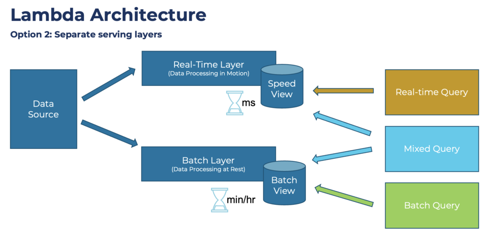

1. S3 → used for storing the files → distributed → managed by aws  🟩
2. what is this ? HDFS or HADOOP or snowflake.
    1. s3: 🟩
        1. cloud based distributed object or file storage or blob storage → its file distributed file systems , manged by aws.
        2. Its not possible to store these in databases.
        3. files, images, logs, vidoes etc and archival storage → since its cheap.
    2. snowflake:
        1. Snowflake is a cloud-based data warehouse platform → coloumn oriented type storage
        
        1. Its like the **datalake** → v**erify help in aggregate query → OLAP** → by writing complex query.
        2. Data warehousing (A data warehouse is a centralized repository for storing and organizing a company's data, making it easier to analyze and report on information for decision-making and reporting purposes.) as a service
        3. **Analytics query**
    3. hdfs: Its a storage
        1. HDFS is a distributed file system that stores data across multiple nodes in a cluster for scalability and **fault tolerance**
        
        1. **Streaming data processing:** Supports streaming data processing using MapReduce. ? 
            1. How does it do stream
            2. What is map reduce bit detailing
        2. **Batch processing** and data warehousing ? 
    4. hadoop:
        1. **open-source framework designed to process and store massive amounts of data efficiently**
        2. **key components → HDFS and map reduce** ( **A programming model for processing large datasets in parallel. )**
        3. **Batch Processing**
        4. Can show the sample architecture with and without this ? 
    5. S3 vs HDFS:
        1. hdfs → is on pysical machine , so can also process the data.
        2. s3 → is just storage → no processing → key : object data.
    
    If you have massive amounts of data, Hadoop or S3 may be suitable. For structured data and complex analytics, Snowflake might be a better choice.
    
    
    

Hadoop More Details: → hdfs + mapreduce + processing ( Batch processing )

- Map Reduce: framework
    - Allow use to perform , batch processing of big database
    - works with hdfs in hadoop.
    - these are the step in it → these are programs like map , reducer → etc are executed on node itself.
    - mapping → shuffling → done by hash the key an get the shuffling node with each → each same key across multiple m apping node → shifted to same shifting node → reduce
    
    
    
- HDFS: ( hadoop districuted file system )
    - archicture is like our dbaas/ kafka →
    - there is name node → zookeeper.
    - data nodes → kafka broker
    - replication factors → like partiion replication.
    - big file → break into blocks → store different data node . → these entries mentioned in name node . So at time of read get to know about this.

- Hadoop:
    - orchestrator type → uses hdfs and mapreducer → to store and processing data.
    - What actually is ? is it like kubernetes ? 

- Use case in system designing:
    - **Massive Data Storage:** The platform needs to store billions of user posts, comments, likes, and other user-generated content.
    - **Batch Processing:** Use MapReduce for batch processing tasks like calculating user recommendations, generating reports, and data cleaning.
    MapReduce is well-suited for large-scale batch processing jobs.
    - **Fault Tolerance:** The platform must be resilient to hardware failures and data loss.

1. how to stream (multiple node and logic and handle them manually -> readymade just write code ) → data → kafka or apache spark vs apache flink → internal architecture what is this ?  ( these are big data processing tools )
    1. Kafka →
        1. **stream processing** → although kafka + consumer → can be batch.
        2. pub sub + store stream of data. Guarantees data durability through replication and persistence
        3. **Message queuing:** Asynchronous communication between systems.
        4. **Data pipelines:** Building data pipelines for streaming data processing.
        5. **Real-time analytics:** As a data source for real-time analytics applications
    2. spark →
        1. Apache Spark is a batch processing engine that emulates streaming via **microbatching or lambda processing**.
        2. big data processing frame work , like hadoop.
        3. **batch processing**
    3. flink:
        1. aws kinesis analytics stream → to process real time data → given by msk or kinesis data stream.
        2. **real time streaming**
        3. Not sure but flink can also do both simultaneouly
    4. storm:
2. how to scale or shard graph database ?  🟧
    1. One way is to do like tenant id → all related data separation, no cross connection.
    2. Replication can be useful for any kind of database - it's just creating multiple copies of data so you can serve more queries than a single server can handle.
    3. sharding is pretty complex if not possible to put relative data in one shard in graph databases.
    4. or like subgraph solve → graph on graph. → very very complex

Sream Vs Batch:

About Hadoop , HDFS and map reduce and batch processing.

1. How to scale time series database and its details.
    1. First of all there are few points which are different related to time query as compare to normal sql.
    2. like we only focus on the query between time ranges.
    3. query are insert not any update → kind of append.
    4. **Columnar Data Model**: The data model of a TSDB is typically columnar, meaning that each column represents a time series or a metric. Once the data is validated and parsed, the TSDB stores it in a compressed, columnar format optimized for storage and retrieval efficiency.
    5. Indexing: To enable efficient querying of large datasets, the TSDB uses indexing mechanisms to organize the data by timestamp and tags. Time-based indexing involves organizing the data by timestamp, while tag-based indexing involves organizing the data by tags such as device name, location, or other metadata. The TSDB also performs metadata indexing to provide additional context for the data.
    6. **SQL-like Querying**: Most TSDBs support a SQL-like query language
    7. Scalable: TSDBs are designed to scale horizontally to handle large volumes of time-series data. Most TSDBs support distributed architectures that allow for adding more nodes as data volume grows. Some TSDBs also support sharding techniques that allow for partitioning data across multiple nodes.
    8. No transactions.

#### Doubts:
***
- I know hdfs, s3.
- I know aws lambda.
- I know map reduce concept.
- I know kafka

1. I want to know the comparision of architecture with these and without using these explicity ( not sure, use hadoop, spark, flink, kinesis data analytic processing, kinesis firehose )
2. How to implement on aws.

***

Before directly jumping to this let first understand two data processing paradigm

1. Batch(offline): 
- Suppose we need to find out the some thing on last one day data on regularly basis. Like on x date  , we need to find about the x-1 day.
- Means we will have to store this data.
- That's why batch is important, we will store the data on some storage.
- we will have processing which will fetch last one day data and do processing.
- and will put the extracted information in some database.

Without Ready made tools Architecture: 
- We will have source ( s3 ).
- We will have data partitioner. (2)
- We will have another queue.(3)
- We will have parallel processor , may be map reduce jobs.(4)
- Put this data in some s3 or database.

- 2,3 and 4 will be encapsulated as modern tools like spark/hadoop.

Ready mate tools and implementation and arch:
- Tools are hadoop and spark. They both kind of similar internal component are different. Apache Hadoop was created to delegate data processing to several servers instead of running the workload on a single machine.

- Meanwhile, Apache Spark is a newer data processing system that overcomes key limitations of Hadoop. Despite its ability to process large datasets, Hadoop only does so in batches and with substantial delay.

Hands on information:
Aws EMR

2. Stream(live):
- Suppose we need to find the some analytics on live cricket match or hotstar live event, this can't be done with batch processing, we will have to do processing before storing.
- Storage may be optional , but can do for reliability.
- Here instead of storing and processing, we will have to do the processing as soon as we get the data and send this event to client.

Without Ready made tools Architecture: 
- input can be kafka stream , live data.
- may be aws lambda processing one by one and mataining the local data structure and flush to database.
- out can be kafka or database

Ready mate tools and implementation and arch:
- Flink, aws flink

3. Lambda
- This is called micro batching:

4. Kappa:
- This model simplifies the traditional Lambda Architecture by using a single stream processing system to handle both real-time and historical data analysis, reducing complexity and increasing efficiency.

Let's not go into much of lambda and kappa if need below article, we are more focussed on concept of stream and batch and its architecture:
- https://www.kai-waehner.de/blog/2021/09/23/real-time-kappa-architecture-mainstream-replacing-batch-lambda/
- 

