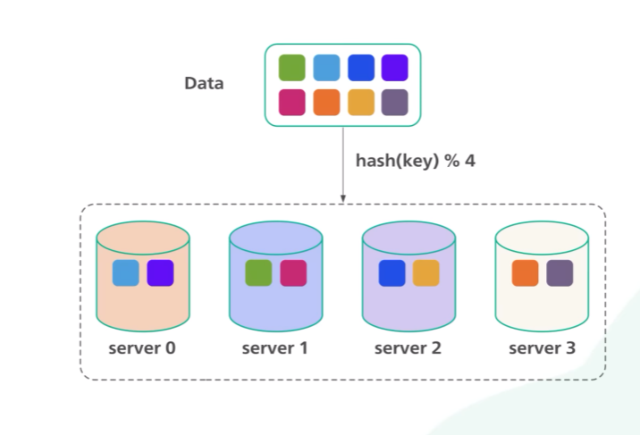

# consistent hashing

Resources:
[https://www.youtube.com/watch?v=UF9Iqmg94tk](https://www.youtube.com/watch?v=UF9Iqmg94tk)
Book: system design interview alex xu.

**Simple hash algo:**

When ever we want handle load on multiple server , we  use load balancer and it uses a hash algorithm to handle that and there are some issue in normal hash algorithm when new server comes or down. So this is the famous hash algorithm which is used in load balancing.

**Basic** **Sample implementation in golang:**

Available on internet but think how can be implement this.

**Disadvantage**

Solution Virtual Node: In real world its having more than 3 find a/c to you , as we grow virtual more its become more balance but also increase overhead. LIke keeping more meta data about virtual nodes deletion, its trade off find you best suited number.

Uses: (Didn’t deep dive how / why)

