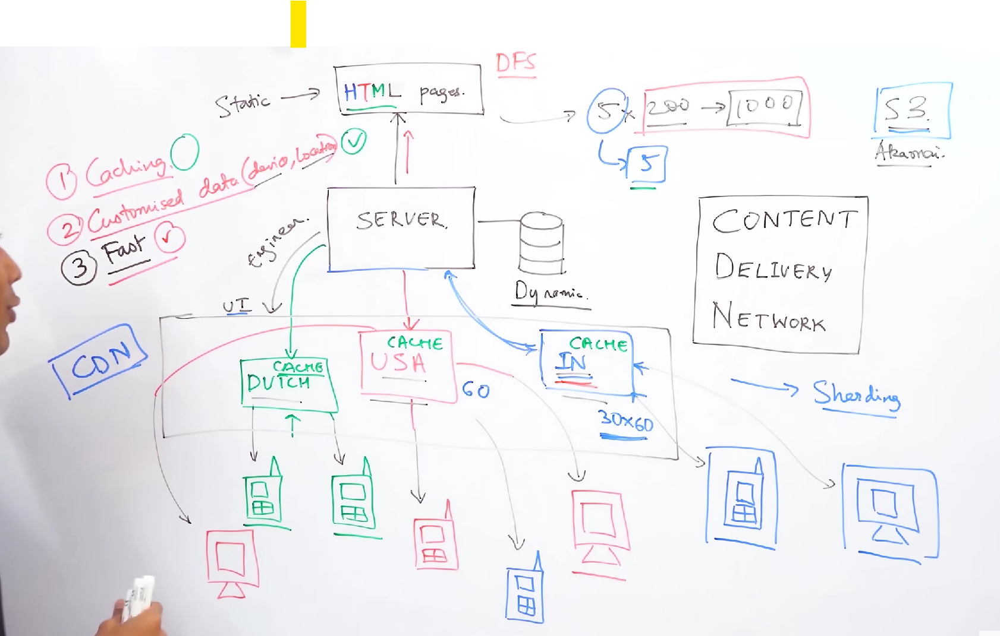
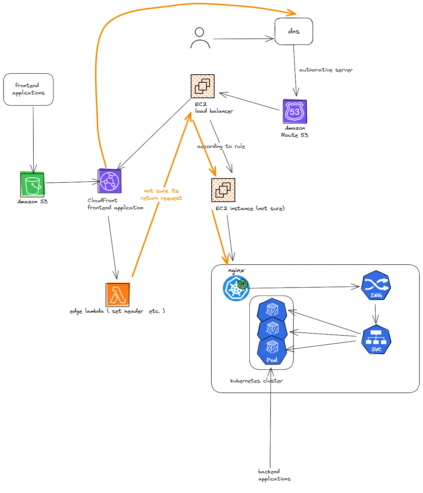

# CDN

Resources: 
[https://www.youtube.com/watch?v=rwBv7FqZ77g](https://www.youtube.com/watch?v=rwBv7FqZ77g)

[https://www.youtube.com/watch?v=8zX0rue2Hic](https://www.youtube.com/watch?v=8zX0rue2Hic)

AWS Cloudfront is a CDN. I didn’t know. Some other Akamai etc.

Mostly server stores all static context as a directory i.e. in the file system. ( such as HTML/CSS/JS, photos, and videos )

**Globally distributed groups of servers that cache static assets for your origin server.**

Approach to implement this:

1. **Pull CDN:**  In Pull CDNs, the cache is updated on-demand when users request content. If the CDN lacks the content, it fetches it from the origin server, stores it, and serves it to the user. This minimizes maintenance and suits high-traffic sites
2. **Push CDN: (Mindtickle or AWS Cloudfront)**: Push CDNs receive new content whenever changes occur on the server. We take full responsibility for providing content and uploading directly to the CDN. Sites with a small amount of traffic or sites with content that isn't often updated work well with push CDN

**AWS CloudFront**

[https://docs.aws.amazon.com/AmazonCloudFront/latest/DeveloperGuide/HowCloudFrontWorks.html](https://docs.aws.amazon.com/AmazonCloudFront/latest/DeveloperGuide/HowCloudFrontWorks.html)

Check how mind tickle works with Cloudfront and s3 to do this. 

(while building we do save the build in s3, and invalidate the CloudFront cache (deleting the current version ))

[https://medium.com/mindful-engineering/today-we-will-learn-about-cloudfront-690bf3a8819a](https://medium.com/mindful-engineering/today-we-will-learn-about-cloudfront-690bf3a8819a)

• If the content is not in that edge location, CloudFront retrieves it from an origin that you’ve defined — such as an Amazon S3 bucket, a MediaPackage channel, or an HTTP server (for example, a web server) that you have identified as the source for the definitive version of your content.

CloudFront speeds up the distribution of your content by routing each user request through the AWS backbone network to the edge location that can best serve your content. Typically, this is a CloudFront edge server that provides the fastest delivery to the viewer.

More detail → doc

**How does It work/fit in flow, I mean when the user hits a request on the browser how does it flow, get to know about CDN, etc?** 

(My guess authoritative server keep cdn IP instead of main server , then its all sorted 🤔, or may be like having multiregion service IP and those  service fetch its near cdn)

### Follow up:
1. aws edge lambda , router 53, api-gateway, elastic load balancer
2. nice playlist on aws: https://www.youtube.com/watch?v=AjlUFYnScBk&list=PL6XT0grm_TfgtwtwUit305qS-HhDvb4du&index=78

[ TO BE 100% VERIFIED ]

