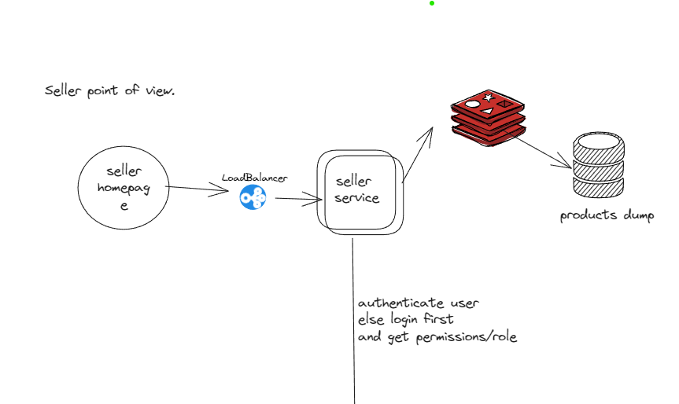
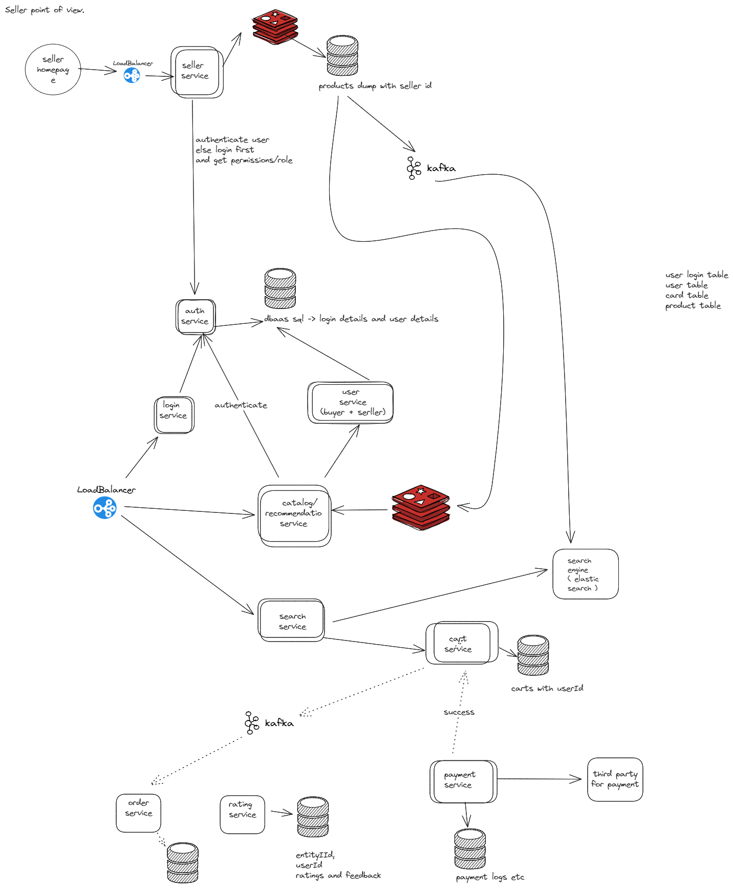

Design the flipkart/amazon

### Functional Requirements

1. Sellers should be able to add, delete and modify products they want to sell.
2. The website should include a catalog of products.
3. Buyers can search products by name, keyword or category.
4. Buyers can add, delete or update items in a cart.
5. Buyers can purchase items in the cart and make payments.
6. Buyers can view their previous orders.
7. Buyers can review and rate purchased products.

### Non-Functional Requirements

1. High availability
2. High consistency
3. Low latency

Since in microservice its like at some place we can prioritise availability and at some place consistency . So its not like whole system have all these quality.

### Capacity Estimation

- Total No of users : 400 Million
- Daily active users ( DAU) : 200 Million/day
- No of users/month : 200 Million * 30 days = 6 Billion/month
- User profile : 200 KB
- Product profile : 500 KB
- No of products on Flipkart: 10000/day
- Total Storage per day for products : 100 * 500 KB = 50 GB 
- Total storage per day for users : 200 Million * 200 KB = 40 TB 
- For next 30 days, Total storage needed for users = 40 TB * 30 = 1.2 PB

### High level design

e-commerce platforms have two sides for the system. If you are a customer of Amazon, you can either be selling products through your own isolated store on Amazon, or you can be buying products available from different sellers

#### Seller point of view

- Add, view,  edit and delete item in the inventory , that is belonging to seller only. He can't do CRUD on other seller items.

#### Buyer point of view

- Catalog/Recommendation of the product for buyer home page.
- Search the product , Search home page.
- CRUD  with card items.
- Purchase item from cart.
- Order history
- ratings and feedback on item.

### Deep dive in design

Reference:
1. https://readmedium.com/en/https:/medium.com/double-pointer/system-design-interview-amazon-flipkart-ebay-or-similar-e-commerce-applications-35a0bc764421
2. https://www.codekarle.com/system-design/Amazon-system-design.html
3. https://readmedium.com/en/https:/medium.com/coders-mojo/day-24-of-system-design-case-studies-series-design-flipkart-42af832b9794

