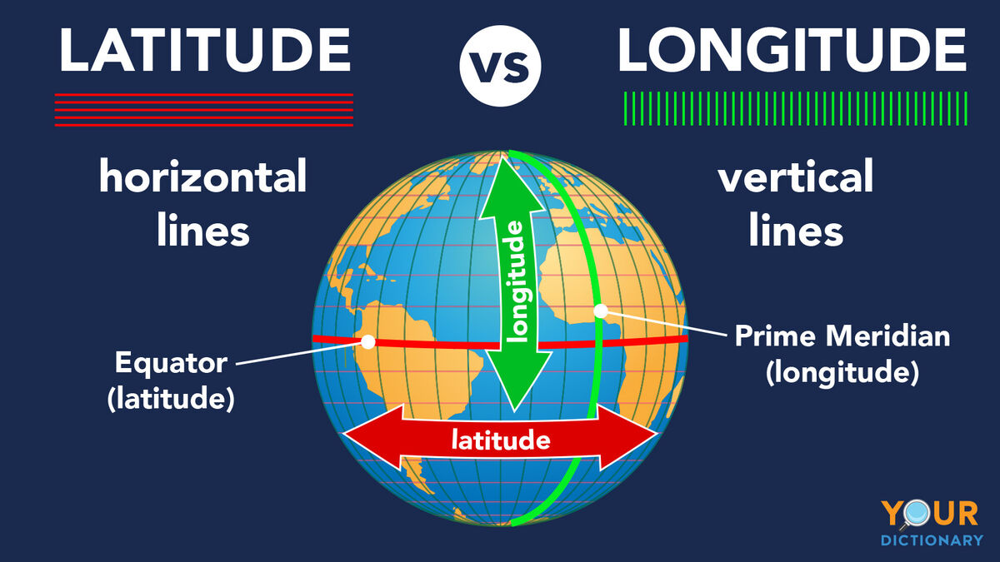
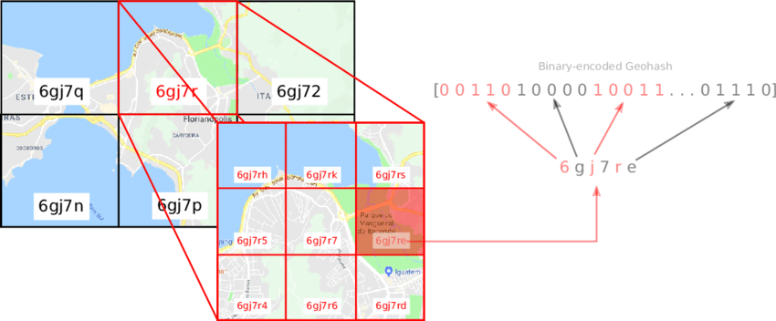
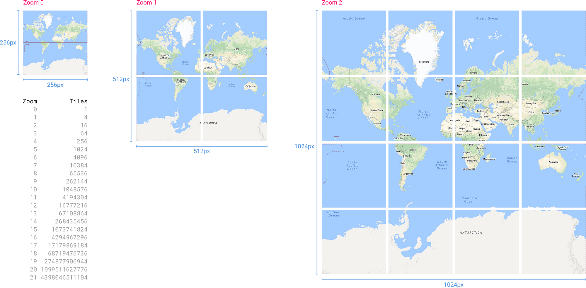
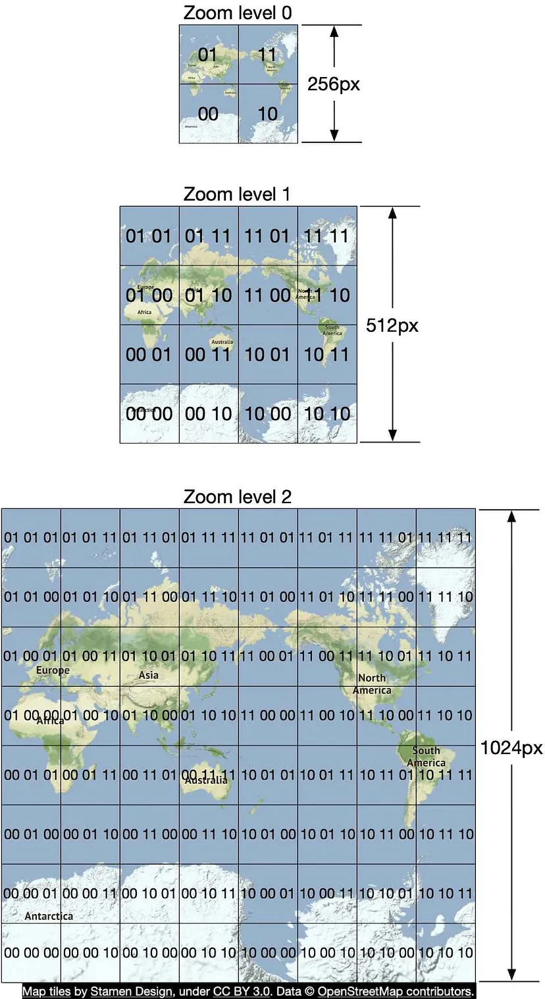
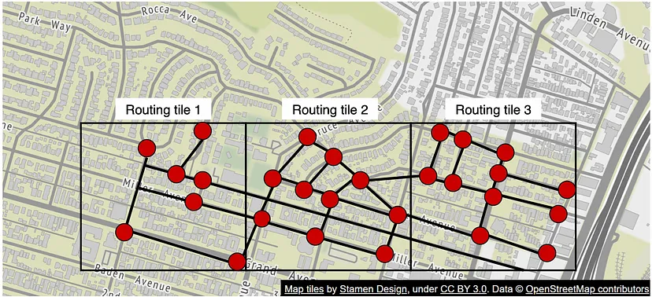
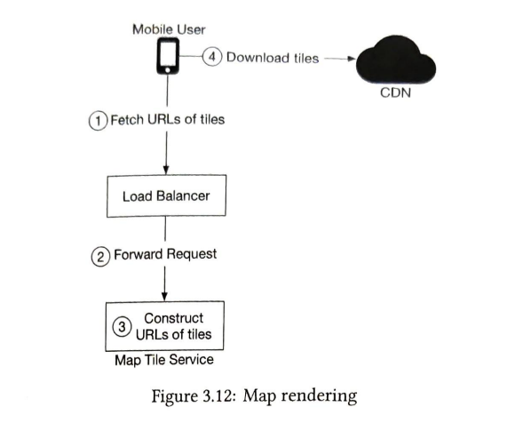
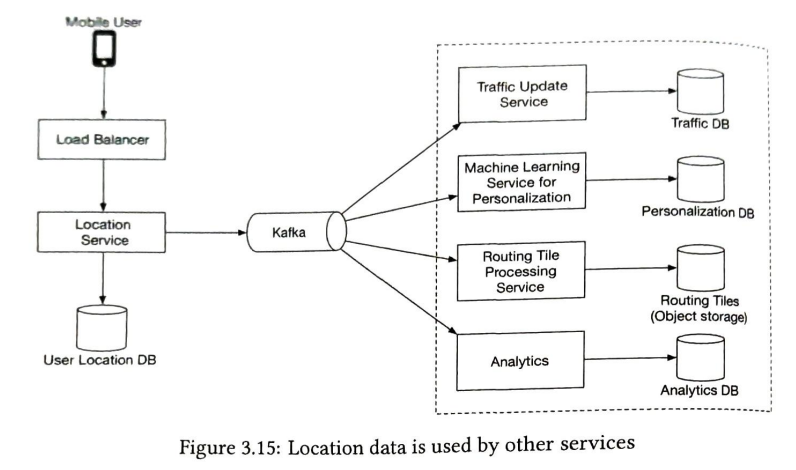
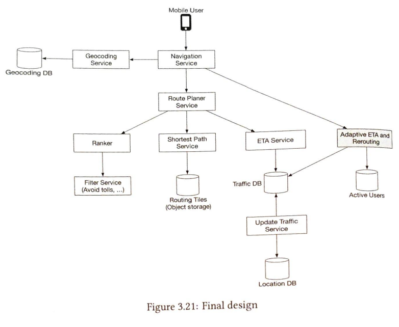

## Design the Google map.

### Functional Requirements

1. Support User location update. ( live location analysis and update in map)
2. navigation service including the ETA. ( find the optimal route, eta from source to destination by distance and time, depending on the type of transportation)
3. Map rendering ( find the particular place )

### Non-functional Requirements

1. Accuracy.
2. General availability and scalability

### Pre-requisite

#### Positioning system
For a particular point in the earth, there is two variable. i.e. 

- Latitute (Lat):    denotes how far north or south we are. 
- Longitude (Long):  denotes how far east or west we are.

#### Going from 3D to 2D

- This process is called **Map Projection**. ( Google Use Web Meracator)

#### Geocoding
- Process to find the lat and long from the address or name.
- Sample E.g.  Manit -> (23,45).

#### Geohashing

- Encode the geographic area into digits and letters.
- Its is recursive mean, on zooming one tile it generate its 4*x.

#### Map Rendering

- Tiling -> We show the tile on the zoom level.
- Let say global there is one tile, if someone zoom it then it shows the tiles which are inside the above zoom level.

#### Road data processing for navigation algorithm

https://medium.com/@sidgangs99/developing-google-maps-3c3320a365d

- For finding the optimal path algorithm A* or dijkstra variations can be used.
- Important part is how are we doing. Since these works on graph i.e. node and edges. Node denoting the location and edges denoting road.
- Denoting whole world like this would be inefficient take too memory and wouldn't be good for these algorithm.
- That's why we have Routing tiles. Same like Map rendering tiles. It is also mantained on the zoom level. Each zoom level have differnt route. like More upper only connecting highways or state, then district ...etc
- These tile have its graph inside. and these tile connected to zoom level.
- Means images like zoom 1 tile -> itself a graph.
- and zoom 2 which is made of zoom2 . That's how reach from zoom1 graph to high level.

### Capacity Estimation

- Storage: this can be calculated with total no. of tiles ( already shown in above pic ) and its image size.
- Optimization: 80-90% area are natural these images can be compressed . So can consider only 30% of total.
- Assume 1 billions DAU use 30 minutes map per week. or 5 billion minutes / day 
- Assume 1 request per second for live location from client.
- then 5*60 -> 300 billions request per day.
- 3 million / second.
- But we can optimize it since its not compulsory to send live location per second , we can batch on client side and sent. Assume 15 second perrequest.
- 200000 request/second -> PQPS *5 -> 1 million QPS.

### High level design

1. Location Service:
- That get the user live location and store in db for the future reference and usecase . ( Useful in analysis and get to know user live location )
- We the user location in batch from the client.
- Database: High write and scalable -> nosql or coloum  -> cassandra.
- Protocol: Http POST request.

2. Navigation Service:
- Take the source and destination location and return the routing data on that zoom level. (Reroute and ETA in deep dive.)

3. Map Rendering:

- For showing the data on the particular zoom level, we send the map tiles.
- Option 1: Server tell on the fly. Bad data is huge and static no caching .
- Option 2: CDN , we already send the pre generated tiles to the CDN and then client use it. Since each map tile have its unique string.
- For getting the url of the CDN for map tiles , we can introduce another service , that will take the lat and long with the zoom level and tell the map render tiles and also the other surrounding 8 tiles.
- Then client with these url can get the tiles.

### Deep dive in

#### Location Service ( capture the user live location ):

Let's discuss the database of location service. As we discussed already database can be cassandra because of our usecase.

Let's see how's user model can be. User id can be primary key. This will help to get the user live location efficiently.

Now this location service will send the events in kafka , so that other service can get the live location and do their operations like traffic update service, ML service , analytics etc.

#### Map rendering
(When user opens map application , to showcase + when user zoom or shift the map around at that particular zoom . We fetch new images or tiles.)

Since this data is huge can't be storable in any database.

For this we can use the object storage like S3 which have images of the tiles at each zoom level and also CDN  backed by this S3.

There can be async job which will update this . Since after some time we might get more coordinates or updated map etc. That will eventually update the CDN tiles.

Further optimization: Use vector tiles. [ Check Separately ]

#### Navigation Service:
(To get the optimal route from source to destination to the user)

#### Geo Coding service 
(help to find the coordinate with address): Its database can be simple cache with supporting database ( This is static might be updated on async).

Data model : (Place text) : (lat,long) in redis and db.

#### Route Planer 

This the service which take the source and destination coordinates and the routes between them.

This eventually call the Ranker, Shortest Path and ETA service to get all these information and send back to client.

#### Shortest Path Service:

This is the main service , which find out the top k shorted path from source to destination without consider other factors like traffic or etc. Its tell out of all possible valid routes.

It has its own database which is Routing Db.  Since this data is kind of static. This can also be cache according to the routing tile key.

Since the routing tile data is not complete processed for the shortest path algorithm to works. Since we get a lot of road data sets.
For solving this **routing tiling processing service** is used. This is run offline and put the processed tiles to object storage i.e S3.
This also update the new data in s3.

Overview of algorithm:

1. The algorithm receives the origin and destination in lat and long , then its changes into the geohashing and run the algorithm.
2. [Not clear much about this]Algorithm start from the origin tile and fine the shortest paths within that tile, then find fetch other routing tiles on high zoom level or around.

#### ETA service:

- After getting data from the shortest path service, this service is used to get the time in each path with the consideration of other factors like traffic etc.
- This service can be used to get ML service to predict the approx. time with factor considerations.

#### Ranker Service:

- This service received the path with their ETA.
- This service with the help of factor given the user, sort these data in top k and return to the client.

#### ETA service optimisation for adaptive ETA and rerouting

- For this to be possible , we need to get the consideration of current live user locations and traffic situation and update it .
- That's why there is another service which will take into all these active or live situation and update the traffic db which will eventually update and tell the client.
- Client can be in websocket connect with these.
- [ Take this up separately how to do this.]

#### References:

1. Alex xu system design vol 2
2. https://blog.bytebytego.com/p/design-google-maps

#### Doubts:
1. Not able to get the routing working on routing tiles. Deep dive more on it.
2. what data base for storing routing data ?