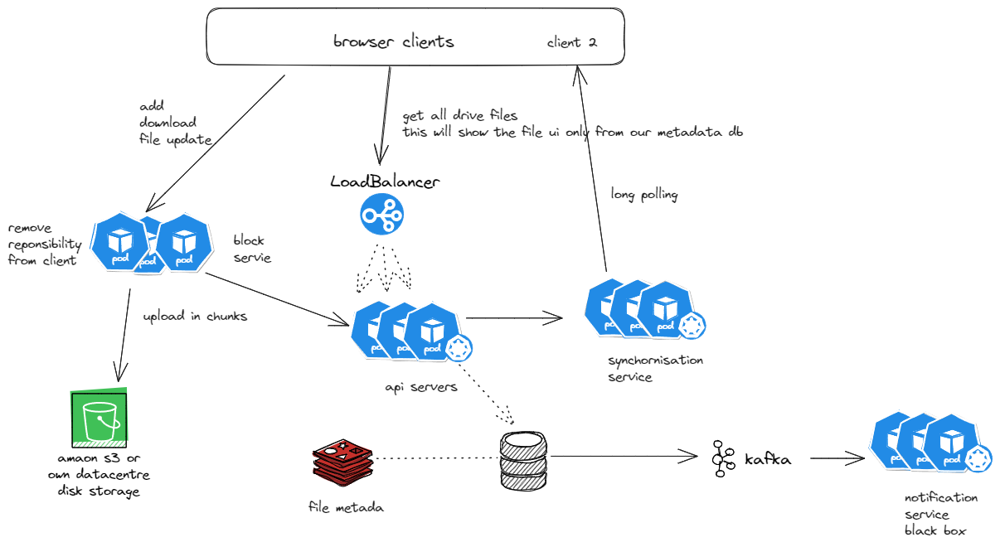
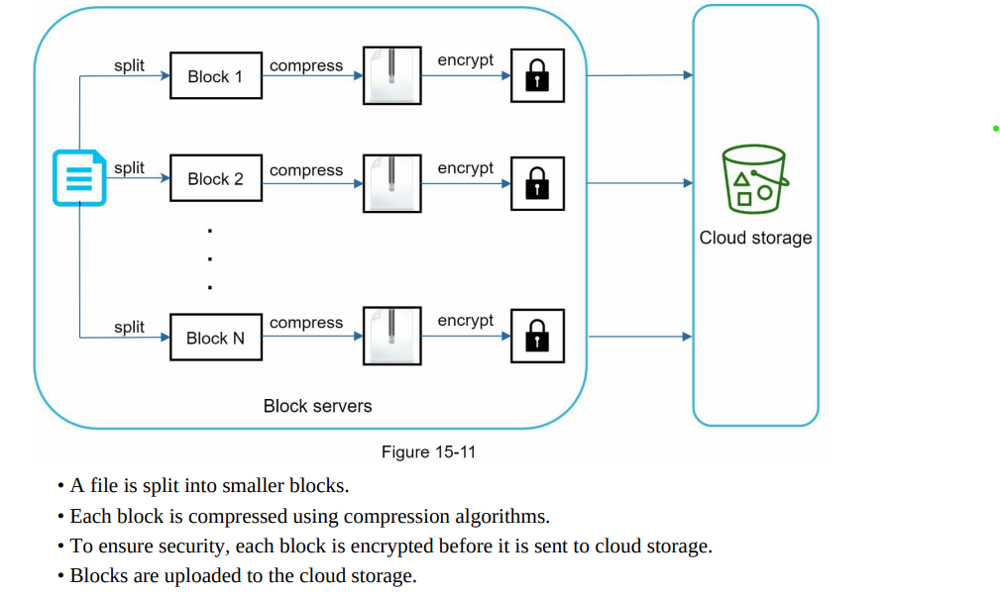
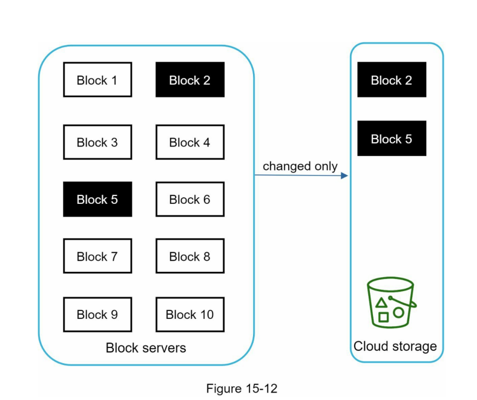
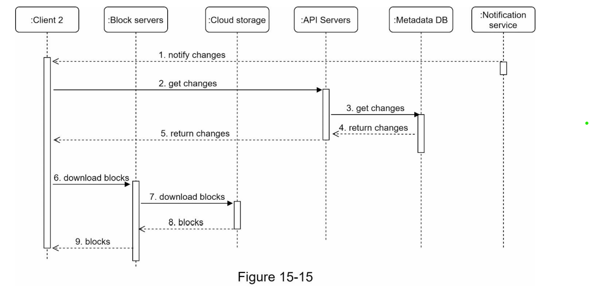
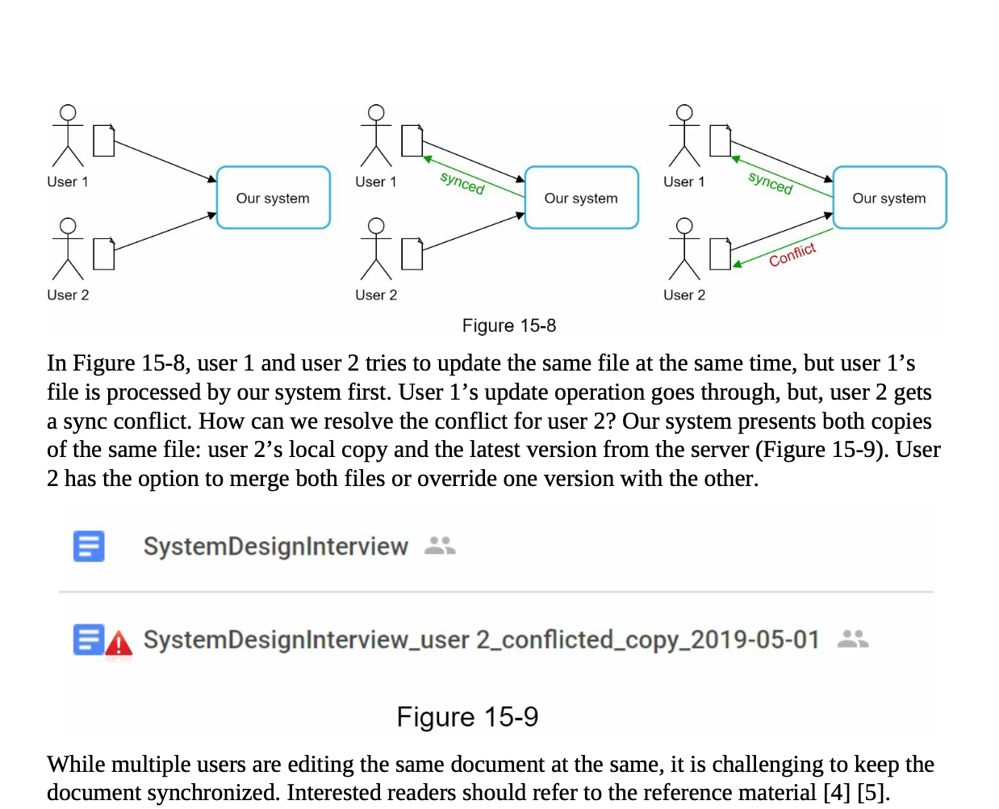
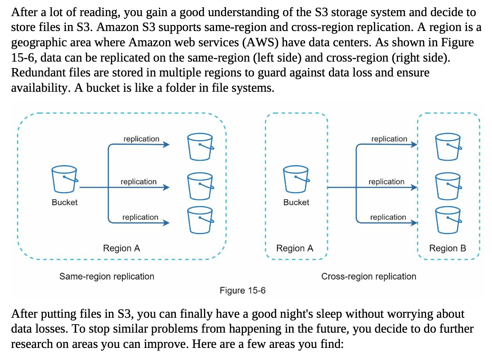

###  source of truth -> book , repo goolge-drive-mvp and This is
Design the google-drive: Its kinda same of youtube once. But here we don't need transcoding but yes need chunking.

### Functional Requirements
1. Add and download files. 
2. Sync on all device.
3. See file revision.
5. Send notification when a file is edited, deleted and shared to you.

### Non-functional Requirements
1. Reliability : data shouldn't be lost.
2. Fast sync speed
3. Scalability and high availability.

### Capacity Estimations
1. Assume 50M sign up and upto 10M DAU.
2. User gets 10 GB free space.
3. User upload 2 files perday. The average file size is 500Kb.
4. 1:1 read to write ratio.
5. Total storage allocated = 50 M * 10GB => 500 * 10^12 -> 500 PB
6. QPS  = 10M * 2 / 10^5 = 200 request/second.
7. Peak QPS = 400 request/second.

### Entities
- User, file, fileversion, filechunk..

### Api Design:

- See that mvp project, chunkupload, finalupload, download, listversion... Or Book.

### Db schema

- later part after chunking

### High level design

Let check functional requirement one by one.

1. Add/download the files.
Check the googl-drive-mcp, bascially from client we will chunk the local big file and it will be send to block server chunk by chunk, current implementation send by https, there might be better way lke on side streaming by as of now lets take this as solution.  similary download instead of client server do chunking and send.
2. notification service -> already discussed. We will send the event to kafka once related entry in out metadata base.
3. Version: Best thing is that we are having chunks of file. So when version upgrade. It means there might be possible not all chunks are save only some chunks are update in this case storage would be saved. Can see mvp, but basically client will have hash and it will see which go updated by finding hash  and send that only. 
4. Sync on all device:  Instead of async use sync update of metadata ( baiscally calling a new synchonisation service). use sql db in metadata. We can also use synchronisation server to send updated file to other client with long polling / SSE. Its kind of same in whatsapp. ( when user open google drive, we send request to stablish SSE connection and any change , we will get popup to refresh the page or can also send meta directly and just tell with some info popup)

### Deep dive high level design ( how of each thing )

1. Block Server:
   1. Split file in chunks and then save it. 
   2. Delta change in case of update/edit file. ( in below photo block 2 and 5 are only changes )
      
      
   3. Let me simplify flow. 
      - Possible solutions ( upload and update , both)
         - block server do all thing,
         - at add -> client send whole file to block server ( like old  mvp), then it will do chunking ( Dropbox as a reference: it sets the maximal size of a block to 4MB [6]. ) and compression and enrcrypt and upload to s3.
         - at final call it will send all metadata details about chunk and all to metadatadb.
         - at case of upload do same, but block server do chunking and its hashiing compare to previous and add only new. (there wuld be some library as well for this.)
         - cons: high network bandwidth between client and block server
         - now client do chunk and hashing and send the block server, it will just encrypt and compress and upload to s3.
         - in case of upload, it will have file meta previous one, now client will have to do same chunking and hashing and it will compare and only send the changed one.
         - server just compre and encrypt and upload that chunk only and send messateg to metadata db.
         - cons: client have to do that processing.
         - as every one says system design is tradeoffs :)
         - If minimizing bandwidth between the client and the block server is a top priority—particularly in environments with limited or expensive connectivity—then it's advantageous to move delta sync logic to the client side.
            - Mobile apps with users on cellular networks.
            - Remote field devices with satellite or slow uplinks.
            - Enterprise laptops syncing over VPN with bandwidth quotas.
         - second one works well on low-power devices or in web browsers, where doing complex processing is hard. All the smart logic stays on the server, so it’s easier to fix or update without touching the clients. For this can go with second one.
   4. Download flow is simple server send chunk by chunk broser and client gather and save to local path. mvp
      
2. Synchornisation Server and Conflict resolution:
   - as said it would be conect with client with sse, 
   - as soon as meta update it will send response to client and popu info.
   - what if we conflict ? same time upload new version
      - use LWW, and for other person send message already file uploaded , tell replace or let it be or upload new.
      - each new version will have previous version.
      
3. Metadata DB:
   1.  
5. High consistency:
   1. User shouldn't see different version on different system.
   2. We want strong consistency , then we can use the sql database for metadata.  Instead of nosql which are based on eventual consistency. Now all metadata update will be done by transactions.
6. Scaling each and why s3.
   1. api server statless
   2. block server -> stickly load balancing , horizontal.
   3. api server -> userId
   4. storage -> s3
      -  Easily handles millions of small or large file blocks.
      -  99.999999999% durability with multi-AZ replication.
      – Ideal for delta sync using multipart upload or versioning.
      – Pay-as-you-go with multiple storage tiers (Standard, IA, Glacier).
      – Supports encryption, IAM roles, and fine-grained access control.
      – Fast access and delivery with CloudFront integration.
      – Works seamlessly with EC2, Lambda, Athena, etc.
   
7. Notification service: Already discussed.
8. Failure cases: 
   - Download failure -> np, we can maintain the local storage for some time, user retry it will upload from that offset or chunk sequence number for that file. 
   - Upload failure -> no way retry until whole file upload to server. 
   - in another case we can same maintain the uploaded meta and retry.
   - sync communication -> retry with exponential backofff. + send to kafka there will be reconsillation that will take care of it but will have hit of eventual consistency. 
   - s3 replicated to multiple region.
   - db -> master replica and also sharded .
9. what about the answer of large doc upload very frequently ? or big excel etc 
   - hmm, not 100% sure, but mostly via OT, its just series of operations, we can batch and then update it ( event sorucing visit google doc) or you explicity save it and while doing so user doesn't explicity do save since its collaborative and eventually save it. with that collaboratife feel we can handle this. some file there is not possile this we are arleady doing the chunking upload only. basically user client on doc/excel in google drive, it will redirect to their specific app or native app -> they change their native format and do collaboratin and reduce save frequency. 

Latest Flow: (assume taking second way)
- user click on button to upload
- client send that to backend,
- block chunk it , compress it, hash it, encrypt it and upload to s3.
- after upload done. send message to metadata upload.
- call directly and also send in kafka for 100% 
- in case off download as i told already. 
- update -> server take hit and take care. 

References:

1. https://www.linkedin.com/pulse/google-drive-design-saral-saxena/
2. https://www.pankajtanwar.in/blog/system-design-how-to-design-google-drive-dropbox-a-cloud-file-storage-service
3. Alex xu volume 1.

Curious Doubts [ WIP ]:

1. What does chunking file means ?
- With chunk upload, the file is divided into smaller parts that can be uploaded in parallel or sequentially.
- Receiver might concatenate, else it can also store in chunks, at the time of fetch again we can fetch these chunks paralley or sequencially.
- Sample golang code: mvp in gitub
- Everything internally is a binary. no going deepdive in this, mostly will be a libraray to do so.

