( this and book is source of truth, https://www.hellointerview.com/learn/system-design/problem-breakdowns/ticketmaster )

Interesting fact: in book my show crash for cold play it was ~13M concurrent users. 

## Design Hotel management system. 
Same others similar can be done like Airbnb, flight reservation, movie ticket booking etc.


### Functional Requirements
1. Show the hotel related page.
2. Show the hotel room-related details page.
3. Reserve a room.
4. Admin Panel update/add/delete the hotel or room information.
5. Support overbooking feature. ( We allow 10% overbooking,this is used in reservation system by anticipating that some people will cancel the reservations.)

### Non-functional Requirements

1. High concurrent: There might be some events high concurrent request.
2. Latency can be moderate.

### Capacity Estimation

- 5000 hotels and 1 millions rooms in total.
- Assume 70% are occupied and for 3 days average.
- daily reservation = 1 million * .7 / 3 => 240k -> ~3 per second
- 3 QPS is not much high for reservation.

### High level design

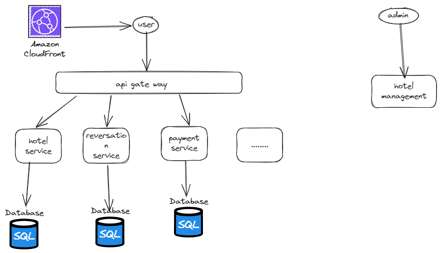

On a high level since we are not considering the search with multiple filter or by name . so it would be like of normal micro servers and database.

#### Api design 

Note: Most of the api are correct, last one reservationId ( take it as idempotencyKey because we will generate different reservationId) you can assume its like for each checkout client generate token with help of server for each booking.

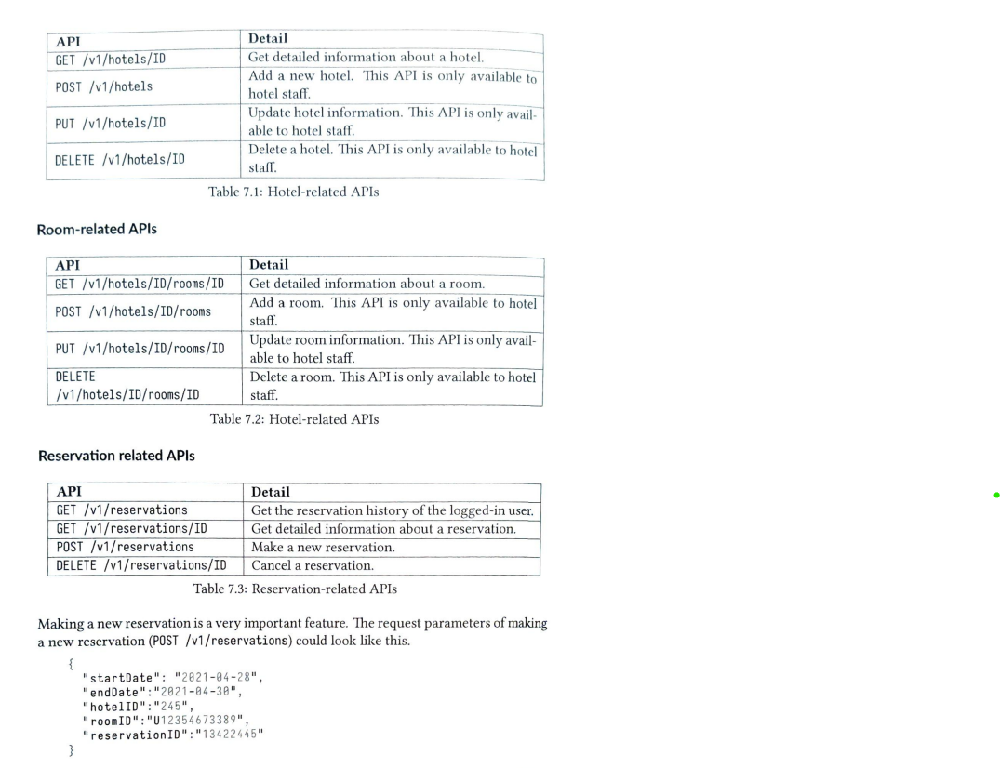
#### Database

Favourable Database for this case -> MYSQL

- It's a read heavy system and mysql good in read-heavy system .
- In case of reservation we need ACID properties and transactions etc.
- We have already structured.

#### Data model 
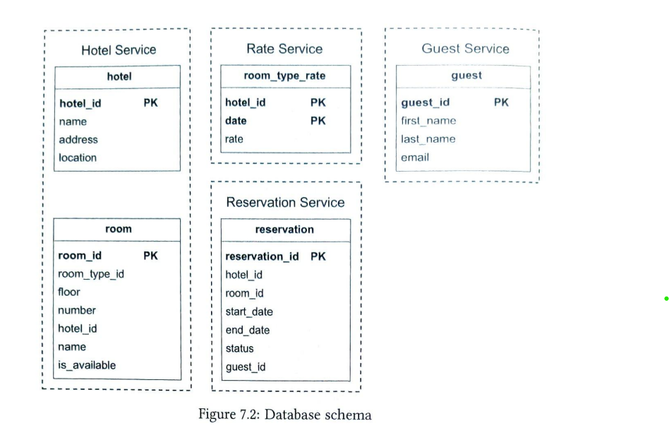

Status can be Pending, cancelled, Paid, Refunded or Rejected.

Issue: in hotel reservation system , we have room type instead of exact room that we get at the time of hotel visit. room type like standard room, king size etc.

### Deep dive design

#### Improved data models

As already discussed the issue in previous model .Now we can have another table which have information about the room_type and reservation will have information about the room type.

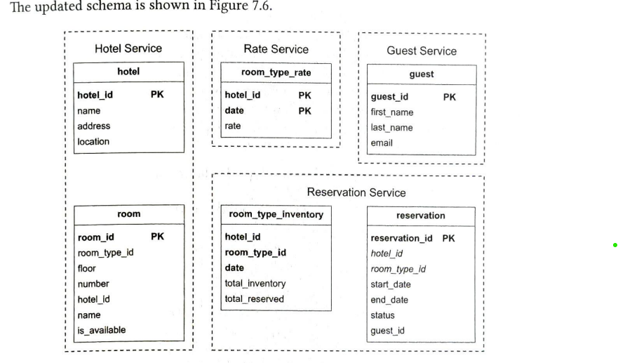
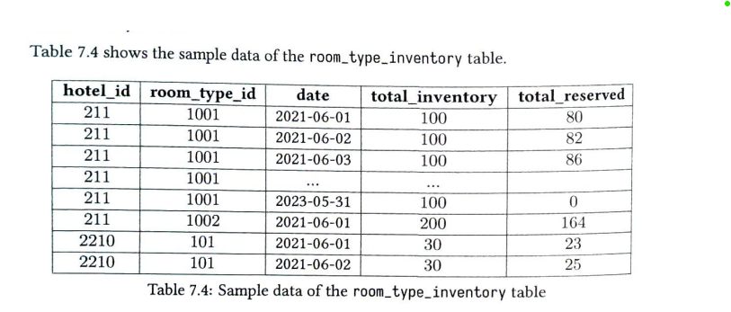

10% overbooking condition can be checked at the time of query condition like

```sql
if (( total_reserved + ${numberOfRoomsToReverse})) <= 110% of total_inventory
```

Optimisation: This table be big, so we can only focus on current and some future data ( that is filled up by a job). or database sharding.


#### Above db scheme, lets assume we have one more table reservation_session ( basically a unique id for each booking try and that will be send as idempotency key at time of actual booking, but bookingid will be different see below). Also it has not timer, now moder solution uses few minutes timer for lock that in case of less traffic

```
reservation_session -> id(send to client initially), reservationid (initially null, mean not used this session yet), sessionId (general login sesoin), createdTime, userId, expiration ( user redirect to starting let say 30mins)

reservation -> id (not given by UI), hotelid, roomtype, start, end, status, expirationTime (10 mins)

payment -> id, reservationId ( actual ), price, creationtime, status ..... 
```


#### Concurrency Issues

1. The same user click twice on book button.

   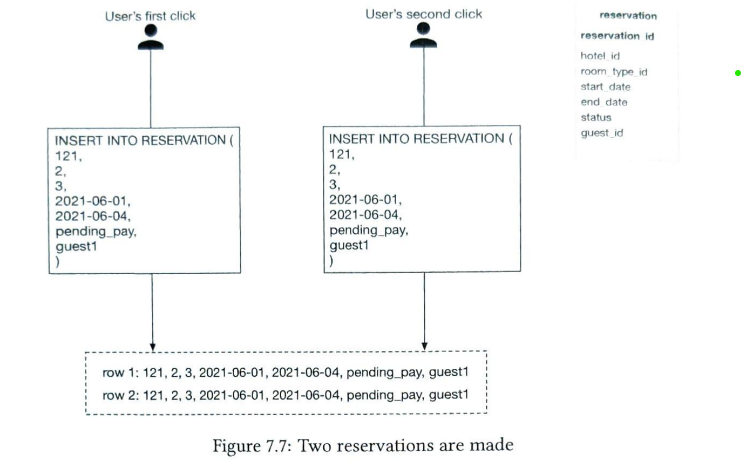
    
Solutions:
1. Client side checking -> disable button after once clicked . ( Not perfect solution ).
2. Make api idempotent -> user reservation session key as a idempotency key and validate with it.


2. The more than one user trying to book the same rooms.
   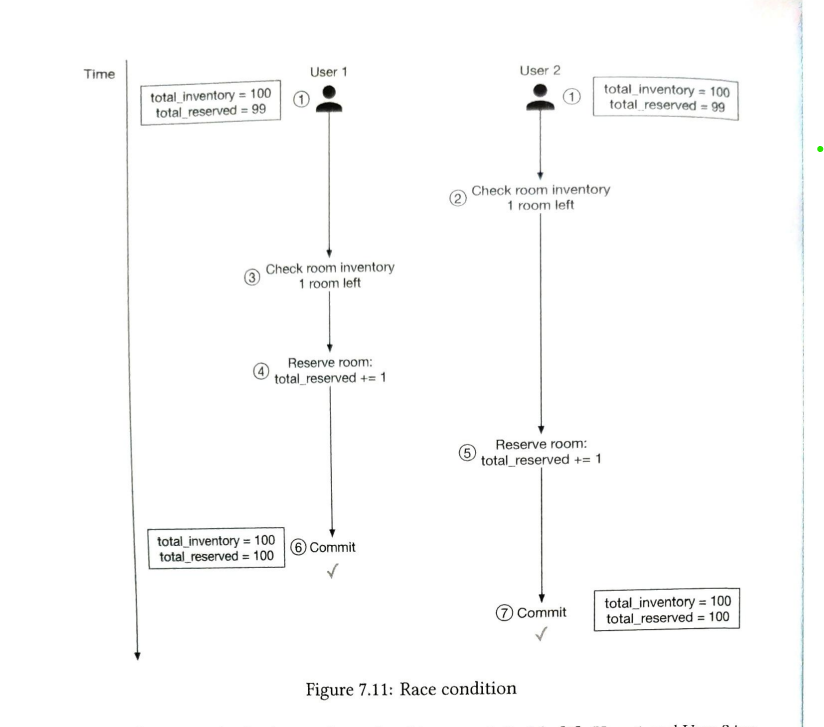
    


1. Pessimistic Locking: 
- Block other transaction when one is happening.

Pros:
- Easy to implement. Good when high data contention.
Cons:
- Performance issue, blocking other requests.

2. Optimistic Locking:
- Allow concurrent users. Implemented with versions and timestamp column in database.
- Only write when initial and final version are same.

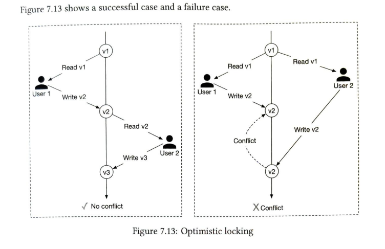

Pros:
- Faster than pessimistic. Use when data contention is low and conflicts are rare. 
Cons:
- Still user experience bad and performance , since if we see we are trying concurrent but ending up a only multiple transactions.

3. Database constraints:

- Put query in transactions and at the end use the constraint check whether it's not negative.
- **[Note]**: For this room inventory table and reservation table should be in same database.

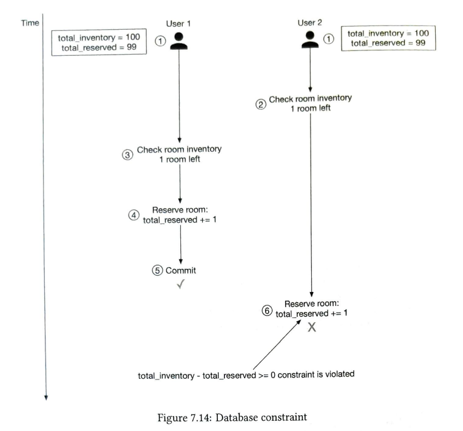

Pros:
- Easy to implement and support minimal data contention
Cons:
- Still user experience bad and performance , since if we see we are trying concurrent but ending up a only multiple transactions.
- All databases might not have this feature.


4.  [IMP MODERN SOLUTION in repo]Visit this hands on repo: https://github.com/manvirag?tab=repositories 
   - other solution, status + timeout , redis distributed lock with ttl.
   - for extremely popular events, they use virtual waiting queue. ( this usually start few minutes before event and also continue at live sales)
   -  How
      - on UI people come and they see queue and how many people ahead of them.
      - once their turns come, they redirect to normal booking page and start processing. ( on backend would be allowing concurrent as per system limits and other would be in queue as FIFO way. ) 
      - How can we implement this. 
         - user send request to server as usual
         - backend server , as of now assume maintain the lag or queue size how -> later ( that is size of sorted set ), it checks if empty and redirect to as usual, else redirec to queue page.
         - now it will queue api, 
         - push that userid, timestampe , in redis sorted set. 
         ```
            ZADD event_queue:concert_2025 1620000010 user_123
         ```
         - 13M -> 30b -> 400MB cool.
         - also create sessionId with status. ( we can maintain the aof and master-replica etc to handle redis worst case, yes its possilbe in very worst case we can miss few folk, verify rarely, like which are in redis but unable to save in aof, and also in replica.)
         - session ttl has good number like 1hour, 30-mins and famous show event book very early, so user logout, refresh , new table it will be in queue. 
         
         ```
               HSET session:{session_id} status in_queue
               HSET session:{session_id} event_id event_id
               HSET session:{session_id} user_id user_id
               HSET session:{session_id} created_at timestamp
               HSET session:{session_id} expires_at (timestamp + TTL)
         ```
         - there would be worker received those events, that will pull the some set of user ( as per timestampe , yes possible to pull in logn from sorted set.) from redis and assign some token and also save this in redis and update session status to started from in queue.

         ```
            HSET session:{session_id} status ready
            HSET session:{session_id} token booking_token_abc
            HSET session:{session_id} expires_at (new TTL, e.g., 10 min)
         ```
         - and notificy user at their time with timeout, and user redirect to booking page and have ttl for 5-10 mins, they book or drop on basis of it update the session status or delete so that can try again. ( here db status will also be updated, its like normal scene )
         - interesting things is that ,  we  have limit search let say even if its 1 lakh, its less or if people are enthusiast not timepassing first 2-3 lakh would end up all tickets.  so actualy db operatoin will be less it was only concurrency
         - once payment done, mark tha session. 
         - one all seat filled we can clean the data for that event. 
         - it is done for very popular event. 
         


#### Scaling the system

What if we have lots of QPS ?

- Database sharding:

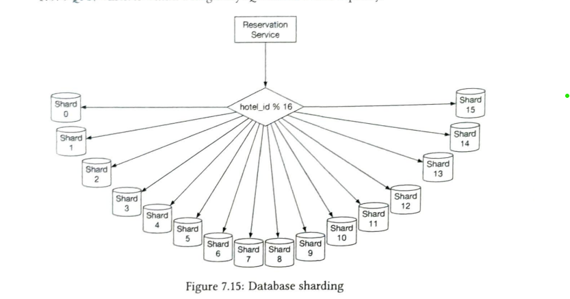

- Caching in services 

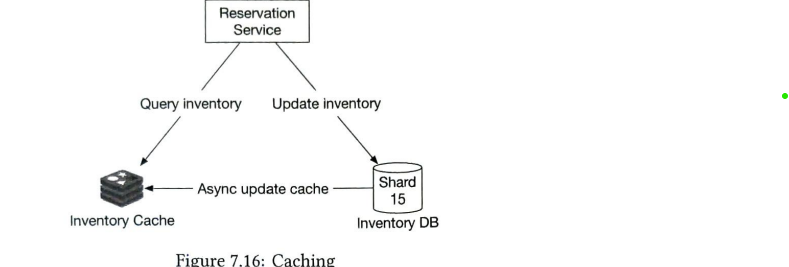

Caching consistency issue, but its okk at the end request will fail in transaction and after user will refresh the page he/she will see the updated data .

#### Resolving data inconsistencies in the microservice architecture.

What if we don't have comman database for inventory and reservation ? 

Solution: Use distributed transaction 
- rollback on node level.
- suppose two node in transaction if any fail, both node will be rollbacked.
- Protocol : 2 Phase Commit [ Check it separately ]

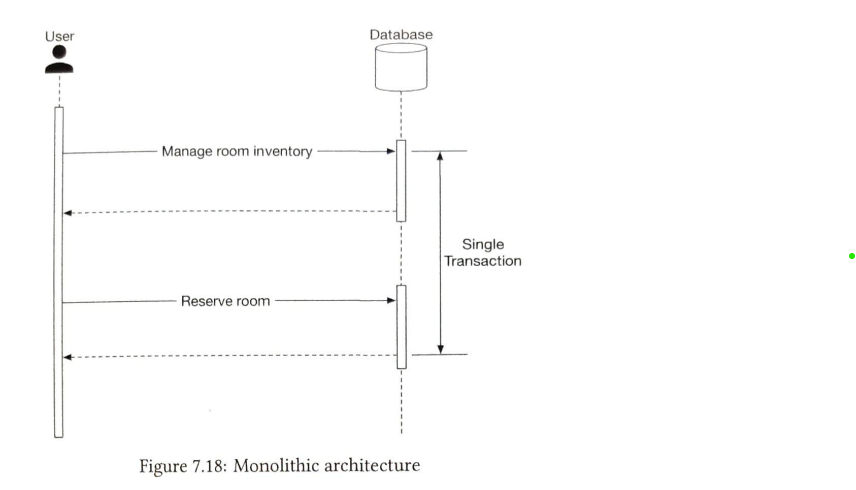
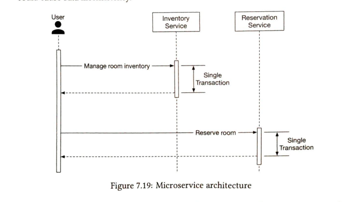


#### References
1. System design alex xu volume 2.


#### Latest Summary: 

- Lets assume its MMT 
- UI 
   - it showing list of hotel
   - start to end date
   - select hotel -> select room type
   - select count 
   - enter details 
   - book the hotel. ( payment can do later , like 2 days before start date )
   - hotel is booked
   - payment pending status. 
-  Backend
   - db -> hotel, hotel_room_type, room_inventory (date, total, reserved), booking, booking_session.
   - search hotel with date range area etc.
   - show list 
   - client hotel for booking
   - select room type, and count.
   - assume there is button for start booking
   - click -> create booking_session with reservationId as null now.
   - client got the unique id for this checkout. 
   - user enter email and other details.
   - click on book and start payment button.
   - now -> backend 
      - create reservation entry with timer of 10 minutes.
      - upate that booking session.
      - lock the room for time range and reduce them for other users.
      - return the reservationId ( actual )
   - user seelct up paymentn way and done payment with the reservationId.
      - out backend received payment status with reversation id.
      - we mark it as success or fail. 
   - user after payment redirect to success page or
   - redirect to again hotel searches result.
   - it will retry to checkout and generate new token.
   - user click twice we will first see is this token taken or not if yes return error. 
   - there might be possibility that it is taken and booking failed.
   