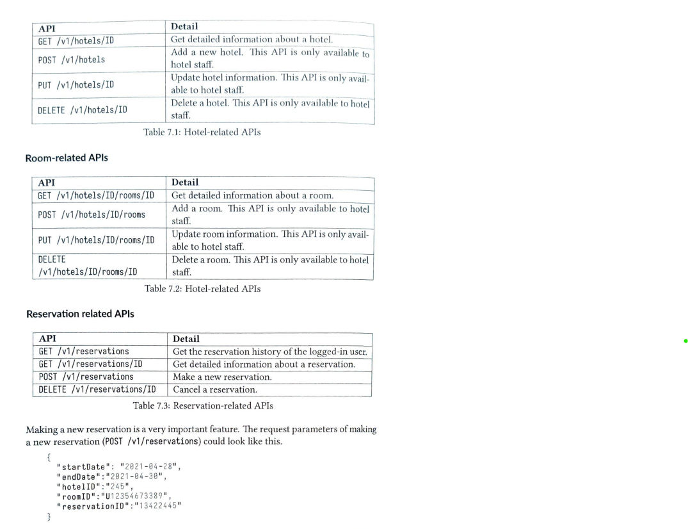
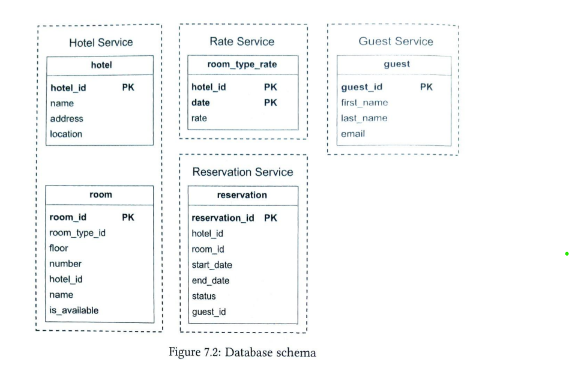
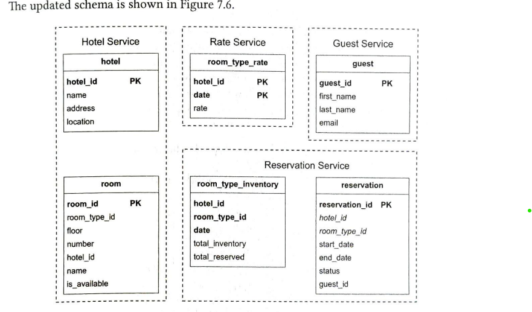
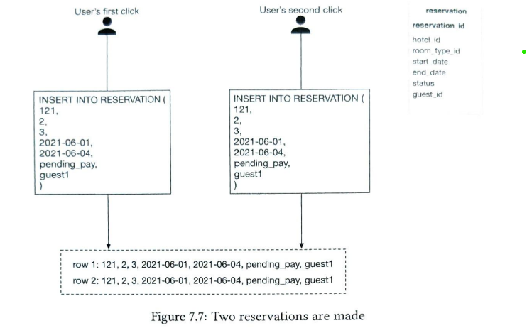
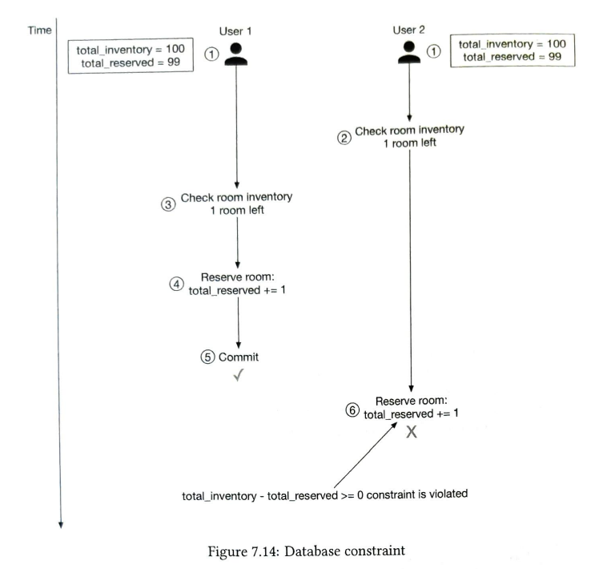
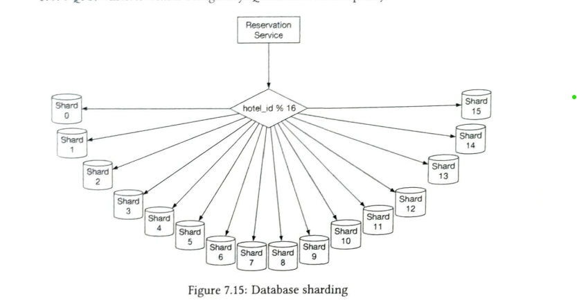
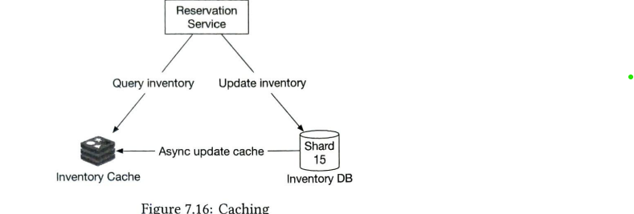
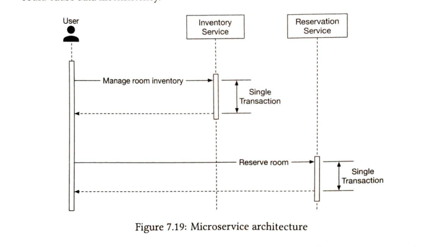

## Design Hotel management system. 
Same others similar can be done like Airbnb, flight reservation, movie ticket booking etc.


### Functional Requirements
1. Show the hotel related page.
2. Show the hotel room-related details page.
3. Reserve a room.
4. Admin Panel update/add/delete the hotel or room information.
5. Support overbooking feature. ( We allow 10% overbooking,this is used in reservation system by anticipating that some people will cancel the reservations.)

### Non-functional Requirements

1. High concurrent: There might be some events high concurrent request.
2. Latency can be moderate.

### Capacity Estimation

- 5000 hotels and 1 millions rooms in total.
- Assume 70% are occupied and for 3 days average.
- daily reservation = 1 million * .7 / 3 => 240k -> ~3 per second
- 3 QPS is not much high for reservation.

### High level design


On a high level since we are not considering the search with multiple filter or by name . so it would be like of normal micro servers and database.

#### Api design


#### Database

Favourable Database for this case -> MYSQL

- It's a read heavy system and mysql good in read-heavy system .
- In case of reservation we need ACID properties and transactions etc.
- We have already structured.

#### Data model



Status can be Pending, cancelled, Paid, Refunded or Rejected.

Issue: in hotel reservation system , we have room type instead of exact room that we get at the time of hotel visit. room type like standard room, king size etc.

### Deep dive design

#### Improved data models

As already discussed the issue in previous model .Now we can have another table which have information about the room_type and reservation will have information about the room type.




10% overbooking condition can be checked at the time of query condition like

```sql
if (( total_reserved + ${numberOfRoomsToReverse})) <= 110% of total_inventory
```

Optimisation: This table be big, so we can only focus on current and some future data ( that is filled up by a job). or database sharding.

#### Concurrency Issues

1. The same user click twice on book button.

   
    
Solutions:
1. Client side checking -> disable button after once clicked . ( Not perfect solution ).
2. Make api idempotent -> user reservation key or any other global unique key as a idempotency key and validate with it.


2. The more than one user trying to book the same rooms.
   
    
Solutions:

1. Pessimistic Locking:
- Block other transaction when one is happening.

Pros:
- Easy to implement. Good when high data contention.
Cons:
- Performance issue, blocking other requests.

2. Optimistic Locking:
- Allow concurrent users. Implemented with versions and timestamp column in database.
- Only write when initial and final version are same.


Pros:
- Faster than pessimistic. Use when data contention is low and conflicts are rare. 
Cons:
- Still user experience bad and performance , since if we see we are trying concurrent but ending up a only multiple transactions.

3. Database constraints:

- Put query in transactions and at the end use the constraint check whether it's not negative.
- **[Note]**: For this room inventory table and reservation table should be in same database.



Pros:
- Easy to implement and support minimal data contention
Cons:
- Still user experience bad and performance , since if we see we are trying concurrent but ending up a only multiple transactions.
- All databases might not have this feature.


#### Scaling the system

What if we have lots of QPS ?

- Database sharding:



- Caching in services 



Caching consistency issue, but its okk at the end request will fail in transaction and after user will refresh the page he/she will see the updated data .

#### Resolving data inconsistencies in the microservice architecture.

What if we don't have comman database for inventory and reservation ? 

Solution: Use distributed transaction 
- rollback on node level.
- suppose two node in transaction if any fail, both node will be rollbacked.
- Protocol : 2 Phase Commit [ Check it separately ]





#### References
1. System design alex xu volume 2.


