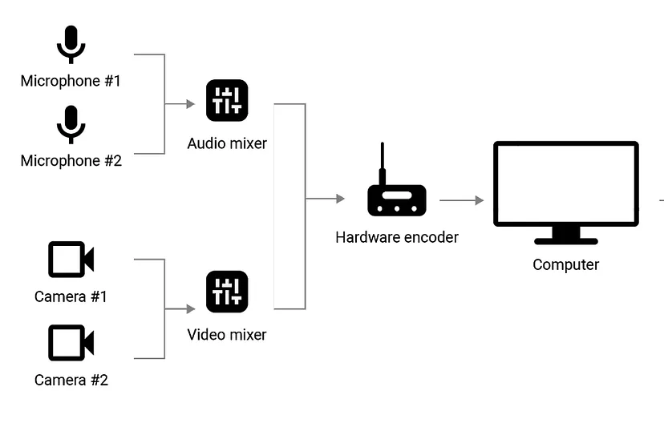
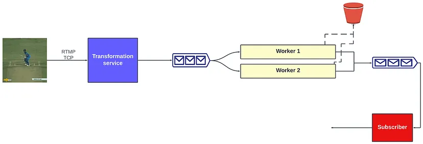
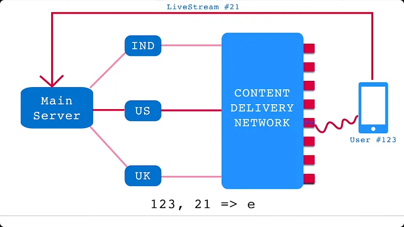
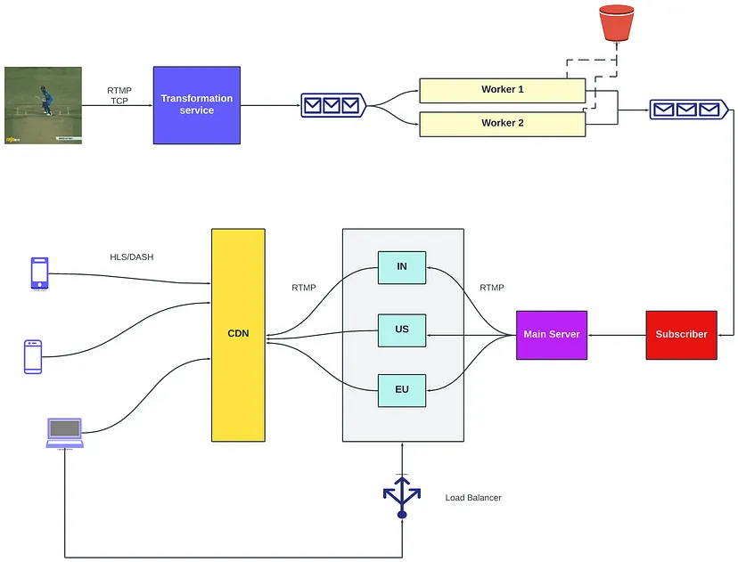

Designing a Live Video Streaming System Like ESPN ( this is the source of truth )

### Functional requirements
1. There should be a maximum delay of 1 minute between the live event and the stream
2. Our system should scale to a lot of users. (Heterogenous delivery)
3. Our system should convert videos to different resolutions and codecs.
4. Our system should be fault-tolerant.

### Deep Dive
Basically the big picture is we will take data from a camera source & send it to your device like laptop/mobile


#### 
- Image -> let say 1980 * 1080 -> size 1980 * 1080 * 3 B ( RGB)
- Frame is also called image.
- video is 30 frame / second , or its just sequence of frame.
- camera give raw data,  nothing but the you can image its a 2d arary with value as list of RGB.
- Similary audio recorder give list of byte ( one byte ), its a list of amplitude

```
audio = [ s(t0), s(t1), s(t2), ... ]
where t0, t1, t2 = sample times

[Raw Video Frame - Pixels (RGB or YUV)]
Row 1: [pixel1, pixel2, pixel3, ..., pixel1920]
Row 2: [pixel1, pixel2, pixel3, ..., pixel1920]
...
Row 1080: [pixel1, pixel2, pixel3, ..., pixel1920]

Each pixel = 3 bytes (R, G, B) or more

```




- Cool Now cient computer, espn have row audio and video stream.
- It does not send raw frames + raw audio → too huge, inefficient for network
- It sends encoded + packetized data over protocol RTMP Protocol: RTMP (Real Time Messaging Protocol) Encoding ( made on top of TCP, not using UDP since not reliable )
- espn server, compress and encode both data and make in FLV ( flash video ) format , having other flag -> after that it send via rtmp in chunks of size 128b over network.

  


- hotstar server, similarly get this encoded data via protocol and send into our queue.
- worker will change this stream into differnet resolutions and codec , encoding techinque( since (e.g., Safari prefers H.264, Chrome supports VP9/AV1).)
 


- We can store these to distributed file system for fault tolerance.
- Responsibilities of worker
  - Starting point: FLV tags (from RTMP ingest)  
  - FLV tags contain compressed video (e.g., H.264) and audio (e.g., AAC) frames with timestamps  
  - Tags arrive as a continuous stream
  - Step 1: Extract frames from FLV tags  
  - Parse FLV container → separate video and audio frames  
  - Extract timestamps & keyframe info  
  - Step 2: Decode & Transcode  
  - Decode compressed frames to raw video/audio  
  - Transcode to target resolutions & codecs (e.g., 720p H.264, 480p VP9)   // store these
  - Correction also in different bitrates -> can check in youtube. 
  - send into queue
- Another worker , which do below things packaging worker.
  - Step 3: Encode & Repackage into fragmented MP4 (fMP4)    
  - Encode frames into segments suitable for HLS/DASH (usually fragmented MP4)  
  - Each segment contains a short chunk of video/audio (e.g., 4 seconds)  // store these
  - Step 4: Generate playlists/manifests    // its just a file telling about the sequence of segements fMP4 to play on client side. 
  - Create `.m3u8` playlists for HLS or `.mpd` manifest for DASH  ( HDS (HTTP Dynamic Streaming) is Adobe's legacy format.
MPEG-DASH is the modern, standard format for HTTP Adaptive Streaming — and what you’re actually asking about. )
  - Playlists reference segments with timestamps, durations, and variant streams  
  - Step 5: Upload segments & manifests to CDN/storage  
  - Deliver segments to end users for adaptive streaming
- Clients/Players fetch manifests and chunks adaptively for playback.
  - “Adaptively” means the player dynamically adjusts video quality based on current network conditions and device capability.
  - It monitors things like bandwidth and CPU, then picks the best bitrate/resolution stream from the available manifests (.m3u8 playlists) to avoid buffering or poor quality.
  - CDNs serve HLS content directly to customer mobile phones (and other devices).
  - HLS is HTTP-based, so the CDN just delivers the .m3u8 playlists and .m4s (segment) files over standard HTTP/HTTPS.
    
```
Example:
When bandwidth is high → player chooses 1080p stream
When bandwidth drops → player switches to 480p or 360p smoothly without stopping playback
This is called adaptive bitrate streaming (ABR) and ensures the best user experience.
```
  
  - Bit about manifest and fmp4

  - Two fMP4 segments (different resolutions/bitrates)
  - A  sample .m3u8 manifest for adaptive bitrate streaming

```

fMP4 segments (simplified names)
720p_segment1.m4s  
720p_segment2.m4s  

480p_segment1.m4s  
480p_segment2.m4s  
```


  - Sample .m3u8 master playlist for adaptive streaming

m3u8
```
#EXTM3U
#EXT-X-VERSION:7

# 720p variant playlist
#EXT-X-STREAM-INF:BANDWIDTH=3000000,RESOLUTION=1280x720
720p.m3u8

# 480p variant playlist
#EXT-X-STREAM-INF:BANDWIDTH=1000000,RESOLUTION=854x480
480p.m3u8

```
Sample 720p.m3u8 (variant playlist)
```
#EXTM3U
#EXT-X-VERSION:7
#EXT-X-TARGETDURATION:4
#EXT-X-MAP:URI="init_720p.mp4"

# Segments
#EXTINF:4.0,
720p_segment1.m4s
#EXTINF:4.0,
720p_segment2.m4s
#EXT-X-ENDLIST

```
Sample 480p.m3u8 (variant playlist)

```
#EXTM3U
#EXT-X-VERSION:7
#EXT-X-TARGETDURATION:4
#EXT-X-MAP:URI="init_480p.mp4"

# Segments
#EXTINF:4.0,
480p_segment1.m4s
#EXTINF:4.0,
480p_segment2.m4s
#EXT-X-ENDLIST

```

  - How adaptive streaming works here:
  - Player downloads master .m3u8, sees two streams (720p & 480p)
  - Player picks the stream best suited to current network (e.g., 480p if slow)
  - Player fetches segments listed in that variant playlist (720p_segment1.m4s etc.)
  - Player can switch between 720p and 480p playlists mid-stream smoothly


#### System design:

#### Components required
1. Transformation service RTMP gives us a video stream. Transformation service converts this video stream to different codecs and resolutions. It also has a job scheduler that takes the raw video stream as input and converts it into all resolutions and codecs. Several worker nodes carry out these tasks. When there is a new raw video stream transformation service pushes it to a message queue. Worker nodes subscribe to this message queue. They accept the input and once the video is converted, these nodes then push it to another message queue.
2. Database We don’t want to lose video data in case there is a disaster (We want fault tolerance). So we will use a database to store raw video data.
3. Distributed File Service After worker nodes process the video, the result should also be stored in a file service for fault tolerance.
4. Message queue



#### Transferring videos to end-users

Using a Content Delivery Network (CDN) for video delivery is advantageous because CDNs utilize edge servers that are geographically closer to end-users, reducing latency. For streaming over HTTP, protocols like HLS (HTTP Live Streaming) for iPhone and DASH (Dynamic Adaptive Streaming over HTTP) for other operating systems are preferred.

HLS/DASH offer Adaptive Bit Rate, adjusting bit rate based on factors like available network speed and client device capabilities, optimizing bandwidth usage in real-time. Despite being lower quality compared to RTMP, HLS/DASH provide a tradeoff for real-time streaming over quality.

To distribute videos to CDNs, servers are deployed globally, and processed videos are sent to these servers using RTMP. This approach circumvents directly sending processed videos to the CDN due to potential delays in propagation across CDNs, which may not meet live streaming guarantees. Instead, when a client requests a video, a server directs them to a CDN endpoint, allowing clients to pull the video efficiently



#### Cache

We will let the CDN take care of caching the videos.

#### Fault Tolerance

To make our system more fault-tolerant we can use a load balancer. If one of the servers goes offline we can redirect the requests to other servers.

#### Trade off

- Using Web-RTC v/s using HLS/DASH for transferring videos HLS/DASH are HTTP based and work via TCP. They maintain orderly transfer. On the other hand, WebRTC is peer-to-peer-based and works via UDP. It might also send unordered chunks of data. Since we want to maintain the quality of video we will be using HLS/DASH.

#### Final Arch.
Added:

1. Content Delivery Network
2. Servers located in different locations


### Capacity Estimation

#### How many videos will need to be processed per live stream?

Assumptions
- 8k footage is being captured in the event.
- Resolutions we want to server: 1080p, 720p, 480p and 360p.
- Number of codecs: 4
- Duration of a cricket match: 10 hours
- Size of footage: 10GB
- Size of 720p footage: 10/2 = 5GB Size of 480p footage: 10/4 = 2.5GB Size of 360p footage: 10/8 = 1.25GB
- Total storage required for all resolutions: 18.75GB
- Total storage for all resolutions and codecs: 18.75 * 4 = 75GB

#### How much data will be transferred to CDN in a single live stream?
Assumptions

- Number of users: 1000,000
- Percentage of users having HD resolution: 50%
- Percentage of live stream users watch: 50%
- Size of footage in standard resolution: 10/4 = 2.5GB 
- Therefore, Total Data Transfer = SUM(size_of_video_type * number_of_users_for_type) * average_watch_percentage

= (10 GB * 50/100 * 10⁶ + 2.5 GB * 50/100 * 10⁶) * 50/100 = 3.125 * 1000000GB = 3.125 PB

#### How much time would it take to send data from the event to a user’s device?
Assumptions

- Amount of data consumed by user in a second = 10GB/10 hour = 300 kB/sec
- Time is taken to transfer 300kB of data to the nearest CDN = 1sec
- Time is taken to transfer 300kB of data to the user from CDN = 150ms
- Total travel time = 1 + 0.15 + 0.15 = 1.3sec 
- Processing time assuming ffmpeg running at 2x of video speed = 1 / 2 = 0.5s

Total latency = 1.3 + 0.5 =1.8s.

### Reference 
[ Copy Pasted :D]


1. https://medium.com/@interviewready/designing-a-live-video-streaming-system-like-espn-14c8b3ff16c3
2. https://medium.com/@saurabh.codes/system-design-live-streaming-to-millions-1739fc748ef8
