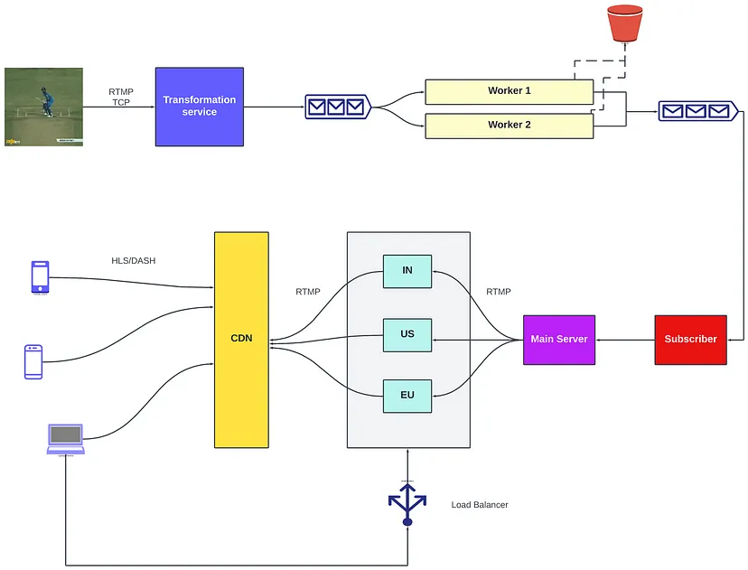

Designing a Live Video Streaming System Like ESPN

### Functional requirements
1. There should be a maximum delay of 1 minute between the live event and the stream
2. Our system should scale to a lot of users. (Heterogenous delivery)
3. Our system should convert videos to different resolutions and codecs.
4. Our system should be fault-tolerant.

### Deep Dive
Basically the big picture is we will take data from a camera source & send it to your device like laptop/mobile

Protocol: RTMP (Real Time Messaging Protocol) Encoding

#### System design:

#### Components required
1. Transformation service RTMP gives us a video stream. Transformation service converts this video stream to different codecs and resolutions. It also has a job scheduler that takes the raw video stream as input and converts it into all resolutions and codecs. Several worker nodes carry out these tasks. When there is a new raw video stream transformation service pushes it to a message queue. Worker nodes subscribe to this message queue. They accept the input and once the video is converted, these nodes then push it to another message queue.
2. Database We don’t want to lose video data in case there is a disaster (We want fault tolerance). So we will use a database to store raw video data.
3. Distributed File Service After worker nodes process the video, the result should also be stored in a file service for fault tolerance.
4. Message queue

#### Transferring videos to end-users

Using a Content Delivery Network (CDN) for video delivery is advantageous because CDNs utilize edge servers that are geographically closer to end-users, reducing latency. For streaming over HTTP, protocols like HLS (HTTP Live Streaming) for iPhone and DASH (Dynamic Adaptive Streaming over HTTP) for other operating systems are preferred.

HLS/DASH offer Adaptive Bit Rate, adjusting bit rate based on factors like available network speed and client device capabilities, optimizing bandwidth usage in real-time. Despite being lower quality compared to RTMP, HLS/DASH provide a tradeoff for real-time streaming over quality.

To distribute videos to CDNs, servers are deployed globally, and processed videos are sent to these servers using RTMP. This approach circumvents directly sending processed videos to the CDN due to potential delays in propagation across CDNs, which may not meet live streaming guarantees. Instead, when a client requests a video, a server directs them to a CDN endpoint, allowing clients to pull the video efficiently

#### Cache

We will let the CDN take care of caching the videos.

#### Fault Tolerance

To make our system more fault-tolerant we can use a load balancer. If one of the servers goes offline we can redirect the requests to other servers.

#### Trade off

- Using Web-RTC v/s using HLS/DASH for transferring videos HLS/DASH are HTTP based and work via TCP. They maintain orderly transfer. On the other hand, WebRTC is peer-to-peer-based and works via UDP. It might also send unordered chunks of data. Since we want to maintain the quality of video we will be using HLS/DASH.

#### Final Arch.
Added:

1. Content Delivery Network
2. Servers located in different locations

### Capacity Estimation

#### How many videos will need to be processed per live stream?

Assumptions
- 8k footage is being captured in the event.
- Resolutions we want to server: 1080p, 720p, 480p and 360p.
- Number of codecs: 4
- Duration of a cricket match: 10 hours
- Size of footage: 10GB
- Size of 720p footage: 10/2 = 5GB Size of 480p footage: 10/4 = 2.5GB Size of 360p footage: 10/8 = 1.25GB
- Total storage required for all resolutions: 18.75GB
- Total storage for all resolutions and codecs: 18.75 * 4 = 75GB

#### How much data will be transferred to CDN in a single live stream?
Assumptions

- Number of users: 1000,000
- Percentage of users having HD resolution: 50%
- Percentage of live stream users watch: 50%
- Size of footage in standard resolution: 10/4 = 2.5GB 
- Therefore, Total Data Transfer = SUM(size_of_video_type * number_of_users_for_type) * average_watch_percentage

= (10 GB * 50/100 * 10⁶ + 2.5 GB * 50/100 * 10⁶) * 50/100 = 3.125 * 1000000GB = 3.125 PB

#### How much time would it take to send data from the event to a user’s device?
Assumptions

- Amount of data consumed by user in a second = 10GB/10 hour = 300 kB/sec
- Time is taken to transfer 300kB of data to the nearest CDN = 1sec
- Time is taken to transfer 300kB of data to the user from CDN = 150ms
- Total travel time = 1 + 0.15 + 0.15 = 1.3sec 
- Processing time assuming ffmpeg running at 2x of video speed = 1 / 2 = 0.5s

Total latency = 1.3 + 0.5 =1.8s.

### Reference 
[ Copy Pasted :D]

1. https://medium.com/@interviewready/designing-a-live-video-streaming-system-like-espn-14c8b3ff16c3
2. https://medium.com/@saurabh.codes/system-design-live-streaming-to-millions-1739fc748ef8