Before going into deep dive, why did we creating this again ? we have already did same in proximity service.
No , if you think carefully, there we could have delay in update no real time. Here we need real time update. So quad tree won't work here.

Functional Requirements:

- User should be able to see nearby friends. 
- Near by defined by finding distance between them and that is less than predefined threshold.
- Friend and user location can be updated in every few seconds.
- Also extend the design so that we can find out the any random person near by to us.

Non-functional Requirements:

- Low latency.
- Reliable -> (occational data loss is acceptable).
- Eventual consistency -> location data store doesn't need strong consistency, few seconds delay in receiving in different replica is acceptable.

Estimation:

- 100M DAU.
- Concurrent users 10% -> 10M
- update location in 30 second.
- QPS  -> 10M/30 -> 335k / second

High Level Design:

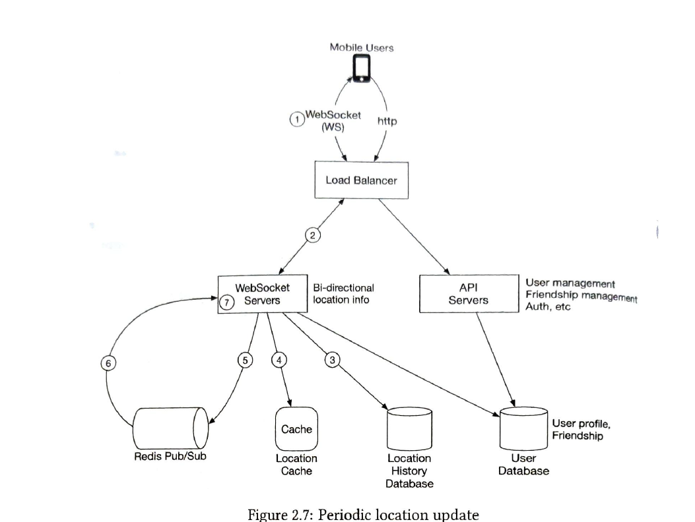

Deep Dive:

Since we need to update the user location in every few second it make sense , they have to be on websocket connection.
User can also have on p2p connection ,but that won't work for so high QPS

- Load balancer -> Api server -> User profile . 
- This is pretty standard flow, database can be sql here, that can be shared with userid.
- Api Service can be scaled horizontally
- It is not possible to have one web socket server, we will have to have a lot more, then we can use some service discovery for that like in chat application
- Whever we receive the location update we send sent event for updated in db (that can we done async ). 
- Update the location of user in cache.
- and publish event in redis pub sub.

- Location History database:

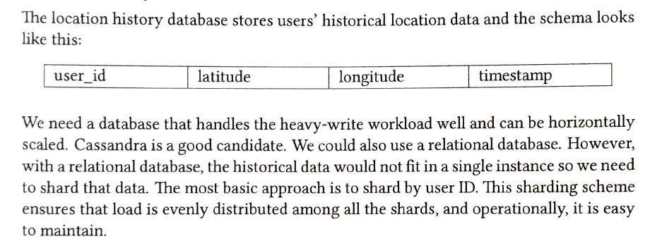

- User location cache:

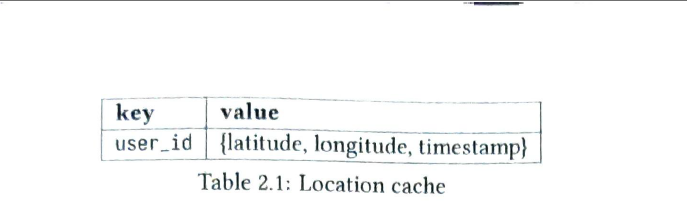

- Why not using the datastore
    - Will be getting again after few second.
    - Increase the latency.
    - No need in future or no need of durability in location.
    - Redis have ttl , which will purge data after some time (mean no location received now -> user inactive).
    - At worst , the user won't get the friend location for few second, that is acceptable

- Redis Pub Sub : (This is heart of this system)

    - We will talk about as learning perspective and for this problem as well.
    - It is very light weight channel pub-sub like kafka.
    - Internally it also have queue with id/topic.
    - Since this is very light weight, we can assign each user a single queue. 
    - and other user can subscribe the friend queue.
    - A modern redis server with GBs of memory cold hold millions of channels

- Now real question is how to scale this and how many redis pubsub server will require.
    - We have two constraints.
    - Storage and QPS. 
    - As per storage less server, but QPS is bottle neck.
    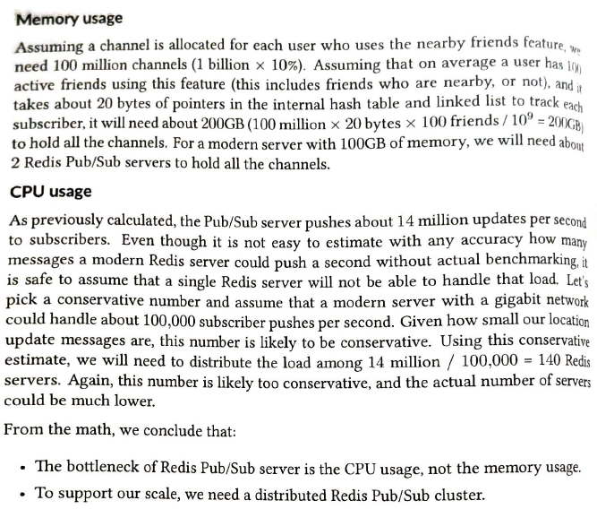
    - We can scale the redis pubsub with the consistent hashing and the zookeeper , that will maintain the list of servers and get and update operations.
    - and consistent hashing is done on the basis of userid.
    - Now with userid -> will get the server -> publish location to queue.
    - Web socket subscribe to the server -> with sample way by mapping user's friend id on ring and get server.
    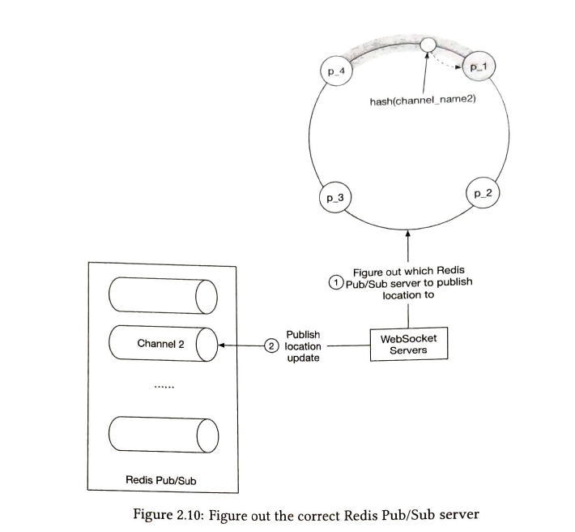
    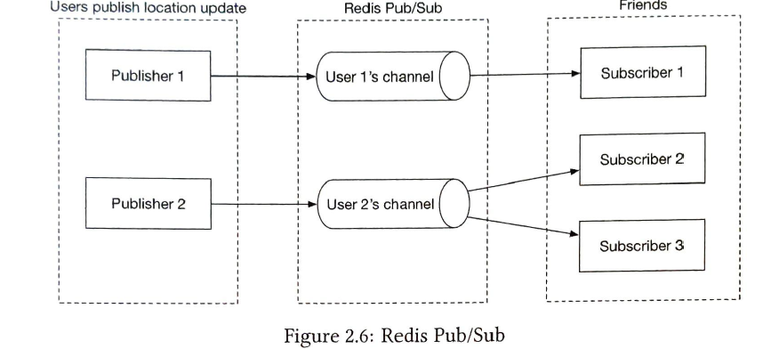
    - What if we increase the ring in future or we have to do by any reason?
        - This is rearly possible. if still this happen some how. 
        - We will have to increase the ring and replace the server in zookeeper and again websocket has to re subscribe.
        - Now problem is that we might lose data , since server is not stateless, it maintaining information about userid and its channel pointer, subscriber etc.
        - We will have some data loss , but we can try to minimize it , bit data loss is acceptable.

    - What if any server go down ? 
        - This is bit simple as compare to previous case. 
        - Only the particular server will affect and its data.
        - whenever failure -> oncall -> update zookeeper and replace server -> restart server may be to update the subscription again.

- So websocket will receive location , it will publish in pubsub. also in each websocket there is listening thread of these queue on websocket. For e.g. userA is connected to Websocket A , then websocket A is listening the queue of all firends of A. So if any friend update location we will get to know the its updated location , then we will see if its in radius or not with user location (maintaining in local) and return if near.

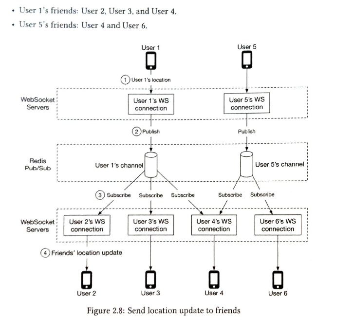 

- Api design

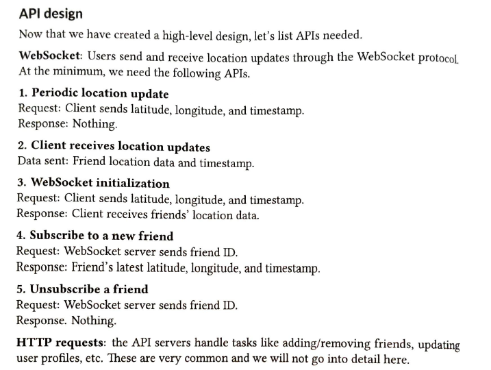

- Hotspot problem ? 

    - Yeah this would exist, we can limit on number of nearby friend connection let say 5000 , and for this our system would work by scaling it more.

- How to do this for random person.

    - As we discussed in previous proximiyt.
    - we can divide earth in equal part. 
    - we will find out the fix zoom level as per usecase and find all the geohash.
    - for each user belong to some geohash.
    - for nearby -> find all users in that geohash and near 8 geohash that will be our result.
    - so here channel instead of userid they will be like geohash.

    - this technique can also be used in Uber.
    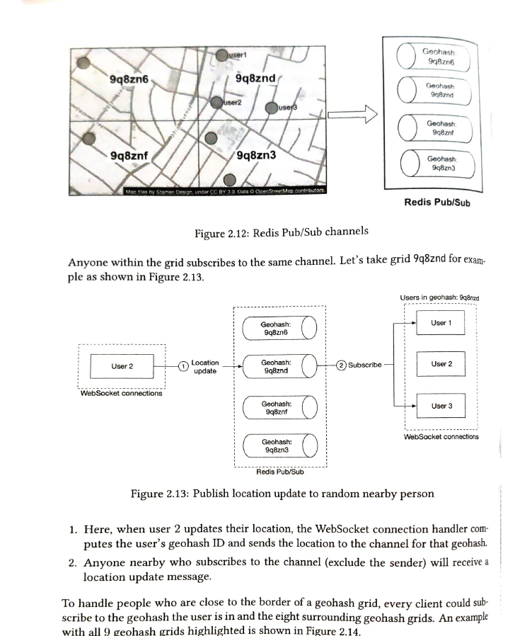
    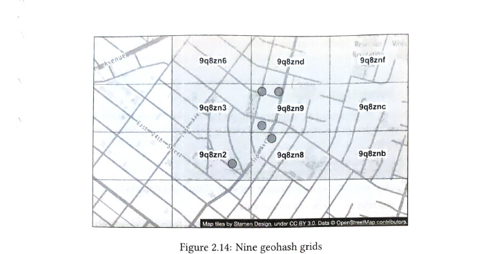

    Rough:

    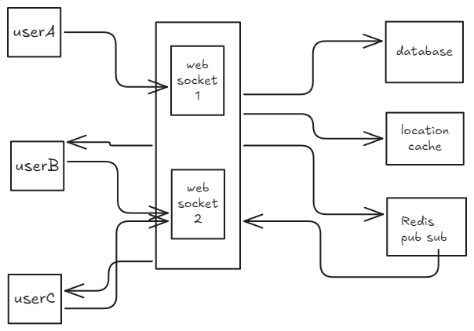