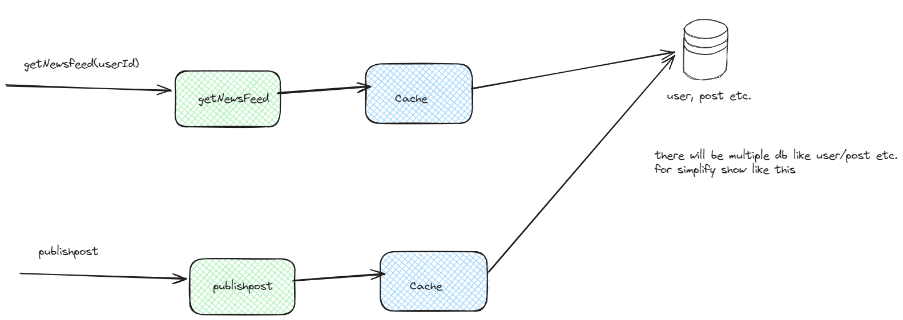
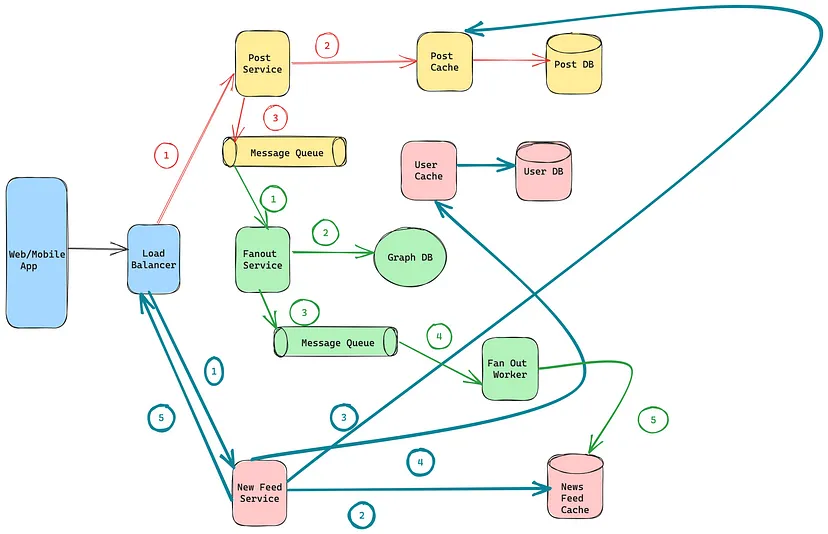
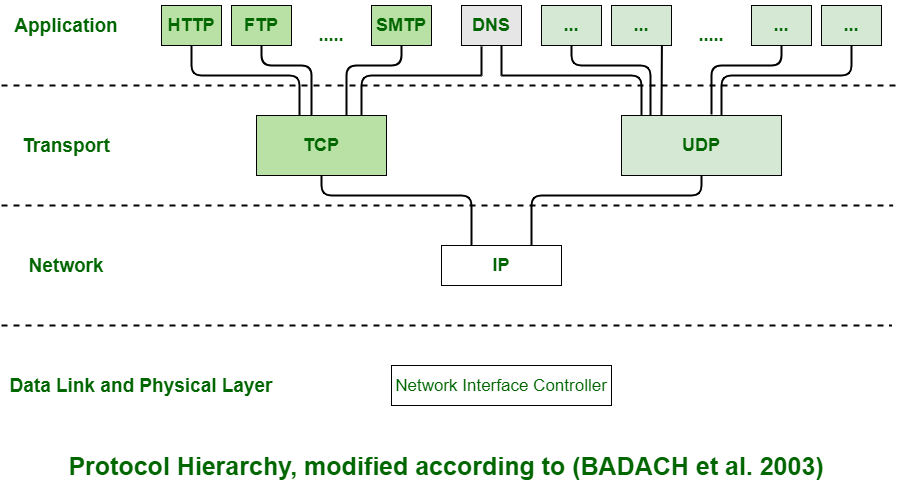

Design NewsFeed System:

#### Problem Statement:
Let’s design Facebook’s Newsfeed, which contains posts, photos, videos and status updates from all the people and pages a user follows.

***Similar Services***: Twitter Newsfeed, Instagram Newsfeed, Quora Newsfeed


#### Functional requirements:

1. Newsfeed will be generated based on the posts from the people, pages, and groups that a user follows.
2. A user may have many friends and follow a large number of pages/groups.
3. Feeds may contain images, videos or just text.
4. Our service should support appending new posts, as they arrive, to the newsfeed for all active users.

#### Non-functional requirements:

1. Our system should be able to generate any user’s newsfeed in real- time - maximum latency seen by the end user could be 2s.
2. A post shouldn’t take more than 5s to make it to a user’s feed assuming a new newsfeed request comes in.

So basically , there are 2 important features we need. 
- Publish the post by user.
- Show the news feed for the user according to its following.


#### Capacity Estimation and Constraints

Let’s assume on average a user has 300 friends and follows 200 pages.
Traffic estimates:

Let’s assume 300M daily active users, with each user fetching their timeline an avg of 5 times a day.
This will result in 1.5B newsfeed requests per day or approximately 17,500 requests/second.

***Memory estimates***:

On avg, let’s assume, we would need to have around 500 posts in every user’s feed that we want to keep in memory for a quick fetch.
Let’s also assume that on average each post would be 1KB in size.
This would mean that we need to store roughly 500KB of data per user.
To store all this data for all the active users, we would need 150TB of memory.
If a server can hold 100GB, we would need around 1500 machines to keep the top 500 posts in memory for all active users.


#### High Level System Design


At a high level this problem can be divided into two parts:

***Feed generation and publishing ***:

1. Newsfeed is generated from the posts (or feed items) of users and entities (pages and groups) that a user follows.
2. So, whenever our system receives a request to generate the feed for a user (say Jane), we will perform following steps:
   1. Retrieve IDs of all users and entities that Jane follows.
   2. Retrieve latest, most popular and relevant posts for those IDs, these are the potential posts that we can show in Jane’s newsfeed. [ Assume here reverse chronological order ]
   3. Rank these posts, based on the relevance to Jane, this represents Jane’s current feed.
   4. Store this feed in the cache and return top posts (say 20) to be rendered on Jane’s feed.
   5. On the front-end when Jane reaches the end of her current feed, she can fetch next 20 posts from the server and so on.
3. Here we generated the feed once and stored it in cache.


Following is the high-level architecture diagram of our system. User B and C are following User A.




### Detailed Component Design

a) ***Feed Generation and Publishing Service***

Let’s take the simple case of the newsfeed generation service fetching most recent posts from all the users and entities that Jane follows.

The query would look like this:

```SELECT FeedItemID FROM FeedItem WHERE SourceID in (
SELECT EntityOrFriendID FROM UserFollow WHERE UserID = <current_user_id>
) ORDER BY CreationDate DESC LIMIT 100
```

Here are issues with this design for the feed generation service:

1. High latency, Crazy slow for users with a lot of friends/follows as we have to perform sorting/merging/ranking of a huge number of posts.
2. What about new incoming posts from people that Jane follows? If Jane is online, we should have a mechanism to rank and add those new posts to her feed.

So Now we will create another service which will help to precompute the news feed for the users. There are two approaches in this: <br>
................................................................. <br>
This service is called fanout service. This will pre-updated the news feed cache.
It has two ways:

- Push Model
- Pull Model

In the push model the newsfeed is computed during the write. A new post is immediately cached and delivered to the user’s friends/followers

- The pros include real time feed and faster feed as its is pre computed while writing to the Database
- The Cons are, for an user with many friends, fetching the friendliest and generating newsfeed is slow. It is called ***hot key problem***.
- For inactive users pre computing newsfeed is a waste of resources


In the Pull Model, the news feed is generated during read tie. It is on demand.

- For inactive users push works better.
- There is no hotkey problem.
- The only problem with Pull model is that it is slow


1. In practice a hybrid approach is used. For users who have many friends a pull method is used while for other users a push method is used. This distributes the load evenly.
2. The Fanout service, first fetched the friend IDs from a graph database like neo4J. The friend info is retrieved from the user cache if available in cache or from user database. We can use Least Frequently used method for updating our cache. A cache like Reddis can be used here.
3. The fanout service fetches data from the message queue and stores news feed in a news feed cache like reddish. WIth <post_id, user_id> in the mapping table


### Final Design:
         
We have mainly three internal services :

- Post Service : Publish Post
- Fanout Service : Generate news feed for friends
- News Feed Service : Retrieve news feed for user




#### Curious Doubts

1. How are we handling video and image ? like how do you save image and video from frontend ?  Since http doesn’t support like image etc.
- Wow you are so smart dude.  Basics acche karo. See below about http.
- ````HTTP, or Hypertext Transfer Protocol, is a set of rules for transferring data on the internet. With POST requests, you can send various types of data, like text, JSON (which is a way to structure data), images, videos, audio files (like mp3), and pretty much any other type of file. When a server receives a POST request, it can respond with different types of data as well. It could send back HTML for a web page, JSON for structured data, images, videos, audio files, zip files, or any other type of file. So basically, HTTP allows computers to send different types of data back and forth, like web pages, files, and structured information, using a standardized set of rules.````
- For keeping data we can use S3 object storage and its link in our database.
- Action Item -> Learn about protocol in computer network and different layers conceptually and its tree map with writing code in golang if possible.

2. How to deal with graph db in Go or know about graph db as much you know about sql ?
- Apologies , will deep dive later on.

3. Tell details about user table , post table, follower and following table or relation table, news feed table etc. and which database we are using. And also how we are saving in cache.

#### User table: 

Usecase:
1. Save newly created user and its account information.
2. Get the user information with userId [ bulk ]

```json
{
   "userId": "",
   "userName": "",
   "name": "",
   "profilePicUrl": "",
   "..."
}
```

Since we don't have to use any transaction and can have lots of user need scalability etc. Second information have high frequency.
Maybe we can use column database cassandra. or else key store db would also work fine.


#### Post table:

 ```json
{
   "id": "<global unique id",
   "postPicturesUrl": [],
   "postDescription": "",
   "creator" : "<userId>",
   ...
}
```

Have similar usecaes like user , can use same type of db here as well.

#### Relation table:

Usecase:

1.  Find all follower id of user.
that's it.

TBU


4. How do we get to know when to use push/pull , implementation wise. Like from following or how at the run time. [ in short how do we implements hybrid method ]

- This is tough to answer its depend upon on business requirements , may be one simple solution is to have threshold of followers, with which we can take decision.