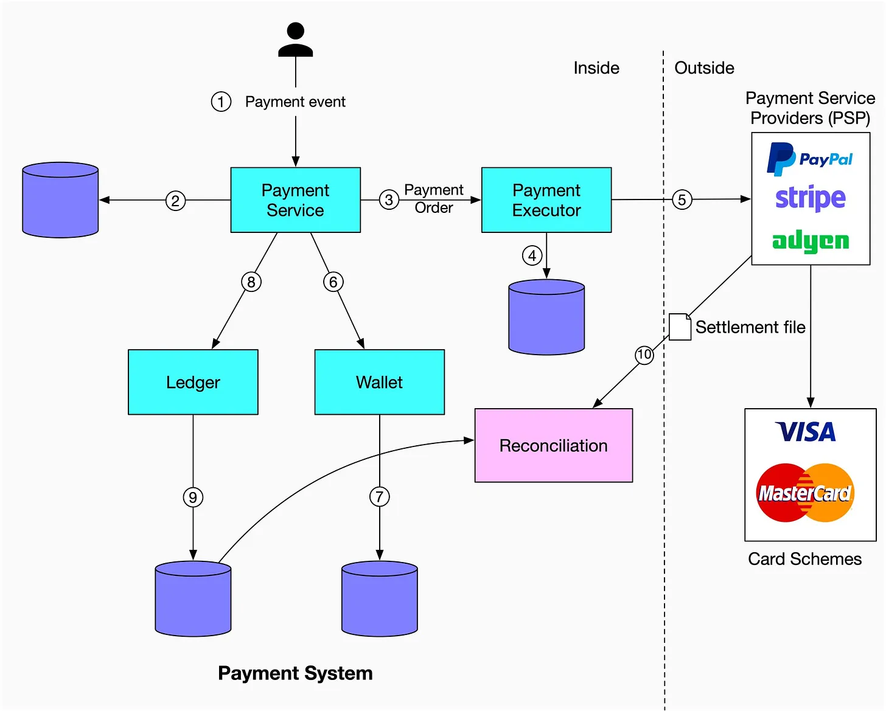
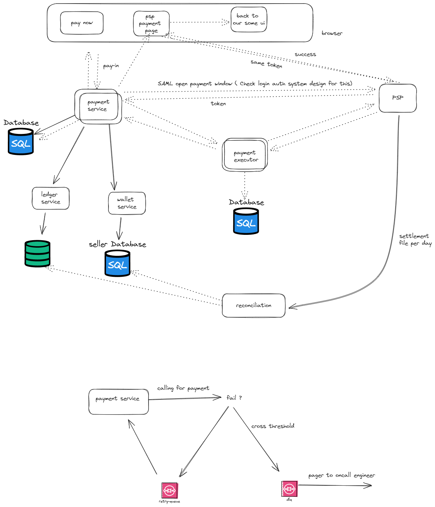
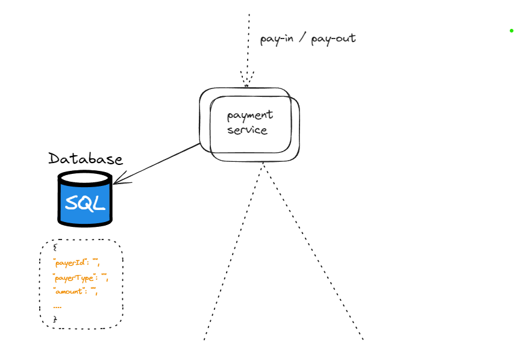
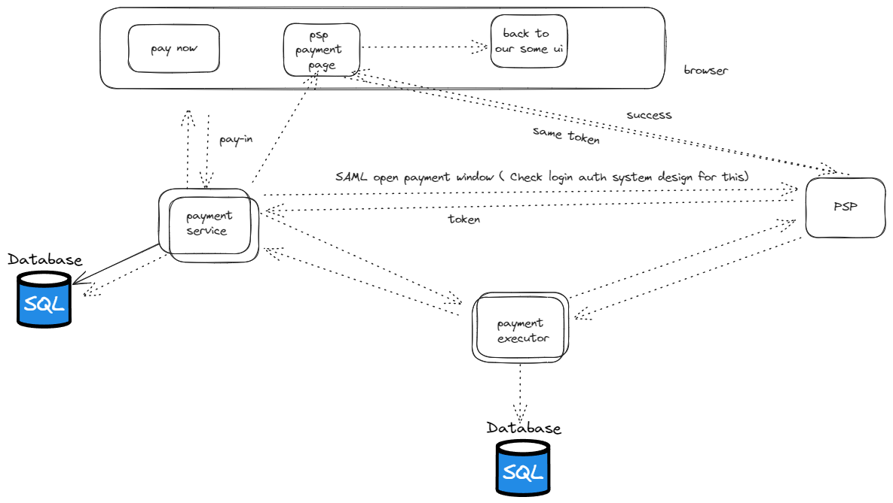
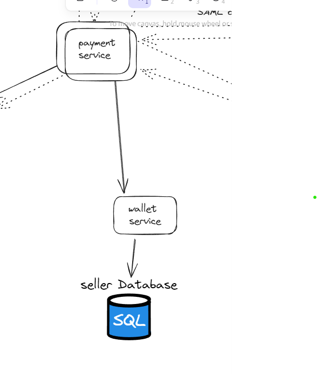
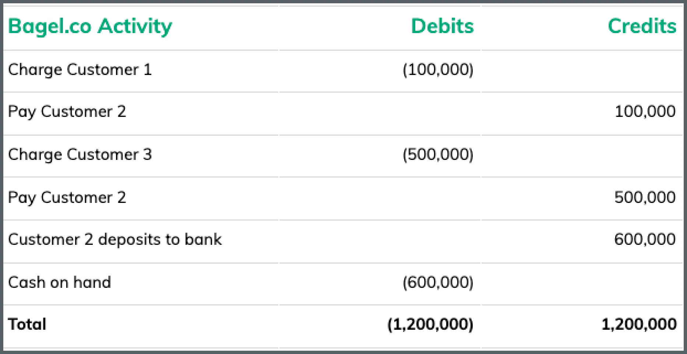
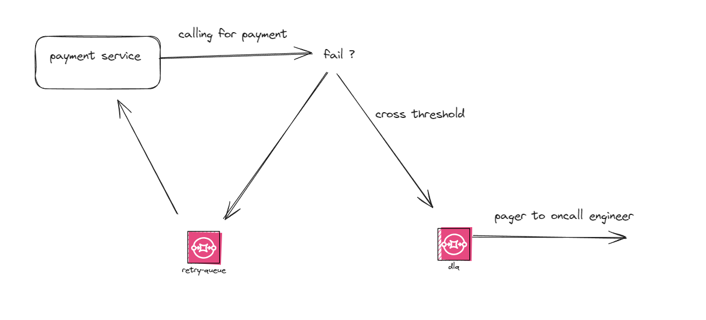

Design the Payment system.

### 1. Functional Requirements:

- Pay-in flow: payment system receives money from consumer on behalf of seller 
- Pay-out flow: payment system send money to sellers
- Assume we are not taking credit card input details, that will be done by external vendor.

### 2. Non-Functional Requirements:

- Reliability and fault tolerance
- Consistency accross all the internal payment service.

### 3. Capacity Estimations:

- 1 million of transaction per day
- 10 transaction per second
- This is not high ,but we have to focus more on non functional requirements.

### 4. High Level Design:


[ Copy Pasted ]

1. When a user clicks the “Buy” button, a payment event is generated and sent to the payment service. [ Assume it POST request Now]
2. The payment service stores the payment event in the database.
3. Sometimes a single payment event may contain several payment orders. For example, you may select products from multiple sellers in a single checkout process. The payment service will call the payment executor for each payment order.
4. The payment executor stores the payment order in the database.
5. The payment executor calls an external PSP to finish the credit card payment.
6. After the payment executor has successfully executed the payment, the payment service will update the wallet to record how much money a given seller has.
7. The wallet server stores the updated balance information in the database.
8. After the wallet service has successfully updated the seller’s balance information, the payment service will call the ledger to update it.
9. The ledger service appends the new ledger information to the database.
10. Every night the PSP or banks send settlement files to their clients. The settlement file contains the balance of the bank account, together with all the transactions that took place on this bank account during the day


### 5. Deep Dive High Level Design One By One:



#### Pay-In flow
Get payment from buyer and put in our bank ( Not seller yet )

#### Payment Service:

Responsibility:
- Check and verification of events. [ This is POST request with event in request ]
- Save payment event in db with its status and call executer.
- Return the response to the client about the payment.
- Which type of event ? -> Get X money from user ( Payer Entity In General , so that it will be agnostic of it).

Sample Event [ It will be in bulk ]:

```json
{
  "payerUserId": "",
  "paymentType": "<payIN or payOUT>",
  "amount": "",
  "orderMetadata": {}, // for payIn type, will help us to know it was for what product etc ?
  "sellerDetails": {}, // for payOut that will help us to send money to seller
  "statue": ""
}
```
Since we don't have to scale our database much and payment service will have structural event.
We will be using the SQL for this.


#### Payment Executor:

- Will get the valid event for payment and will call external payment service provider to get it done.
- - It has its own database will store payment details with global unique paymentId. That can be used as reference and receipt. After it got success.
- Same, SQL can be used here.

```json
{
  "paymentId": "",
  "amount": "",
  "recipantAccountInfo": "",
  "timestamp": "",
  "status": ""
}
```

#### Payment Service Provider:

- External, That will move money from buyer credit card to our system account ( for e.g. flipkart account ). That's it.
- Famous PSP -> Stripe, Visa This is itself a complex system that has to be taken care separately.
- Check out them separately. These also give the UI for taking credit card information.




#### Pay-out flow

- Once the item is delivered. Instead of pay-in . We g qet. pay-out payment event with account information of seller.
- We same initiate payment with pay-out PSP ( for e.g. Tipalti etc). That will transfer the amount from our bank to seller account.
- One more thing for pay-out service. We would like to add one more service which will help to update the seller information about the money which has to be transfered etc.
- Since there can be multiple pay-in for a single receipant so it would be easy to club and sent details to recipent etc usecases.

  

### Fault tolerant and consistent deep dive

How to make our system consistent and handle failure. What if user click twice or what if payment fails etc.

Before going in this let's understand one more service. That helps in consistency.

#### Ledger

- This is important part in post-payment analysis such as total revenue etc.
- This is a important design principle in ledger system is double-entry principle ( or double-entiry bookkeeping ).
- This principle says that sum of all transaction entries must be zero.
- It uses ledger database inside of it. with this database, you could utilize a ledger database to find the current value of a business bank account, as well as the historical value and transaction history for the same account.


- Below table is called double-entry accounting
```sql
 Account | Debit | Credit
 buyer   |  1 $  |
 seller  |       | 1$          
```

More reading: https://developer.squareup.com/blog/books-an-immutable-double-entry-accounting-database-service/
- https://www.moderntreasury.com/learn/ledger-database

#### Reconciliation for consistency
[ Doubtful , Also its very high level ]

According to alex xu:

- There might be inconsistency between the amounts we have in different table for example in wallet and ledger.
- For solving this, we use reconciliation . In this PSP send the settlement file to our payment service. With the help of this file we make our system consistent.
- Reconciliation service parse settlement file and compare with ledger. After comparing there can be three scenerios.
- After compare if not any issue then its okk.
- Else if either its possible to settlement by automation then -> Enginner can solve it with automation system.
- Else finance team will check manually if not possible to settlement or possible to settlement but not by automation.


#### Handling delay 

- What if PBP taking long time to do payment.
- This can be happened for like in case of high risk payment require human to review it. etc cases.
- For this with the help of db we will maintain the state of payment.One we receive pending status from PSP ( Communication with them are mostly sort of asyn ). And on UI we can show async status. Means user can switch to another flow of system and can check status later on.
- Above this will be handled by us. Once payment is success. PSP will send us a request [ Webhook ].
- This will tell use about the payment information and same we will update on our UI.

#### Handling failure and repetition idempotency

- handling failure we can use retry-queue and dead-letter-queue . To make our system more resilient.
- payment service will call if its fail then again put in retry queue if still failing then after threshold we can put in dead letter queue and check manually.


#### Exactly-Once delivery and idempotency

- What if user click twice ? or if payment success but fail acknowledging payment service ?
- As already discussed without maintaining state , its not possible to have exactly one delivery. [ Not know proof ]
- One way to solve this problem is:
- Infinite Retry + Idempotency with maintaining unique payment Id.
- Retry can be done with exponential backoff of x -> 2*x -> 4*x ....

Above Retry will confirm atleast one delivery.

Now for exactly 

- On our payment service we can have unique id from client. this will help use to already done payment. 
- PSP contract have idempotency key. So communication between payment service and PBP will also we save.
- Because if multiple request come on PSP with same key then it won't do thing again.

Above user click and another case both will be handled in this way.


### Follow Up:

- How to make it as a service . So that can be used at any place.
- Login flow and consider this example and deep dive it.
- System design if PSP.
- Doubt section remain

### Reference:

1. https://blog.bytebytego.com/p/payment-system
2. Alex xu system design volume 2.
3. https://www.youtube.com/watch?v=olfaBgJrUBI
