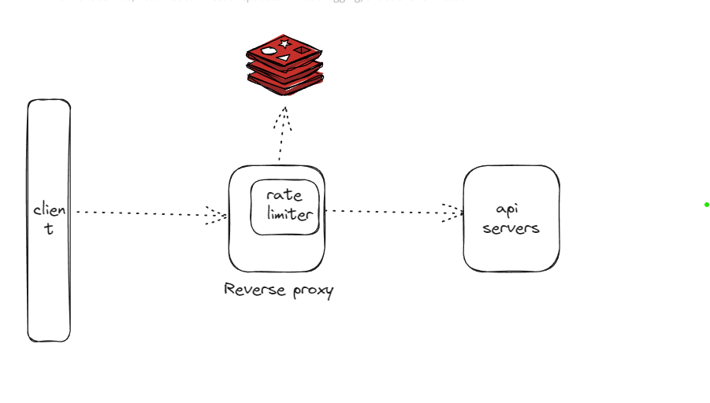
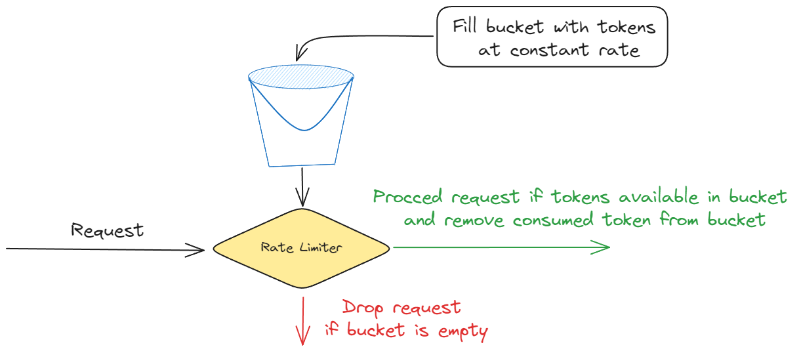
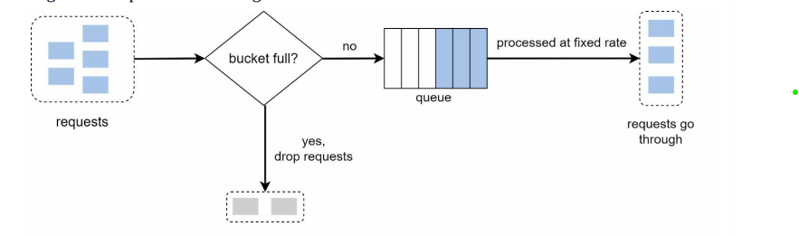
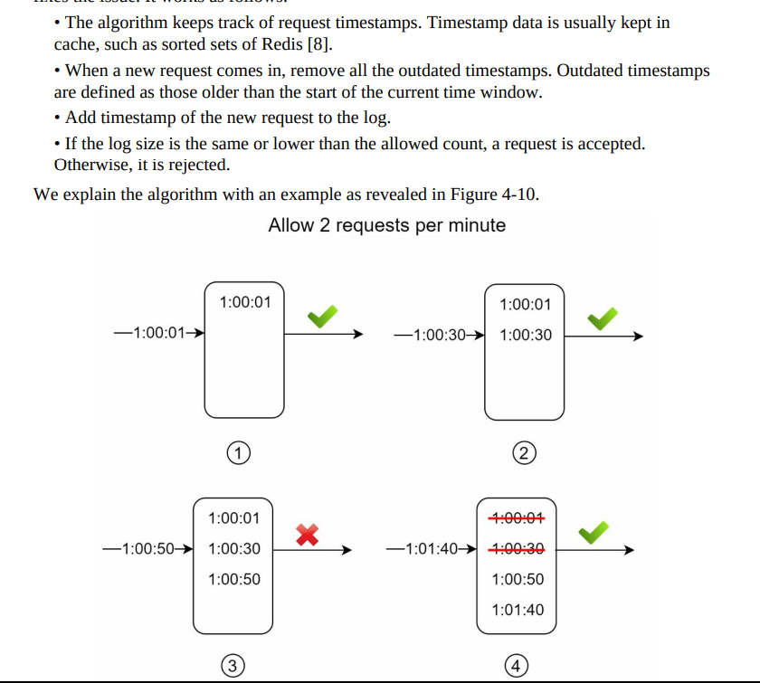
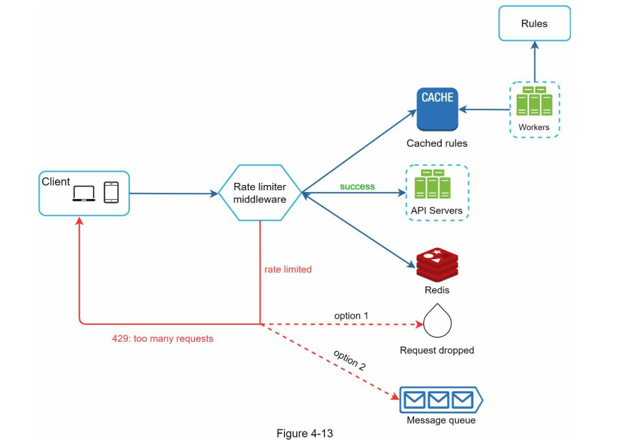

### Functional Requirements

1. Accurately limit to excessive requests.
2. Distributed rate limit: Can be shared across multiple servers and processes.
3. Exception handling: Show clear status to user that their request are throttled.
4. Is this on api level or like reverse proxy -> now can take it as reverse proxy
5. On what basis do we want to throttle -> develop on ip address,but should be able to adopt different rules.

### Non-functional Requirements

1. Low latency: Shouldn't slow down the other requests.
2. Use as little memory as possible.
3. High fault-tolerant: this shouldn't break our system if there is some issue in rate limiter for e.g. in cache tec.

### Capacity Estimation
### High level design

- On a high level we want a reverse proxy in which there is rate limiter which with the help of its state throttle the coming requests with the help of request ip address.
- Major deep-dive in rate limiting is its algorithm for limiting and its corresponding database.

- rate-limiting algorithms ideas.

1. Token bucket [ Amazon, stripe ].
   
   1. Pros:
      1. Easy to implement
      2. Memory efficient.
   2. Cons:
      1. 2 Parameters , bucket size and bucket refill. It might challenging to tune them properly
2. Leaking bucket.[ Shopify ] : Sort of same , but it take help with queue whether there is space or not other wise throttle the request.
   
    1. Pros:
        1. Easy to implement
        2. Memory efficient.
    2. Cons:
        1. 2 Parameters , bucket size and outflow rate (from queue to server fixed rate) . It might challenging to tune them properly 
3. sliding window log
   
    1. Pros:
        1. Accuracy.
    2. Cons:
        1. Consumes a lot of memory.

We can also use some database . It's a tradeoff between latency and infrastructure cost.

### Deep dive in design

1. How can we write rate limiting rule.
   TBU MORE
   1.  Store in disk as a file and get while processoing.
2. What about throttled requests ? 
   1. Send message to client with request headers and status code. 429 too many requests.
   2. Also send other informations about rate-limiting threshold, rate-limit waiting time ( after that client will have to retry )
3. What in distributed environment. when same request came to different pods. but summing up is greater than threshold.
   1. Redis should be global and command for all pods.
   2. Put locks on update the counts. To safe from race condition. 

#### References
1. Alex xu system design volume 1.