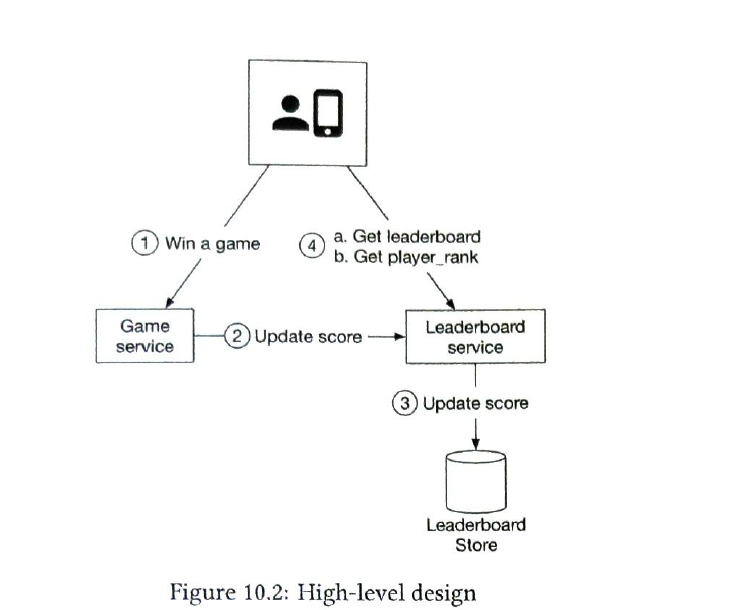
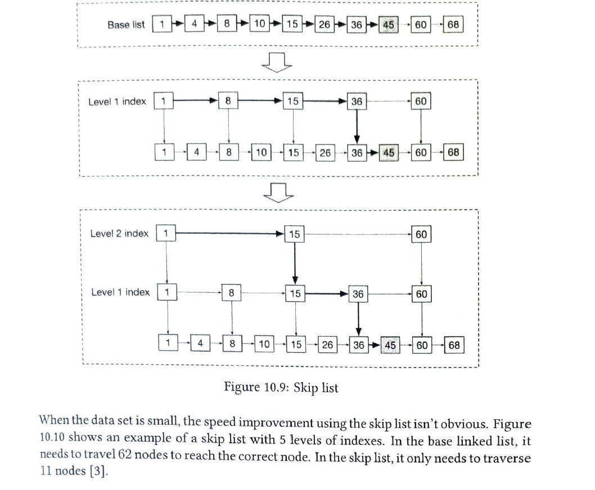
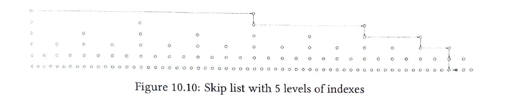
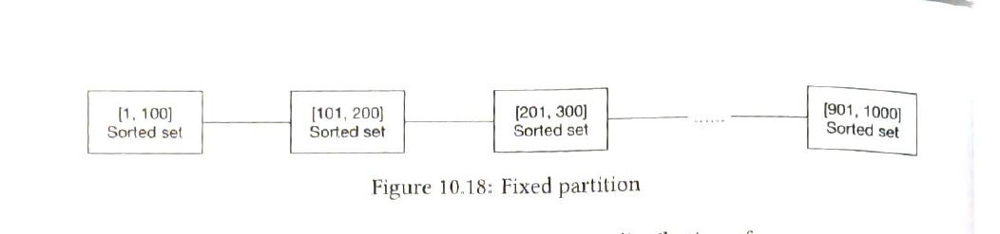
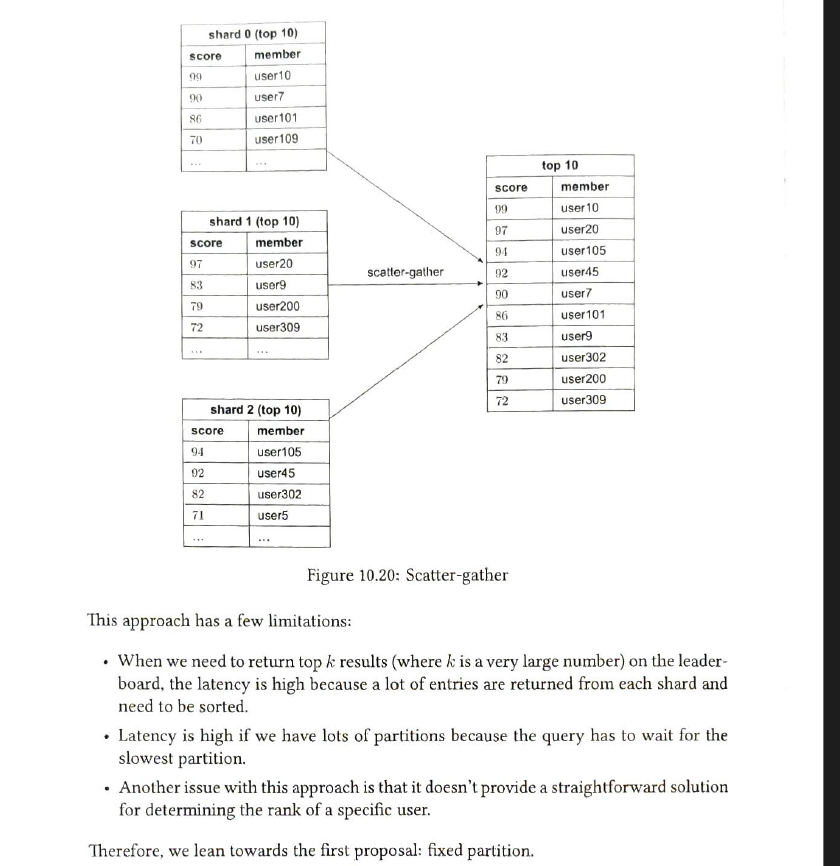

Functional Requirements:
- Display top 10 players on leaderboard
- Show user’s specific rank.
- Display players who are 4 places above and below the desired user ( bonus )

Non-functional Requirements:
- Real time update on score.
- Score updated on leaderboard in real time.
- and leaderboard will run let say for 30 days.

Estimation:
- 5M DAU
- Avg play 10 game.
- QPS for users scoaring -> 50 * 10 -> 500. QPS = 5* = 2500.
- QPS for search leaderboard top 10, on avg one game opened -> QPS = 50.

High Level Design:
Since there is not much event 2.5k is not very high. So No need to have ETL kind of system . And also we need exact precision , no approximation.

Api Design:
- 

Should game service 
- We can do , but here QPS is not very high and we don't want to add extra latency , so as per alex we didn't go with queue.

Data Models:

- we only need the score table which contain information about user score and may be time stamp.
- we can use the mysql , doesn't seem issue, can also use other database as well. Sicne mostly its write system we can use the cassandra and also it doesn't have any scaling issue.
- But both option is not very optimal for the find rank of user on large amount of data.

Cache: 
- We can use the sorted list data structure in redis. which is kind of have save functionality what we want.
- That will maintain the sorted list of user and score for a leaderboard and it provide update, add and search in log n . 
- It internally uses the skip list to optimize this.

- For find the user whose have high and lower score than particular user, that still will have to find with query.

How to scale redis ? 

- We can partition redis with score range.
- And figure out the user from the highest value until top k.

- What if user don't have normal distribution of score and user ? 
- Second way to hash partition 

