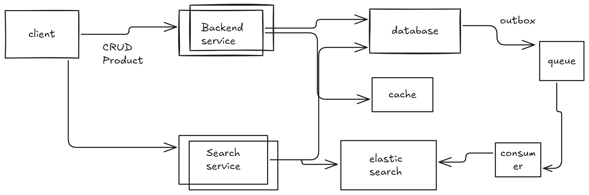

Functional Requirements:

- Develop the search functionality like e commerce website.
- We can search item with name.
- We can filter the things.
- We can do sorting with some parameters.
- Product will have -> Rating, Price , Colour, Brand.
- We want to have sorting on rating and price.
- We want filterting on colour and brand.
- This is not limited , we want it to be extensible.

Non-Functional Requirements:
- Highly scalable.

Estimations:
- QPS, PQPS.
- Storage.

High Level Design:

 

Deep Dive:

1. Backend Service:
    - This service is for the crud operation with the product that can be related to particular domain.
    - This product will have its metadata. There are some fix field on which we want to have filtering and sorting.

2. Database:

3. Cache:

4. Event Queue and consumer:

5. Search Service:

6. Elastic Search:

Database Schema:     

References:
- https://www.hellointerview.com/learn/system-design/deep-dives/elasticsearch

