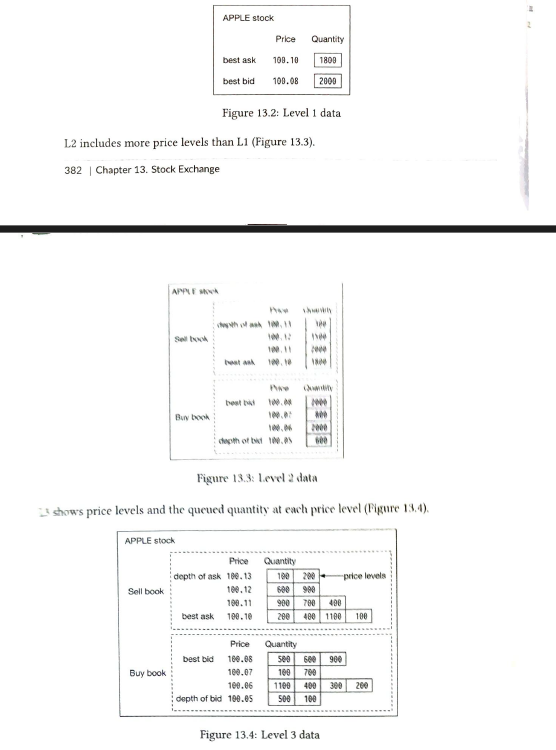
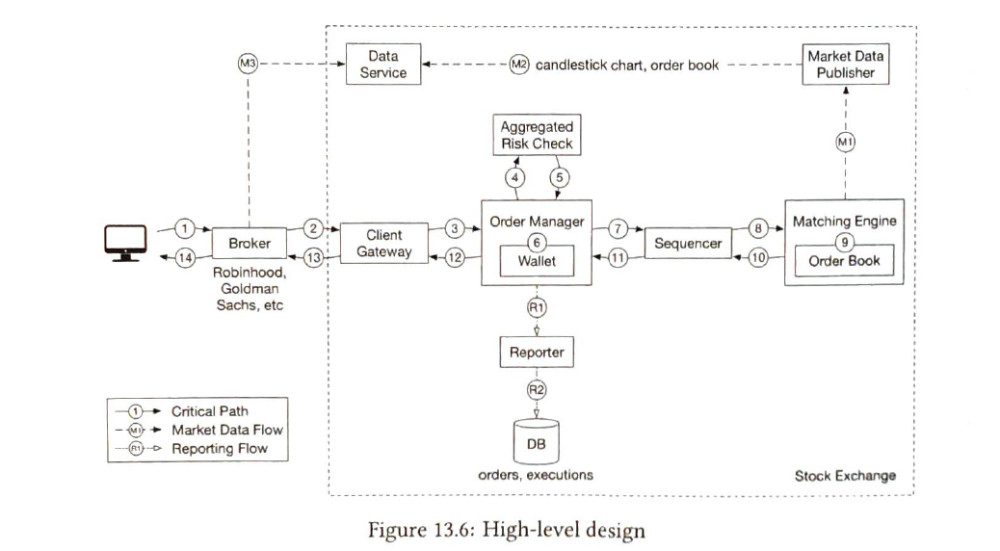
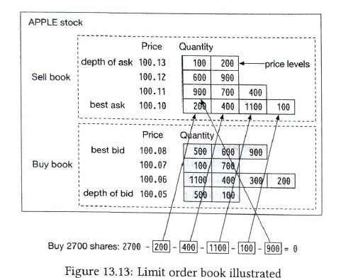
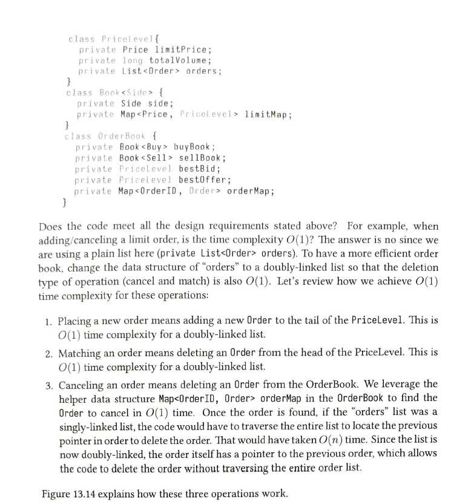
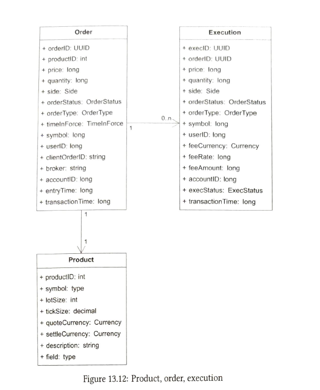
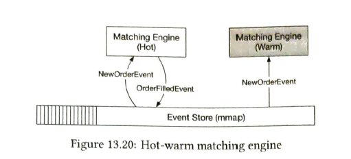
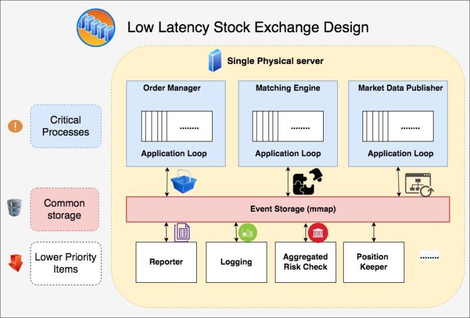
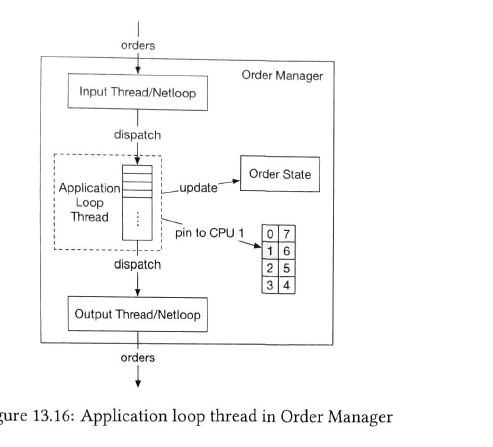
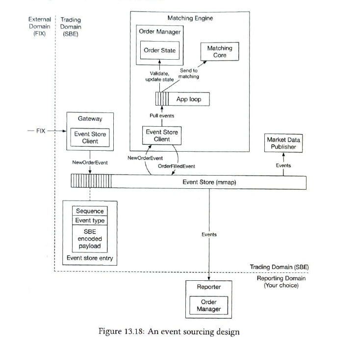

Functional Requirements:

- We have to design the stock exchange.
- User can buy and sell the stocks.
- User can see the market listing price.
- User can do only limit order.

Non-functional Requirements:
- latency should be very low.
- Availability very high and security.

Estimation:
- Order request, QPS => 1 Billion order perday -> 10^4 / seconds (Hugeeee)
- and it only for 6.5 hours => so it make 40k / second\
- Peak = 5*QPS = 200k / seconds

Pre Knowledge:
1. Stock Brokerage vs stock exchange.
    - Stock exchange where seller and buyer come itself for order placing, and exchange execute them.
    - Like NSE and BSE.
    - Brokerage is someone in between exchange and users. This take the request from user and place their order with dealing with exchange. Kind of real life broker. This also validate the user. ( Zeroddha )
2. Limit Order
    - We sell or buy the stock at particular price , it can be different from market.
3. Market Order
    - What's the current price of stock on marker listing, it is fluctuating in time open market.
4. Market data levels.
    - That tell about the bidding and ask information of a stock.
    - It also have level .
    - Level 1 -> show best bid ( highest buy ) and ask (sell, chepeast ask).
    - Level 2 show different bid and ask, but only current order.
    - Level 3 show the different bid and ask , and also the list of orders and quantity, this is FIFO queue.

    

High Level Design:

1. Broker:
    - Validate the user and collected order execution information like how many counts, type of order etc  and call the gateway of stock exchange.
2. Client Gateway.
    - is the starting point of exchange, that will authenticate request, rate limiter etc.
    - But since we want to have very low latency we show not add more load or logic on gateway instead of this can move of ordermanager etc.
3. Order Manager.
    - This will receive the order from broker.
    - This will do the validation like user have money or not.
    - risk check or other security check.
    - Enrich bit of details in order
    - and send to sequencer.
    - this also receive the execution order from sequencer.
    - and put that execution order and order in reporting queue.
    - which will generate report and also save data in database.
4. Sequencer.
    - This is kind of queue like two kafka one for inbound and other for outbound. Infact we can use these if we don't need much low latency. in interview can use this and just tell the deep dive optimisation in brief.
    - this will generate the sequence number of each item and send the order for the matching service.
    - this also receive execution order from matching service.
    - help us to make system deterministic. (aim is to same order should result in same execution.)
5. Matching Engine.
    - this receive the order in sequencce. FIFO.
    - this maintain the order book datastructure on local (what if this crashes ? ).
    - and insert the order in it .
    - and the algorithm use this order book to execute the orders.
    - once we execute the order we put the execution in sequence and also send this information to market data publisher.
6. Market Data publisher and Reporter.
    - this two are not in critical path  ,so can have bit of high latency as compare to critical path.
    - these receive the event of order and exeuction order.
    - Reporter create the report , user exeuction doc, payment etc.
    - Market data take the exeuction and update the market order and other stock information on market and generate candles and at end send this information for data data service to store it.

Api Design:
- Place the order.
- Show Marker Detail of a stock.
- List all stocks

Data Modelling:
- Product
- Order
- Execution Order
- Order Book Data structure (Every operation in constant time with doubly linkedin list)

Deep Dive:
1. Low latency and performance ( Modern system )
    - By putting all the components in a single server.
    - Doing Less on the critical path. 
    - If we start building it like a normal web application, the latency will shoot up exponentially. - These are the Latency Numbers:-
        - Network Latency: 500 microsec.
        - (Storage) Disk Access Latency: 10 microsec. 
    - So Exchanges eliminated both these latencies completely.
        1. To remove Network Latency, put all the processes in a single huge server.
        2. To remove Disk Latency, use Memory Map for high-performance sharing of memory between processes. (no hard disk)
        3. Key components like Order Manager and Matching Engine are single-threaded on the critical path. 4. Each is pinned to a CPU so that there is no context switch and no locks.
        5. Finally, the critical path only contains the necessary components, even logging is removed from the critical path to achieve low latency.
    - (not sure) Since stock are independent so , may be we can horizontally scaled with respect to stock , like one stock will completed executed in single machine. ( or atleast for failover or warm mathcing engine and repliate all inf. like in order manager and other stateful part )
    
    - Warm receive order in same as hot but don't send even to event store. if both go down , they can recover state from event store.
    - other can execute also completely in a machine, but other , since these both stock no need inter communication.
    - Learn this separately , this is getting too much
    
    
    
2. Maching Algorithm
    - There are a lots of algorithms , that can be check on internet. like FIFO with LMM (lead market maker)
    - As of now we will following this algo.
    - match with best ask with best bid in FIFO manner.
    - once one order done of that ask , move to second quantity or order in that ask or bid.
    - if that price order ends move to level up in bid or ask and continue.

How to optimize latency on critical path ( order execution part 1,2,3,4,5 )