- Before going design of this, let's understand what's the different between real time leader board and this problem.
- In real time leader board design, we had a leader board that users were playing different games and they updating the leader board.
- In that case we had very less scoring events.
- like 50 QPS in reading leader board, and 2.5k in user score event to write.
- Here we would have lots of data then we need to find the top k data.
- in this also we will cover the add click events aggregation, this is basically a usecase of this general problem.
- this problem can have different variations.
    - It should real time big leader board of high traffic game.
    - It can be updated periodically like top k songs.
    - It should be high precision, we can't approximate the input events.
    - It can be approximate -> here we can do bit of sampling that will speed up and with loss of bit data.
- We will cover designing of all these variations in this blog.
- If i am correct this is also know as heavy hitter

........................................................................

Functional Requirements:
- Assuming we are getting lots of events. ( Big data processing map reduce )
- Now we need to find our the top k aggregation of any parameter , let say frequency. top k most frequent song.
- Make design for real time ( alert and monitoring system, stock price ) and periodic updation ( top k songs or add click events ).
- Make design when we do consider precision (most click add events -> we need count , that can affect our revenue.)
- top listened song, here approximation can work, since we don't need exact count we need relative top k.
- do design for both.
- these top k can be real time, last 5 min, last 1 hour, last 1 day, upto last 30 days, in dataloss case can be all time .
- We want our system to return the list of K most frequent items over a predefined time interval.
- topk (K, startTime, endTime)

Non-functional Requirements:
- Already mentioned in functional.
- Real time should be realtime.
- Precision vs approximation.

Estimation:
- QPS 500k
- Woo, that's a lot

High Level Design:

If we see the high level design of this , it can be like.

- Design Goal #1: A fast system (gets results within seconds) — the results are approximate.
- Design Goal #2: A relatively slower system (gets results within minutes to hours) — the results are accurate. 

#### First Flow ( Aggregation flow ):

If the requirement is to get the search results within a few seconds then it requires a real-time solution. Solutions involving MapReduce may be out of the window as they tend to batch updates and require a longer timeframe.

We will create two flows
- One is precise and slow
- Second one if fast and approximated.
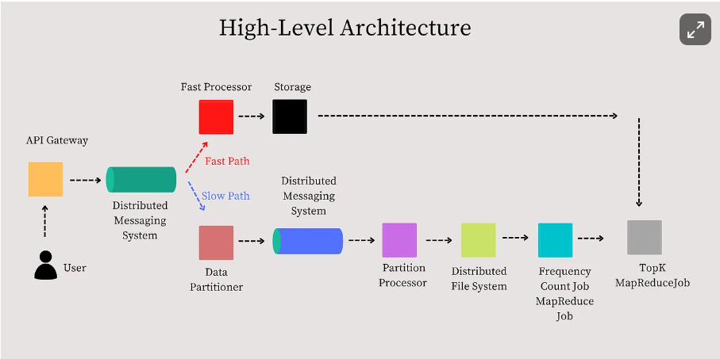
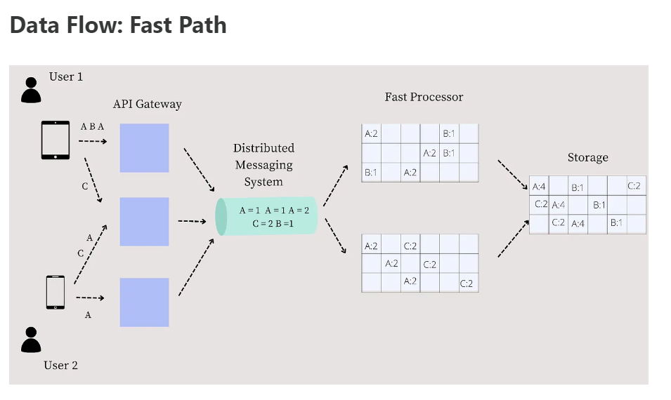
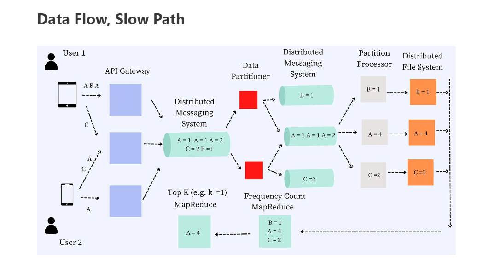
From data partitioning to partition processor , we can replace with apache spark, but these are under the hood details.
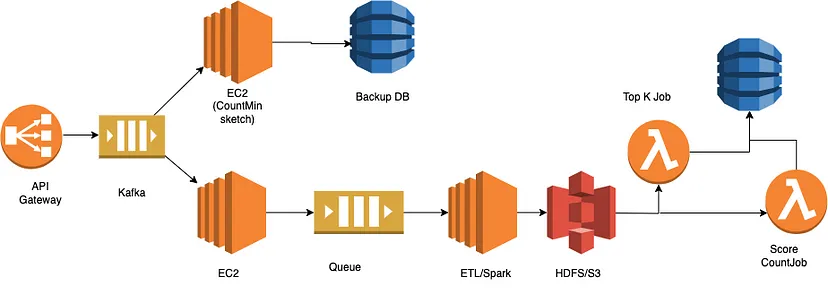

Api Gateway:
An essential function of an API Gateway is to route the request from the client to the backend services. We are interested in using the API Gateway to look at the request logs for our use case.
- The single entry point for all clients.
- Aggregates data on the fly or via a background process the processes logs. Data is flushed based on either time or size. Can be implemented with fixed size hash and once it full we can flush to disk.

Distributed Messaging System:
- The data is then sent to a distributed messaging queue such as Apache Kafka or AWS Kinesis.
- A random partitioning scheme will serve the purpose of distributing data across different nodes within the cluster.

Fast processor:
- 
- Above is not optimal solution , because we are going to have a lots of events, we can't keep them in memory.
- Second thing is that this will become complex because:
    - We will have to do the data replication to have reliability.
    - Then will have to handle the rebalancing.
    - Adding and deletion of node. 
    - Although that can be done with service discovery or metadata in one node.
    - Dealing with hot partition problem.

- Optimal: we have better solution but the problem is that, that is approximated and might not result in exact or accurate response.
- Count-Min sketch:
    - This is fixed memory , according to us like how much accurate we want it to be.
    - Since fixed memory , also don't need multiple fast server.
    - Let say each minute, we can flush to the storage.
    - To ensure that the system remains highly available (one of the requirements of the system’s design), we need to ensure that the data is replicated. Otherwise, the system may not remain available when one of the processor nodes shuts down. However, we have the Slow Path as a backup to the Fast Path. If still not possible we might need to go like previous but instead of hash count min sketch will be there.
    - We can discuss with interviewer and do trade off. Else will require a another processor for backup
    - Still we will have the heap, but the hash table will be replace by count-min sketch.

- Bit about the Count-Min:
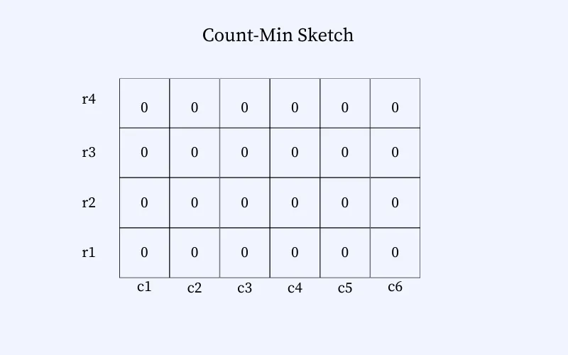

- So it is like a 2d grid, r1,r2.. => denoting the hash function.
- c1,c2..... => denoting the width of matrix.
- if we increase the row or column it will update the accuracy ( will get to know why ).
- so let say event A come , we can find out the value of hash function for each row and map to column
- Note that there can be collisions. The collisions are handled by incrementing the number in the cell. E.g., A and C hash to the exact location (row: 2, column: 6), and therefore, the count on the cell is 3.
- For retrieval , it is optimal to find our the minimum value from the all boxes , for particular event. 
- Let say for A = min(r1c3, r2c6, r3c2, r4c1).
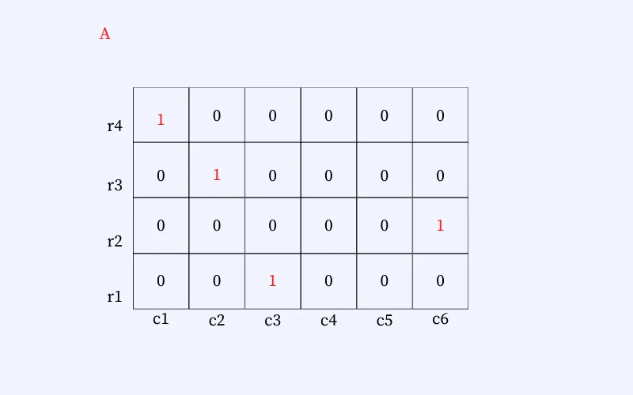
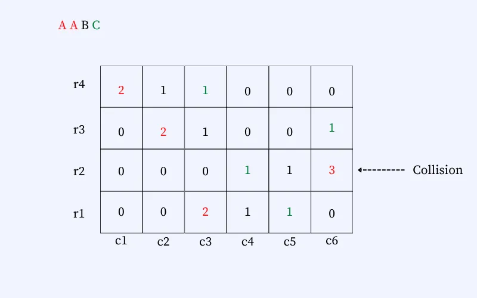

Storage + its consumer: 
- till now everything is n memory so we need to dump the same copy in some replicated storage for high availability.
- For that, we keep flushing this in-memory data to some storage every few seconds or minutes
- Also, we actually don't need to worry about some event loss in case of instance goes down or is unavailable for a few seconds in some rare cases, as the count-min sketch already does not provide 100% accurate results.
- So once we start dumping in DB, then final users can consume from this DB storage via some APIS with the refresh rate of millis or seconds as per our choice of refresh rate.

#### Slow Flow

There are two ways:
##### One
- one is direct push all data to hdfs.
- then run the map reduce job, this is basically only batch processing.
##### Second
- in this case we will kind of use the lambda architecture , mean will try to do the stream and batch processing simultaneously.
- and in this case hdfs will have better data like each min or some period.
- Now we need to have job for count and top k , this will be bit lighter and fast.
- we followed this and also in diagram is this architecture.

Data Partitioner Processor: (aws lambda)
- The data partitioner reads batches of events from the Distributed Messaging Queue and partitions them into individual events
- Each partition is then sent to different partitions of a messaging queue. The messaging queue can be Apache Kafka, AWS Kinesis
- It is also worth noting that the data partitioner should take care of hot partitions. If a particular set of videos are being watched heavily, the partitioner will need to rebalance the data flowing into the stream for the specific data partition. This may be done by creating a duplicate partition for the hot set of keys or using a different hashing scheme. (***)

Distributed Queue: (kafka):
- Pretty standard, can scale as per node .

Partition Processing Processor: (aws lambda):
- Next, we need a component to read each partition and aggregate it further. 
- The main job of the partition processor is to aggregate the partitioned data in memory over several minutes and generate the data in predefined file sizes and store it in the distributed file system.
- we can dump the data onto a distributed storage layer such as HDFS or S3.

Distributed file system: (s3):
- standard

Map reduce Job ( Frequency count job ): (aws emr):
-  Count the frequency of each item (view of a YouTube video).
Top k map reduce job: (aws emr):
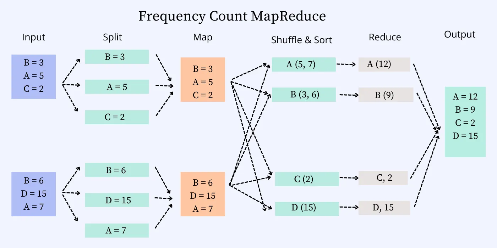
-  Calculate the TopK hitters.  
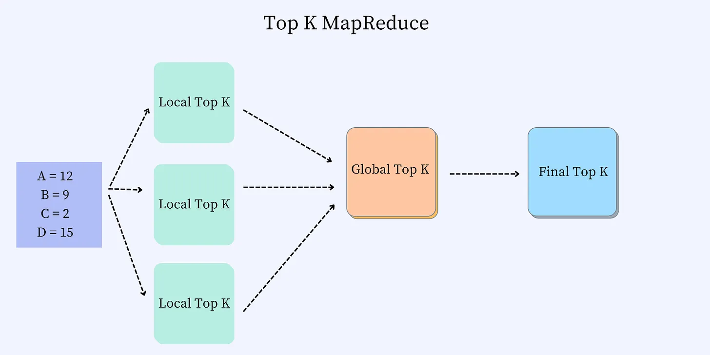

#### Second Flow ( Query flow ):

topk (K, startTime, endTime): whenever we require this result, mean we will need to process the data between this time to get accurate result some how.

Data Retrieval: 

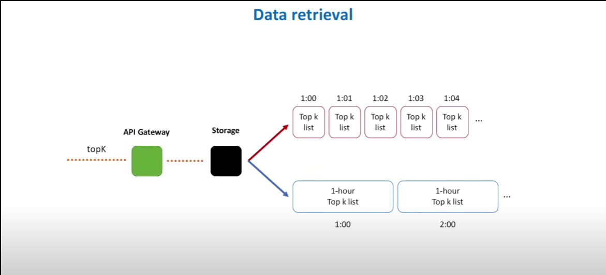

- In this case , for alerting and monitoring , we can have like time series database.
- Else can also have mysql with last minute information.

#### Problems with this

- add click event aggregations top k.
- last x min , alert and monitoring system.
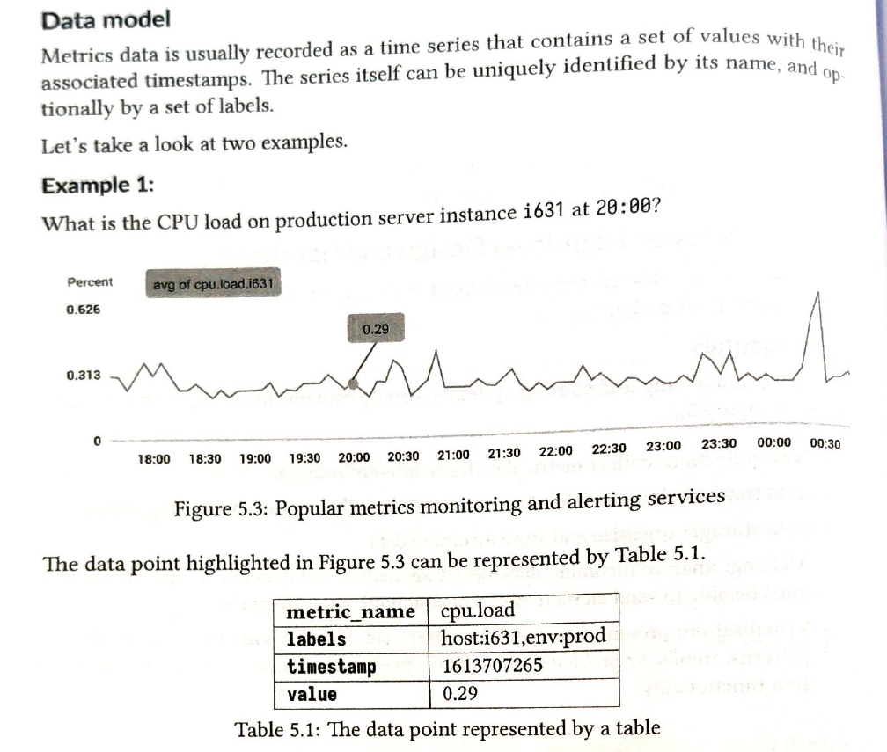
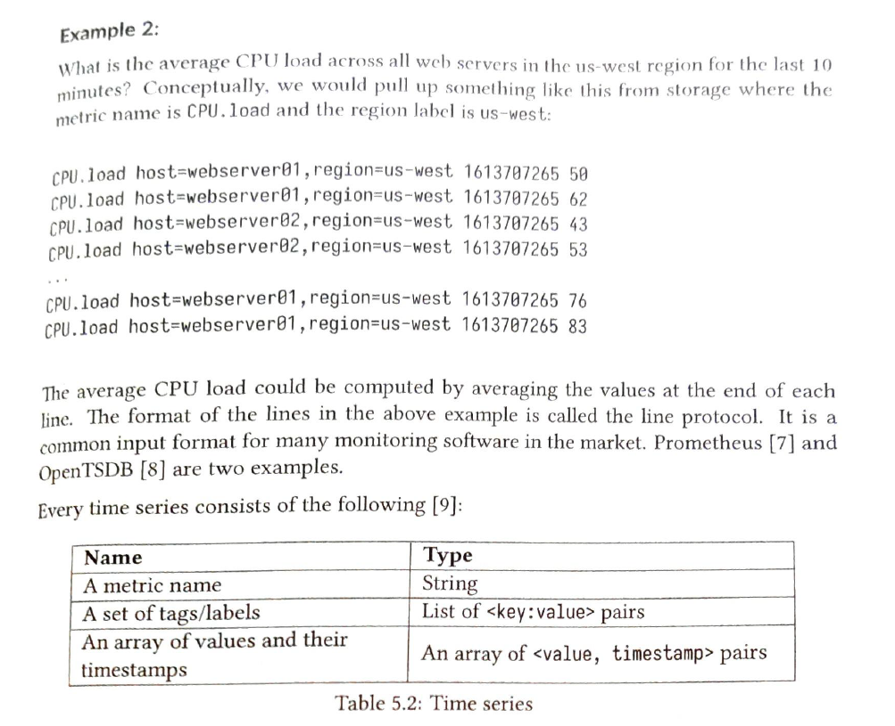
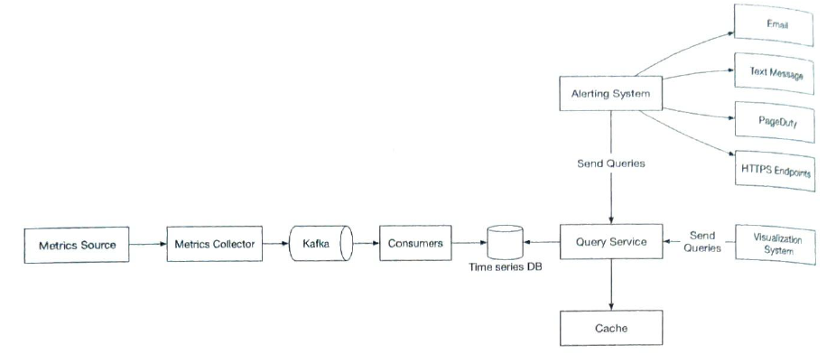
    - metric source to consumer is similar to top k architecture
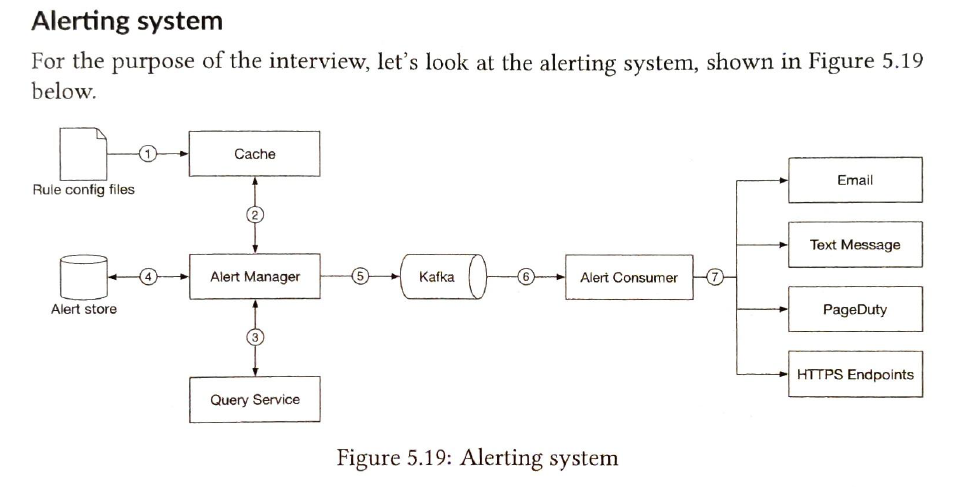
Pull vs Push (this is no correct answer):
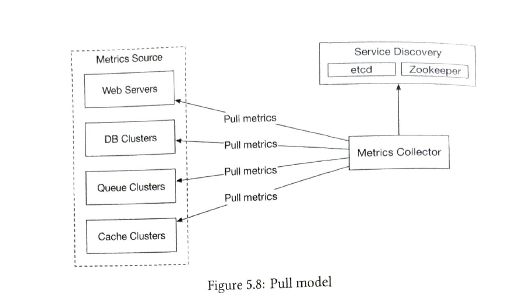
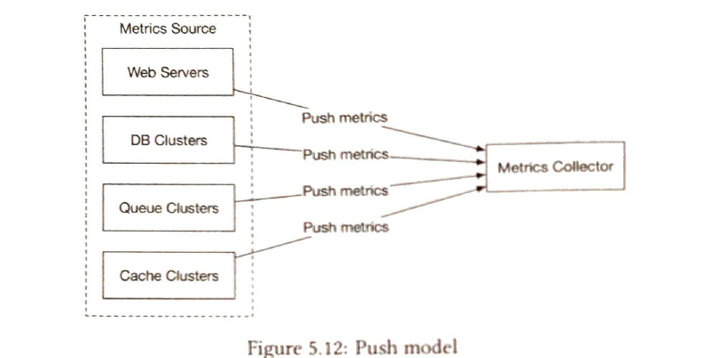
Storage
- As per research 85% query of last 26 hours case.
- So we can do the data encoding and compression on database and move to cold storage. or put in database with later timestamp like last 1 hour -> last 1 day -> last 30 days ....
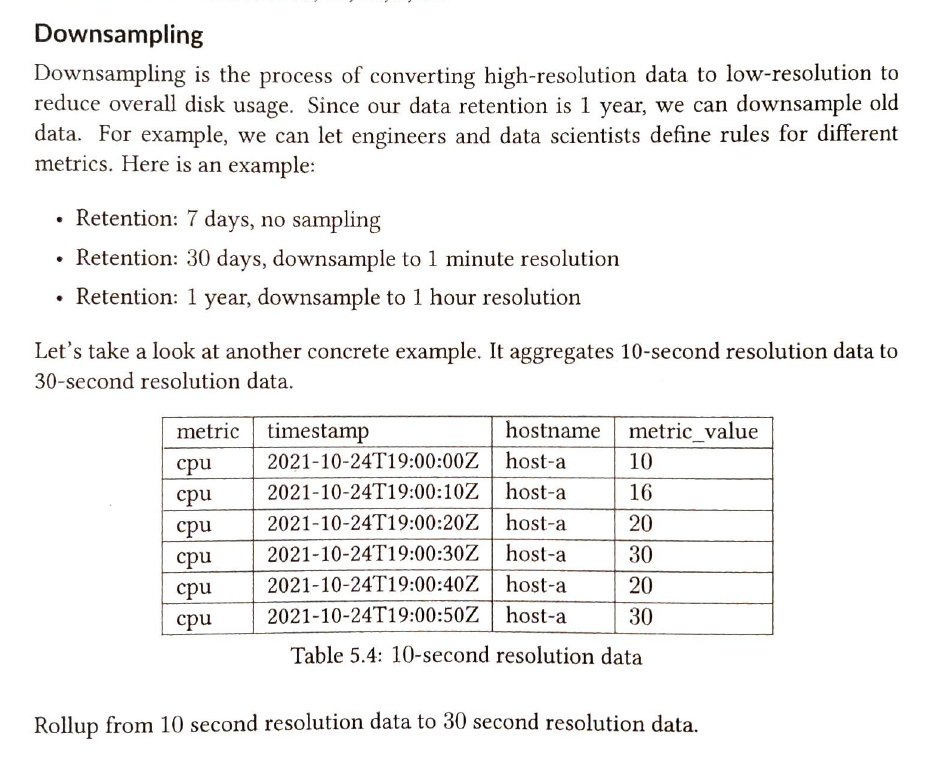
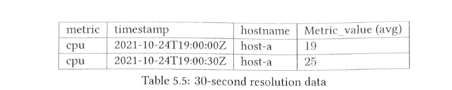
- top k songs.
- stock price real time shower
- top trending item
- most viewed video
- top tweeted tweets.

References: 
- Khatarnaak: https://www.youtube.com/watch?v=kx-XDoPjoHw&ab_channel=SystemDesignInterview
- Text version ^ : https://ravisystemdesign.substack.com/p/interview-preparation-design-a-system
- https://blog.stackademic.com/system-design-top-k-problem-heavy-hitters-b070603bbcfa
- Add client events aggregation V2.
- alerts and monitoring systems.

### Clear using the ready made libraray or system

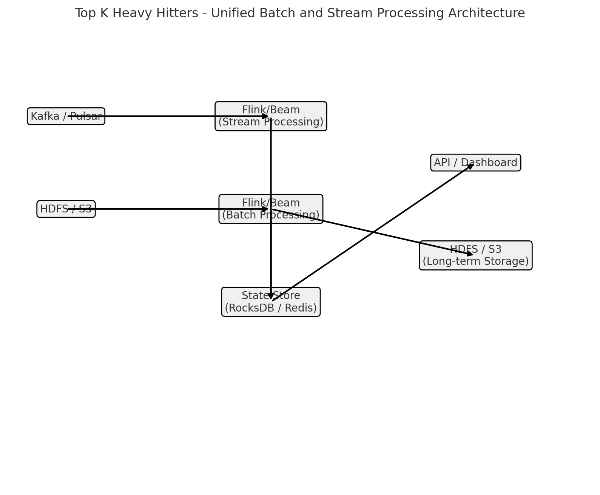

- We will do stream processing and put data in database.
- Also on other hand can do the batch processing and put in hdfs for future back filling etc.

