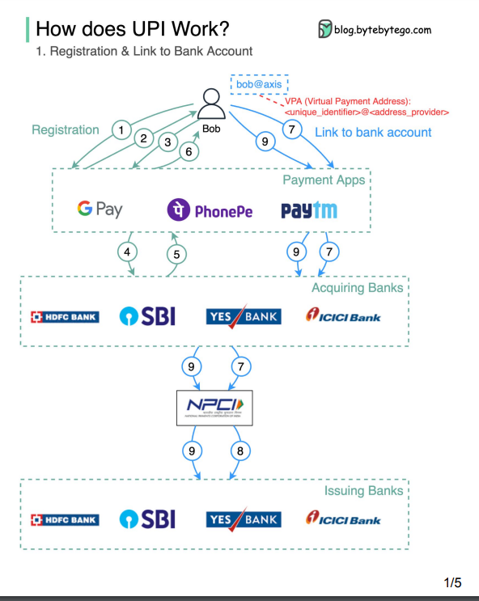
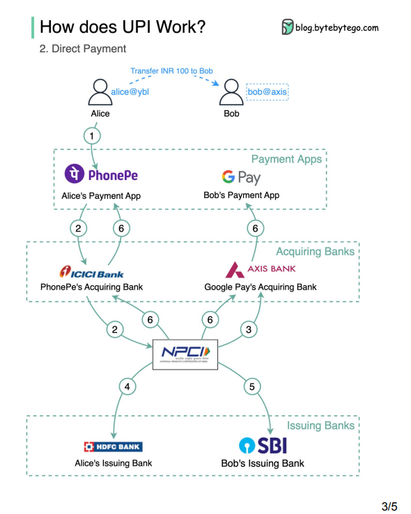

Its kind of understanding UPI current system working.
## Functional Requirements
- User should be able to send money using some address, not knowing other bank details.
- It will be independent of different type of bank.
## Non-functional Requirements
- It should be high secure, and strong authentication.
- It should be consistent and high scalable for transactions per day.
## Capacity Estimation
- 5k transactions per second.
## High Level Design

- Problem understanding
	-  what's the current situation and problem:
		- There are different interfaces, if user have to transfer money. He has to follow the proper process of that bank to transfer money, like filling form etc.
	- We now want , there should be a interface , which is above these bank, and user send money with the help of that interface to the cross bank.
- Not if there is not api, we can send money using internet banking. Means enter received bank account number and ifcs code , it will use government centre system npci like NEFT etc. and send the money to receiver.
- For our current problem , we can have address which will have map to bank details and that will be maintained by NPCI
- This NPCI will have upi servers that will be horizontally scaled and with have sql database that will store the unique address and bank details.
## API Design

1.   Create the unique address 
	1. /post -> /create/vpa/v1 
2.   get bank information with VPS
## Database design

1. NPCI will be using the RDMS for having high consistency , if require we can have index on the key and later on shard it . Since write compare to read will be very less. 
2. So RDMS would be good choise.

## Deep dive High Level Design

1.  Registration:
	1. Will the help of bank details want to create VPA.
	2. Assuming bank already fulfilled the UPI criteria like support IMPS and online working.
	3. we will with the help of phone number will say about the bank .
	4. with this information PSP (gpay) -> bank create the VPA and will link the bank with this VPA.
	5. for this PSP send the request to NPCI , to create VPA and link the user bank .
	6. NPCI send the otp for VPA verification.
	7. NPCI will send request to bank and it will verify by otp and create the MPIN, this will be saved by bank for authentication and user has to enter this every time whenever doing the payments.
  
2. Transfer Money:
	1. Now what are the informations we have about of the user in our architecture:
		1. Send and receiver VPA and its linked banks info in NPCI.
		2. MPIN , that is for 2FA , respective bank.
	2. Alice send 100 rupees to bob.
	3. alice will enter bob VPA and phone verify it with its bank and NPCI
	4. after that alice will enter the amount start for processoing.
	5. after this alice will have to enter the MPIN.
	6. phone forward this to NPCI. 
	7. npci 
		1. forward the deduction request to  alice bank for transfer by resolving bob bank details,
		2. once alice bank verify , it will send money to bob account and send response to NPCI.
		3. now NPCI send credit request to bob account and once it verify 
		4. npci once get response from both side it will send to both respective PSP.

### Deep dive in authentication and 2FA or how do we make all these call secure ? 

## Reference

