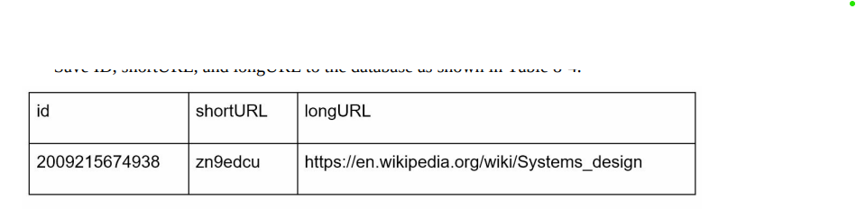
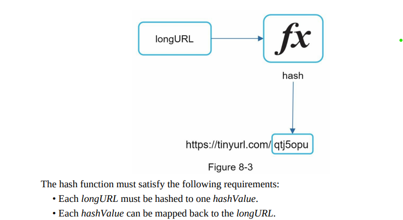
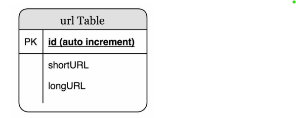
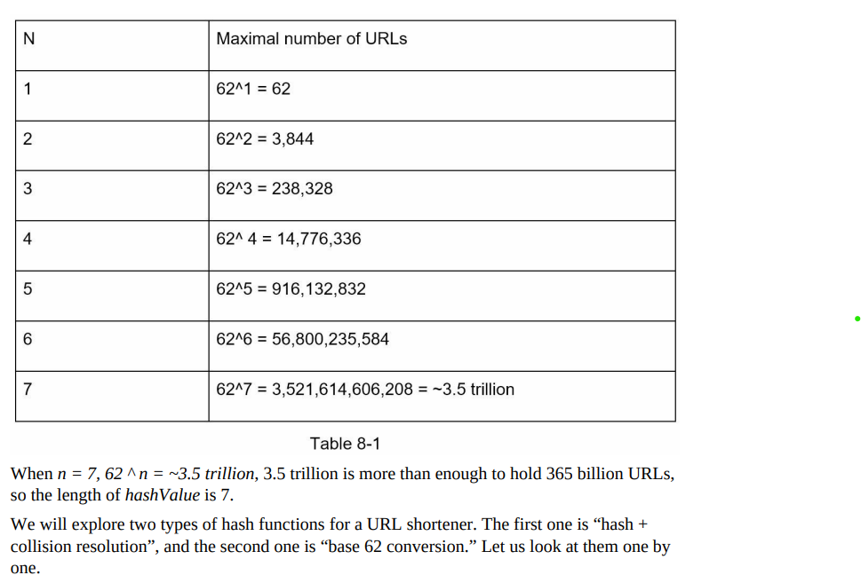
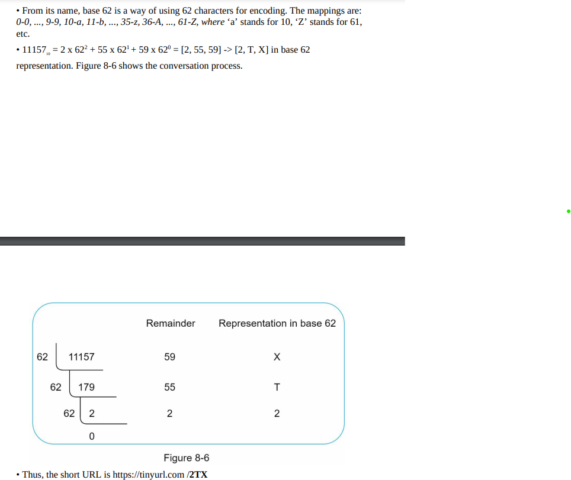
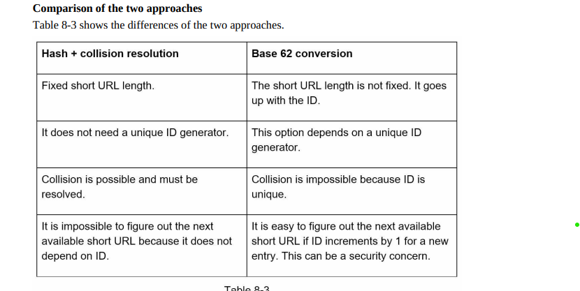
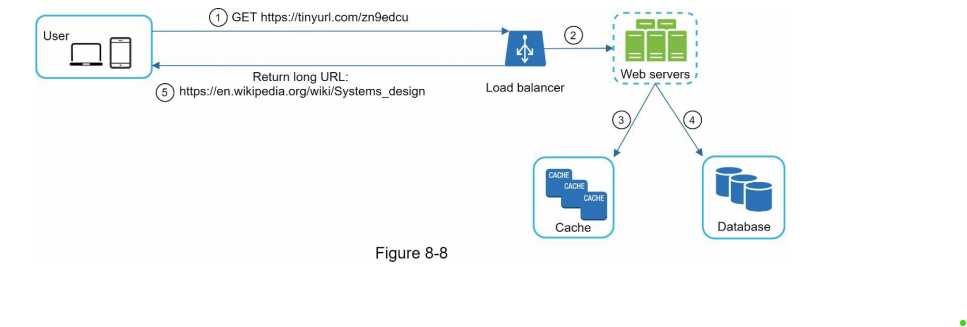

### Requirements:

1.URL shortening: given a long URL => return a much shorter URL
2.URL redirecting: given a shorter URL => redirect to the original URL
3.High availability, scalability, and fault tolerance considerations

### Capacity Estimation:
1. Write operation: 100 million URLs are generated per day.
2. Write operation per second: 100 million / 24 /3600 = 1160
3. Read operation: Assuming ratio of read operation to write operation is 10:1, read operation per second: 1160 * 10 = 11,600
4. Assuming the URL shortener service will run for 10 years, this means we must support 100 million * 365 * 10 = 365 billion records.
5. Assume average URL length is 100.
6. Storage requirement over 10 years: 365 billion * 100 bytes * 10 years = 365 TB

### Designing

#### Apis

POST api/v1/data/shorten
- request parameter: {longUrl: longURLString}
- return shortURL

GET api/v1/shortUrl
- Return longURL for HTTP redirection

#### Url redirection

#### Url shortening 

#### Data model

#### Hash optimisation
- Since in short url according to our estimations , We don't require very long hashed string and here we can save our storage.
- This is made up of alphanumeric, total -> 62 [0-9, a-z , A-Z].
- So 7 length of short url would be enough
  

1. Hash + collision resolution:
   Inshort get the long hashed value from function and take only first 7 letter. This might cause collision. So start adding letter one by one more and check if its not already exist. Cons: Call db every time or cache . Not much efficient. Optimisation use bloom filter.
2. Base 64 conversion:
   
   

#### Final Design

