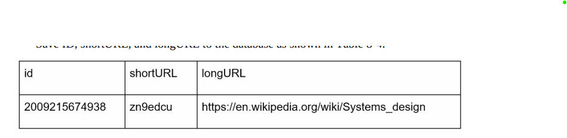
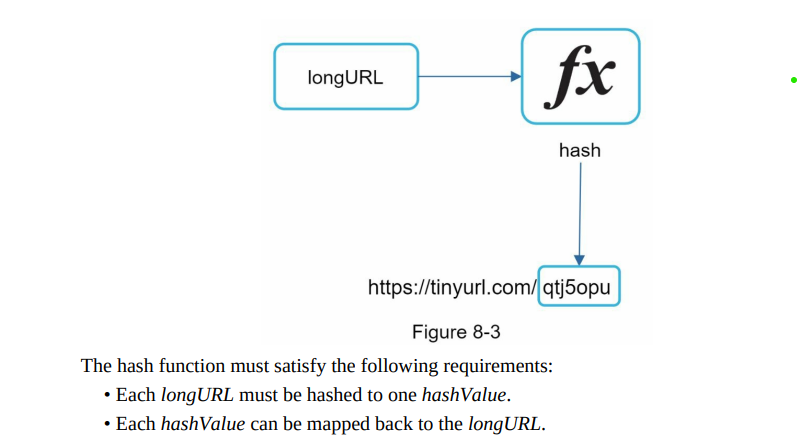
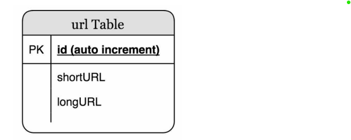
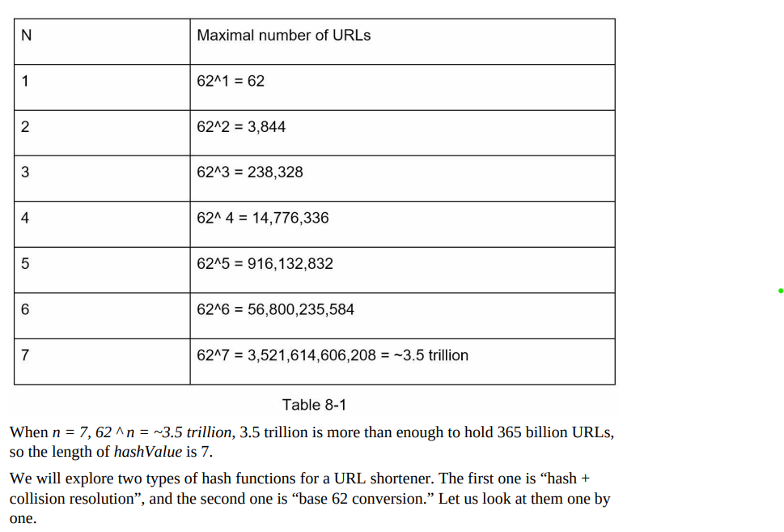
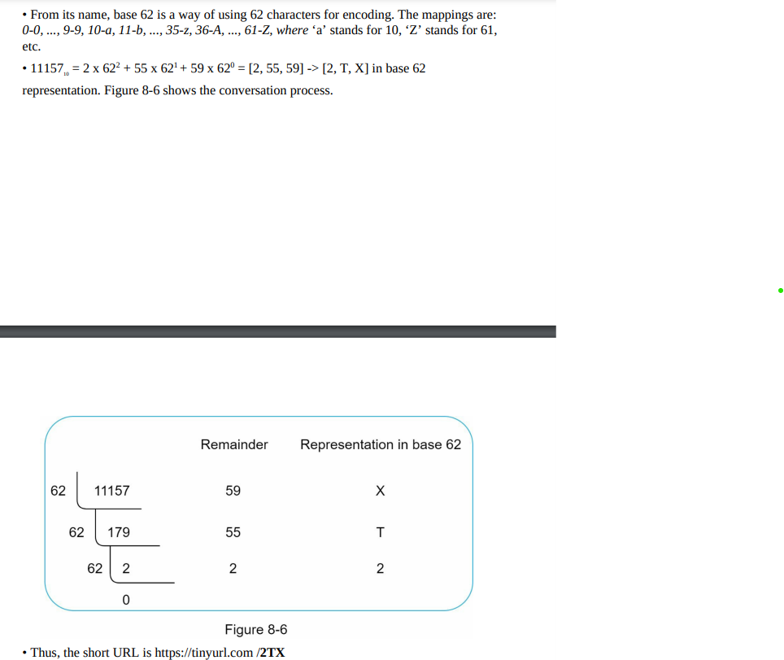
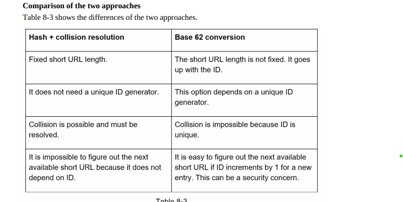
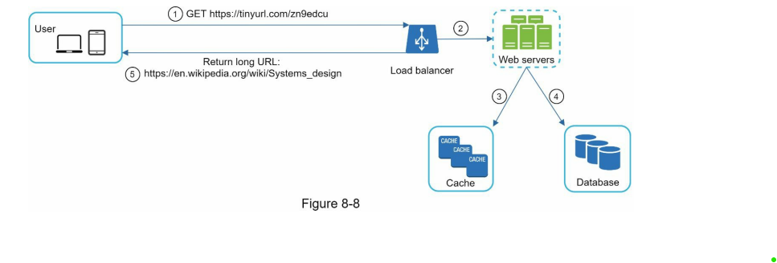

Top Notch: https://systemdesign.one/url-shortening-system-design/#summary
With Redis atomic counter: https://www.hellointerview.com/learn/system-design/problem-breakdowns/bitly

### Requirements:

1.URL shortening: given a long URL => return a much shorter URL
2.URL redirecting: given a shorter URL => redirect to the original URL
3.High availability, scalability, and fault tolerance considerations

### Capacity Estimation:
1. Write operation: 100 million URLs are generated per day.
2. Write operation per second: 100 million / 24 /3600 = 1160
3. Read operation: Assuming ratio of read operation to write operation is 10:1, read operation per second: 1160 * 10 = 11,600
4. Assuming the URL shortener service will run for 10 years, this means we must support 100 million * 365 * 10 = 365 billion records.
5. Assume average URL length is 100.
6. Storage requirement over 10 years: 365 billion * 100 bytes * 10 years = 365 TB

### Designing

#### Apis

POST api/v1/data/shorten
- request parameter: {longUrl: longURLString}
- return shortURL

GET api/v1/shortUrl
- Return longURL for HTTP redirection

#### Url redirection


#### Url shortening 


#### Data model


#### Hash optimisation
- Since in short url according to our estimations , We don't require very long hashed string and here we can save our storage.
- This is made up of alphanumeric, total -> 62 [0-9, a-z , A-Z].
- So 7 length of short url would be enough
  


1. Hash + collision resolution:
   Inshort get the long hashed value from function and take only first 7 letter. This might cause collision. So start adding letter one by one more and check if its not already exist. Cons: Call db every time or cache . Not much efficient. Optimisation use bloom filter.
2. Base 64 conversion:
   
   

#### Final Design



### Token based zookeeper approach

Put the ranges in zookeeper before hand, zookeeper cluster setup
script to insert the ranges in zookeeper
```
func CreateRanges(zkConn *zk.Conn, numRanges int, rangeSize uint64) error {
    basePath := "/counter_ranges"

    // Make sure base path exists
    ensurePath(zkConn, basePath)

    for i := 0; i < numRanges; i++ {
        start := uint64(i) * rangeSize
        end := start + rangeSize - 1
        path := fmt.Sprintf("%s/%d-%d", basePath, start, end)

        exists, _, err := zkConn.Exists(path)
        if err != nil {
            return err
        }
        if !exists {
            _, err := zkConn.Create(path, []byte("free"), 0, zk.WorldACL(zk.PermAll))
            if err != nil {
                return err
            }
            fmt.Printf("Created range node: %s\n", path)
        }
    }
    return nil
}

```

one this done can use below code 

```
package main

import (
    "errors"
    "fmt"
    "log"
    "math/rand"
    "strconv"
    "strings"
    "time"

    "github.com/go-zookeeper/zk"
)

const (
    zkServersPath       = "/servers"
    zkCounterRangesPath = "/counter_ranges"
)

type CounterRange struct {
    Start uint64
    End   uint64
}

// RegisterServer creates ephemeral node and gets assigned a counter range from ZK
func RegisterServer(zkConn *zk.Conn, serverID string) (CounterRange, error) {
    // 1. Create ephemeral node for this server under /servers/<serverID>
    serverPath := fmt.Sprintf("%s/%s", zkServersPath, serverID)

    flags := int32(zk.FlagEphemeral)
    acl := zk.WorldACL(zk.PermAll)

    // Delete existing if any (clean start)
    exists, _, err := zkConn.Exists(serverPath)
    if err != nil {
        return CounterRange{}, err
    }
    if exists {
        zkConn.Delete(serverPath, -1)
    }

    _, err = zkConn.Create(serverPath, []byte("online"), flags, acl)
    if err != nil {
        return CounterRange{}, fmt.Errorf("failed to create ephemeral node: %v", err)
    }
    log.Printf("Created ephemeral node: %s", serverPath)

    // 2. Find a free counter range in /counter_ranges
    ranges, _, err := zkConn.Children(zkCounterRangesPath)
    if err != nil {
        return CounterRange{}, fmt.Errorf("failed to list counter ranges: %v", err)
    }

    for _, r := range ranges {
        path := fmt.Sprintf("%s/%s", zkCounterRangesPath, r)
        data, stat, err := zkConn.Get(path)
        if err != nil {
            log.Printf("Error reading range node %s: %v", path, err)
            continue
        }

        status := string(data)
        if status == "used" {
            // Already assigned, skip
            continue
        }

        // Try to mark this range as used with a version check to avoid race
        err = zkConn.Set(path, []byte("used"), stat.Version)
        if err != nil {
            // Someone else took it meanwhile, try next
            continue
        }

        // Parse the range name like "1000000-2000000"
        parts := strings.Split(r, "-")
        if len(parts) != 2 {
            return CounterRange{}, errors.New("invalid counter range format in znode")
        }
        start, err1 := strconv.ParseUint(parts[0], 10, 64)
        end, err2 := strconv.ParseUint(parts[1], 10, 64)
        if err1 != nil || err2 != nil {
            return CounterRange{}, errors.New("failed to parse range numbers")
        }

        log.Printf("Assigned counter range %s to server %s", r, serverID)
        return CounterRange{Start: start, End: end}, nil
    }

    return CounterRange{}, errors.New("no free counter ranges available")
}

func main() {
    zkServers := []string{"127.0.0.1:2181"}
    zkConn, _, err := zk.Connect(zkServers, time.Second*5)
    if err != nil {
        log.Fatalf("Failed to connect to Zookeeper: %v", err)
    }
    defer zkConn.Close()

    serverID := fmt.Sprintf("server-%d", rand.Intn(10000))

    // Ensure base paths exist
    ensurePath(zkConn, zkServersPath)
    ensurePath(zkConn, zkCounterRangesPath)

    cr, err := RegisterServer(zkConn, serverID)
    if err != nil {
        log.Fatalf("Server registration failed: %v", err)
    }
    fmt.Printf("Server %s got range [%d-%d]\n", serverID, cr.Start, cr.End)
}

func ensurePath(zkConn *zk.Conn, path string) {
    exists, _, err := zkConn.Exists(path)
    if err != nil {
        log.Fatalf("Failed to check path %s: %v", path, err)
    }
    if !exists {
        _, err = zkConn.Create(path, []byte{}, 0, zk.WorldACL(zk.PermAll))
        if err != nil && err != zk.ErrNodeExists {
            log.Fatalf("Failed to create path %s: %v", path, err)
        }
    }
}
```


With Redis counter

```

package main

import (
    "context"
    "fmt"
    "log"
    "github.com/redis/go-redis/v9"
)

var (
    ctx = context.Background()
    rdb *redis.Client
)

func initRedis() {
    rdb = redis.NewClient(&redis.Options{
        Addr:     "localhost:6379", // change to your Redis address
        Password: "",               // no password set
        DB:       0,                // use default DB
    })

    _, err := rdb.Ping(ctx).Result()
    if err != nil {
        log.Fatalf("Could not connect to Redis: %v", err)
    }
}

// IncrementGlobalCounter increases the counter atomically
func IncrementGlobalCounter(key string) (int64, error) {
    return rdb.Incr(ctx, key).Result()
}

func main() {
    initRedis()

    counterKey := "global_counter"
    newVal, err := IncrementGlobalCounter(counterKey)
    if err != nil {
        log.Fatalf("Failed to increment counter: %v", err)
    }

    fmt.Printf("New counter value: %d\n", newVal)
}

```

Comparison with Non-Atomic Approach
If you did something like:

```
val, _ := rdb.Get(ctx, "counter").Int()
val++
rdb.Set(ctx, "counter", val)
```

This is not atomic — two clients might:

Read the same value at the same time (e.g., both get 10)
Both increment and write 11, losing one increment.

TL;DR: Why You Can Trust INCR
Redis guarantees that INCR (and similar commands like INCRBY, DECR, etc.) will never be interrupted by another command.
Even in high concurrency scenarios, each call to INCR will return a unique, sequential value — perfect for global counters or ID generation in microservices.
