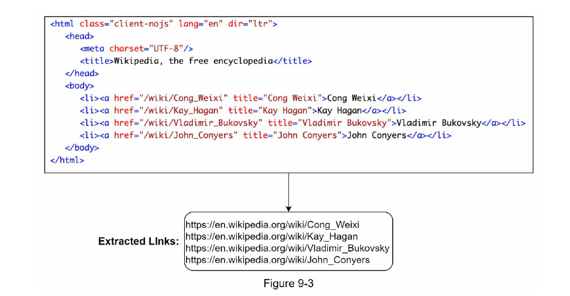
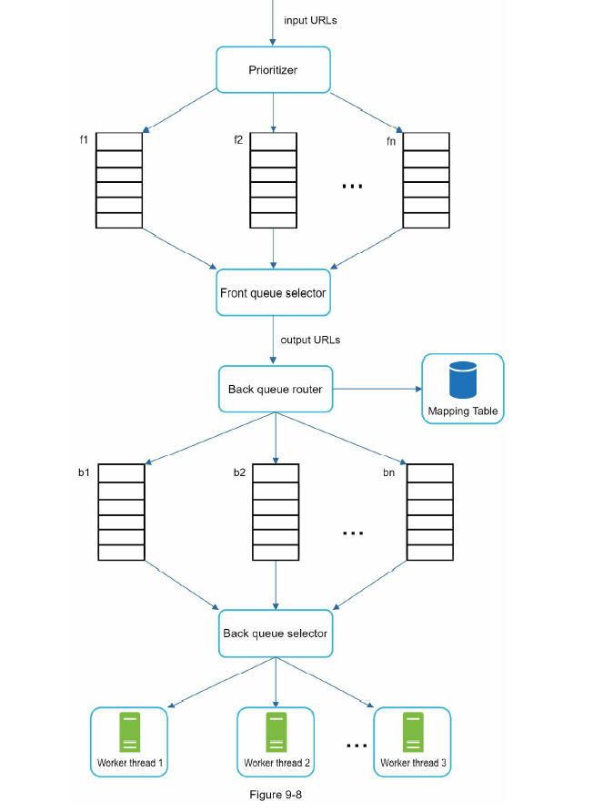

Functional Requirements:

- We want to make a web crawler, that will take url as input.
- Then will search the content of that user and keep them.
- if that url have multiple url in it, then it will recursively search for all urls.
- you can assume , you 'll have to download only html
 

Non-functional Requirements:

- Scalable
- Politeness => shouldn't attack other site or high no. of calls.

Estimation:
- QPS: 1 billion page downloaded every month  => 350 pages / second -> 
- PQPS: 2*QPS = 700
- Storage: 700 * avg page size => per second.

High Level Design:

- Seed Urls
    - Starting point, where we add the urls on which we want to do the crawling.
    - Top improve speed or efficient -> we can insert url with like same locality and same domains.

- URL frontier:
    - It is like the queue -> which maintain the url that has to be searched. With efficient and as per our non functional requirements.

- Html downloader and DNS:
    - This with with help of DNS find out the ips and down the html content.
    - This have  lots of un useful content url etc. this is then send to content extractor.

- Content extractor
    - this extract the html , that can have either content or the url again. for content we maintain the content storage and also check if this is repeted , then skip it.

- Url extractor:
    - For the url part , we have url extractor and this will also check the url is already searched or not. Else it will send this url to URL frontier.

Deep dive:

URL Frontier:

- When developing this we will have to take care about.
     - Politeness : -> no attack the same url again and again.
     - Priority : -> some url have high priority have other.

     - For this
        - scaling this we can have distribute the url to queue, each type of url should map to same queue. We can either maintain the storage or either can be done with key maintain and hashing.
        - for priority also we can have different queue having its different priority as per priority of url we can put it in to queue.
        - And we will have different hread to execute this.

        

- HTML Downloader
    - It is bad to call the DNS server every time , its better to main the local cache to save time.
    - Before download, every site have robots.txt file, which is way to have robots exclusion protol first. This file contain the information about which url you can't access. So its better to avoid them.
    - downloader can be distributed to scale up the things , and we can use consistant hashing to do so.
    - and key will be decoding of url.

